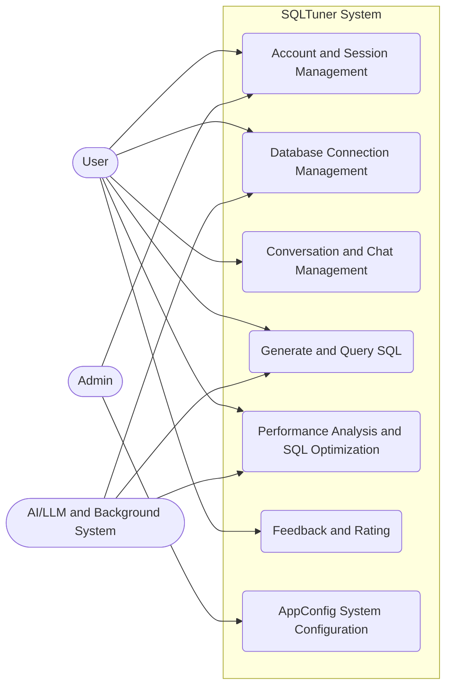

# General Use Case Diagram

This diagram describes the main features and interactions of the actors with the SQLTuner system based on its modules (user management, database connection, conversation, feedback, analysis, and optimization).

## Brief Explanation:
- **User**: Interacts with most features of the system such as database setup, AI chat, rating, and SQL optimization.
- **Admin**: Has permissions to view/edit overall system configuration (App Config) and intervene in account management.
- **AI/Background System**: Processes background tasks such as schema synchronization, SQL generation, index recommendation, and optimization simulation in the Sandbox.

## General Use Case Specifications Overview

| Use Case Group | Actor | Description | Main Goal |
| --- | --- | --- | --- |
| **Account and Session Management** | User, Admin | Handles user registration, authentication, roles, and session persistence. | Secure user access. |
| **Database Connection Management** | User, Sys | Manages database credentials, configurations, and metadata synchronization. | Maintain active connection links. |
| **Conversation and Chat Management** | User | Allows users to interact with the system via natural language prompts. | Facilitate context-aware chat. |
| **Generate and Query SQL** | User, Sys | Translates natural language to SQL and executes it on target databases. | Return accurate data results. |
| **Performance Analysis and SQL Optimization** | User, Sys | Analyzes explain plans and suggests LLM-based SQL optimizations. | Improve query performance. |
| **Feedback and Rating** | User | Collects user ratings and manually corrected SQL for model fine-tuning. | Gather reinforcement data. |
| **AppConfig System Configuration** | Admin | Global settings management for the application. | Customize system behavior. |
