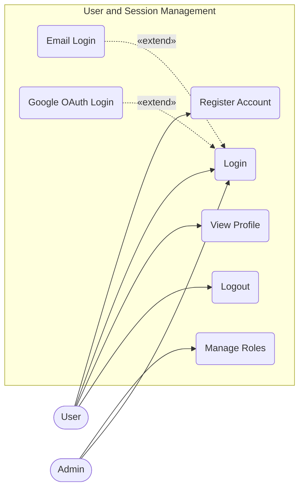

# User Management Use Case Diagram

This diagram details the actions a User or Admin can perform regarding accounts and login sessions.

## Main Use Cases:
1. **Register Account**: Create a new User.
2. **Login**: Authenticate user and initialize session.
    - **Email Login**: Extended login method using email and password.
    - **Google OAuth Login**: Extended login method via Google OAuth.
3. **Logout**: Revoke current session.
4. **View Profile**: Update or display user avatar and email.
5. **Manage Roles**: Admins can intervene to change the UserRole enum.

## Use Case Specifications

| Use Case Name | Actor | Preconditions | Main Flow | Postconditions |
| --- | --- | --- | --- | --- |
| **Register Account** | User | None | User inputs email and password; system validates and creates a new user record. | User account is created and ready for login. |
| **Login** | User | Account exists | User selects login method (Email or Google); system validates credentials and initializes session. | User is authenticated and redirected to dashboard. |
| **Logout** | User | User is logged in | User requests logout; system revokes the active session token. | User is logged out and redirected to login page. |
| **View Profile** | User | User is logged in | User accesses profile page; system retrieves and displays user info (avatar, email). | Profile info is displayed correctly. |
| **Manage Roles** | Admin | Admin is logged in | Admin selects a user to change role; system updates the `UserRole` enum in DB. | User's permissions are updated. |
