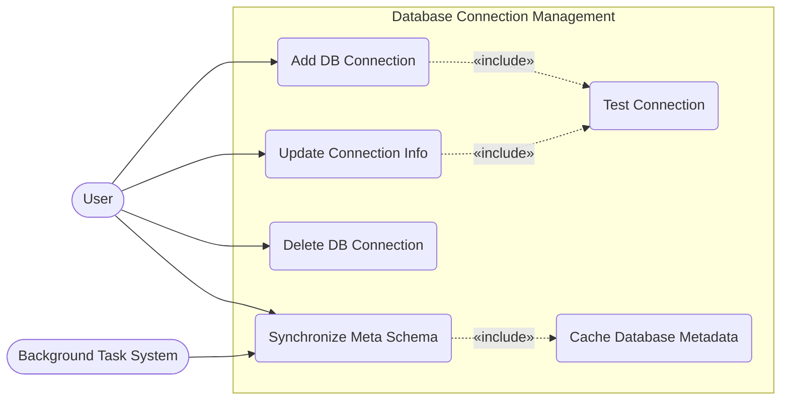

# Database Connection Management Use Case Diagram

This diagram describes how users manage connections to databases (Postgres, MySQL, etc.) and the Metadata (Schema) synchronization process of the system.

## Main Use Cases:
1. **Add DB Connection**: Initialize a database connection.
    - Includes **Test Connection** to ensure credentials are valid.
2. **Update Connection Info**: Users edit connection details when necessary.
    - Includes **Test Connection** to ensure the new credentials are valid.
3. **Delete DB Connection**: Users disconnect and remove database configurations.
4. **Synchronize Meta Schema**: The process of scanning and retrieving the schema structure.
    - Includes **Cache Database Metadata** to save the structure locally for the LLM model.

## Use Case Specifications

| Use Case Name | Actor | Preconditions | Main Flow | Postconditions |
| --- | --- | --- | --- | --- |
| **Add DB Connection** | User | User is logged in | User inputs DB host, port, user, pass; system tests connection and saves it. | DB Connection is successfully added to workspace. |
| **Test Connection** | System | None | System attempts to connect to the provided DB credentials. | Returns success or failure status. |
| **Update Connection Info** | User | DB Connection exists | User edits existing details; system tests and updates the DB record. | DB Connection details are updated. |
| **Delete DB Connection** | User | DB Connection exists | User confirms deletion; system removes the connection and cascades associated data. | DB Connection is removed. |
| **Synchronize Meta Schema** | User, SysTask | DB Connection is active | System runs a background task to extract tables and columns from the target DB. | Meta schema is built as JSON. |
| **Cache Database Metadata** | System | Sync is successful | System caches the JSON schema into `metadata_cache` column in DB. | Schema is ready for LLM context extraction. |
