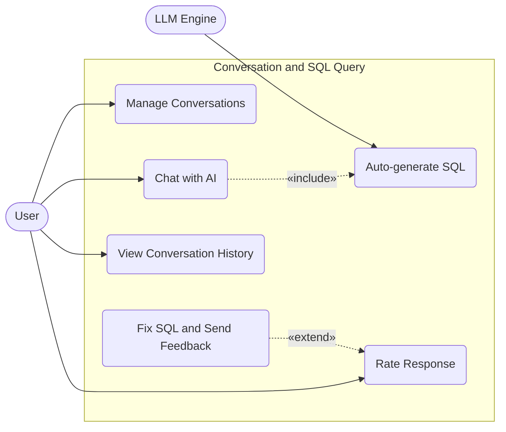

# Conversation and SQL Query Use Case Diagram

This diagram describes the user interaction workflow in a chat window, where SQL generation/query requests are sent to the LLM engine.

## Main Use Cases:
1. **Manage Conversations**: Create new conversations or delete them.
2. **Chat with AI**: Send prompt or chat request.
    - Includes **Auto-generate SQL**: The system processes the prompt and asks the LLM engine to generate SQL.
3. **View Conversation History**: Load past queries.
4. **Rate Response**: Users rate the quality of the response.
    - Extended by **Fix SQL and Send Feedback**: If the user fixes incorrect SQL manually, they provide extended feedback.

## Use Case Specifications

| Use Case Name | Actor | Preconditions | Main Flow | Postconditions |
| --- | --- | --- | --- | --- |
| **Manage Conversations** | User | User is logged in | User creates a new chat session linked to a DB connection, or deletes old ones. | A new conversation is created or deleted. |
| **Chat with AI** | User | Conversation is active | User sends a prompt or query; system logs the query and triggers LLM processing. | User message is logged and displayed. |
| **Auto-generate SQL** | LLM Engine | Prompt is received | System builds context (schema + prompt), calls LLM, and parses the generated SQL. | SQL is generated and returned to UI. |
| **View Conversation History** | User | User is logged in | User opens a past conversation; system loads associated query logs. | Previous chat history is displayed. |
| **Rate Response** | User | Response generated | User clicks upvote/downvote; system records the rating in `feedbacks` table. | Rating is saved successfully. |
| **Fix SQL and Send Feedback** | User | Response generated | User modifies the generated SQL and submits feedback; system saves `corrected_sql`. | Feedback data is saved for future training. |
