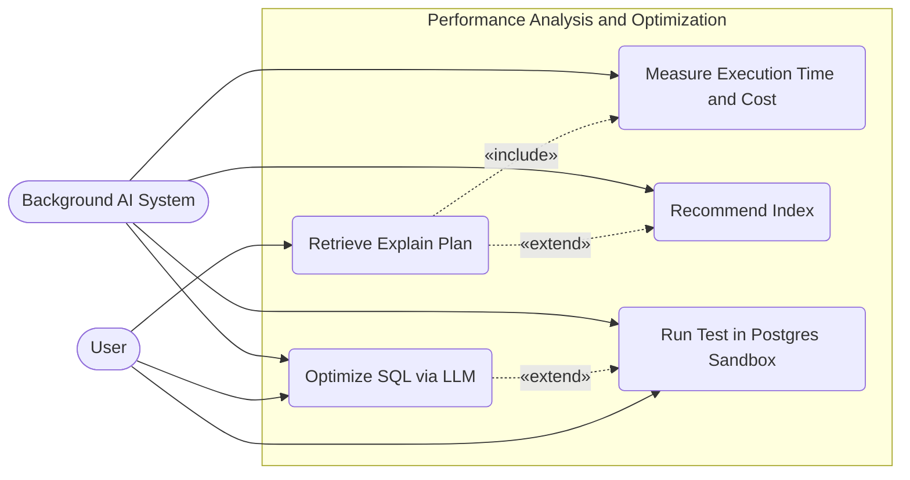

# Performance Analysis and SQL Optimization Use Case Diagram

This diagram illustrates the deep evaluation process of query performance in the SQLTuner system: execution time analysis, cost calculation, index recommendation, and Sandbox execution support.

## Main Use Cases:
1. **Retrieve Explain Plan**: Run the explain command to get query execution details.
    - Includes **Measure Execution Time and Cost** to calculate metrics.
    - Extended by **Recommend Index**: If the plan is slow (e.g. Seq Scan), it triggers an index recommendation.
2. **Optimize SQL via LLM**: Request AI to analyze the plan and suggest a better query.
    - Extended by **Run Test in Postgres Sandbox**: Optionally execute the optimized query in a safe sandbox container.

## Use Case Specifications

| Use Case Name | Actor | Preconditions | Main Flow | Postconditions |
| --- | --- | --- | --- | --- |
| **Retrieve Explain Plan** | User | SQL is provided | User clicks Explain; system connects to DB and runs EXPLAIN query. | Execution plan JSON is retrieved. |
| **Measure Execution Time and Cost** | SysTask | Plan is retrieved | System extracts cost and actual execution time from the Explain plan. | Performance stats are calculated and saved. |
| **Recommend Index** | SysTask | Heavy scan detected | System analyzes the plan for sequential scans and suggests index creation. | Index recommendations are displayed. |
| **Optimize SQL via LLM** | User, SysTask | Plan is retrieved | User clicks Optimize; system triggers background task to prompt LLM for better SQL. | Optimized SQL query is generated. |
| **Run Test in Postgres Sandbox** | SysTask | SQL is generated | System provisions SQLite/Postgres sandbox, seeds data, and runs the query. | Safe simulation results and metrics are returned. |
