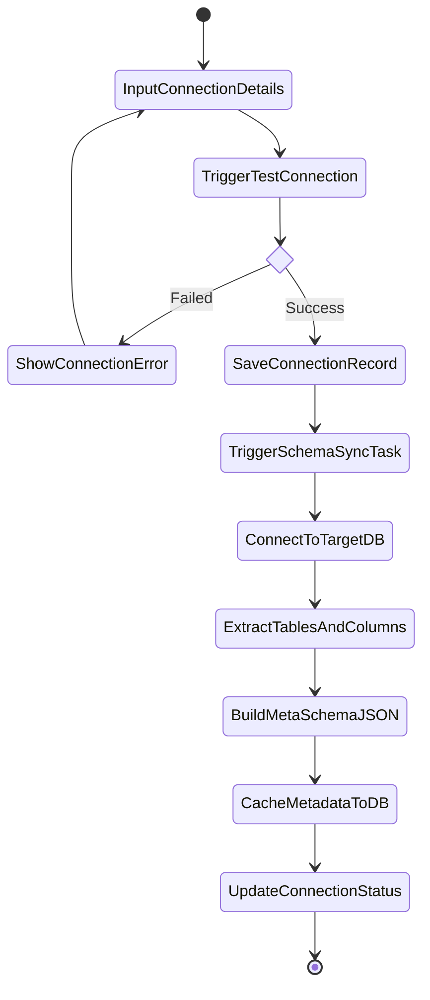

# Database Connection and Schema Sync Activity Diagram

This diagram outlines the steps involved when a user adds a new database connection and how the system synchronizes its schema.

```mermaid
stateDiagram-v2
    [*] --> InputConnectionDetails
    InputConnectionDetails --> TriggerTestConnection
    
    state Connection_Success <<choice>>
    TriggerTestConnection --> Connection_Success
    
    Connection_Success --> ShowConnectionError : Failed
    ShowConnectionError --> InputConnectionDetails
    
    Connection_Success --> SaveConnectionRecord : Success
    SaveConnectionRecord --> TriggerSchemaSyncTask
    
    %% Background Task Process
    TriggerSchemaSyncTask --> ConnectToTargetDB
    ConnectToTargetDB --> ExtractTablesAndColumns
    ExtractTablesAndColumns --> BuildMetaSchemaJSON
    BuildMetaSchemaJSON --> CacheMetadataToDB
    CacheMetadataToDB --> UpdateConnectionStatus
    
    UpdateConnectionStatus --> [*]
```
