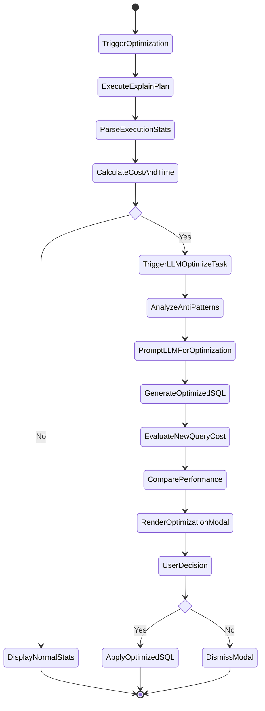

# SQL Optimization and Performance Analysis Activity Diagram

This activity diagram describes the process of analyzing a query's performance and using the LLM to suggest an optimized alternative.

```mermaid
stateDiagram-v2
    [*] --> TriggerOptimization
    TriggerOptimization --> ExecuteExplainPlan
    ExecuteExplainPlan --> ParseExecutionStats
    ParseExecutionStats --> CalculateCostAndTime
    
    state Is_Bottleneck_Found <<choice>>
    CalculateCostAndTime --> Is_Bottleneck_Found
    
    Is_Bottleneck_Found --> DisplayNormalStats : No
    DisplayNormalStats --> [*]
    
    Is_Bottleneck_Found --> TriggerLLMOptimizeTask : Yes
    
    %% LLM Optimization Process
    TriggerLLMOptimizeTask --> AnalyzeAntiPatterns
    AnalyzeAntiPatterns --> PromptLLMForOptimization
    PromptLLMForOptimization --> GenerateOptimizedSQL
    
    GenerateOptimizedSQL --> EvaluateNewQueryCost
    EvaluateNewQueryCost --> ComparePerformance
    
    ComparePerformance --> RenderOptimizationModal
    RenderOptimizationModal --> UserDecision
    
    state User_Accepts <<choice>>
    UserDecision --> User_Accepts
    
    User_Accepts --> ApplyOptimizedSQL : Yes
    User_Accepts --> DismissModal : No
    
    ApplyOptimizedSQL --> [*]
    DismissModal --> [*]
```
