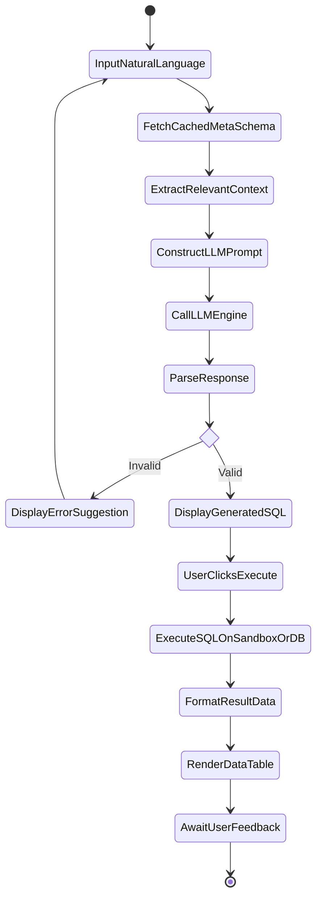

# Text-to-SQL and Query Execution Activity Diagram

This diagram demonstrates the flow from when a user inputs a natural language prompt to the AI generating and executing the SQL query.

```mermaid
stateDiagram-v2
    [*] --> InputNaturalLanguage
    InputNaturalLanguage --> FetchCachedMetaSchema
    FetchCachedMetaSchema --> ExtractRelevantContext
    
    ExtractRelevantContext --> ConstructLLMPrompt
    ConstructLLMPrompt --> CallLLMEngine
    CallLLMEngine --> ParseResponse
    
    state Is_Valid_SQL <<choice>>
    ParseResponse --> Is_Valid_SQL
    
    Is_Valid_SQL --> DisplayErrorSuggestion : Invalid
    DisplayErrorSuggestion --> InputNaturalLanguage
    
    Is_Valid_SQL --> DisplayGeneratedSQL : Valid
    DisplayGeneratedSQL --> UserClicksExecute
    
    UserClicksExecute --> ExecuteSQLOnSandboxOrDB
    ExecuteSQLOnSandboxOrDB --> FormatResultData
    FormatResultData --> RenderDataTable
    
    RenderDataTable --> AwaitUserFeedback
    AwaitUserFeedback --> [*]
```
