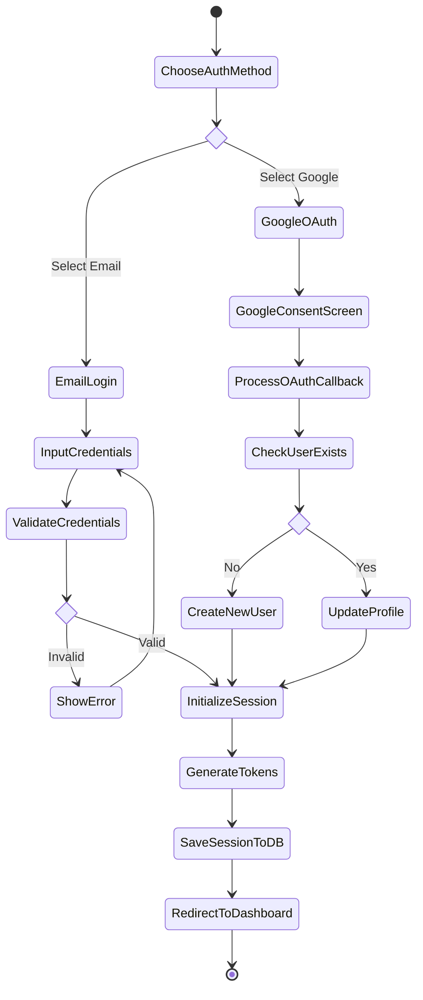

# User Authentication Activity Diagram

This diagram illustrates the activity flow for a user attempting to log in or register via the system.

```mermaid
stateDiagram-v2
    [*] --> ChooseAuthMethod
    
    state Choose_Method <<choice>>
    ChooseAuthMethod --> Choose_Method
    
    Choose_Method --> EmailLogin : Select Email
    Choose_Method --> GoogleOAuth : Select Google
    
    %% Email Flow
    EmailLogin --> InputCredentials
    InputCredentials --> ValidateCredentials
    state Valid_Creds <<choice>>
    ValidateCredentials --> Valid_Creds
    Valid_Creds --> ShowError : Invalid
    ShowError --> InputCredentials
    Valid_Creds --> InitializeSession : Valid
    
    %% Google Flow
    GoogleOAuth --> GoogleConsentScreen
    GoogleConsentScreen --> ProcessOAuthCallback
    ProcessOAuthCallback --> CheckUserExists
    state User_Exists <<choice>>
    CheckUserExists --> User_Exists
    User_Exists --> CreateNewUser : No
    User_Exists --> UpdateProfile : Yes
    CreateNewUser --> InitializeSession
    UpdateProfile --> InitializeSession
    
    %% Session creation
    InitializeSession --> GenerateTokens
    GenerateTokens --> SaveSessionToDB
    SaveSessionToDB --> RedirectToDashboard
    RedirectToDashboard --> [*]
```
