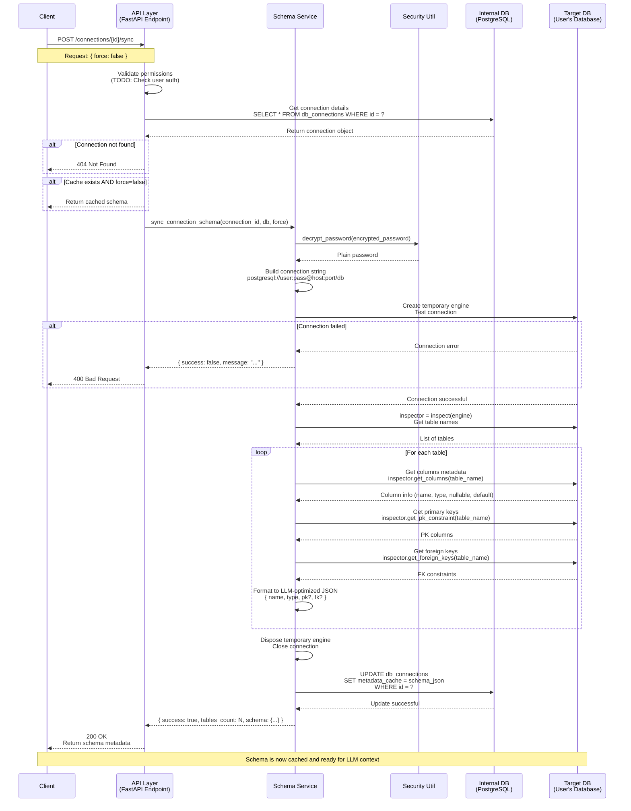

# Schema Synchronization Flow

## Mermaid Sequence Diagram



## Flow Description

### 1. Client Trigger
- Client sends `POST /connections/{id}/sync` with optional `force` parameter
- The `force` flag determines whether to bypass cached schema

### 2. API Layer Validation
- Validates that the connection exists in the internal database
- **TODO**: Check user permissions to ensure they own this connection
- Returns cached schema if available and `force=false`

### 3. Service Layer Processing
- Retrieves connection details from `db_connections` table
- Decrypts the stored password using the Security utility

### 4. Target Database Connection
- Builds connection string based on database type (Postgres/MySQL)
- Creates a temporary synchronous SQLAlchemy engine
- Tests connection with timeout (10 seconds)
- If connection fails, returns error to client

### 5. Schema Inspection
- Uses `sqlalchemy.inspect(engine)` to introspect the database
- Iterates through all tables in the target database
- For each table, extracts:
  - **Columns**: name, data type, nullable, default value
  - **Primary Keys**: identifies PK columns
  - **Foreign Keys**: maps to referenced table.column

### 6. Data Formatting
- Converts raw metadata to LLM-optimized JSON format
- Minimizes token usage by:
  - Using short keys (`pk`, `fk` instead of full words)
  - Omitting nullable if true (default assumption)
  - Compact type representation

**Example Output Format:**
```json
{
  "users": [
    {"name": "id", "type": "UUID", "pk": true},
    {"name": "email", "type": "VARCHAR(255)"},
    {"name": "role", "type": "user_role", "default": "user"}
  ],
  "db_connections": [
    {"name": "id", "type": "UUID", "pk": true},
    {"name": "user_id", "type": "UUID", "fk": "users.id"},
    {"name": "metadata_cache", "type": "JSONB", "nullable": true}
  ]
}
```

### 7. Storage & Response
- Updates the `metadata_cache` JSONB field in the `db_connections` table
- Disposes of the temporary database engine
- Returns success response with table count and schema data

### 8. Error Handling
- **Connection not found**: Returns 404
- **Database unreachable**: Returns 400 with connection error
- **Authentication failed**: Returns 400 with auth error
- **Decryption failed**: Returns 400 with decryption error
- **Unexpected errors**: Returns 400 with generic error message

## Security Considerations

1. **Password Encryption**: Database passwords are encrypted at rest using Fernet symmetric encryption
2. **Temporary Connections**: Engine is disposed immediately after use
3. **Read-Only Operations**: Schema inspection does not modify target database
4. **No Data Extraction**: Only metadata is retrieved, never row data
5. **Connection Timeout**: 10-second timeout prevents hanging connections

## Performance Optimization

1. **Caching**: Schema is cached in JSONB field to avoid repeated connections
2. **Force Sync**: Optional `force` parameter allows cache invalidation
3. **Connection Pooling**: Disabled for temporary inspection connections
4. **Token Efficiency**: LLM-optimized format reduces token usage in AI prompts
