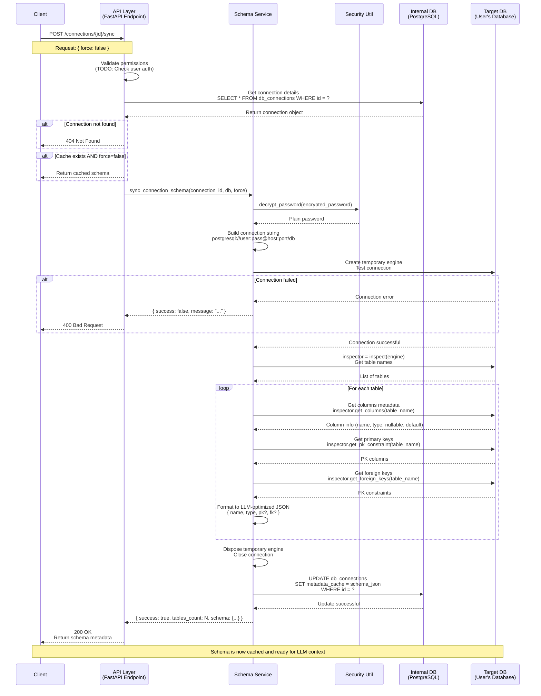

# Luồng Đồng bộ Schema

## Sơ đồ Tuần tự Mermaid



## Mô tả Luồng

### 1. Kích hoạt Client
- Client gửi `POST /connections/{id}/sync` với tham số `force` tùy chọn
- Cờ `force` xác định có bỏ qua schema đã cache hay không

### 2. Xác thực API Layer
- Xác thực rằng kết nối tồn tại trong cơ sở dữ liệu nội bộ
- **TODO**: Kiểm tra quyền người dùng để đảm bảo họ sở hữu kết nối này
- Trả về schema đã cache nếu có và `force=false`

### 3. Xử lý Service Layer
- Lấy chi tiết kết nối từ bảng `db_connections`
- Giải mã mật khẩu đã lưu bằng Security utility

### 4. Kết nối Target Database
- Xây dựng chuỗi kết nối dựa trên loại cơ sở dữ liệu (Postgres/MySQL)
- Tạo engine SQLAlchemy đồng bộ tạm thời
- Kiểm tra kết nối với timeout (10 giây)
- Nếu kết nối thất bại, trả về lỗi cho client

### 5. Kiểm tra Schema
- Sử dụng `sqlalchemy.inspect(engine)` để introspect cơ sở dữ liệu
- Lặp qua tất cả bảng trong cơ sở dữ liệu mục tiêu
- Cho mỗi bảng, trích xuất:
  - **Cột**: tên, loại dữ liệu, nullable, giá trị mặc định
  - **Khóa Chính**: xác định cột PK
  - **Khóa Ngoại**: ánh xạ đến table.column được tham chiếu

### 6. Định dạng Dữ liệu
- Chuyển đổi metadata thô thành định dạng JSON được tối ưu cho LLM
- Giảm thiểu việc sử dụng token bằng:
  - Sử dụng khóa ngắn (`pk`, `fk` thay vì từ đầy đủ)
  - Bỏ qua nullable nếu true (giả định mặc định)
  - Biểu diễn loại compact

**Ví dụ Định dạng Đầu ra:**
```json
{
  "users": [
    {"name": "id", "type": "UUID", "pk": true},
    {"name": "email", "type": "VARCHAR(255)"},
    {"name": "role", "type": "user_role", "default": "user"}
  ],
  "db_connections": [
    {"name": "id", "type": "UUID", "pk": true},
    {"name": "user_id", "type": "UUID", "fk": "users.id"},
    {"name": "metadata_cache", "type": "JSONB", "nullable": true}
  ]
}
```

### 7. Lưu trữ & Phản hồi
- Cập nhật trường `metadata_cache` JSONB trong bảng `db_connections`
- Loại bỏ engine cơ sở dữ liệu tạm thời
- Trả về phản hồi thành công với số lượng bảng và dữ liệu schema

### 8. Xử lý Lỗi
- **Kết nối không tìm thấy**: Trả về 404
- **Cơ sở dữ liệu không thể truy cập**: Trả về 400 với lỗi kết nối
- **Xác thực thất bại**: Trả về 400 với lỗi auth
- **Giải mã thất bại**: Trả về 400 với lỗi giải mã
- **Lỗi bất ngờ**: Trả về 400 với thông báo lỗi chung

## Cân nhắc Bảo mật

1. **Mã hóa Mật khẩu**: Mật khẩu cơ sở dữ liệu được mã hóa khi lưu bằng Fernet symmetric encryption
2. **Kết nối Tạm thời**: Engine được loại bỏ ngay sau khi sử dụng
3. **Hoạt động Chỉ Đọc**: Kiểm tra schema không sửa đổi cơ sở dữ liệu mục tiêu
4. **Không Trích xuất Dữ liệu**: Chỉ metadata được lấy, không bao giờ là dữ liệu hàng
5. **Timeout Kết nối**: Timeout 10 giây ngăn chặn kết nối treo

## Tối ưu hóa Hiệu suất

1. **Caching**: Schema được cache trong trường JSONB để tránh kết nối lặp lại
2. **Force Sync**: Tham số `force` tùy chọn cho phép vô hiệu hóa cache
3. **Connection Pooling**: Vô hiệu hóa cho kết nối kiểm tra tạm thời
4. **Token Efficiency**: Định dạng được tối ưu cho LLM giảm việc sử dụng token trong AI prompts