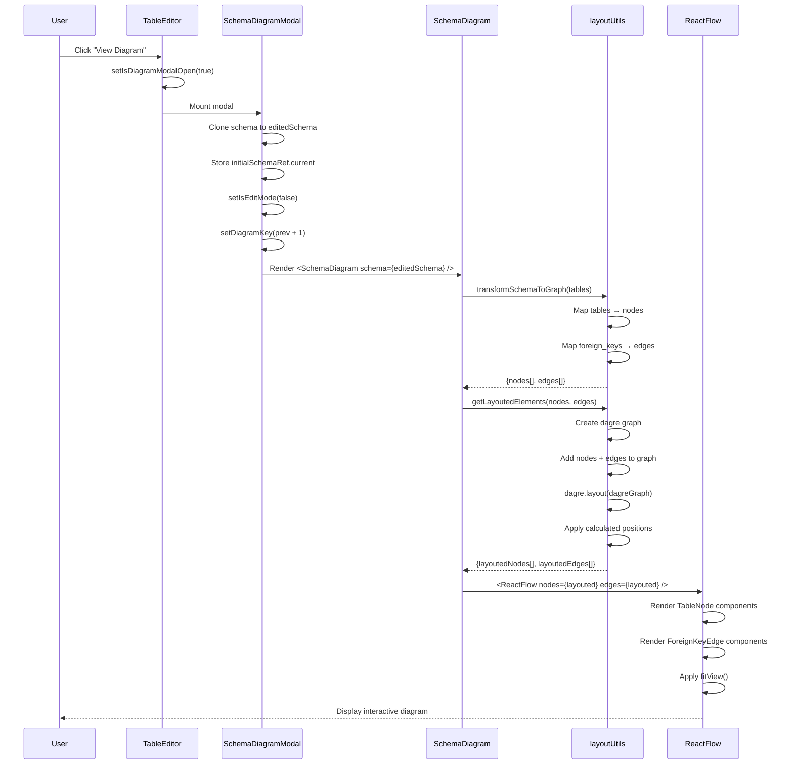
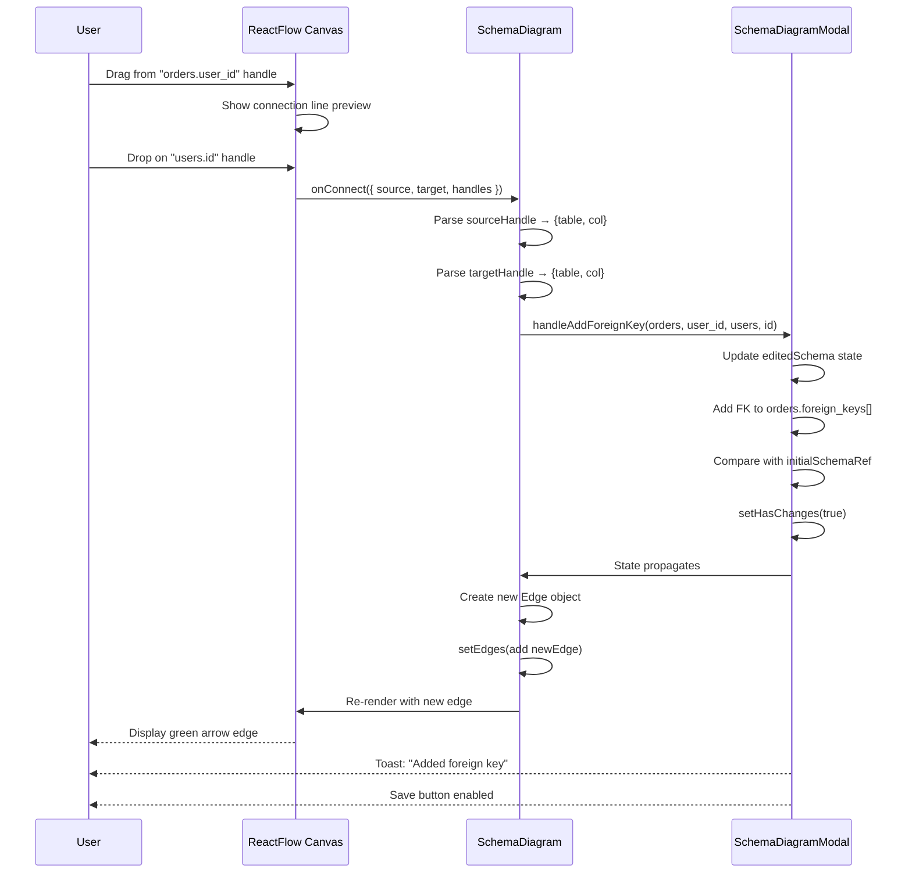
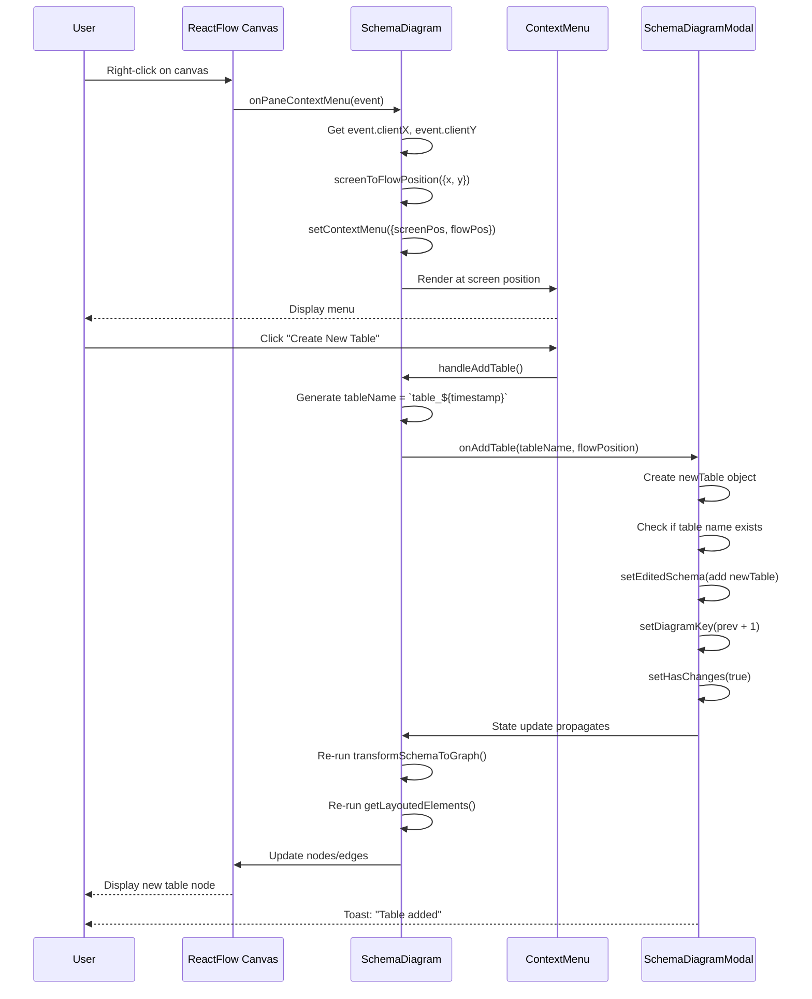
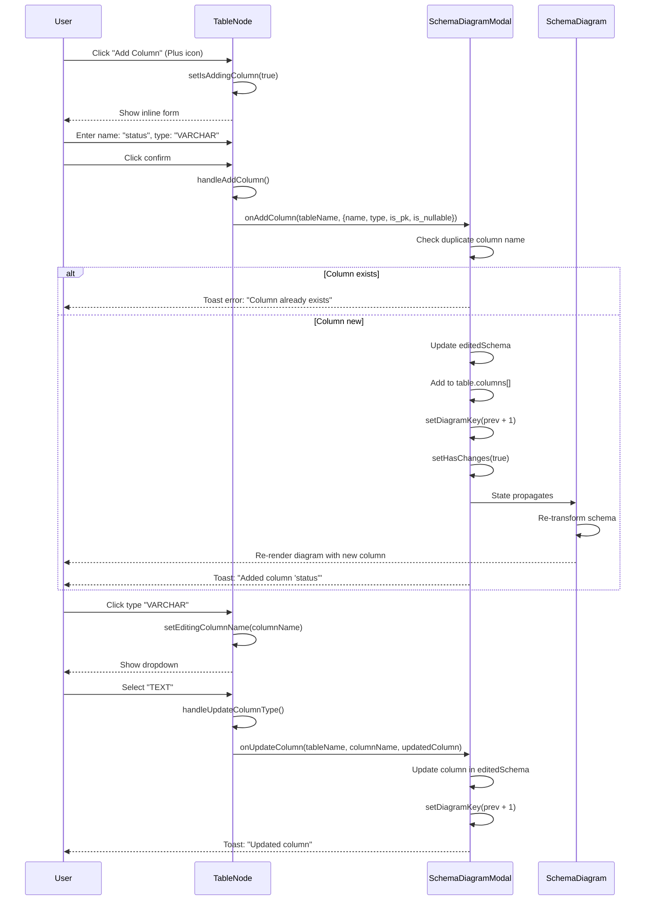
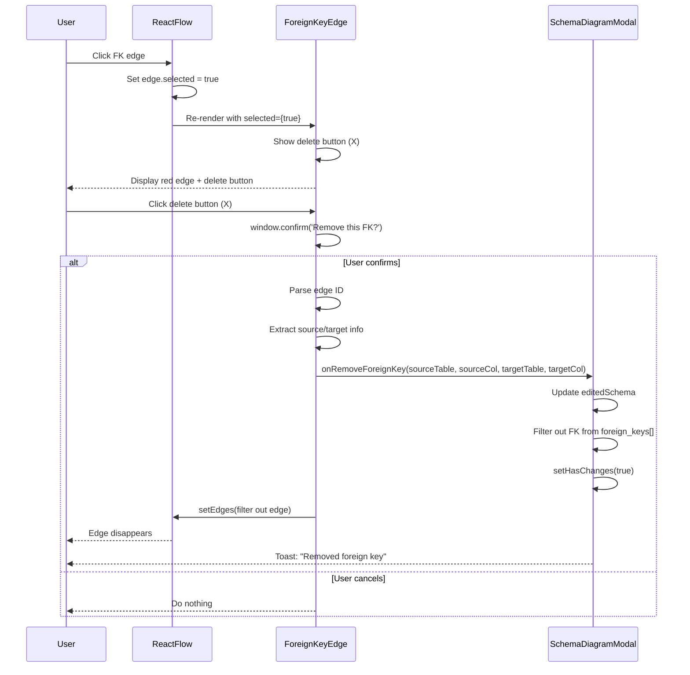
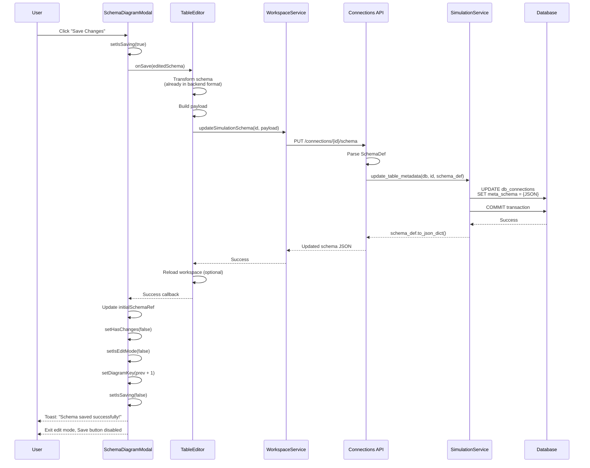
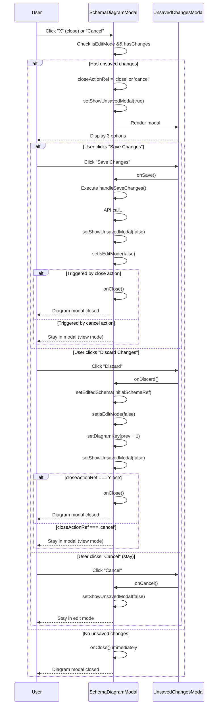

specification_functions/20260206/10_erd_visual_designer.md

# Tài liệu Đặc tả: Sơ đồ ERD & Chỉnh sửa Trực quan (Visual Designer)

## 1. Tác động Database (Database Impact)

### Table: `db_connections`
- **Usage:**
  - **Read:** `meta_schema` (JSONB) để render sơ đồ ERD
  - **Update:** `meta_schema` khi user save changes từ diagram editor
  - Chỉ áp dụng cho `db_type='simulation'` connections

**Lưu ý:**
- Chức năng này KHÔNG trực tiếp modify database schema
- Tất cả edits được lưu vào `meta_schema` JSON field
- Real databases (`postgres`, `mysql`) chỉ xem được diagram (read-only mode)

---

## 2. Mô phỏng API (API Simulation)

### 2.1. Get Schema for Diagram

**Endpoint:** `GET /api/v1/connections/{connection_id}/schema`

**Simulation:**

**Response JSON (Success - với Foreign Keys):**
```json
{
  "tables": [
    {
      "name": "users",
      "columns": [
        {
          "name": "id",
          "type": "UUID",
          "is_pk": true,
          "is_nullable": false
        },
        {
          "name": "email",
          "type": "VARCHAR(255)",
          "is_pk": false,
          "is_nullable": false
        }
      ],
      "foreign_keys": [],
      "indexes": [],
      "row_count": 150
    },
    {
      "name": "orders",
      "columns": [
        {
          "name": "id",
          "type": "UUID",
          "is_pk": true,
          "is_nullable": false
        },
        {
          "name": "user_id",
          "type": "UUID",
          "is_pk": false,
          "is_nullable": false
        },
        {
          "name": "total",
          "type": "DECIMAL(10,2)",
          "is_pk": false,
          "is_nullable": false
        }
      ],
      "foreign_keys": [
        {
          "column": "user_id",
          "ref_table": "users",
          "ref_column": "id"
        }
      ],
      "indexes": [],
      "row_count": 523
    }
  ]
}
```

---

### 2.2. Save Diagram Changes

**Endpoint:** `PUT /api/v1/connections/{connection_id}/schema`

**Simulation:**

**Request JSON (với added FK, renamed table, added column):**
```json
{
  "tables": [
    {
      "name": "customers",
      "columns": [
        {
          "name": "id",
          "type": "UUID",
          "is_pk": true,
          "is_nullable": false
        },
        {
          "name": "email",
          "type": "VARCHAR(255)",
          "is_pk": false,
          "is_nullable": false
        },
        {
          "name": "phone",
          "type": "VARCHAR(20)",
          "is_pk": false,
          "is_nullable": true
        }
      ],
      "foreign_keys": [],
      "indexes": []
    },
    {
      "name": "orders",
      "columns": [
        {
          "name": "id",
          "type": "UUID",
          "is_pk": true,
          "is_nullable": false
        },
        {
          "name": "customer_id",
          "type": "UUID",
          "is_pk": false,
          "is_nullable": false
        },
        {
          "name": "total",
          "type": "DECIMAL(10,2)",
          "is_pk": false,
          "is_nullable": false
        },
        {
          "name": "product_id",
          "type": "UUID",
          "is_pk": false,
          "is_nullable": true
        }
      ],
      "foreign_keys": [
        {
          "column": "customer_id",
          "ref_table": "customers",
          "ref_column": "id"
        },
        {
          "column": "product_id",
          "ref_table": "products",
          "ref_column": "id"
        }
      ],
      "indexes": []
    },
    {
      "name": "products",
      "columns": [
        {
          "name": "id",
          "type": "UUID",
          "is_pk": true,
          "is_nullable": false
        },
        {
          "name": "name",
          "type": "VARCHAR(255)",
          "is_pk": false,
          "is_nullable": false
        }
      ],
      "foreign_keys": [],
      "indexes": []
    }
  ]
}
```

**Response JSON (Success):**
```json
{
  "tables": [
    {
      "name": "customers",
      "columns": [...],
      "foreign_keys": [],
      "indexes": []
    },
    {
      "name": "orders",
      "columns": [...],
      "foreign_keys": [
        {
          "column": "customer_id",
          "ref_table": "customers",
          "ref_column": "id"
        },
        {
          "column": "product_id",
          "ref_table": "products",
          "ref_column": "id"
        }
      ],
      "indexes": []
    },
    {
      "name": "products",
      "columns": [...],
      "foreign_keys": [],
      "indexes": []
    }
  ]
}
```

**Error Response (400 - Not Simulation):**
```json
{
  "detail": "Can only update schema for simulation connections. Use POST /sync for real databases."
}
```

---

## 3. Luồng xử lý Chi tiết (Core Logic Flow)

### 3.1. Luồng Open Diagram Modal

**Step-by-Step Flow:**

1. **User Trigger:**
   - User click "View Diagram" button (Network icon) trong TableEditor header
   - Hoặc user click diagram icon từ workspace card

2. **Open Modal:**
   - Set: `setIsDiagramModalOpen(true)`
   - Component: `SchemaDiagramModal` mounts

3. **Initialize State:**
   - Clone schema: `editedSchema = JSON.parse(JSON.stringify(schema))`
   - Store initial snapshot: `initialSchemaRef.current = JSON.stringify(editedSchema)`
   - Reset flags: `setHasChanges(false)`, `setIsEditMode(false)`
   - Generate diagram key: `setDiagramKey(prev => prev + 1)` (force remount)

4. **Transform Schema:**
   - Function: `transformSchemaToGraph(schema.tables)`
   - Input: Backend schema với table names, columns, foreign_keys array
   - Process:
     - Create nodes: Map mỗi table thành ReactFlow Node
       ```typescript
       nodes = tables.map(table => ({
         id: table.name,
         type: 'tableNode',
         position: { x: 0, y: 0 }, // Sẽ được calculate bởi dagre
         data: {
           tableName: table.name,
           columns: table.columns,
           foreign_keys: table.foreign_keys
         }
       }))
       ```
     - Create edges: Map mỗi FK thành ReactFlow Edge
       ```typescript
       edges = []
       tables.forEach(table => {
         table.foreign_keys.forEach(fk => {
           edges.push({
             id: `${table.name}.${fk.column}-${fk.ref_table}.${fk.ref_column}`,
             source: table.name,
             target: fk.ref_table,
             sourceHandle: `${table.name}__${fk.column}__source`,
             targetHandle: `${fk.ref_table}__${fk.ref_column}__target`,
             type: 'foreignKeyEdge',
             animated: true
           })
         })
       })
       ```

5. **Apply Auto-Layout:**
   - Function: `getLayoutedElements(nodes, edges, options)`
   - Library: Dagre (graph layout algorithm)
   - Options:
     - `rankdir: 'LR'` (Left to Right)
     - `nodesep: 80` (horizontal spacing)
     - `ranksep: 200` (vertical spacing)
   - Process:
     - Build dagre graph: `dagreGraph.setNode(node.id, {width, height})`
     - Add edges: `dagreGraph.setEdge(edge.source, edge.target)`
     - Calculate: `dagre.layout(dagreGraph)`
     - Apply positions: `node.position = {x: nodeX, y: nodeY}`

6. **Render Diagram:**
   - Component: `SchemaDiagram` (wrapped với `ReactFlowProvider`)
   - ReactFlow canvas với:
     - Custom `TableNode` components
     - Custom `ForeignKeyEdge` components
     - Background grid (dots variant)
     - Controls (zoom, fit view)
     - MiniMap

**Sequence Diagram (Open Diagram):**



---

### 3.2. Luồng Drag & Drop để tạo Foreign Key

**Step-by-Step Flow:**

1. **User Interaction:**
   - User enters Edit Mode (click "Edit" button)
   - Set: `setIsEditMode(true)`
   - ReactFlow enables: `onConnect` handler

2. **Start Drag:**
   - User drag từ column handle (source) của table A
   - ReactFlow: Show connection line preview (green, animated)

3. **Drop on Target:**
   - User drop vào column handle (target) của table B
   - Trigger: `onConnect(connection)` callback

4. **Parse Handles:**
   - Extract source info:
     ```typescript
     sourceHandle = "orders__user_id__source"
     [sourceTable, sourceCol] = sourceHandle.split('__') // ["orders", "user_id"]
     ```
   - Extract target info:
     ```typescript
     targetHandle = "users__id__target"
     [targetTable, targetCol] = targetHandle.split('__') // ["users", "id"]
     ```

5. **Update Schema:**
   - Call: `handleAddForeignKey(sourceTable, sourceCol, targetTable, targetCol)`
   - Update `editedSchema`:
     ```typescript
     setEditedSchema(prev => {
       const updatedTables = prev.tables.map(table => {
         if (table.name === sourceTable) {
           return {
             ...table,
             foreign_keys: [
               ...table.foreign_keys,
               { column: sourceCol, ref_table: targetTable, ref_column: targetCol }
             ]
           }
         }
         return table
       })
       return { ...prev, tables: updatedTables }
     })
     ```

6. **Add Edge to UI:**
   - Create edge:
     ```typescript
     newEdge = {
       id: `${sourceTable}.${sourceCol}-${targetTable}.${targetCol}`,
       source: sourceTable,
       target: targetTable,
       sourceHandle, targetHandle,
       type: 'foreignKeyEdge',
       animated: true,
       style: { stroke: '#10b981' },
       markerEnd: { type: MarkerType.ArrowClosed, color: '#10b981' }
     }
     ```
   - Add: `setEdges(eds => addEdge(newEdge, eds))`

7. **Mark Changes:**
   - Detect: Compare `JSON.stringify(editedSchema)` với `initialSchemaRef.current`
   - Set: `setHasChanges(true)`
   - UI: Save button enabled, unsaved badge visible

8. **Show Toast:**
   - Display: `toast.success('Added foreign key: orders.user_id → users.id')`

**Sequence Diagram (Drag & Drop FK):**



---

### 3.3. Luồng Right-Click để tạo Table mới

**Step-by-Step Flow:**

1. **User Right-Click:**
   - User right-click vào empty canvas area
   - Condition: Chỉ hoạt động khi `isEditMode && isSimulation`
   - Trigger: `onPaneContextMenu(event)` handler

2. **Get Cursor Position:**
   - Screen coordinates: `{x: event.clientX, y: event.clientY}`
   - Convert to flow coordinates:
     ```typescript
     flowPosition = screenToFlowPosition({ x: screenX, y: screenY })
     // Accounts for zoom/pan transformations
     ```

3. **Show Context Menu:**
   - Set: `setContextMenu({ x: screenX, y: screenY, flowPosition })`
   - Render: `ContextMenu` component tại screen position
   - Menu items:
     - "Create New Table" (Plus icon)

4. **User Clicks "Create New Table":**
   - Generate table name:
     ```typescript
     timestamp = Date.now()
     tableName = `table_${timestamp}` // e.g., "table_1738843200000"
     ```

5. **Add Table to Schema:**
   - Call: `handleAddTableInDiagram(tableName, flowPosition)`
   - Create new table:
     ```typescript
     newTable = {
       name: tableName,
       columns: [],
       foreign_keys: [],
       indexes: [],
       row_count: 0
     }
     ```
   - Update: `setEditedSchema({ ...prev, tables: [...prev.tables, newTable] })`

6. **Force Diagram Re-render:**
   - Update: `setDiagramKey(prev => prev + 1)`
   - ReactFlow: Re-mount with new table node
   - Dagre: Re-calculate layout with new node

7. **Hide Menu:**
   - Set: `setContextMenu(null)`

8. **Show Guidance Toast:**
   - Display: `toast.info('Table "table_1738843200000" added. Add columns and save to persist.')`

**Note:** Newly created table appears với empty columns. User cần:
- Add columns via TableNode inline editor (Plus button)
- Save changes để persist vào database

**Sequence Diagram (Right-Click Add Table):**



---

### 3.4. Luồng Inline Edit Column trên TableNode

**Step-by-Step Flow:**

1. **Add Column:**
   - User click Plus icon trong TableNode
   - Show inline form: `setIsAddingColumn(true)`
   - Inputs:
     - Column name: Text input
     - Column type: Dropdown (VARCHAR, INTEGER, UUID, etc.)
   - User enters `status`, select `VARCHAR`
   - Click confirm: Call `handleAddColumn()`
   - Update:
     ```typescript
     newColumn = { name: 'status', type: 'VARCHAR', is_pk: false, is_nullable: true }
     onAddColumn(tableName, newColumn)
     ```
   - Modal: `handleAddColumn(tableName, column)` updates `editedSchema`
   - Check: Duplicate column name → Show error toast
   - Success: Add to `table.columns[]`, force diagram re-render

2. **Edit Column Type:**
   - User click type text (e.g., "VARCHAR")
   - Show dropdown: `setEditingColumnName(columnName)`
   - User select new type: "TEXT"
   - Update:
     ```typescript
     updatedColumn = { ...column, type: 'TEXT' }
     onUpdateColumn(tableName, columnName, updatedColumn)
     ```
   - Modal: Updates column in `editedSchema`
   - Toast: "Updated column 'status' in table 'orders'"

3. **Toggle Primary Key:**
   - User click Key icon bên cạnh column
   - Toggle:
     ```typescript
     updatedColumn = { ...column, is_pk: !column.is_pk }
     onUpdateColumn(tableName, columnName, updatedColumn)
     ```
   - UI: Key icon highlighted/unhighlighted
   - Toast: "Set primary key for 'id'" hoặc "Removed primary key"

4. **Delete Column:**
   - User click Trash icon
   - Call: `onRemoveColumn(tableName, columnName)`
   - Modal: `handleRemoveColumn()` executes:
     - Remove from `table.columns[]`
     - Remove related FKs: Filter `table.foreign_keys` where `fk.column === columnName`
     - Remove FKs from other tables: Filter FKs where `fk.ref_table === tableName && fk.ref_column === columnName`
   - Force re-render: `setDiagramKey(prev + 1)`
   - Toast: "Removed column 'status' from table 'orders'"

5. **Edit Table Name:**
   - User double-click table header
   - Show inline input: `setIsEditingTableName(true)`
   - User enters new name: "customers"
   - Press Enter: Call `handleUpdateTableName()`
   - Modal: `handleUpdateTableName(oldName, newName)` executes:
     - Check duplicate: `tables.some(t => t.name === newName)` → Error toast
     - Update table name: `table.name = newName`
     - Update FK references: Loop all tables, update `fk.ref_table === oldName`
   - Force re-render: `setDiagramKey(prev + 1)`
   - Toast: "Renamed table 'users' to 'customers'"

**Sequence Diagram (Inline Column Edit):**



---

### 3.5. Luồng Delete Foreign Key

**Step-by-Step Flow:**

1. **Select Edge:**
   - User click vào Foreign Key edge (green arrow)
   - ReactFlow: Edge becomes selected (`selected={true}`)
   - UI: Edge highlight (stroke color changes to red, width increases)

2. **Show Delete Button:**
   - Component: `ForeignKeyEdge` với `isEditable={true}`
   - Render: Delete button (X icon) at edge midpoint
   - Position: `EdgeLabelRenderer` tại `(labelX, labelY)`

3. **Click Delete:**
   - User click X button
   - Confirm: `window.confirm('Remove this foreign key relationship?')`

4. **Parse Edge ID:**
   - Edge ID format: `"orders.user_id-users.id"`
   - Split: `const [sourcePart, targetPart] = id.split('-')`
   - Extract:
     ```typescript
     [sourceTable, sourceCol] = sourcePart.split('.') // ["orders", "user_id"]
     [targetTable, targetCol] = targetPart.split('.') // ["users", "id"]
     ```

5. **Update Schema:**
   - Call: `onRemoveForeignKey(sourceTable, sourceCol, targetTable, targetCol)`
   - Modal: `handleRemoveForeignKey()` executes:
     ```typescript
     setEditedSchema(prev => {
       const updatedTables = prev.tables.map(table => {
         if (table.name === sourceTable) {
           return {
             ...table,
             foreign_keys: table.foreign_keys.filter(fk => 
               !(fk.column === sourceCol && fk.ref_table === targetTable && fk.ref_column === targetCol)
             )
           }
         }
         return table
       })
       return { ...prev, tables: updatedTables }
     })
     ```

6. **Remove Edge from UI:**
   - ReactFlow: `setEdges(edges => edges.filter(edge => edge.id !== id))`
   - UI: Edge disappears from canvas

7. **Mark Changes:**
   - Set: `setHasChanges(true)`
   - Toast: "Removed foreign key: orders.user_id → users.id"

**Sequence Diagram (Delete FK):**



---

### 3.6. Luồng Edge Reconnection (Thay đổi FK Target)

**Step-by-Step Flow:**

1. **User Drags Edge Source/Target:**
   - User click and drag edge endpoint (source hoặc target handle)
   - ReactFlow: Show reconnection preview line

2. **Drop on New Handle:**
   - User drop vào new column handle
   - Trigger: `onReconnect(oldEdge, newConnection)` callback

3. **Parse Handles:**
   - Old source:
     ```typescript
     oldSourceHandle = oldEdge.sourceHandle // "orders__user_id__source"
     oldSourceData = parseHandleId(oldSourceHandle) // {table: "orders", col: "user_id"}
     ```
   - New source/target:
     ```typescript
     newSourceData = parseHandleId(newConnection.sourceHandle)
     newTargetData = parseHandleId(newConnection.targetHandle)
     ```

4. **Update FK in Schema:**
   - Call: `onUpdateForeignKey(oldSourceData, newSourceData, newTargetData)`
   - Modal: `handleUpdateForeignKey()` executes:
     - Remove old FK: Filter từ old source table
     - Add new FK: Nếu new source table khác → Add vào new table
       - Nếu same table → Update in place

5. **Example Scenario:**
   - Old: `orders.user_id → users.id`
   - User drags target end to `customers.id`
   - New: `orders.user_id → customers.id`
   - Schema update:
     ```typescript
     // Remove old FK
     orders.foreign_keys = orders.foreign_keys.filter(fk => fk.column !== 'user_id')
     // Add new FK
     orders.foreign_keys.push({ 
       column: 'user_id', 
       ref_table: 'customers', 
       ref_column: 'id' 
     })
     ```

6. **Mark Changes:**
   - Set: `setHasChanges(true)`
   - Toast: "Updated foreign key: orders.user_id → orders.user_id → customers.id" (confusing, nhưng đây là actual toast)

**Note:** Edge reconnection chỉ thay đổi target, không move edge sang table khác (không thay đổi source table).

---

### 3.7. Luồng Save Changes from Diagram

**Step-by-Step Flow:**

1. **User Click Save:**
   - Button enabled only when `hasChanges === true`
   - Set: `setIsSaving(true)`, disable button

2. **Validate Schema:**
   - No explicit validation (trust ReactFlow + inline editors)

3. **Call Parent Callback:**
   - Call: `await onSave(editedSchema)`
   - Parent: TableEditor receives callback

4. **Transform Schema (Frontend → Backend):**
   - TableEditor: `handleSaveChanges(schemaToSave)` executes:
     - Remove UUIDs (diagram chỉ dùng names, không có UUIDs)
     - Transform columns:
       ```typescript
       columns: table.columns.map(col => ({
         name: col.name,
         type: col.type,
         is_pk: col.is_pk,
         is_nullable: col.is_nullable,
         default: col.default
       }))
       ```
     - Foreign keys already in correct format:
       ```typescript
       foreign_keys: table.foreign_keys.map(fk => ({
         column: fk.column,
         ref_table: fk.ref_table,
         ref_column: fk.ref_column
       }))
       ```

5. **API Call:**
   - Call: `workspaceService.updateSimulationSchema(workspaceId, payload)`
   - Endpoint: `PUT /connections/{connection_id}/schema`
   - Backend: `simulation_service.update_table_metadata()` updates `meta_schema`

6. **Success Handling:**
   - Update snapshot: `initialSchemaRef.current = JSON.stringify(editedSchema)`
   - Reset flag: `setHasChanges(false)` (via useEffect comparison)
   - Exit edit mode: `setIsEditMode(false)`
   - Force re-render: `setDiagramKey(prev => prev + 1)`
   - Toast: "Schema changes saved successfully!"

7. **Error Handling:**
   - Toast: "Failed to save schema changes"
   - Keep `isSaving = false`, user can retry

**Sequence Diagram (Save Changes):**



---

### 3.8. Luồng Unsaved Changes Warning

**Step-by-Step Flow:**

1. **User Exits Edit Mode:**
   - Scenario 1: Click "Cancel" button
   - Scenario 2: Click "X" (close) button
   - Scenario 3: Click backdrop

2. **Check Changes:**
   - Condition: `isEditMode && hasChanges`
   - If true → Block close, show modal
   - If false → Close immediately

3. **Show Unsaved Modal:**
   - Track action: `closeActionRef.current = 'close'` hoặc `'cancel'`
   - Set: `setShowUnsavedModal(true)`
   - Component: `UnsagedChangesModal`
   - Options:
     - **Save Changes:** Save và close
     - **Discard Changes:** Rollback và close
     - **Cancel:** Stay in edit mode

4. **Option 1: Save Changes:**
   - Execute: `await handleSaveChanges()`
   - Wait: API response
   - Success:
     - Close unsaved modal: `setShowUnsavedModal(false)`
     - Exit edit mode: `setIsEditMode(false)`
     - Close diagram modal: `onClose()` (if triggered by close action)

5. **Option 2: Discard Changes:**
   - Reset: `setEditedSchema(JSON.parse(initialSchemaRef.current))`
   - Exit edit mode: `setIsEditMode(false)`
   - Force re-render: `setDiagramKey(prev + 1)`
   - Conditional close:
     - If `closeActionRef.current === 'close'` → `onClose()` (close diagram)
     - If `closeActionRef.current === 'cancel'` → Stay in modal (just exit edit mode)

6. **Option 3: Cancel:**
   - Close unsaved modal: `setShowUnsavedModal(false)`
   - Stay in edit mode, no changes

**Note:** "Cancel" button khác "Close" button:
- **Cancel:** Exit edit mode (với discard nếu có changes)
- **Close (X):** Close diagram modal hoàn toàn

**Sequence Diagram (Unsaved Warning):**



---

## 4. Tương tác Frontend (Frontend Flow)

### 4.1. Trigger View Diagram

**Trigger:**
- User click "View Diagram" button (Network icon) trong TableEditor header
- Button luôn visible, cả simulation và real databases

**Data Handling:**

1. **Prepare Schema:**
   - Compute: `diagramSchema = useMemo(() => {...}, [workspace, schema])`
   - Transform:
     - Frontend format (với UUIDs) → Diagram format (chỉ names)
     - Extract FK từ `column.fk_target` objects:
       ```typescript
       foreign_keys = table.columns
         .filter(col => col.fk_target)
         .map(col => {
           const refTable = schema.tables.find(t => t.id === col.fk_target.table_id)
           const refCol = refTable.columns.find(c => c.id === col.fk_target.column_id)
           return {
             column: col.name,
             ref_table: refTable.name,
             ref_column: refCol.name
           }
         })
       ```

2. **Open Modal:**
   - Set: `setIsDiagramModalOpen(true)`
   - Pass props:
     - `schema={diagramSchema}`
     - `isSimulation={workspace.db_type === 'simulation'}`
     - `onSave={handleSaveChanges}` (callback từ TableEditor)

3. **Modal Initialization:**
   - Clone schema để edit: `editedSchema`
   - Store snapshot: `initialSchemaRef`
   - Default mode: View (read-only)

**User Flow:**
```
Click "View Diagram" → Transform schema → Open modal → Initialize state → Render ReactFlow diagram
```

---

### 4.2. Enable Edit Mode

**Trigger:**
- User click "Edit" button trong diagram modal header
- Button chỉ hiện với simulation workspaces (`isSimulation={true}`)

**Data Handling:**

1. **Re-sync Schema:**
   - Re-clone: `setEditedSchema(JSON.parse(JSON.stringify(schema)))`
   - Reason: Đảm bảo editedSchema sync với latest schema từ parent

2. **Enter Edit Mode:**
   - Set: `setIsEditMode(true)`
   - UI changes:
     - "Edit" button → "Save Changes" + "Cancel" buttons
     - ReactFlow enables: `onConnect`, `onReconnect`, `onPaneContextMenu`
     - TableNode enables: Add/Delete/Edit column buttons
     - ForeignKeyEdge enables: Delete button

3. **Interactive Features Enabled:**
   - **Drag & Drop FK:** `onConnect` handler active
   - **Edge Reconnect:** `onReconnect` handler active
   - **Right-click Add Table:** `onPaneContextMenu` handler active
   - **Inline Column CRUD:** TableNode buttons enabled
   - **Delete FK:** ForeignKeyEdge delete button visible

**User Flow:**
```
Click "Edit" → Re-sync schema → Enable edit mode → Enable interactive handlers → User can modify diagram
```

---

### 4.3. Drag & Drop Foreign Key

**Trigger:**
- User drags from column handle (small dot) của source table
- User drops vào column handle của target table

**Data Handling:**

1. **ReactFlow Connection:**
   - Library: `@xyflow/react`
   - Handler: `onConnect={(connection) => {...}}`
   - Connection object:
     ```typescript
     {
       source: "orders",        // Source node ID (table name)
       target: "users",         // Target node ID (table name)
       sourceHandle: "orders__user_id__source",
       targetHandle: "users__id__target"
     }
     ```

2. **Parse Handles:**
   - Split `sourceHandle`: `["orders", "user_id", "source"]`
   - Split `targetHandle`: `["users", "id", "target"]`

3. **Schema Update:**
   - Update `editedSchema` state (immutable):
     - Find source table: `tables.find(t => t.name === 'orders')`
     - Add FK: `foreign_keys.push({ column: 'user_id', ref_table: 'users', ref_column: 'id' })`
   - Clone array: `updatedTables = prev.tables.map(...)`

4. **UI Update:**
   - Add edge: `setEdges(eds => addEdge(newEdge, eds))`
   - Edge props:
     - `type: 'foreignKeyEdge'` (custom component)
     - `animated: true` (flowing dots)
     - `style: { stroke: '#10b981' }` (green color)
     - `markerEnd: ArrowClosed` (arrow head)

5. **Change Detection:**
   - Compare: `JSON.stringify(editedSchema) !== initialSchemaRef.current`
   - Result: `hasChanges = true`
   - UI: Save button enabled + badge visible

**User Flow:**
```
Drag from column handle → Show connection line → Drop on target handle → Parse handles → Update schema → Add edge → Mark changes
```

---

### 4.4. Right-Click Add Table

**Trigger:**
- User right-clicks vào empty canvas area
- Condition: `isEditMode === true` AND `isSimulation === true`

**Data Handling:**

1. **Context Menu Position:**
   - Screen coordinates: Directly from mouse event
   - Flow coordinates: Transform với `screenToFlowPosition()` (accounts for zoom/pan)

2. **Generate Table Name:**
   - Strategy: Timestamp-based để tránh duplicate
   - Format: `table_${Date.now()}` → `table_1738843200000`

3. **Create Empty Table:**
   - Structure:
     ```typescript
     {
       name: "table_1738843200000",
       columns: [],
       foreign_keys: [],
       indexes: [],
       row_count: 0
     }
     ```

4. **Add to Schema:**
   - Append: `setEditedSchema({ ...prev, tables: [...prev.tables, newTable] })`
   - Force re-render: `setDiagramKey(prev => prev + 1)` (remount ReactFlow)

5. **Dagre Re-layout:**
   - Automatic: `useEffect` triggers khi schema changes
   - Process:
     - `transformSchemaToGraph()` → Include new table node
     - `getLayoutedElements()` → Re-calculate all positions
     - Dagre finds optimal position for new node

6. **User Next Steps:**
   - Click vào new table node
   - Add columns via inline editor (Plus button)
   - Set column types, PK, nullable
   - Save changes

**User Flow:**
```
Right-click canvas → Context menu appears → Click "Create New Table" → Generate name → Add to schema → Re-layout diagram → Display new node
```

---

### 4.5. Inline Edit Column in TableNode

**Trigger:**
- **Add Column:** Click Plus icon trong TableNode
- **Edit Type:** Click column type text
- **Toggle PK:** Click Key icon
- **Delete Column:** Click Trash icon

**Data Handling:**

1. **Add Column Form:**
   - State: `isAddingColumn = true` (local state trong TableNode)
   - Inputs:
     - Name: `<input value={newColumnName} onChange={...} />`
     - Type: `<select value={newColumnType}>`
       - Options: `['VARCHAR', 'TEXT', 'INTEGER', 'BIGINT', 'DECIMAL', 'BOOLEAN', 'DATE', 'TIMESTAMP', 'UUID', 'JSON']`
   - Submit:
     - Validate: `newColumnName.trim()` not empty
     - Call: `onAddColumn(tableName, { name, type, is_pk: false, is_nullable: true })`
     - Reset form: `setNewColumnName('')`, `setIsAddingColumn(false)`

2. **Edit Column Type:**
   - Click type text: `setEditingColumnName(columnName)` (render dropdown)
   - Select new type: Call `onUpdateColumn(tableName, columnName, { ...column, type: newType })`
   - Exit edit: `setEditingColumnName(null)`

3. **Toggle Primary Key:**
   - Click Key icon: `onUpdateColumn(tableName, columnName, { ...column, is_pk: !column.is_pk })`
   - UI: Icon highlighted (yellow color) when PK

4. **Delete Column:**
   - Click Trash icon: `onRemoveColumn(tableName, columnName)`
   - No confirmation (immediate delete)
   - Cascade effects (handled by SchemaDiagramModal):
     - Remove related FKs from same table
     - Remove FKs from other tables pointing to this column

5. **Callbacks to Modal:**
   - All callbacks propagate to `SchemaDiagramModal`
   - Modal updates `editedSchema` state
   - State change triggers:
     - `hasChanges` detection
     - Diagram re-render (via `setDiagramKey`)
     - Toast notifications

**User Flow:**
```
Click Plus → Enter column info → Submit → Callback to modal → Update schema → Force re-render → New column visible
```

---

### 4.6. Save from Diagram

**Trigger:**
- User click "Save Changes" button
- Button enabled only when `hasChanges === true`

**Data Handling:**

1. **Modal Callback:**
   - Call: `await onSave(editedSchema)`
   - Loading: `isSaving = true`, button shows spinner

2. **TableEditor Receives:**
   - Function: `handleSaveChanges(schemaToSave)`
   - Transform: Diagram format → Backend format
     - Structure already correct (no UUIDs in diagram format)
     - Foreign keys already in `{column, ref_table, ref_column}` format

3. **API Call:**
   - Endpoint: `PUT /connections/{connection_id}/schema`
   - Payload:
     ```json
     {
       "tables": [
         {
           "name": "customers",
           "columns": [...],
           "foreign_keys": [...],
           "indexes": []
         }
       ]
     }
     ```

4. **Success Handling:**
   - Modal:
     - Update snapshot: `initialSchemaRef.current = JSON.stringify(editedSchema)`
     - Detect no changes: `hasChanges = false` (auto via useEffect)
     - Exit edit mode: `setIsEditMode(false)`
     - Toast: "Schema changes saved successfully!"
   - TableEditor:
     - Reload workspace (optional): Trigger workspace refetch
     - Update schema state: Merge server response

5. **Error Handling:**
   - Toast: "Failed to save schema changes"
   - Keep modal open: User can fix and retry
   - `isSaving = false`: Re-enable Save button

**User Flow:**
```
Click Save → Loading state → API call → Success → Update snapshot → Exit edit mode → Toast success
```

---

### 4.7. Close with Unsaved Changes

**Trigger:**
- User clicks:
  - "X" (close) button → Close diagram modal
  - "Cancel" button → Exit edit mode
  - Backdrop (click outside) → Close diagram modal

**Data Handling:**

1. **Intercept Close:**
   - Function: `handleClose()` or `handleCancelEdit()`
   - Check: `isEditMode && hasChanges`
   - Track action: `closeActionRef.current = 'close'` or `'cancel'`

2. **Show Modal:**
   - Component: `UnsavedChangesModal`
   - Props:
     - `isOpen={showUnsavedModal}`
     - `isSaving={isSaving}`
     - `onSave={async () => {...}}`
     - `onDiscard={() => {...}}`
     - `onCancel={() => {...}}`

3. **Option: Save Changes:**
   - Execute: `handleSaveChanges()`
   - Success:
     - Close unsaved modal
     - Exit edit mode
     - IF `closeActionRef === 'close'` → Close diagram modal

4. **Option: Discard Changes:**
   - Rollback: `setEditedSchema(JSON.parse(initialSchemaRef.current))`
   - Exit edit mode: `setIsEditMode(false)`
   - Force re-render: `setDiagramKey(prev + 1)` (apply rollback visually)
   - Close unsaved modal
   - IF `closeActionRef === 'close'` → Close diagram modal
   - IF `closeActionRef === 'cancel'` → Stay in modal (view mode)

5. **Option: Cancel (Stay):**
   - Close unsaved modal only
   - Stay in edit mode
   - Keep all changes

**User Flow:**
```
Click "X" → Check changes → Show unsaved modal → User selects option → Execute action → Close modal(s)
```

---

### 4.8. View Diagram for Real Database

**Trigger:**
- User opens diagram từ real database workspace (`db_type='postgres'` or `'mysql'`)

**Data Handling:**

1. **Fetch Schema:**
   - Schema already loaded từ sync operation
   - Stored in `meta_schema` (read-only snapshot)

2. **Read-Only Mode:**
   - Modal: `isSimulation={false}`
   - UI differences:
     - NO "Edit" button (hidden)
     - ReactFlow: All handlers disabled
       - `onConnect={undefined}`
       - `onReconnect={undefined}`
       - `onPaneContextMenu={undefined}`
     - TableNode: All CRUD buttons hidden (`isEditable={false}`)
     - ForeignKeyEdge: No delete button

3. **Available Features:**
   - ✓ View diagram: Zoom, pan, minimap
   - ✓ Controls: Fit view, zoom in/out
   - ✓ Double-click table: Call `onEditTable()` → Navigate to table detail page
   - ✗ Edit schema: Disabled
   - ✗ Add/delete FK: Disabled
   - ✗ Add table: Disabled

**User Flow:**
```
Open diagram → Read-only mode → View visualization only → Can navigate to table detail via double-click
```

---

## 5. End-to-End Flow Diagram

```mermaid
graph TB
    subgraph "User Actions"
        A[Click "View Diagram"]
        B[Enter Edit Mode]
        C[Drag & Drop FK]
        D[Right-click Add Table]
        E[Inline Edit Column]
        F[Delete FK Edge]
        G[Click Save]
    end
    
    subgraph "SchemaDiagramModal"
        H[Clone schema → editedSchema]
        I[Store initialSchemaRef]
        J[setIsEditMode true]
        K[Update editedSchema]
        L[Detect hasChanges]
        M[setDiagramKey + 1]
        N[handleSaveChanges]
    end
    
    subgraph "SchemaDiagram (ReactFlow)"
        O[transformSchemaToGraph]
        P[getLayoutedElements dagre]
        Q[Render TableNode]
        R[Render ForeignKeyEdge]
        S[onConnect handler]
        T[onPaneContextMenu]
        U[onReconnect handler]
    end
    
    subgraph "TableNode Component"
        V[Inline column form]
        W[onAddColumn callback]
        X[onUpdateColumn callback]
        Y[onRemoveColumn callback]
    end
    
    subgraph "API & Backend"
        Z[PUT /connections/:id/schema]
        AA[simulation_service.update_table_metadata]
        AB[UPDATE db_connections SET meta_schema]
    end
    
    A --> H
    H --> I
    H --> O
    O --> P
    P --> Q
    P --> R
    
    B --> J
    J --> S
    J --> T
    J --> U
    
    C --> S
    S --> K
    K --> L
    L --> M
    M --> P
    
    D --> T
    T --> K
    K --> L
    
    E --> V
    V --> W
    W --> K
    
    F --> U
    U --> K
    
    G --> N
    N --> Z
    Z --> AA
    AA --> AB
    AB --> I
    
    style A fill:#ffe6cc
    style G fill:#ccffe6
    style AB fill:#e6ffe6
    style L fill:#ffffcc
```

---

## Tóm tắt

### Core Functions:

1. **ReactFlow Integration:**
   - Library: `@xyflow/react` cho diagram rendering
   - Custom nodes: `TableNode` với inline CRUD
   - Custom edges: `ForeignKeyEdge` với delete button
   - Layout: Dagre algorithm (LR direction, auto-positioning)

2. **SchemaDiagramModal:**
   - Full-screen modal wrapper
   - Dual mode: View (read-only) vs Edit (interactive)
   - State: `editedSchema` (local changes), `initialSchemaRef` (rollback)
   - Change detection: JSON comparison
   - Unsaved changes warning: Modal on close/cancel

3. **Interactive Features (Edit Mode Only):**
   - **Drag & Drop FK:** `onConnect(connection)` → Parse handles → Update schema → Add edge
   - **Edge Reconnect:** `onReconnect(oldEdge, newConnection)` → Update FK target
   - **Right-click Add Table:** `onPaneContextMenu(event)` → ContextMenu → Generate table name
   - **Inline Column CRUD:** TableNode với Add/Edit/Delete buttons → Callbacks to modal
   - **Delete FK:** ForeignKeyEdge delete button → Remove from schema + edges
   - **Edit Table Name:** Double-click header → Inline input → Update + cascade FKs

4. **Layout Algorithm:**
   - Function: `getLayoutedElements(nodes, edges, options)`
   - Library: Dagre (directed graph layout)
   - Options: `rankdir='LR'`, `nodesep=80`, `ranksep=200`
   - Process: Build graph → Calculate positions → Apply to nodes

5. **Save Flow:**
   - Edit mode → Make changes → Click Save → `onSave(editedSchema)` callback
   - TableEditor → Transform (already in backend format) → API call
   - Success → Update snapshot → Exit edit mode → Toast

6. **Schema Transformation:**
   - **Load:** Backend format → Diagram format (no UUIDs, just names)
   - **Save:** Diagram format → Backend format (same structure)
   - **FK Format:** Array of `{column, ref_table, ref_column}` objects

7. **Read-Only Mode (Real Databases):**
   - No Edit button
   - All interactive handlers disabled
   - Can view diagram only
   - Double-click table → Navigate to detail page

### Key Features:

- **Visual Schema Design:** Drag & drop interface với ReactFlow
- **Auto-Layout:** Dagre algorithm tự động arrange nodes
- **Inline Editing:** CRUD columns directly trên diagram nodes
- **FK Management:** Visual drag & drop để create/reconnect relationships
- **Context Menu:** Right-click canvas để add tables
- **Change Tracking:** JSON comparison với unsaved warning
- **Dual Mode:** View vs Edit với clear UI indicators
- **Simulation Only:** Edit mode chỉ available cho simulation workspaces
- **Real DB Support:** Read-only visualization cho PostgreSQL/MySQL
- **Responsive Controls:** Zoom, pan, minimap, fit view
- **Toast Feedback:** Success/error notifications cho mọi actions
- **Cascade Updates:** Delete column → Auto-remove related FKs
- **Table Rename:** Auto-update FK references
- **Unsaved Protection:** Modal warning trước khi lose changes
