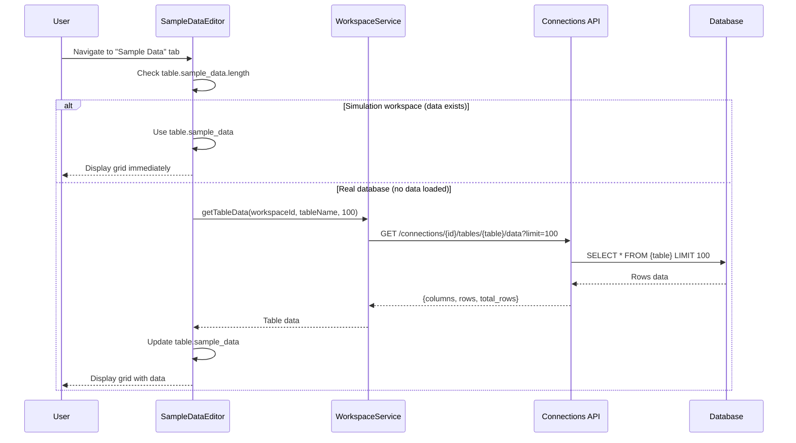
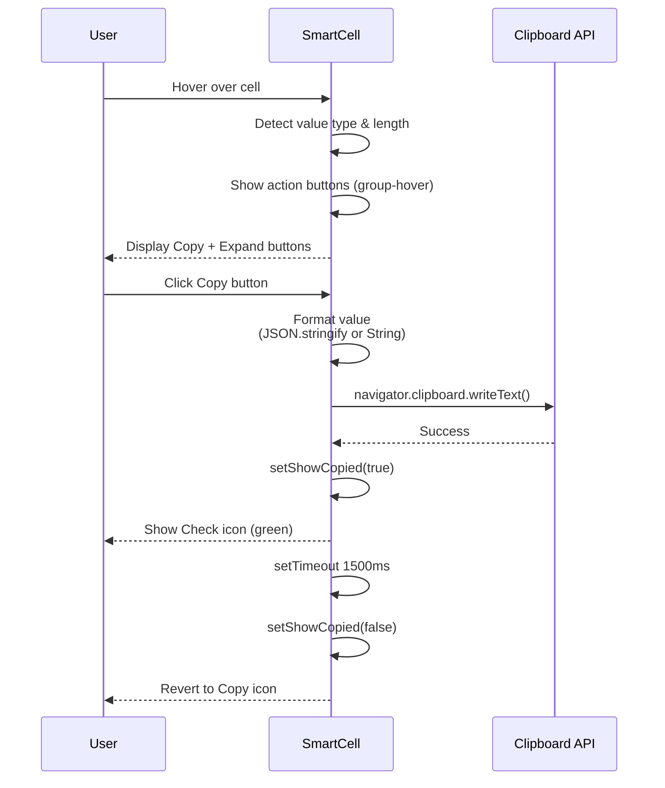
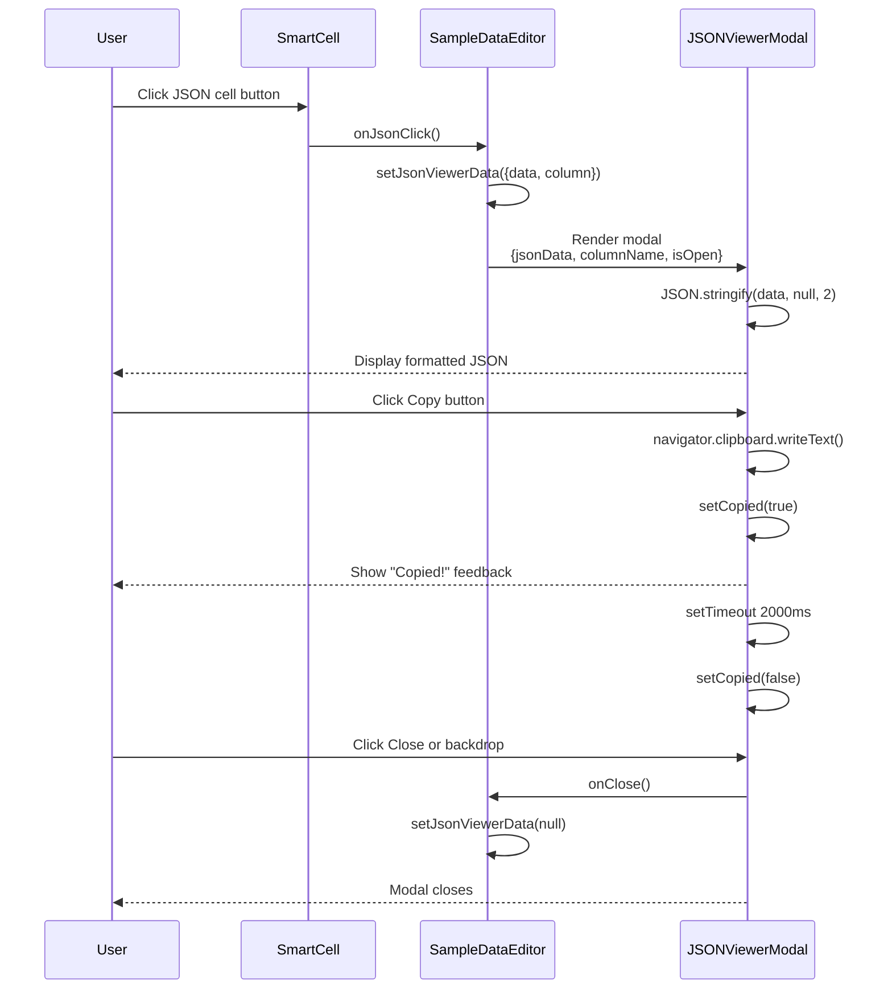
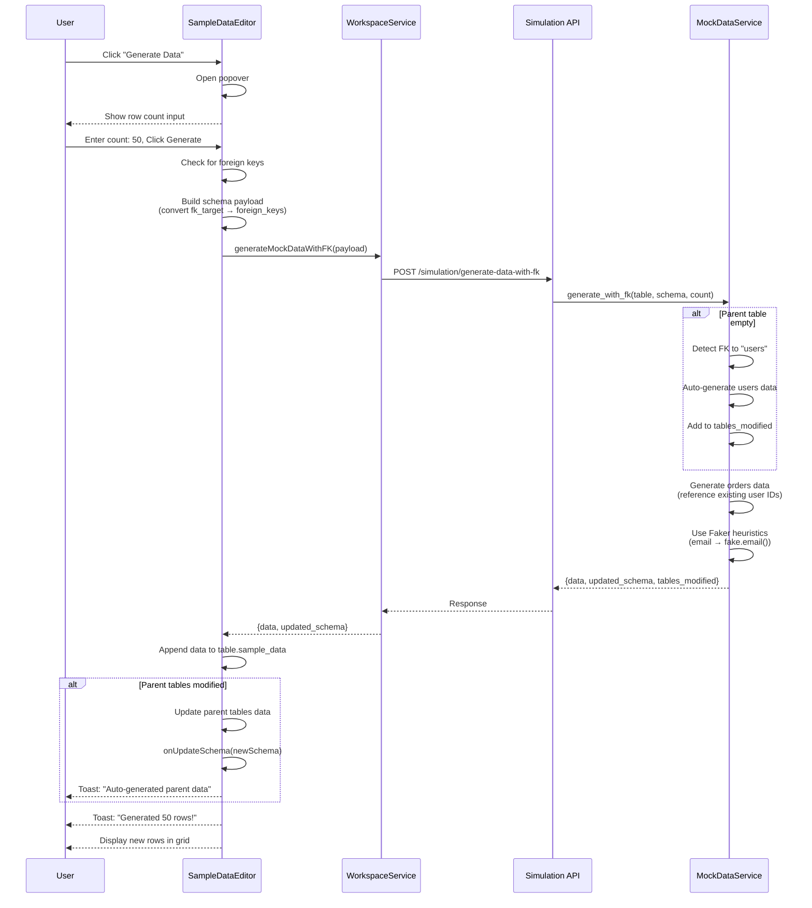
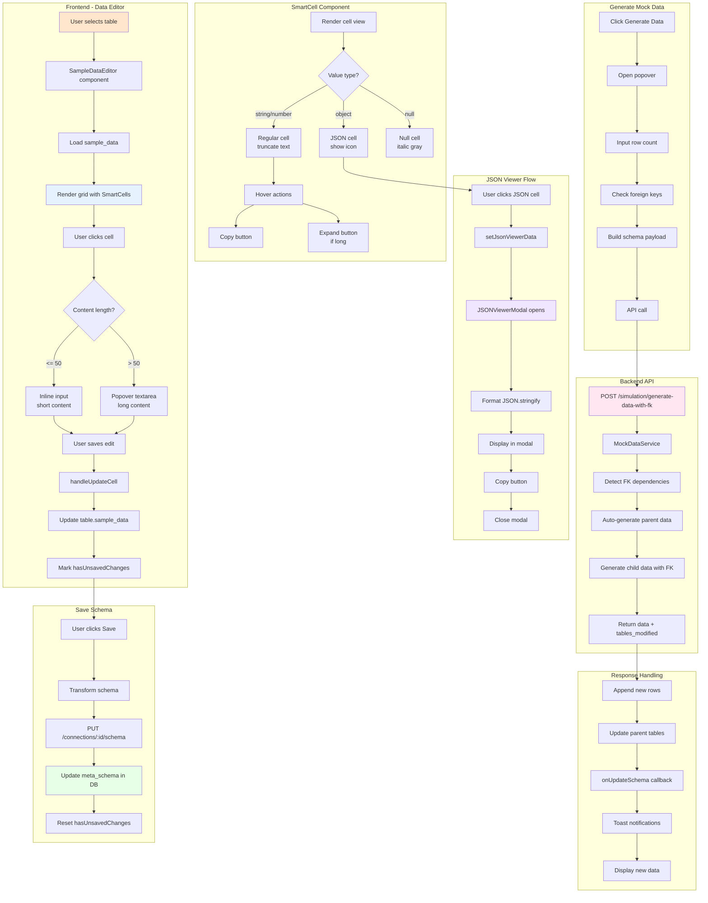

specification_functions/20260206/11_data_editor.md

# Tài liệu Đặc tả: Trình chỉnh sửa Dữ liệu mẫu (Data Editor)

## 1. Tác động Database (Database Impact)

### Table: `db_connections`
- **Usage:**
  - **Read:** `meta_schema` (JSONB) để load sample data cho tables
  - **Update:** `meta_schema.tables[].sample_data` khi user edit cells hoặc add/delete rows
  - Data được lưu trong `sample_data` array của mỗi table

**Lưu ý:**
- Chức năng này KHÔNG modify database schema hay real data
- Tất cả edits được lưu vào `meta_schema` JSON (simulation workspaces)
- Real databases (`postgres`, `mysql`) display data từ `GET /tables/{name}/data` API (read-only mode)

---

## 2. Mô phỏng API (API Simulation)

### 2.1. Get Table Data (Real Database)

**Endpoint:** `GET /api/v1/connections/{connection_id}/tables/{table_name}/data?limit=100`

**Simulation:**

**Response JSON (Success):**
```json
{
  "columns": ["id", "email", "name", "created_at"],
  "rows": [
    {
      "id": 1,
      "email": "john@example.com",
      "name": "John Doe",
      "created_at": "2026-01-15T10:30:00Z"
    },
    {
      "id": 2,
      "email": "jane@example.com",
      "name": "Jane Smith",
      "created_at": "2026-01-16T14:20:00Z"
    }
  ],
  "total_rows": 2,
  "row_count": 2,
  "truncated": false,
  "max_rows": 1000
}
```

**Note:** Data từ real database chỉ dùng để display (read-only), không edit được.

---

### 2.2. Update Schema with Sample Data (Simulation)

**Endpoint:** `PUT /api/v1/connections/{connection_id}/schema`

**Simulation:**

**Request JSON (với updated sample_data):**
```json
{
  "tables": [
    {
      "name": "users",
      "columns": [
        {
          "name": "id",
          "type": "UUID",
          "is_pk": true,
          "is_nullable": false
        },
        {
          "name": "email",
          "type": "VARCHAR(255)",
          "is_pk": false,
          "is_nullable": false
        },
        {
          "name": "profile",
          "type": "JSONB",
          "is_pk": false,
          "is_nullable": true
        }
      ],
      "foreign_keys": [],
      "indexes": [],
      "sample_data": [
        {
          "id": "123e4567-e89b-12d3-a456-426614174000",
          "email": "updated@example.com",
          "profile": {
            "age": 30,
            "city": "San Francisco"
          }
        },
        {
          "id": "223e4567-e89b-12d3-a456-426614174001",
          "email": "new@example.com",
          "profile": null
        }
      ]
    }
  ]
}
```

**Response JSON (Success):**
```json
{
  "tables": [
    {
      "name": "users",
      "columns": [...],
      "foreign_keys": [],
      "indexes": [],
      "sample_data": [...]
    }
  ]
}
```

---

### 2.3. Generate Mock Data

**Endpoint:** `POST /api/v1/simulation/generate-data-with-fk`

**Simulation:**

**Request JSON:**
```json
{
  "table_name": "users",
  "count": 50,
  "schema": {
    "tables": [
      {
        "name": "users",
        "columns": [
          {"name": "id", "type": "UUID", "is_pk": true},
          {"name": "email", "type": "VARCHAR(255)"},
          {"name": "created_at", "type": "TIMESTAMP"}
        ],
        "foreign_keys": [],
        "sample_data": []
      }
    ]
  }
}
```

**Response JSON (Success):**
```json
{
  "data": [
    {
      "id": "f47ac10b-58cc-4372-a567-0e02b2c3d479",
      "email": "alice.johnson@example.com",
      "created_at": "2026-02-01T08:15:30Z"
    },
    {
      "id": "550e8400-e29b-41d4-a716-446655440000",
      "email": "bob.smith@example.com",
      "created_at": "2026-02-02T10:22:15Z"
    }
  ],
  "count": 50,
  "updated_schema": {
    "tables": [...]
  },
  "tables_modified": ["users"]
}
```

**Note:** Backend uses Faker library để generate realistic data based on column names.

---

## 3. Luồng xử lý Chi tiết (Core Logic Flow)

### 3.1. Luồng Load Sample Data

**Step-by-Step Flow:**

1. **Component Mount:**
   - User navigates to SampleDataEditor tab trong TableEditor
   - Component: `SampleDataEditor` receives `table` prop với `sample_data` array

2. **Check Data Source:**
   - **Simulation workspace:**
     - Data đã có sẵn trong `table.sample_data` (loaded từ `meta_schema`)
     - Display immediately
   - **Real database:**
     - Check: `table.sample_data.length === 0`
     - Gọi `workspaceService.getTableData(workspaceId, tableName, 100)`
     - Endpoint: `GET /connections/{id}/tables/{table_name}/data?limit=100`
     - Backend: Execute `SELECT * FROM {table} LIMIT 100`
     - Update: `table.sample_data = rows`

3. **Render Grid:**
   - Build table structure:
     - Header row: Column names + types
     - Body rows: Sample data
   - Apply styling:
     - Column: `min-w-[150px] max-w-[300px]` (prevent shrinking)
     - Container: `overflow-x-auto` (horizontal scroll)
     - Header: Sticky positioning

4. **Initialize State:**
   - Search query: `searchQuery = ''`
   - JSON viewer: `jsonViewerData = null`
   - Generate popover: `showGeneratePopover = false`

**Sequence Diagram (Load Data):**



---

### 3.2. Luồng Search/Filter Data

**Step-by-Step Flow:**

1. **User Input:**
   - User types trong search bar
   - Update: `setSearchQuery(value)`

2. **Filter Logic:**
   - Function: `filteredData = table.sample_data.filter(row => ...)`
   - Process:
     - Convert search query to lowercase
     - Iterate qua tất cả columns của row
     - Get cell value: `getCellValue(row, column.name)`
     - Convert to string: Handle null, objects (JSON.stringify), primitives
     - Check: `cellValue.toLowerCase().includes(searchQuery)`
   - Return: Rows matching query

3. **Re-render Grid:**
   - Display: `filteredData.length` of `table.sample_data.length` rows
   - Update row counter text
   - Map `filteredData` to table rows

4. **Clear Search:**
   - User click X button: `setSearchQuery('')`
   - Show all rows again

**Example:**
```typescript
// User searches "john"
searchQuery = "john"

// Filter logic
filteredData = sample_data.filter(row => {
  return columns.some(col => {
    const value = row[col.name] // "john@example.com"
    return String(value).toLowerCase().includes("john") // true
  })
})
```

---

### 3.3. Luồng View Mode - Smart Cell Display

**Step-by-Step Flow:**

1. **Render Cell:**
   - Component: `SmartCell` receives `{value, type, onSave, onJsonClick, isReadOnly}`
   - Determine display type:
     - Null: `value === null || value === undefined`
     - JSON type: `type.includes('JSON')` hoặc `typeof value === 'object'`
     - Long content: `displayValue.length > 50`

2. **Display Formatting:**
   - Null values: Show `"null"` in italic, muted color
   - JSON values: Show `{ }` icon + truncated preview, blue color
   - Regular values: Truncate text với `truncate` class
   - Tooltip: Full content on hover (`title` attribute)

3. **Hover Actions:**
   - User hover over cell → Show action buttons
   - Buttons:
     - **Copy:** Always visible (except null)
     - **Expand:** Only for long content (>50 chars)
     - **JSON:** Only for JSON types (handled separately)
   - Styling: Floating buttons với `backdrop-blur-sm`, positioned `absolute`

4. **Copy to Clipboard:**
   - User click Copy button
   - Function: `navigator.clipboard.writeText(textToCopy)`
   - Format:
     - Objects: `JSON.stringify(value, null, 2)`
     - Others: `String(value)`
   - Feedback: Icon changes to Check mark (green), revert after 1.5s

**Sequence Diagram (Smart Cell View):**



---

### 3.4. Luồng Edit Mode - Inline Editing

**Step-by-Step Flow:**

1. **Enter Edit Mode:**
   - User clicks vào cell (không phải JSON type)
   - Check: `isReadOnly === false`
   - Set: `setIsEditing(true)`, `setTempValue(value)`

2. **Render Editor (Short Content):**
   - Condition: `displayValue.length <= 50`
   - Render: `<input>` với border highlight (2px primary color)
   - Auto-focus: `inputRef.current.focus()`
   - Auto-select: `inputRef.current.select()`
   - Styling: Border pulsing animation

3. **Render Editor (Long Content - Popover):**
   - Condition: `displayValue.length > 50`
   - Render structure:
     - Invisible placeholder (maintain row height)
     - Floating popover (`absolute`, `z-[100]`)
     - Backdrop overlay (`fixed inset-0`, `z-[90]`, `bg-black/20`)
   - Popover components:
     - Header: "Edit Value" + Close (X) button
     - Textarea: `h-32`, `resize-none`
     - Footer: Cancel + Save buttons
   - Position: `top-[-10px] left-[-10px]` (slightly offset from cell)
   - Width: `400px` (fixed)

4. **Handle User Input:**
   - User types: `setTempValue(e.target.value)`
   - Keyboard shortcuts:
     - **Enter:** Save (inline input only)
     - **Escape:** Cancel
     - **Shift+Enter:** New line (textarea only, natural behavior)

5. **Save Changes:**
   - Trigger: Enter key, Blur event (inline), or Save button
   - Call: `onSave(tempValue)`
   - Propagate: `handleUpdateCell(rowIndex, columnName, tempValue)`
   - Update schema: `table.sample_data[rowIndex][columnName] = tempValue`
   - Exit: `setIsEditing(false)`

6. **Cancel Changes:**
   - Trigger: Escape key, Cancel button, or click outside (popover)
   - Reset: `setTempValue(value)` (revert to original)
   - Exit: `setIsEditing(false)`

**Sequence Diagram (Edit Cell):**

```mermaid
sequenceDiagram
    participant U as User
    participant SC as SmartCell
    participant SDE as SampleDataEditor

    U->>SC: Click cell
    SC->>SC: Check isReadOnly
    SC->>SC: setIsEditing(true)
    SC->>SC: setTempValue(current value)
    
    alt Short content (<= 50 chars)
        SC->>SC: Render <input>
        SC->>SC: Auto-focus & select text
        SC-->>U: Show inline editor
        
        U->>SC: Type new value
        SC->>SC: setTempValue(e.target.value)
        
        U->>SC: Press Enter / Blur
        SC->>SDE: onSave(tempValue)
        SDE->>SDE: handleUpdateCell(rowIndex, column, value)
        SDE->>SDE: Update table.sample_data
        SDE-->>SC: Cell updated
        SC->>SC: setIsEditing(false)
        
    else Long content (> 50 chars)
        SC->>SC: Render popover + backdrop
        SC->>SC: Render <textarea>
        SC-->>U: Show popover editor
        
        U->>SC: Edit text in textarea
        SC->>SC: setTempValue(e.target.value)
        
        U->>SC: Click Save button
        SC->>SDE: onSave(tempValue)
        SDE->>SDE: handleUpdateCell(rowIndex, column, value)
        SDE-->>SC: Cell updated
        SC->>SC: setIsEditing(false)
        SC->>SC: Remove backdrop
    end
```



---

### 3.5. Luồng Popover Editor - Click Outside

**Step-by-Step Flow:**

1. **Setup Click Outside Listener:**
   - When popover opens: `isEditing && isLongContent`
   - Add event listener: `document.addEventListener('mousedown', handleClickOutside)`
   - Delay: `setTimeout(100ms)` để tránh immediate trigger

2. **Detect Click Outside:**
   - Function: `handleClickOutside(e)`
   - Check: `!containerRef.current.contains(e.target)`
   - If outside → Call `handleCancel()`

3. **Cancel Edit:**
   - Reset value: `setTempValue(value)`
   - Exit edit mode: `setIsEditing(false)`
   - Backdrop removed automatically

4. **Cleanup:**
   - On unmount hoặc edit mode exit
   - Remove listener: `document.removeEventListener('mousedown', handleClickOutside)`

**Note:** Backdrop overlay also triggers cancel when clicked (event bubbles to document).

---

### 3.6. Luồng JSON Viewer Modal

**Step-by-Step Flow:**

1. **Trigger JSON Viewer:**
   - Condition: Cell type is JSON/JSONB OR value is object
   - User clicks JSON cell button (`{ }` icon)
   - Set: `setJsonViewerData({ data: value, column: columnName })`

2. **Render Modal:**
   - Component: `JSONViewerModal` receives `{jsonData, columnName, isOpen}`
   - Full-screen overlay với backdrop
   - Modal structure:
     - Header: "JSON Viewer" + column name + Copy button + Close
     - Body: Formatted JSON (scrollable)
   - Z-index: `z-50` (above other elements)

3. **Format JSON:**
   - Function: `JSON.stringify(jsonData, null, 2)`
   - Display: `<pre>` tag với monospace font
   - Styling: `whitespace-pre-wrap`, `break-words`

4. **Copy JSON:**
   - User click Copy button
   - Copy: `navigator.clipboard.writeText(formattedJSON)`
   - Feedback: Button text changes "Copy" → "Copied!" (with Check icon)
   - Revert: After 2 seconds

5. **Close Modal:**
   - User clicks:
     - X button
     - Backdrop
   - Set: `setJsonViewerData(null)`
   - Modal unmounts

**Note:** Modal is read-only (view mode only, no editing JSON structure).

**Sequence Diagram (JSON Viewer):**



---

### 3.7. Luồng Add Row

**Step-by-Step Flow:**

1. **User Click "Add Row":**
   - Button visible only khi `isReadOnly === false`
   - Icon: Plus

2. **Generate Empty Row:**
   - Create: `newRow: Record<string, any> = {}`
   - Iterate columns: `table.columns.forEach(col => {...})`
   - Set default values:
     - UUID type: `newRow[col.name] = uuidv4()`
     - Others: `newRow[col.name] = ''` (empty string)

3. **Append to Data:**
   - Update: `onUpdateTable({...table, sample_data: [...sample_data, newRow]})`
   - Propagate: TableEditor updates schema state
   - Mark: `hasUnsavedChanges = true`

4. **Auto-scroll:**
   - New row appears at bottom of grid
   - User can immediately edit cells

**Example:**
```typescript
// Table has columns: [id (UUID), email (VARCHAR), age (INTEGER)]
newRow = {
  id: "f47ac10b-58cc-4372-a567-0e02b2c3d479", // Auto-generated UUID
  email: "",
  age: ""
}
```

---

### 3.8. Luồng Delete Row

**Step-by-Step Flow:**

1. **User Click Delete (Trash Icon):**
   - Icon visible trong Actions column (last column)
   - Only khi `isReadOnly === false`

2. **Immediate Delete:**
   - No confirmation dialog (immediate action)
   - Filter: `sample_data.filter((_, i) => i !== rowIndex)`

3. **Update Table:**
   - Call: `onUpdateTable({...table, sample_data: updatedData})`
   - Propagate: Schema state updates
   - Mark: `hasUnsavedChanges = true`

4. **Re-render Grid:**
   - Row disappears
   - Row numbers re-calculate (1-based index)

---

### 3.9. Luồng Generate Mock Data

**Step-by-Step Flow:**

1. **User Click "Generate Data":**
   - Button disabled if `table.columns.length === 0`
   - Open popover: `setShowGeneratePopover(true)`

2. **Configure Generation:**
   - Input: Row count (1-1000, default: 50)
   - Validation: `Math.max(1, Math.min(1000, parseInt(value)))`

3. **Check Foreign Keys:**
   - Extract: `columnsWithFK = table.columns.filter(c => c.fk_target)`
   - Convert: `fk_target` objects → `foreign_keys` array format
   - Determine endpoint:
     - Has FK → Use `POST /simulation/generate-data-with-fk`
     - No FK → Use `POST /simulation/generate-data`

4. **Build Payload (với FK):**
   - Transform full schema:
     - Convert all tables' `fk_target` → `foreign_keys`
     - Include `sample_data` từ all tables (for FK reference)
   - Payload structure:
     ```typescript
     {
       table_name: "orders",
       count: 50,
       schema: {
         tables: [
           {name: "users", columns: [...], sample_data: [...]},
           {name: "orders", columns: [...], foreign_keys: [...]}
         ]
       }
     }
     ```

5. **API Call:**
   - Set: `setIsGenerating(true)`
   - Call: `workspaceService.generateMockDataWithFK(payload)`
   - Backend:
     - MockDataService detects FK dependencies
     - Auto-generate parent table data nếu empty
     - Generate child table data với valid FK references
     - Use Faker library (email → fake emails, age → random int, etc.)

6. **Process Response:**
   - Extract: `{data, updated_schema, tables_modified}`
   - Append data: `sample_data: [...existing, ...data]`
   - Update parent tables:
     - Loop `tables_modified`
     - Merge `updated_schema.tables[name].sample_data`
   - Call: `onUpdateSchema(newSchema)` (update full schema)

7. **Show Toast:**
   - Success: "Successfully generated 50 rows!"
   - Info: "Auto-generated data for parent tables: users, categories"
   - Error: "Failed to generate mock data. Please try again."

8. **Cleanup:**
   - Set: `setIsGenerating(false)`
   - Close popover: `setShowGeneratePopover(false)`

**Sequence Diagram (Generate Data with FK):**



---

## 4. Tương tác Frontend (Frontend Flow)

### 4.1. Trigger Data Editor

**Trigger:**
- User clicks "Sample Data" tab trong TableEditor
- Tab chỉ available sau khi select table từ sidebar

**Data Handling:**

1. **Component Mount:**
   - Component: `SampleDataEditor`
   - Props:
     - `table`: Selected table object với `sample_data` array
     - `schema`: Full schema (for FK resolution)
     - `isReadOnly`: `workspace.db_type !== 'simulation'`
     - `onUpdateTable`: Callback để update table data
     - `onUpdateSchema`: Callback để update full schema

2. **Initial State:**
   - Search: `searchQuery = ''`
   - JSON viewer: `jsonViewerData = null`
   - Generate popover: `showGeneratePopover = false`
   - Generating: `isGenerating = false`

3. **Check Data Availability:**
   - Simulation: Data trong `table.sample_data`
   - Real DB: Lazy load từ API

**User Flow:**
```
Select table → Click "Sample Data" tab → Load data → Display grid
```

---

### 4.2. Grid System Display

**Trigger:**
- Data available trong `table.sample_data`

**Data Handling:**

1. **Column Configuration:**
   - Width constraints:
     - Min width: `150px` (prevent shrinking)
     - Max width: `300px` (prevent over-expansion)
   - Classes: `min-w-[150px] max-w-[300px]`
   - Benefit: Consistent column sizing, prevents layout collapse

2. **Horizontal Scroll:**
   - Container: `overflow-x-auto`
   - Behavior: Scrollbar appears khi total width > viewport
   - Sticky header: Remains visible during vertical scroll

3. **Responsive Layout:**
   - Table: `min-w-full` (stretch to container)
   - Inline-block wrapper: Enables horizontal overflow
   - Columns: Fixed widths prevent responsive shrinking

4. **Header Structure:**
   - Column name: Uppercase, semibold
   - Column type: Below name, smaller font, muted color
   - Sticky: `sticky top-0` during scroll

**User Flow:**
```
Render grid → Apply fixed column widths → Enable horizontal scroll → Display data
```

---

### 4.3. Smart Cell - View Mode

**Trigger:**
- Cell rendered trong grid với initial value

**Data Handling:**

1. **Value Type Detection:**
   - Check: `value === null` → Display `"null"` (italic)
   - Check: `type.includes('JSON')` OR `typeof value === 'object'` → JSON mode
   - Check: `displayValue.length > 50` → Long content mode

2. **Display Formatting:**
   - **Regular values:**
     - Truncate: `truncate` class (CSS)
     - Tooltip: `title={displayValue}` (full text on hover)
   - **JSON values:**
     - Icon: `{ }` prefix
     - Color: Blue (indicates interactive)
     - Preview: Stringified object (truncated)
   - **Null values:**
     - Text: `"null"`
     - Style: Italic, muted gray color

3. **Hover Actions:**
   - CSS: `group-hover:flex` (hide by default, show on hover)
   - Buttons container: Floating với `absolute`, `backdrop-blur-sm`
   - Copy button: Always available
   - Expand button: Only if `isLongContent`

4. **Copy Feedback:**
   - Click Copy → Call `navigator.clipboard.writeText()`
   - Icon: `<Copy>` → `<Check className="text-green-500">`
   - Auto-revert: After 1500ms

**User Flow:**
```
View cell → Hover to see actions → Click Copy → Show success feedback → Revert icon
```

---

### 4.4. Smart Cell - Inline Edit (Short Content)

**Trigger:**
- User clicks cell (short content, <50 chars)
- Condition: `isReadOnly === false`

**Data Handling:**

1. **Enter Edit Mode:**
   - State: `setIsEditing(true)`
   - Temp value: `setTempValue(currentValue)`

2. **Render Input:**
   - Element: `<input type="text">`
   - Styling: `border-2 border-primary` (2px highlight)
   - Auto-focus: `inputRef.current.focus()`
   - Auto-select: `inputRef.current.select()` (full text selected)

3. **Handle Input:**
   - On change: `setTempValue(e.target.value)`
   - On Enter: `handleSave()`
   - On Escape: `handleCancel()`
   - On Blur: `handleSave()` (automatic save when focus lost)

4. **Save Logic:**
   - Call: `onSave(tempValue)`
   - Propagate: `SampleDataEditor.handleUpdateCell(rowIndex, columnName, tempValue)`
   - Update: `table.sample_data[rowIndex][columnName] = tempValue`
   - Exit: `setIsEditing(false)`

**User Flow:**
```
Click cell → Input appears → Type new value → Press Enter → Save → Input disappears
```

---

### 4.5. Smart Cell - Popover Edit (Long Content)

**Trigger:**
- User clicks cell (long content, >50 chars)
- Condition: `isReadOnly === false`

**Data Handling:**

1. **Enter Edit Mode:**
   - State: `setIsEditing(true)`, `setTempValue(currentValue)`

2. **Render Popover:**
   - Structure:
     - Invisible placeholder (maintains row height)
     - Floating popover: `absolute top-[-10px] left-[-10px] z-[100]`
     - Backdrop: `fixed inset-0 z-[90] bg-black/20`
   - Dimensions: `w-[400px] h-auto`
   - Shadow: `shadow-2xl` (prominent)

3. **Popover Components:**
   - Header:
     - Title: "Edit Value" (small, semibold)
     - Close button: X icon
   - Body:
     - Textarea: `h-32 resize-none`
     - Auto-focus & select: `textareaRef.current.focus()`
   - Footer:
     - Cancel button: Red, with X icon
     - Save button: Primary color, with Check icon

4. **Keyboard Shortcuts:**
   - Escape: Cancel edit
   - Shift+Enter: New line (natural textarea behavior)
   - Enter alone: Does NOT save (allows multi-line editing)

5. **Click Outside:**
   - Listener: `document.addEventListener('mousedown')`
   - Check: `!containerRef.current.contains(e.target)`
   - Action: `handleCancel()` (discard changes)

6. **Save/Cancel:**
   - Same logic as inline edit
   - Backdrop removed on exit

**User Flow:**
```
Click long cell → Popover appears → Edit in textarea → Click Save → Update data → Popover closes
```

---

### 4.6. JSON Viewer Modal

**Trigger:**
- User clicks JSON cell button (`{ }` icon)
- Applies to: JSON/JSONB columns OR object values

**Data Handling:**

1. **Open Modal:**
   - State: `setJsonViewerData({ data: value, column: columnName })`
   - Condition: `jsonViewerData !== null` → Modal visible

2. **Format Display:**
   - Function: `JSON.stringify(jsonData, null, 2)`
   - Element: `<pre className="font-mono">`
   - Styling: `whitespace-pre-wrap break-words` (preserve formatting, allow wrapping)

3. **Modal Structure:**
   - Backdrop: Full-screen overlay (`fixed inset-0`)
   - Content: Max-width `3xl`, max-height `80vh`
   - Header: Column name + Copy + Close buttons
   - Body: Scrollable JSON content

4. **Copy JSON:**
   - Click Copy → Copy formatted string
   - Feedback: "Copy" → "Copied!" (green Check icon)
   - Auto-revert: 2 seconds

5. **Close Modal:**
   - Click X: `onClose()`
   - Click backdrop: `onClick={(e) => e.stopPropagation()}` prevents bubble, must click outside content
   - State: `setJsonViewerData(null)`

**Note:** Modal is view-only. Editing JSON requires inline cell editing (paste new JSON string).

**User Flow:**
```
Click JSON cell → Modal opens → View formatted JSON → Copy if needed → Click Close or backdrop → Modal closes
```

---

### 4.7. Add/Delete Rows

**Trigger:**
- Add: Click "Add Row" button (below grid)
- Delete: Click Trash icon trong Actions column

**Data Handling:**

1. **Add Row:**
   - Generate: Empty row với default values
   - UUID columns: Auto-generate với `uuidv4()`
   - Other columns: Empty string
   - Append: `sample_data.push(newRow)`
   - Callback: `onUpdateTable(updatedTable)`

2. **Delete Row:**
   - Filter: `sample_data.filter((_, i) => i !== rowIndex)`
   - No confirmation (immediate action)
   - Callback: `onUpdateTable(updatedTable)`

3. **State Propagation:**
   - TableEditor: Receives callback
   - Update: `setSchema(newSchema)`
   - Mark: `setHasUnsavedChanges(true)`
   - UI: Save button enabled

**User Flow:**
```
Click "Add Row" → New row appears at bottom → Edit cells → Click Save schema
Click Trash → Row disappears immediately → Mark unsaved
```

---

### 4.8. Generate Mock Data

**Trigger:**
- Click "Generate Data" button (Sparkles icon)
- Disabled if table has no columns

**Data Handling:**

1. **Open Popover:**
   - State: `setShowGeneratePopover(true)`
   - Position: `absolute right-0 top-full` (below button)

2. **Configure:**
   - Input: Number input (1-1000)
   - Validation: Clamp `Math.max(1, Math.min(1000, value))`
   - Default: 50 rows

3. **Submit:**
   - Click Generate: Close popover, start loading
   - State: `setIsGenerating(true)`

4. **Loading State:**
   - Button: "Generating..." + disabled
   - Spinner: Optional loading indicator

5. **Process Response:**
   - Append rows: `sample_data: [...existing, ...newRows]`
   - Update parent tables: If `tables_modified.length > 0`
   - Callback: `onUpdateSchema(newSchema)` (full schema update)

6. **Toast Notifications:**
   - Success: "Successfully generated 50 rows!"
   - Info: "Auto-generated data for parent tables: users"
   - Error: "Failed to generate mock data"

7. **Cleanup:**
   - State: `setIsGenerating(false)`

**User Flow:**
```
Click "Generate Data" → Popover opens → Enter count: 100 → Click Generate → Loading → Rows appear → Toast success
```

---

### 4.9. Search/Filter

**Trigger:**
- User types trong search bar

**Data Handling:**

1. **Input Change:**
   - State: `setSearchQuery(value)`
   - Icon: Search icon (left), Clear X button (right, if query exists)

2. **Filter Logic:**
   - Function: `filteredData = sample_data.filter(row => ...)`
   - Search across: All columns
   - Case-insensitive: Convert both to lowercase
   - Match: Substring search với `.includes()`

3. **Display Results:**
   - Row counter: "X of Y rows (filtered)"
   - Empty state: "No results found for '{query}'"
   - Map filtered rows only

4. **Clear Search:**
   - Click X button: `setSearchQuery('')`
   - Show all rows again

**User Flow:**
```
Type "john" → Filter to matching rows → Show "3 of 150 rows (filtered)" → Click X → Show all 150 rows
```

---

### 4.10. Read-Only Mode

**Trigger:**
- Workspace type: `db_type !== 'simulation'` (PostgreSQL, MySQL)

**Data Handling:**

1. **Disable Features:**
   - Add Row button: Hidden
   - Delete Row button: Hidden
   - Generate Data button: Hidden
   - Cell editing: Disabled (`onClick` does nothing)

2. **View-Only:**
   - Copy button: Still available
   - JSON viewer: Still available
   - Search: Still available
   - Horizontal scroll: Still works

3. **Data Source:**
   - Lazy load từ API: `GET /tables/{name}/data?limit=100`
   - Cache trong component state
   - Not saved to meta_schema

**User Flow:**
```
Open real database table → Load 100 rows → View grid (read-only) → Can copy/search/view JSON
```

---

## 5. End-to-End Flow Diagram



---

## Tóm tắt

### Core Functions:

1. **SampleDataEditor Component:**
   - Grid layout với fixed column widths (`min-w-[150px] max-w-[300px]`)
   - Horizontal scroll support
   - Search/filter across all columns
   - Add/Delete rows
   - Generate mock data với FK support
   - Read-only mode for real databases

2. **SmartCell Component:**
   - **View Mode:**
     - Truncated text display
     - Hover actions (Copy, Expand)
     - JSON detection (`{ }` icon)
     - Null value styling
   - **Edit Mode (Short):**
     - Inline `<input>` với border highlight
     - Auto-focus & select
     - Save on Enter/Blur
   - **Edit Mode (Long):**
     - Floating popover với `<textarea>`
     - Backdrop overlay
     - Save/Cancel buttons
     - Click outside to cancel

3. **JSONViewerModal Component:**
   - Full-screen modal overlay
   - Formatted JSON display (`JSON.stringify(data, null, 2)`)
   - Copy button với success feedback
   - Column name header
   - Read-only view

4. **Grid System Features:**
   - **Anti-Shrink:** Fixed min-width prevents column collapse
   - **Horizontal Scroll:** Container `overflow-x-auto`
   - **Sticky Header:** Remains visible during scroll
   - **Responsive:** Maintains layout integrity

5. **Data Operations:**
   - `handleUpdateCell(rowIndex, columnName, value)`: Update single cell
   - `handleAddRow()`: Append empty row với UUID generation
   - `handleDeleteRow(index)`: Filter out row
   - `handleGenerateData()`: Generate mock data via API

6. **Popover Editor Features:**
   - **Positioning:** `absolute top-[-10px] left-[-10px]` (offset từ cell)
   - **Dimensions:** Fixed width `400px`, auto height
   - **Z-index:** `z-[100]` (popover), `z-[90]` (backdrop)
   - **Click Outside:** Event listener để detect và cancel
   - **Keyboard:**
     - Escape: Cancel
     - Shift+Enter: New line

7. **Mock Data Generation:**
   - Faker library integration (backend)
   - Heuristic detection (email → fake emails, age → random numbers)
   - FK-aware generation (auto-populate parent tables)
   - Response: `{data, updated_schema, tables_modified}`

### Key Features:

- **Fixed Column Widths:** `min-w-[150px] max-w-[300px]` prevents layout shifts
- **Smart Truncation:** Long text truncated với full tooltip
- **Quick Copy:** One-click copy với visual feedback
- **Dual Edit Modes:** Inline input (short) vs Popover textarea (long)
- **Popover Editor:** Floating editor for long content (>50 chars)
- **JSON Viewer:** Specialized modal for JSON/JSONB columns
- **Search Filter:** Real-time search across all columns
- **Mock Data:** AI-powered realistic data generation
- **FK Support:** Auto-generate parent table data if missing
- **Read-Only Mode:** View-only for real databases
- **Horizontal Scroll:** Wide tables scroll smoothly
- **Sticky Header:** Column names always visible
- **Unsaved Changes:** Tracking và warning before navigation
- **Type Detection:** Auto-detect JSON, null, long content
- **Keyboard Shortcuts:** Enter/Escape for save/cancel
- **Click Outside:** Auto-cancel for popover editor
