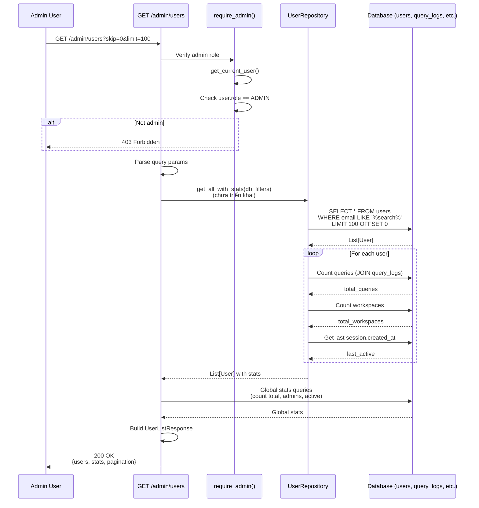
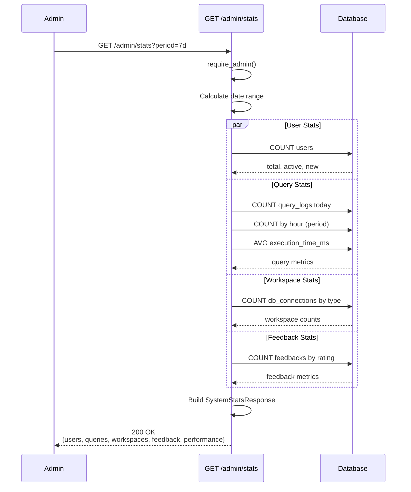
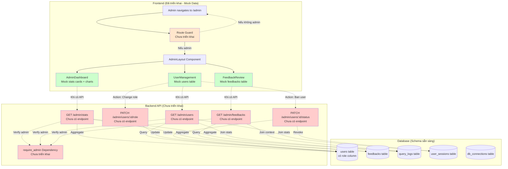

specification_functions/20260206/12_admin_panel.md

# Tài liệu Đặc tả: Quản trị Hệ thống (Admin Panel)

## 1. Tác động Database (Database Impact)

### Table: `users`
- **Usage:**
  - **Read:** `id`, `email`, `role`, `is_active`, `created_at`, `auth_provider`, `google_id`, `avatar_url` để hiển thị danh sách users
  - **Update:** `role` để thay đổi quyền user (user ↔ admin)
  - **Update:** `is_active` để ban/unban user accounts
  - `role` enum: `'admin'` hoặc `'user'` (UserRole enum)

### Table: `feedbacks`
- **Usage:**
  - **Read:** `id`, `query_log_id`, `rating`, `corrected_sql`, `comment`, `created_at` để xem phản hồi từ users
  - Liên kết với `query_logs` qua `query_log_id` để lấy context (original query, AI-generated SQL)

### Table: `query_logs`  
- **Usage:**
  - **Read:** `id`, `conversation_id`, `role`, `action_type`, `content`, `sql_generated`, `created_at` để theo dõi hoạt động hệ thống
  - Count queries by user, by time period để generate statistics

### Table: `db_connections`
- **Usage:**
  - **Read:** `id`, `user_id`, `name`, `db_type`, `created_at` để thống kê workspaces

### Table: `user_sessions`
- **Usage:**
  - **Read:** `session_id`, `user_id`, `user_agent`, `ip_address`, `created_at`, `expires_at`, `is_revoked` để monitor active sessions

**Lưu ý:** Không tạo cột/table mới. Chức năng này sử dụng schema hiện tại.

---

## 2. Mô phỏng API (API Simulation)

### 2.1. Get All Users (Admin Only)

**Endpoint:** `GET /api/v1/admin/users`

**Simulation:**

**Request Headers:**
```http
Authorization: Bearer <admin_access_token>
Cookie: access_token=<admin_token>
```

**Query Parameters:**
```
?skip=0&limit=100&search=john&role=user&is_active=true
```

**Response JSON (Success):**
```json
{
  "users": [
    {
      "id": "7a1b2c3d-4e5f-6789-0abc-def123456789",
      "email": "john@example.com",
      "role": "user",
      "is_active": true,
      "auth_provider": "email",
      "google_id": null,
      "avatar_url": null,
      "created_at": "2026-01-15T10:23:00Z",
      "total_queries": 234,
      "total_workspaces": 5,
      "last_active": "2026-02-06T14:30:00Z"
    },
    {
      "id": "8b2c3d4e-5f67-8901-bcde-f234567890ab",
      "email": "admin@example.com",
      "role": "admin",
      "is_active": true,
      "auth_provider": "google",
      "google_id": "1234567890",
      "avatar_url": "https://lh3.googleusercontent.com/...",
      "created_at": "2025-12-01T08:00:00Z",
      "total_queries": 89,
      "total_workspaces": 3,
      "last_active": "2026-02-06T15:42:00Z"
    }
  ],
  "total": 1234,
  "page": 1,
  "total_pages": 13,
  "stats": {
    "total_users": 1234,
    "total_admins": 3,
    "active_users": 1180,
    "banned_users": 54
  }
}
```

**Error Response (403 - Not Admin):**
```json
{
  "detail": "Admin privileges required"
}
```

**Error Response (401 - Not Authenticated):**
```json
{
  "detail": "Could not validate credentials"
}
```

**Note:** **Logic này chưa được triển khai.** Backend cần:
- API endpoint `/admin/users`
- Dependency `require_admin()` để verify `user.role == UserRole.ADMIN`
- Repository method `user_repository.get_all_with_stats()`

---

### 2.2. Update User Role (Admin Only)

**Endpoint:** `PATCH /api/v1/admin/users/{user_id}/role`

**Simulation:**

**Request JSON:**
```json
{
  "role": "admin"
}
```

**Response JSON (Success):**
```json
{
  "id": "7a1b2c3d-4e5f-6789-0abc-def123456789",
  "email": "john@example.com",
  "role": "admin",
  "is_active": true,
  "created_at": "2026-01-15T10:23:00Z"
}
```

**Error Response (403 - Cannot Modify Self):**
```json
{
  "detail": "Cannot modify your own role"
}
```

**Error Response (404 - User Not Found):**
```json
{
  "detail": "User not found"
}
```

**Note:** **Logic này chưa được triển khai.**

---

### 2.3. Ban/Unban User (Admin Only)

**Endpoint:** `PATCH /api/v1/admin/users/{user_id}/status`

**Simulation:**

**Request JSON:**
```json
{
  "is_active": false
}
```

**Response JSON (Success):**
```json
{
  "id": "7a1b2c3d-4e5f-6789-0abc-def123456789",
  "email": "john@example.com",
  "role": "user",
  "is_active": false,
  "created_at": "2026-01-15T10:23:00Z"
}
```

**Error Response (403 - Cannot Ban Self):**
```json
{
  "detail": "Cannot ban your own account"
}
```

**Note:** **Logic này chưa được triển khai.**

---

### 2.4. Get All Feedbacks (Admin Only)

**Endpoint:** `GET /api/v1/admin/feedbacks`

**Simulation:**

**Query Parameters:**
```
?skip=0&limit=50&status=pending&rating=down
```

**Response JSON (Success):**
```json
{
  "feedbacks": [
    {
      "id": "fb1a2b3c-4d5e-6f78-90ab-cdef12345678",
      "query_log_id": "ql9a8b7c-6d5e-4f32-10ab-cdef98765432",
      "rating": -1,
      "corrected_sql": "SELECT o.order_id, c.name FROM orders o JOIN customers c ON o.customer_id = c.id WHERE o.created_at >= CURDATE() - INTERVAL 1 MONTH",
      "comment": "AI used DATE_SUB instead of CURDATE()",
      "created_at": "2026-02-06T10:23:00Z",
      "user_email": "john@example.com",
      "original_query": "How can I get all orders from last month?",
      "ai_generated_sql": "SELECT o.*, c.name FROM orders o JOIN customers c ON o.customer_id = c.id WHERE o.created_at >= DATE_SUB(NOW(), INTERVAL 1 MONTH)",
      "status": "pending"
    }
  ],
  "total": 42,
  "stats": {
    "total_feedbacks": 523,
    "pending_reviews": 42,
    "thumbs_up": 380,
    "thumbs_down": 143,
    "with_corrections": 98
  }
}
```

**Note:** **Logic này chưa được triển khai.** Backend cần:
- API endpoint `/admin/feedbacks`
- Repository method `feedback_repository.get_all_with_query_context()`
- Join với `query_logs` và `users` để lấy context

---

### 2.5. Get System Stats (Admin Only)

**Endpoint:** `GET /api/v1/admin/stats`

**Simulation:**

**Query Parameters:**
```
?period=7d&timezone=Asia/Ho_Chi_Minh
```

**Response JSON (Success):**
```json
{
  "users": {
    "total": 1234,
    "active": 1180,
    "new_this_period": 42
  },
  "queries": {
    "total_today": 8547,
    "total_this_period": 45230,
    "avg_response_time_ms": 1234.56,
    "queries_per_hour": [
      {"hour": "2026-02-06T00:00:00Z", "count": 120},
      {"hour": "2026-02-06T01:00:00Z", "count": 95},
      {"hour": "2026-02-06T02:00:00Z", "count": 80}
    ]
  },
  "workspaces": {
    "total": 3456,
    "real_databases": 2890,
    "simulations": 566
  },
  "feedback": {
    "total": 523,
    "thumbs_up": 380,
    "thumbs_down": 143,
    "pending_reviews": 42
  },
  "performance": {
    "avg_query_time_ms": 156.78,
    "avg_optimization_improvement_percent": 34.5,
    "total_optimizations": 1240
  }
}
```

**Note:** **Logic này chưa được triển khai.** Backend cần:
- Aggregate queries từ `query_logs` table
- Count users, workspaces từ respective tables
- Calculate performance metrics từ `performance_analysis` table

---

## 3. Luồng xử lý Chi tiết (Core Logic Flow)

### 3.1. Luồng Get All Users (Backend - Chưa triển khai)

**Step-by-Step Flow:**

1. **Authentication Check:**
   - API nhận request với access token trong cookie
   - Gọi `get_current_user(request, db)`:
     - Read token từ `request.cookies.get("access_token")`
     - Gọi `decode_access_token(token)` → Extract email, user_id
     - Query: `user_repository.get_by_email(db, email)`
     - Check `user.is_active == True`
     - Return `User` object

2. **Admin Authorization Check:**
   - **Logic này chưa được triển khai.**
   - Cần tạo dependency `require_admin()`:
     ```python
     async def require_admin(current_user: User = Depends(get_current_user)):
         if current_user.role != UserRole.ADMIN:
             raise HTTPException(status_code=403, detail="Admin privileges required")
         return current_user
     ```

3. **Parse Query Parameters:**
   - Nhận: `skip`, `limit`, `search`, `role`, `is_active`
   - Validate: `limit <= 100` (prevent abuse)

4. **Query Users với Stats:**
   - **Logic này chưa được triển khai.**
   - Cần method `user_repository.get_all_with_stats(db, filters)`:
     - Base query: `select(User)`
     - Nếu có `search` → Filter by `User.email.ilike(f"%{search}%")`
     - Nếu có `role` → Filter by `User.role == role`
     - Nếu có `is_active` → Filter by `User.is_active == is_active`
     - Paginate: `.offset(skip).limit(limit)`
     - Execute: `result.scalars().all()`

5. **Aggregate Stats cho mỗi User:**
   - **Logic này chưa được triển khai.**
   - Với mỗi user:
     - Query total queries:
       ```python
       total_queries = await db.scalar(
         select(func.count(QueryLog.id))
         .join(Conversation)
         .join(DBConnection)
         .where(DBConnection.user_id == user.id)
       )
       ```
     - Query total workspaces:
       ```python
       total_workspaces = await db.scalar(
         select(func.count(DBConnection.id))
         .where(DBConnection.user_id == user.id)
       )
       ```
     - Query last active:
       ```python
       last_active = await db.scalar(
         select(func.max(UserSession.created_at))
         .where(UserSession.user_id == user.id)
       )
       ```

6. **Calculate Global Stats:**
   - **Logic này chưa được triển khai.**
   - Count total users: `await db.scalar(select(func.count(User.id)))`
   - Count admins: `await db.scalar(select(func.count(User.id)).where(User.role == UserRole.ADMIN))`
   - Count active: `await db.scalar(select(func.count(User.id)).where(User.is_active == True))`
   - Count banned: `await db.scalar(select(func.count(User.id)).where(User.is_active == False))`

7. **Build Response:**
   - Construct `UserListResponse`:
     - `users`: List of user dicts với stats
     - `total`: Total count (sau filter)
     - `page`: Calculated from skip/limit
     - `total_pages`: `ceil(total / limit)`
     - `stats`: Global statistics
   - Return JSON response

**Sequence Diagram (Get All Users - Chưa triển khai):**



---

### 3.2. Luồng Update User Role (Backend - Chưa triển khai)

**Step-by-Step Flow:**

1. **Authentication & Authorization:**
   - Verify admin: `require_admin(current_user)`

2. **Validate Request:**
   - Parse request body: `{"role": "admin" | "user"}`
   - Validate target user exists: `await user_repository.get(db, user_id)`
   - Nếu không tồn tại → HTTP 404

3. **Prevent Self-Modification:**
   - **Logic này chưa được triển khai.**
   - Check: `if user_id == current_user.id:`
     - Raise `HTTPException(status_code=403, detail="Cannot modify your own role")`

4. **Update Role:**
   - **Logic này chưa được triển khai.**
   - Gọi `user_repository.update(db, user_id, {"role": new_role})`:
     - Query: `await db.execute(update(User).where(User.id == user_id).values(role=new_role))`
     - Commit: `await db.commit()`
     - Refresh: `await db.refresh(user)`

5. **Audit Log (Optional):**
   - **Logic này chưa được triển khai.**
   - Log admin action: `admin_log.create(admin_id, action="update_user_role", target_user_id, old_role, new_role)`

6. **Return Updated User:**
   - Serialize: `UserResponse.from_orm(user)`
   - Return JSON

**Note:** Chức năng này **chưa có backend implementation**. Cần tạo:
- Endpoint `PATCH /admin/users/{user_id}/role`
- Validation logic cho self-modification
- Audit logging

---

### 3.3. Luồng Ban/Unban User (Backend - Chưa triển khai)

**Step-by-Step Flow:**

1. **Authentication & Authorization:**
   - Verify admin: `require_admin(current_user)`

2. **Validate Target User:**
   - Check existence: `await user_repository.get(db, user_id)`
   - Prevent self-ban:
     - **Logic này chưa được triển khai.**
     - `if user_id == current_user.id → Raise 403`

3. **Update Status:**
   - **Logic này chưa được triển khai.**
   - Update: `user_repository.update(db, user_id, {"is_active": is_active})`
   - Nếu ban (`is_active=False`):
     - Revoke all sessions: `user_session_repository.revoke_all_by_user(db, user_id)`
       - Update: `UPDATE user_sessions SET is_revoked=True WHERE user_id={id}`

4. **Return Updated User:**
   - Serialize và return

**Note:** **Backend chưa triển khai.** Cần:
- Endpoint `PATCH /admin/users/{user_id}/status`
- Method `user_session_repository.revoke_all_by_user()`

---

### 3.4. Luồng Get All Feedbacks (Backend - Chưa triển khai)

**Step-by-Step Flow:**

1. **Authentication & Authorization:**
   - Verify admin: `require_admin(current_user)`

2. **Parse Query Filters:**
   - Nhận: `skip`, `limit`, `status`, `rating` (up/down)

3. **Query Feedbacks với Context:**
   - **Logic này chưa được triển khai.**
   - Cần method `feedback_repository.get_all_with_context(db, filters)`:
     - Base query:
       ```python
       query = select(Feedback).join(QueryLog).join(Conversation).join(DBConnection).join(User)
       ```
     - Filter by rating: `.where(Feedback.rating == rating)`
     - Order by: `.order_by(Feedback.created_at.desc())`
     - Paginate: `.offset(skip).limit(limit)`

4. **Enrich Feedback Data:**
   - Với mỗi feedback:
     - Lấy `query_log.content` (user's original question)
     - Lấy `query_log.sql_generated` (AI-generated SQL)
     - Lấy `user.email` (user who submitted feedback)

5. **Calculate Stats:**
   - **Logic này chưa được triển khai.**
   - Count total feedbacks
   - Count by rating: `thumbs_up = rating > 0`, `thumbs_down = rating < 0`
   - Count với corrected_sql: `with_corrections = corrected_sql IS NOT NULL`

6. **Return Response:**
   - Build `FeedbackListResponse` với feedbacks + stats

**Note:** **Backend chưa triển khai.** Repository hiện tại không có method này.

---

### 3.5. Luồng Get System Stats (Backend - Chưa triển khai)

**Step-by-Step Flow:**

1. **Authentication & Authorization:**
   - Verify admin: `require_admin(current_user)`

2. **Parse Time Period:**
   - Nhận `period` param: `7d`, `30d`, `90d`
   - Calculate date range: `start_date = now() - timedelta(days=period)`

3. **Aggregate User Stats:**
   - **Logic này chưa được triển khai.**
   - Total users: `SELECT COUNT(*) FROM users`
   - Active users: `SELECT COUNT(*) WHERE is_active=true`
   - New users this period: `SELECT COUNT(*) WHERE created_at >= start_date`

4. **Aggregate Query Stats:**
   - **Logic này chưa được triển khai.**
   - Total queries today:
     ```python
     SELECT COUNT(*) FROM query_logs
     WHERE DATE(created_at) = CURRENT_DATE
     ```
   - Queries this period by hour:
     ```python
     SELECT DATE_TRUNC('hour', created_at) as hour, COUNT(*) as count
     FROM query_logs
     WHERE created_at >= start_date
     GROUP BY hour
     ORDER BY hour
     ```
   - Avg response time:
     ```python
     SELECT AVG(execution_time_ms) FROM performance_analysis
     WHERE created_at >= start_date
     ```

5. **Aggregate Workspace Stats:**
   - **Logic này chưa được triển khai.**
   - Total: `SELECT COUNT(*) FROM db_connections`
   - By type: `SELECT db_type, COUNT(*) FROM db_connections GROUP BY db_type`

6. **Aggregate Feedback Stats:**
   - **Logic này chưa được triển khai.**
   - Total: `SELECT COUNT(*) FROM feedbacks`
   - By rating: `SELECT rating, COUNT(*) GROUP BY rating`

7. **Build Response:**
   - Construct `SystemStatsResponse` với all metrics
   - Return JSON

**Sequence Diagram (Get System Stats - Chưa triển khai):**



---

## 4. Tương tác Frontend (Frontend Flow)

### 4.1. Trigger Admin Panel Access

**Trigger:**
- User navigate to `/admin` route
- Route guard check `user.role === 'admin'`

**Data Handling:**

1. **Route Protection:**
   - Component: `AdminRoute` wrapper (chưa có)
   - Check: Verify `authUser.role === 'admin'`
   - Nếu không phải admin → Redirect to `/dashboard`

2. **Layout Render:**
   - Component: `AdminLayout`
   - Sidebar với navigation:
     - Dashboard (System Overview)
     - User Management
     - Feedback Review

3. **Default Page:**
   - Load `AdminDashboard` component
   - **Hiện tại:** Sử dụng mock data hardcoded
   - **Khi có API:** Gọi `GET /admin/stats` để fetch real data

**User Flow:**
```
Admin login → Navigate to /admin → Route guard check → Load AdminLayout → Display AdminDashboard
```

**Note:** Frontend hiện có UI đầy đủ nhưng dùng **mock data**. Cần replace bằng API calls khi backend sẵn sàng.

---

### 4.2. View User Management

**Trigger:**
- Admin click "User Management" trong sidebar

**Data Handling:**

1. **Component `UserManagement` Mount:**
   - **Hiện tại:** Load mock data từ `usersData` constant
   - **Khi có API:**
     ```typescript
     const { data, isLoading } = useQuery({
       queryKey: ['admin', 'users', { page, search, role, isActive }],
       queryFn: () => adminService.getUsers({ skip, limit, search, role, is_active })
     })
     ```

2. **Search Functionality:**
   - State: `searchQuery` (local filter)
   - Filter: `users.filter(u => u.name.includes(search) || u.email.includes(search))`
   - **Khi có API:** Pass `search` param to backend query

3. **Display Stats Cards:**
   - Total Users: `usersData.length`
   - Active: `usersData.filter(u => u.status === 'active').length`
   - Admins: `usersData.filter(u => u.role === 'admin').length`
   - Banned: `usersData.filter(u => u.status === 'banned').length`
   - **Khi có API:** Use `data.stats` từ response

4. **Render Table:**
   - Headers: User, Email, Role, Status, Queries, Last Active, Actions
   - Rows: Map `filteredUsers` to table rows
   - Role badge: Admin (purple) vs User (blue)
   - Status badge: Active (green) vs Banned (red)

5. **Action Dropdown:**
   - State: `activeDropdown` (track which row menu is open)
   - Actions:
     - **Promote to Admin / Demote to User:** `handleAction('change-role', userId)`
       - **Khi có API:** `PATCH /admin/users/{id}/role`
     - **Ban User / Unban User:** `handleAction('toggle-ban', userId)`
       - **Khi có API:** `PATCH /admin/users/{id}/status`
     - **Reset Password:** `handleAction('reset-password', userId)` (chưa implement)
     - **Delete User:** `handleAction('delete', userId)` (chưa implement)

**User Flow:**
```
Click "User Management" → Load users list → Display table → Admin clicks dropdown → Select action → Confirm → API call → Refetch users
```

**Note:** UI đầy đủ nhưng **actions chỉ log to console**. Cần integrate với backend API.

---

### 4.3. View Feedback Review

**Trigger:**
- Admin click "Feedback Review" trong sidebar

**Data Handling:**

1. **Component `FeedbackReview` Mount:**
   - **Hiện tại:** Load mock data từ `feedbackData` constant
   - **Khi có API:**
     ```typescript
     const { data, isLoading } = useQuery({
       queryKey: ['admin', 'feedbacks', { status, rating }],
       queryFn: () => adminService.getFeedbacks({ skip, limit, status, rating })
     })
     ```

2. **Display Stats:**
   - Pending Reviews: `feedbackData.filter(f => f.status === 'pending').length`
   - With Corrections: `feedbackData.filter(f => f.userCorrection).length`
   - Reviewed: `feedbackData.filter(f => f.status === 'reviewed').length`

3. **Render Table:**
   - Columns: Date, User, Original Query, AI SQL, User Correction, Rating, Status, Actions
   - Rows: Map feedbacks với:
     - **Rating Badge:**
       - Thumbs Up (green) vs Thumbs Down (red)
     - **SQL Code Blocks:**
       - Display trong `<pre><code>` với syntax highlighting
       - Truncate dài → Show "View Full" button
     - **Status Badge:**
       - Pending (orange) vs Reviewed (green)

4. **Approve for Training:**
   - Single select: `handleApprove(feedbackId)`
   - Bulk select: `selectedRows` state, `handleBulkApprove()`
   - **Action:**
     - Mark status: `pending → reviewed`
     - Add to training dataset (future: RLHF pipeline)
   - **Khi có API:**
     ```typescript
     await adminService.approveFeedback(feedbackId)
     ```

**User Flow:**
```
Click "Feedback Review" → Load feedbacks → Display table → Admin selects rows → Click "Approve for Training" → API call → Update status
```

**Note:** Frontend có checkbox selection + bulk approve button, nhưng **chỉ log to console**. Cần backend API để persist status.

---

### 4.4. View System Dashboard

**Trigger:**
- Admin navigate to `/admin` (default page)

**Data Handling:**

1. **Component `AdminDashboard` Mount:**
   - **Hiện tại:** Load mock data:
     - `statsData`: Total Users, Queries Today, Avg Response Time, Pending Reviews
     - `queriesPerHourData`: Chart data cho queries by hour
     - `satisfactionData`: Thumbs up/down by day
   - **Khi có API:**
     ```typescript
     const { data: stats } = useQuery({
       queryKey: ['admin', 'stats', { period: '7d' }],
       queryFn: () => adminService.getSystemStats({ period: '7d' })
     })
     ```

2. **Display Stats Cards:**
   - 4 cards với gradient backgrounds:
     - Total Users (blue): `{stats.users.total}`, change: `"+12% from last month"`
     - Queries Today (green): `{stats.queries.total_today}`, change: `"+23% from yesterday"`
     - Avg Response Time (orange): `{stats.performance.avg_query_time_ms}`, change: `"-8% improvement"`
     - Pending Reviews (purple): `{stats.feedback.pending_reviews}`, change: `"12 new today"`

3. **Render Charts:**
   - **Queries Per Hour (Area Chart):**
     - Library: `recharts`
     - Component: `<AreaChart>` với `<Area>` gradient fill
     - Data: `stats.queries.queries_per_hour.map(h => ({hour: format(h.hour), queries: h.count}))`
   - **User Satisfaction (Bar Chart):**
     - Component: `<BarChart>` với 2 bars (thumbs up, thumbs down)
     - Data: `satisfactionData` (mock - cần aggregate từ feedbacks by day)

4. **Recent Activity Table:**
   - Display recent queries, optimizations, feedbacks
   - **Hiện tại:** Mock data
   - **Khi có API:** Query recent `query_logs` JOIN `users`

**User Flow:**
```
Navigate to /admin → Load AdminDashboard → Fetch system stats → Render cards + charts → Auto-refresh every 30s (optional)
```

**Note:** Frontend render đầy đủ charts với mock data. Cần replace bằng real-time stats từ backend.

---

### 4.5. Admin Authorization (Frontend Guard)

**Trigger:**
- User attempts to access `/admin/*` routes

**Data Handling:**

1. **Route Protection (Chưa có):**
   - **Logic này chưa được triển khai ở frontend routing.**
   - Cần tạo `AdminRoute` component:
     ```typescript
     function AdminRoute({ children }) {
       const { user } = useAuth();
       
       if (!user) {
         return <Navigate to="/login" />;
       }
       
       if (user.role !== 'admin') {
         return <Navigate to="/dashboard" />;
       }
       
       return children;
     }
     ```

2. **Hide Admin Menu (Chưa có):**
   - Navbar hiện tại không có link to `/admin`
   - **Cần implement:** Conditional render admin link:
     ```typescript
     {user?.role === 'admin' && (
       <NavLink to="/admin">Admin Panel</NavLink>
     )}
     ```

**User Flow:**
```
Non-admin user types /admin → Route guard redirect to /dashboard → Alert "Unauthorized"
```

**Note:** **Frontend routing chưa có guard logic.** Hiện tại có thể access `/admin` directly qua URL. Cần add protection.

---

## 5. End-to-End Flow Diagram



---

## Tóm tắt

### Tình trạng Triển khai:

**✅ Frontend (UI Hoàn chỉnh - Mock Data):**
- `AdminLayout`: Sidebar navigation với 3 sections
- `AdminDashboard`: Stats cards + Charts (Recharts)
- `UserManagement`: Users table với search, role badges, action dropdown
- `FeedbackReview`: Feedbacks table với bulk select, approve button

**✅ Database Schema:**
- `users.role` column (UserRole.ADMIN/USER)
- `users.is_active` column (ban/unban feature)
- `feedbacks` table với `rating`, `corrected_sql`, `comment`
- `query_logs`, `user_sessions`, `db_connections` tables

**❌ Backend API (Chưa triển khai):**
- ❌ `GET /admin/users` - List users với stats
- ❌ `PATCH /admin/users/{id}/role` - Change user role
- ❌ `PATCH /admin/users/{id}/status` - Ban/unban user
- ❌ `GET /admin/feedbacks` - List feedbacks với context
- ❌ `GET /admin/stats` - System statistics
- ❌ `require_admin()` dependency - Admin authorization

**❌ Frontend Integration (Chưa triển khai):**
- ❌ Route guard protection cho `/admin/*` routes
- ❌ API service calls (hiện dùng mock data)
- ❌ React Query hooks cho admin endpoints
- ❌ Real-time data fetching + refresh

### Core Functions (Cần triển khai):

1. **require_admin() Dependency:**
   - Verify `user.role == UserRole.ADMIN`
   - Raise `403` nếu không phải admin

2. **user_repository.get_all_with_stats():**
   - Query users với pagination
   - Join aggregate: total_queries, total_workspaces, last_active
   - Support filters: search, role, is_active

3. **feedback_repository.get_all_with_context():**
   - Query feedbacks JOIN query_logs JOIN users
   - Enrich với: user_email, original_query, ai_generated_sql

4. **Admin Stats Aggregation:**
   - Count users by status (active/banned)
   - Count queries by time period
   - Calculate avg response time
   - Count feedbacks by rating

5. **Frontend AdminService:**
   - `getUsers({ skip, limit, search })`: Call `GET /admin/users`
   - `updateUserRole(userId, role)`: Call `PATCH /admin/users/{id}/role`
   - `banUser(userId)`: Call `PATCH /admin/users/{id}/status`
   - `getFeedbacks()`: Call `GET /admin/feedbacks`
   - `getSystemStats()`: Call `GET /admin/stats`

6. **Frontend Route Protection:**
   - `AdminRoute` wrapper component
   - Check `user.role === 'admin'`
   - Redirect non-admin users

### Key Features (Khi hoàn thành):

- **User Management:** View all users, search, change roles, ban/unban
- **Feedback Review:** View user corrections, approve for RLHF training
- **System Monitoring:** Real-time stats, charts, activity logs
- **Role-based Access:** Admin-only routes + API endpoints
- **Audit Trail:** Log admin actions (role changes, bans)
