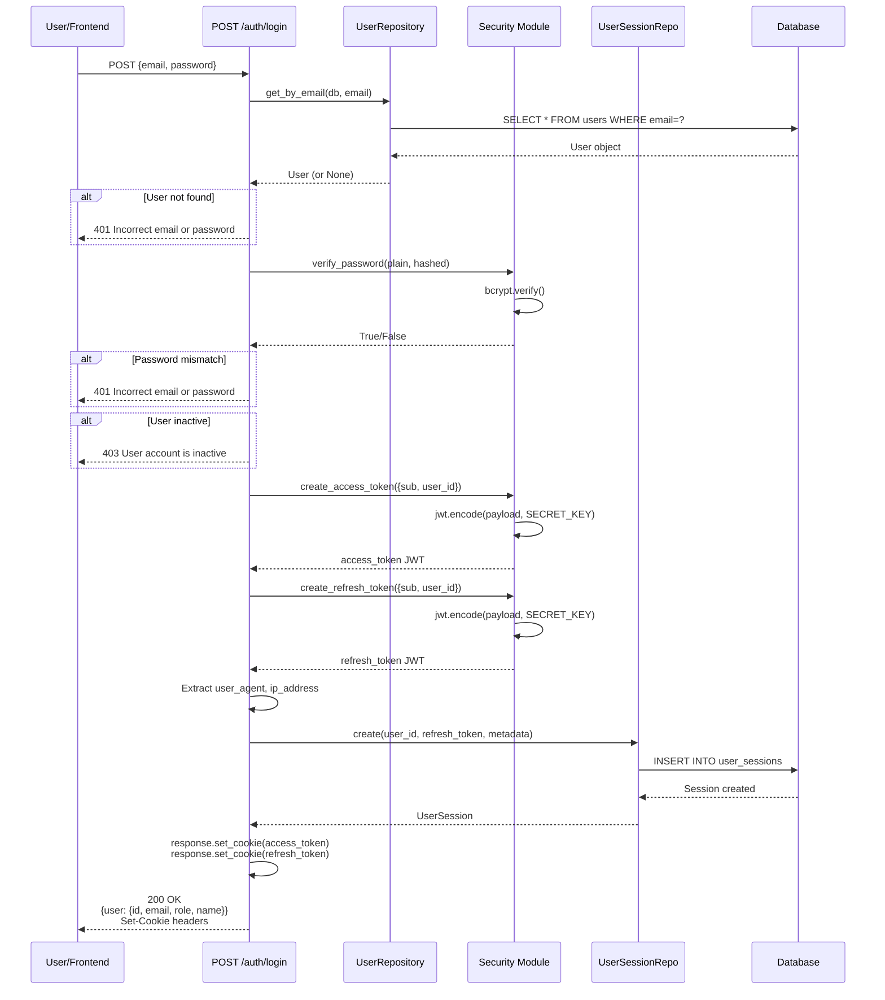
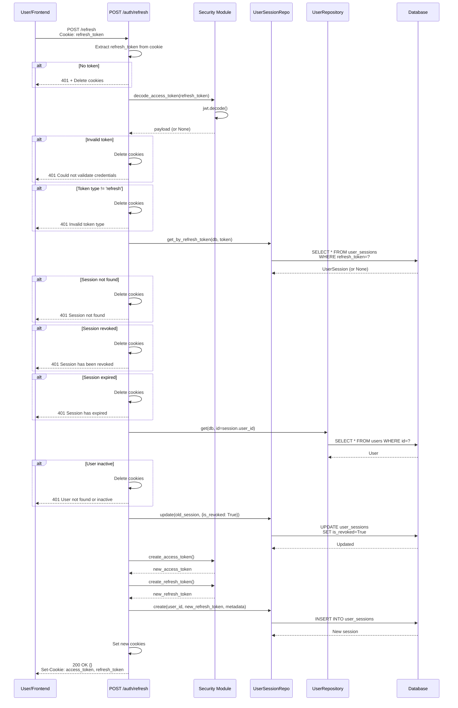
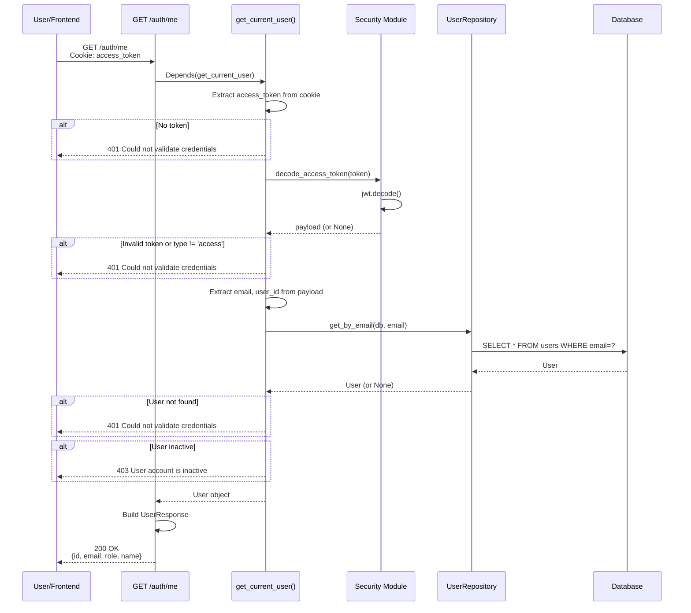
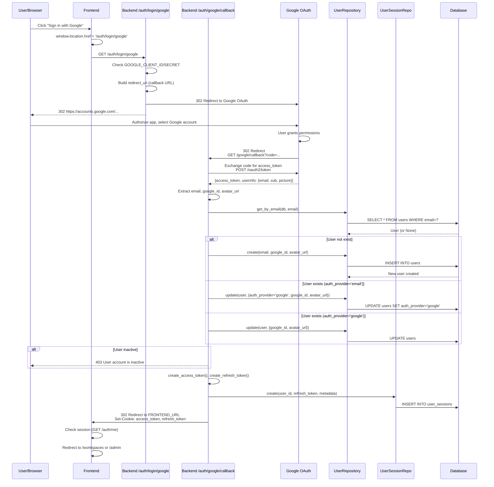

specification_functions/20260206/1_authentication_authorization.md

# Tài liệu Đặc tả: Xác thực và Phân quyền (Authentication & Authorization)

## 1. Tác động Database (Database Impact)

### Table: `users`
- **Usage:**
  - **Read:** `id`, `email`, `password`, `role`, `is_active`, `auth_provider`, `google_id`, `avatar_url` để xác thực user
  - **Create:** Tạo user mới khi đăng ký hoặc Google OAuth lần đầu
  - **Update:** Cập nhật `google_id`, `avatar_url`, `auth_provider` khi link tài khoản Google
  - `role` enum: `'admin'` hoặc `'user'` (UserRole enum)
  - `auth_provider`: `'email'` hoặc `'google'`

### Table: `user_sessions`
- **Usage:**
  - **Create:** Tạo session mới khi login thành công, lưu `refresh_token`, `user_agent`, `ip_address`, `expires_at`
  - **Read:** Query session bằng `refresh_token` để validate refresh request
  - **Update:** Set `is_revoked=True` khi logout hoặc refresh token (revoke old session)
  - Tracking: `user_agent` (device info) và `ip_address` (location) để quản lý phiên theo thiết bị

**Lưu ý:** Không tạo cột/table mới. Chức năng này sử dụng schema hiện tại.

---

## 2. Mô phỏng API (API Simulation)

### 2.1. Email/Password Login

**Endpoint:** `POST /api/v1/auth/login`

**Simulation:**

**Request JSON:**
```json
{
  "email": "user@example.com",
  "password": "SecurePass123!"
}
```

**Response JSON (Success):**
```json
{
  "user": {
    "id": "7a1b2c3d-4e5f-6789-0abc-def123456789",
    "email": "user@example.com",
    "role": "user",
    "name": "User"
  }
}
```

**Response Headers (Set-Cookie):**
```
Set-Cookie: access_token=eyJhbGc...; HttpOnly; Secure; SameSite=Lax; Max-Age=1800; Path=/
Set-Cookie: refresh_token=eyJhbGc...; HttpOnly; Secure; SameSite=Lax; Max-Age=604800; Path=/
```

**Error Response (401 - Invalid Credentials):**
```json
{
  "detail": "Incorrect email or password"
}
```

**Error Response (403 - Inactive Account):**
```json
{
  "detail": "User account is inactive"
}
```

---

### 2.2. Refresh Access Token

**Endpoint:** `POST /api/v1/auth/refresh`

**Simulation:**

**Request Headers (Cookie):**
```
Cookie: refresh_token=eyJhbGc...
```

**Response JSON (Success):**
```json
{}
```

**Response Headers (Set-Cookie - New Tokens):**
```
Set-Cookie: access_token=eyJhbGc...; HttpOnly; Secure; SameSite=Lax; Max-Age=1800; Path=/
Set-Cookie: refresh_token=eyJhbGc...; HttpOnly; Secure; SameSite=Lax; Max-Age=604800; Path=/
```

**Error Response (401 - Session Not Found):**
```json
{
  "detail": "Session not found"
}
```

**Error Response (401 - Session Revoked):**
```json
{
  "detail": "Session has been revoked"
}
```

**Error Response (401 - Session Expired):**
```json
{
  "detail": "Session has expired"
}
```

---

### 2.3. Logout

**Endpoint:** `POST /api/v1/auth/logout`

**Simulation:**

**Request Headers (Cookie):**
```
Cookie: refresh_token=eyJhbGc...
```

**Response JSON (Success):**
```json
{}
```

**Response Headers (Delete Cookies):**
```
Set-Cookie: access_token=; Max-Age=0; Path=/
Set-Cookie: refresh_token=; Max-Age=0; Path=/
```

---

### 2.4. Get Current User Info

**Endpoint:** `GET /api/v1/auth/me`

**Simulation:**

**Request Headers (Cookie):**
```
Cookie: access_token=eyJhbGc...
```

**Response JSON (Success):**
```json
{
  "id": "7a1b2c3d-4e5f-6789-0abc-def123456789",
  "email": "user@example.com",
  "role": "user",
  "name": "User"
}
```

**Error Response (401 - No Token):**
```json
{
  "detail": "Could not validate credentials"
}
```

---

### 2.5. Google OAuth Login (Initiate)

**Endpoint:** `GET /api/v1/auth/login/google`

**Simulation:**

**Response (302 Redirect):**
```
HTTP/1.1 302 Found
Location: https://accounts.google.com/o/oauth2/auth?client_id=...&redirect_uri=http://localhost:8000/api/v1/auth/google/callback&scope=openid+email+profile&response_type=code
```

**Error Response (501 - Not Configured):**
```json
{
  "detail": "Google OAuth not configured"
}
```

---

### 2.6. Google OAuth Callback

**Endpoint:** `GET /api/v1/auth/google/callback?code=...&state=...`

**Simulation:**

**Response (302 Redirect to Frontend):**
```
HTTP/1.1 302 Found
Location: http://localhost:5173
Set-Cookie: access_token=eyJhbGc...; HttpOnly; Secure; SameSite=Lax; Max-Age=1800; Path=/
Set-Cookie: refresh_token=eyJhbGc...; HttpOnly; Secure; SameSite=Lax; Max-Age=604800; Path=/
```

**Error Response (400 - OAuth Failed):**
```json
{
  "detail": "OAuth authorization failed: invalid_grant"
}
```

**Error Response (400 - Missing User Info):**
```json
{
  "detail": "Email or Google ID missing from user info"
}
```

---

## 3. Luồng xử lý Chi tiết (Core Logic Flow)

### 3.1. Luồng Email/Password Login (POST /auth/login)

**Step-by-Step Flow:**

1. **Input Handling:**
   - API nhận `LoginRequest` với `email` và `password`
   - Parse request body: `login_data.email`, `login_data.password`

2. **User Authentication:**
   - Gọi `user_repository.get_by_email(db, email)` để tìm user
   - Nếu không tìm thấy → HTTP 401: "Incorrect email or password"
   - Gọi `verify_password(plain_password, hashed_password)`:
     - Sử dụng `passlib.CryptContext` với bcrypt
     - So sánh password người dùng nhập với hash trong DB
     - Nếu không khớp → HTTP 401

3. **Check User Status:**
   - Kiểm tra `user.is_active`:
     - Nếu `False` → HTTP 403: "User account is inactive"

4. **Generate Tokens:**
   - Gọi `create_access_token(data, expires_delta)`:
     - Data: `{"sub": user.email, "user_id": str(user.id)}`
     - Expires: `settings.ACCESS_TOKEN_EXPIRE_MINUTES` (default: 30 phút)
     - Thêm vào payload: `{"exp": expire_time, "type": "access"}`
     - Encode JWT: `jwt.encode(payload, SECRET_KEY, algorithm=HS256)`
   - Gọi `create_refresh_token(data, expires_delta)`:
     - Data: `{"sub": user.email, "user_id": str(user.id)}`
     - Expires: `settings.REFRESH_TOKEN_EXPIRE_DAYS` (default: 7 ngày)
     - Thêm vào payload: `{"exp": expire_time, "type": "refresh"}`
     - Encode JWT

5. **Extract Request Metadata:**
   - Lấy User Agent: `request.headers.get("user-agent", "")`
   - Lấy IP Address: `request.client.host`

6. **Create User Session:**
   - Gọi `user_session_repository.create(db, obj_in)`:
     - `user_id`: ID của user
     - `refresh_token`: Refresh token vừa tạo
     - `user_agent`: Device info
     - `ip_address`: Client IP
     - `expires_at`: Thời gian hết hạn của refresh token
     - `is_revoked`: `False`
   - Insert vào `user_sessions` table
   - Commit transaction

7. **Set HttpOnly Cookies:**
   - Set `access_token` cookie:
     - `httponly=True` (không thể access từ JavaScript)
     - `secure=True` (chỉ HTTPS trong production)
     - `samesite='lax'` (CSRF protection)
     - `max_age`: 30 phút
     - `path='/'`
   - Set `refresh_token` cookie:
     - Các options tương tự
     - `max_age`: 7 ngày

8. **Build Response:**
   - Tạo `UserResponse`:
     - `id`, `email`, `role`, `name` (extracted từ email)
   - Return `LoginResponse` với `user` object

**Sequence Diagram (Email/Password Login):**



---

### 3.2. Luồng Refresh Access Token (POST /auth/refresh)

**Step-by-Step Flow:**

1. **Extract Refresh Token:**
   - Đọc token từ cookie: `request.cookies.get(COOKIE_REFRESH_TOKEN_NAME)`
   - Nếu không có → HTTP 401: "Could not validate credentials"

2. **Validate Token:**
   - Gọi `decode_access_token(refresh_token)`:
     - `jwt.decode(token, SECRET_KEY, algorithms=[HS256])`
     - Nếu lỗi (expired, invalid signature) → Return `None`
   - Nếu `payload is None`:
     - Delete cookies: `response.delete_cookie(access_token, refresh_token)`
     - Raise HTTP 401

3. **Verify Token Type:**
   - Kiểm tra `payload.get("type")`:
     - Nếu != `"refresh"` → Delete cookies, raise HTTP 401

4. **Check Session in Database:**
   - Gọi `user_session_repository.get_by_refresh_token(db, refresh_token)`:
     - Query: `SELECT * FROM user_sessions WHERE refresh_token = ?`
   - Nếu không tìm thấy:
     - Delete cookies, raise HTTP 401: "Session not found"

5. **Validate Session Status:**
   - Kiểm tra `session.is_revoked`:
     - Nếu `True` → Delete cookies, raise HTTP 401: "Session has been revoked"
   - Kiểm tra `session.expires_at < datetime.now(timezone.utc)`:
     - Nếu expired → Delete cookies, raise HTTP 401: "Session has expired"

6. **Get User:**
   - Gọi `user_repository.get(db, id=session.user_id)`
   - Kiểm tra `user.is_active`:
     - Nếu không active → Delete cookies, raise HTTP 401

7. **Revoke Old Session:**
   - Gọi `user_session_repository.update(db, db_obj=old_session, obj_in={"is_revoked": True})`:
     - Update: `UPDATE user_sessions SET is_revoked=True WHERE session_id=?`
     - Commit transaction

8. **Generate New Tokens:**
   - Gọi `create_access_token({sub, user_id})` → New access token
   - Gọi `create_refresh_token({sub, user_id})` → New refresh token

9. **Create New Session:**
   - Gọi `user_session_repository.create(db, obj_in)`:
     - Tạo session mới với `new_refresh_token`
     - Metadata: `user_agent`, `ip_address`
     - `expires_at`: Tính từ thời điểm hiện tại + 7 ngày
     - `is_revoked`: `False`

10. **Set New Cookies:**
    - `response.set_cookie(access_token)` với token mới
    - `response.set_cookie(refresh_token)` với token mới

11. **Return Response:**
    - Return `RefreshResponse` (empty object `{}`)

**Sequence Diagram (Refresh Token):**



---

### 3.3. Luồng Logout (POST /auth/logout)

**Step-by-Step Flow:**

1. **Extract Refresh Token:**
   - Đọc token từ cookie: `request.cookies.get(COOKIE_REFRESH_TOKEN_NAME)`

2. **Revoke Session (Optional):**
   - Nếu có `refresh_token`:
     - Gọi `user_session_repository.revoke_by_refresh_token(db, refresh_token)`:
       - Query session: `get_by_refresh_token(db, token)`
       - Nếu tìm thấy → Update: `{is_revoked: True}`
       - Commit transaction

3. **Delete Cookies:**
   - `response.delete_cookie(key=COOKIE_ACCESS_TOKEN_NAME, path='/')`
   - `response.delete_cookie(key=COOKIE_REFRESH_TOKEN_NAME, path='/')`

4. **Return Response:**
   - Return `LogoutResponse` (empty object `{}`)

**Note:** Logout luôn thành công kể cả khi không có token. Frontend sẽ nhận response và redirect về login page.

---

### 3.4. Luồng Get Current User (GET /auth/me)

**Step-by-Step Flow:**

1. **Dependency Injection:**
   - Endpoint sử dụng `current_user: User = Depends(get_current_user)`
   - FastAPI tự động gọi `get_current_user(request, db)` trước khi execute endpoint

2. **Extract Access Token:**
   - Đọc token từ cookie: `request.cookies.get(COOKIE_ACCESS_TOKEN_NAME)`
   - Nếu không có → HTTP 401: "Could not validate credentials"

3. **Decode Token:**
   - Gọi `decode_access_token(token)`:
     - `jwt.decode(token, SECRET_KEY)`
   - Nếu lỗi → HTTP 401

4. **Verify Token Type:**
   - Kiểm tra `payload.get("type") == "access"`
   - Nếu không đúng → HTTP 401

5. **Extract User Info:**
   - Lấy `email = payload.get("sub")`
   - Lấy `user_id = payload.get("user_id")`
   - Nếu thiếu → HTTP 401

6. **Get User from Database:**
   - Gọi `user_repository.get_by_email(db, email)`:
     - Query: `SELECT * FROM users WHERE email = ?`
   - Nếu không tìm thấy → HTTP 401

7. **Check User Status:**
   - Kiểm tra `user.is_active`:
     - Nếu `False` → HTTP 403: "User account is inactive"

8. **Return User:**
   - Dependency trả về `User` object
   - Endpoint nhận `current_user`
   - Build `UserResponse`:
     - `id`, `email`, `role`, `name`
   - Return JSON

**Sequence Diagram (Get Current User):**



---

### 3.5. Luồng Google OAuth Login

**Step-by-Step Flow:**

**Phase 1: Initiate OAuth (GET /auth/login/google)**

1. **Check OAuth Configuration:**
   - Kiểm tra `settings.GOOGLE_CLIENT_ID` và `GOOGLE_CLIENT_SECRET` tồn tại
   - Nếu không → HTTP 501: "Google OAuth not configured"

2. **Build Redirect URI:**
   - Lấy callback URL: `request.url_for('auth_google_callback')`
   - Ví dụ: `http://localhost:8000/api/v1/auth/google/callback`

3. **Redirect to Google:**
   - Gọi `oauth.google.authorize_redirect(request, redirect_uri)`:
     - Sử dụng `authlib` library
     - Build OAuth URL: `https://accounts.google.com/o/oauth2/auth`
     - Query params: `client_id`, `redirect_uri`, `scope` (openid email profile), `response_type=code`
   - Return `302 Found` redirect response

**Phase 2: Handle Callback (GET /auth/google/callback?code=...)**

1. **Exchange Code for Token:**
   - Gọi `oauth.google.authorize_access_token(request)`:
     - Send request to Google token endpoint
     - Exchange `code` for `access_token`
     - Nếu lỗi → HTTP 400: "OAuth authorization failed: {error}"

2. **Get User Info from Google:**
   - Lấy `user_info = token.get('userinfo')`
   - Extract:
     - `email = user_info.get('email')`
     - `google_id = user_info.get('sub')`
     - `avatar_url = user_info.get('picture')`
   - Nếu thiếu email hoặc google_id → HTTP 400

3. **Check User Existence:**
   - Gọi `user_repository.get_by_email(db, email)`

4. **Create or Update User:**
   - **Nếu user không tồn tại:**
     - Gọi `user_repository.create(db, obj_in)`:
       - `email`, `password=None`
       - `role='user'` (UserRole.USER)
       - `auth_provider='google'`
       - `google_id`, `avatar_url`
       - `is_active=True`
   - **Nếu user đã tồn tại:**
     - Kiểm tra `user.auth_provider`:
       - Nếu `'email'` → Update sang `'google'`: `{auth_provider, google_id, avatar_url}`
       - Nếu đã là `'google'` → Chỉ update: `{google_id, avatar_url}`

5. **Check User Status:**
   - Kiểm tra `user.is_active`:
     - Nếu `False` → HTTP 403: "User account is inactive"

6. **Generate Tokens:**
   - Gọi `create_access_token({sub, user_id})`
   - Gọi `create_refresh_token({sub, user_id})`

7. **Extract Metadata:**
   - Lấy `user_agent` và `ip_address` từ request

8. **Create Session:**
   - Gọi `user_session_repository.create(db, obj_in)`:
     - `user_id`, `refresh_token`, `user_agent`, `ip_address`, `expires_at`, `is_revoked=False`

9. **Redirect to Frontend:**
   - Tạo `RedirectResponse(url=settings.FRONTEND_URL)`:
     - Default: `http://localhost:5173`
   - Set cookies:
     - `access_token` cookie
     - `refresh_token` cookie
   - Return `302 Found` redirect response

**Sequence Diagram (Google OAuth):**



---

### 3.6. Luồng RBAC (Role-Based Access Control)

**Current Implementation:**

1. **Role Assignment:**
   - User model có column `role` (UserRole enum: ADMIN hoặc USER)
   - Default role khi tạo user: `UserRole.USER`
   - Admin role phải được set manually trong database

2. **Role Check at Login:**
   - Sau khi login thành công, frontend nhận `user.role`
   - Frontend redirect dựa vào role:
     - `role === 'admin'` → Navigate to `/admin`
     - `role === 'user'` → Navigate to `/workspaces`

3. **Frontend Route Protection:**
   - **Logic này chưa được triển khai đầy đủ.**
   - Hiện tại admin routes (`/admin/*`) chưa có guard protection
   - Cần implement `AdminRoute` component để check `user.role === 'admin'`

4. **Backend Endpoint Protection:**
   - **Logic này chưa được triển khai.**
   - Current: `get_current_user()` dependency chỉ check `is_active`
   - Cần implement: `require_admin()` dependency:
     ```python
     async def require_admin(current_user: User = Depends(get_current_user)):
         if current_user.role != UserRole.ADMIN:
             raise HTTPException(status_code=403, detail="Admin privileges required")
         return current_user
     ```
   - Áp dụng cho các admin endpoints (user management, feedback review, system stats)

5. **Frontend UI Conditional Rendering:**
   - Navigation menu ẩn/hiện admin link dựa vào `user.role`
   - **Logic này chưa được triển khai.**
   - Cần implement:
     ```typescript
     {user?.role === 'admin' && (
       <NavLink to="/admin">Admin Panel</NavLink>
     )}
     ```

**Note:** RBAC hiện tại chỉ có infrastructure (database role column, frontend redirect). Chưa có enforcement ở backend API level và frontend route protection.

---

## 4. Tương tác Frontend (Frontend Flow)

### 4.1. Trigger Email/Password Login

**Trigger:**
- User submit form tại `/login` page
- Form có validation: email format, password minimum length

**Data Handling:**

1. **Component `LoginPage`:**
   - Form state: `email`, `password` được quản lý bởi `react-hook-form`
   - Validation: `zodResolver(loginSchema)`
     - Email: Phải đúng format email
     - Password: Minimum 6 characters
   - Submit: `onSubmit(data)` được gọi khi form valid

2. **Hook `useAuth()`:**
   - Gọi `login(email, password)` method:
     - State: `setIsLoading(true)`
     - API call: `axiosInstance.post('/auth/login', {email, password})`
     - **Success:**
       - Extract `user` từ response: `response.data.user`
       - Update state: `setUser(user)`
       - **Cookies tự động được set** bởi browser (HttpOnly)
       - Navigate dựa vào role:
         - `user.role === 'admin'` → `navigate('/admin')`
         - Else → `navigate('/workspaces')`
     - **Error:**
       - Extract error message: `error.response?.data?.detail`
       - Throw error với message
       - Component catch error và display toast/alert

3. **Axios Configuration:**
   - `axiosInstance` được config với `withCredentials: true`
   - Tự động gửi cookies trong mọi request
   - Automatically include cookies trong `Authorization` header

**User Flow:**
```
User nhập email/password → Validate form → Submit → POST /auth/login → Receive user + Set cookies → Update authStore → Redirect based on role
```

---

### 4.2. Trigger Session Check (Auto-login)

**Trigger:**
- `AuthProvider` component mount (app starts)
- `useEffect(() => { checkAuth() }, [])` được gọi

**Data Handling:**

1. **Hook `useAuth()` - checkAuth():**
   - Kiểm tra current path:
     - Nếu đang ở `/login` → Skip check, set `isLoading=false`
   - **API call:** `axiosInstance.get('/auth/me')`
     - Cookies tự động được gửi trong request
   - **Success:**
     - Extract `user` từ response
     - Update state: `setUser(user)`
     - User đã authenticated, stay ở current page
   - **Error (401):**
     - No valid session
     - Set `user=null`
     - Nếu ở protected route → Redirect to `/login`
   - **Finally:**
     - Set `isLoading=false`

2. **Protected Route Behavior:**
   - Components check `isAuthenticated` từ `useAuth()`
   - Nếu `!isAuthenticated && !isLoading` → Redirect to `/login`

**User Flow:**
```
App loads → checkAuth() → GET /auth/me (with cookies) → Valid session → Set user → Stay on page
                                                       → Invalid → Redirect to /login
```

---

### 4.3. Trigger Google OAuth Login

**Trigger:**
- User click "Sign in with Google" button tại `/login` page

**Data Handling:**

1. **Component `LoginPage`:**
   - Button onClick:
     ```typescript
     window.location.href = `${apiUrl}/auth/login/google`;
     ```
   - Navigate toàn bộ browser window đến backend OAuth endpoint

2. **Backend Redirect:**
   - Backend redirect đến Google OAuth consent screen
   - User chọn Google account, grant permissions

3. **OAuth Callback:**
   - Google redirect về backend `/auth/google/callback?code=...`
   - Backend xử lý:
     - Exchange code for token
     - Get user info
     - Create/update user
     - Set cookies
     - Redirect về frontend: `FRONTEND_URL` (default: `http://localhost:5173`)

4. **Frontend Load:**
   - App loads at root route
   - `AuthProvider` mount → `checkAuth()` được gọi
   - API call: `GET /auth/me` (cookies đã được set)
   - Success → Set `user` state
   - Navigate to `/workspaces` hoặc `/admin`

**User Flow:**
```
Click "Google login" → window.location = /auth/login/google → Redirect to Google → User authorize → Callback to backend → Backend set cookies + redirect to frontend → Frontend checkAuth() → Navigate to app
```

---

### 4.4. Trigger Logout

**Trigger:**
- User click "Logout" button trong navigation menu

**Data Handling:**

1. **Hook `useAuth()` - logout():**
   - API call: `axiosInstance.post('/auth/logout')`
     - Backend revoke session và delete cookies
   - **Success hoặc Error (không quan trọng):**
     - Clear user state: `setUser(null)`
     - Navigate: `navigate('/login')`
   - Cookies được browser tự động xóa (backend set `Max-Age=0`)

2. **Component Behavior:**
   - Navigation menu re-render
   - Protected routes check `isAuthenticated=false` → Redirect to login

**User Flow:**
```
Click Logout → POST /auth/logout → Backend delete cookies → Clear user state → Navigate to /login
```

---

### 4.5. Trigger Automatic Token Refresh

**Trigger:**
- Access token hết hạn (sau 30 phút)
- User gửi request và nhận 401 response

**Data Handling:**

**Note:** **Logic này chưa được triển khai ở frontend.**

**Planned Flow:**

1. **Axios Interceptor (Response):**
   - Catch 401 error
   - Check nếu error là "Could not validate credentials"
   - Attempt refresh:
     - Call `POST /auth/refresh` (refresh_token cookie tự động gửi)
     - **Success:**
       - Receive new cookies
       - Retry original request
     - **Error:**
       - Refresh failed → Session expired
       - Clear user state
       - Redirect to `/login`

2. **Alternative Implementation:**
   - Frontend track token expiration time (decode JWT `exp` field)
   - Set timer để auto-refresh trước khi token hết hạn
   - Call `POST /auth/refresh` 5 phút trước expiry

**Current Behavior:**
- Khi access token hết hạn → User nhận 401 → Phải login lại
- Refresh token endpoint đã sẵn sàng nhưng frontend chưa tự động gọi

---

## 5. End-to-End Flow Diagram

```mermaid
graph TB
    subgraph "Frontend"
        LP[LoginPage Component]
        AC[AuthContext/useAuth Hook]
        PL[Protected Layout]
        GB[Google OAuth Button]
    end
    
    subgraph "Backend API"
        LOGIN[POST /auth/login]
        REFRESH[POST /auth/refresh]
        LOGOUT[POST /auth/logout]
        ME[GET /auth/me]
        GOOGLE[GET /auth/login/google]
        CALLBACK[GET /auth/google/callback]
    end
    
    subgraph "Security Module"
        JWT[create_access_token<br/>create_refresh_token<br/>decode_access_token]
        PWD[verify_password<br/>get_password_hash]
    end
    
    subgraph "Repositories"
        UR[UserRepository<br/>get_by_email, create, update]
        USR[UserSessionRepository<br/>create, get_by_refresh_token<br/>revoke_by_refresh_token]
    end
    
    subgraph "Database"
        USERS[(users table)]
        SESSIONS[(user_sessions table)]
    end
    
    subgraph "External"
        GOAUTH[Google OAuth API]
    end
    
    LP -->|1. Submit email/password| AC
    AC -->|2. POST request| LOGIN
    
    LOGIN -->|3. Validate password| PWD
    LOGIN -->|4. Query user| UR
    UR -->|5. Read| USERS
    
    LOGIN -->|6. Generate tokens| JWT
    LOGIN -->|7. Create session| USR
    USR -->|8. Insert| SESSIONS
    
    LOGIN -->|9. Set cookies + Response| AC
    AC -->|10. Update user state| PL
    PL -->|11. Navigate by role| LP
    
    AC -->|12. Check session on mount| ME
    ME -->|13. Verify token| JWT
    ME -->|14. Get user| UR
    ME -->|15. Response| AC
    
    PL -->|16. Logout click| AC
    AC -->|17. POST logout| LOGOUT
    LOGOUT -->|18. Revoke session| USR
    USR -->|19. Update is_revoked| SESSIONS
    LOGOUT -->|20. Delete cookies| AC
    
    AC -->|21. Auto-refresh (planned)| REFRESH
    REFRESH -->|22. Validate refresh_token| JWT
    REFRESH -->|23. Check session| USR
    REFRESH -->|24. Revoke old session| SESSIONS
    REFRESH -->|25. Create new session| SESSIONS
    REFRESH -->|26. New cookies| AC
    
    GB -->|27. Redirect browser| GOOGLE
    GOOGLE -->|28. Redirect to Google| GOAUTH
    GOAUTH -->|29. Callback with code| CALLBACK
    
    CALLBACK -->|30. Exchange code| GOAUTH
    CALLBACK -->|31. Get/Create user| UR
    UR -->|32. Create/Update| USERS
    CALLBACK -->|33. Generate tokens| JWT
    CALLBACK -->|34. Create session| USR
    USR -->|35. Insert| SESSIONS
    CALLBACK -->|36. Redirect + cookies| LP
    
    style LOGIN fill:#e1f5ff
    style REFRESH fill:#e1f5ff
    style ME fill:#e1f5ff
    style CALLBACK fill:#fff4e1
    style AC fill:#e8f5e9
```

---

## Tóm tắt

### Tình trạng Triển khai:

**✅ Backend (Hoàn chỉnh):**
- `POST /auth/login`: Email/Password authentication với bcrypt
- `POST /auth/refresh`: Refresh access token với session validation
- `POST /auth/logout`: Revoke session và delete cookies
- `GET /auth/me`: Get current user info từ access token
- `GET /auth/login/google`: Initiate Google OAuth flow
- `GET /auth/google/callback`: Handle OAuth callback, create/link account
- `get_current_user()` dependency: Validate access token, check is_active

**✅ Database:**
- `users` table: email, password, role (admin/user), auth_provider (email/google), google_id, avatar_url, is_active
- `user_sessions` table: refresh_token, user_agent, ip_address, expires_at, is_revoked

**✅ Security:**
- JWT tokens với type field (access/refresh)
- HttpOnly cookies (CSRF protection)
- Bcrypt password hashing
- Session tracking by device (user_agent + ip_address)

**✅ Frontend:**
- `AuthContext` với `useAuth()` hook
- Auto-check session on mount (`GET /auth/me`)
- Login form với validation
- Google OAuth button (redirect to backend)
- Logout functionality

**❌ Chưa Triển khai:**
- ❌ Automatic token refresh (frontend interceptor)
- ❌ `require_admin()` dependency cho backend admin endpoints
- ❌ Frontend route guards cho admin routes
- ❌ Frontend UI: Hide/show admin menu based on role

### Core Functions:

1. **Security Module:**
   - `verify_password(plain, hashed)`: Bcrypt verification
   - `get_password_hash(password)`: Bcrypt hashing
   - `create_access_token(data, expires_delta)`: JWT encode với type="access"
   - `create_refresh_token(data, expires_delta)`: JWT encode với type="refresh"
   - `decode_access_token(token)`: JWT decode và validate

2. **UserRepository:**
   - `get_by_email(db, email)`: Query user by email
   - `create(db, obj_in)`: Create new user
   - `update(db, db_obj, obj_in)`: Update user fields

3. **UserSessionRepository:**
   - `create(db, obj_in)`: Create new session
   - `get_by_refresh_token(db, token)`: Query session by refresh_token
   - `revoke_by_refresh_token(db, token)`: Revoke session (set is_revoked=True)
   - `get_active_sessions(db, user_id)`: List active sessions by user
   - `revoke_all_user_sessions(db, user_id)`: Revoke all sessions for user

4. **API Dependencies:**
   - `get_current_user(request, db)`: Extract + validate access token, return User object
   - `require_admin()`: **Chưa triển khai** - Verify admin role

5. **Frontend Hooks:**
   - `useAuth()`: Provide auth context (user, isAuthenticated, login, logout)
   - `checkAuth()`: Auto-check session with `/auth/me`
   - `login(email, password)`: Call login API, update state, navigate
   - `logout()`: Call logout API, clear state, navigate to login

### Key Features:

- **Cookie-based Authentication:** HttpOnly cookies (không thể access từ JavaScript), secure, SameSite protection
- **Session Management:** Database-backed sessions với refresh_token, device tracking (user_agent, IP)
- **Token Rotation:** Refresh token flow revokes old session và tạo session mới
- **Google OAuth Integration:** Auto-create user, link existing account, seamless redirect
- **Role-Based Access:** UserRole enum (ADMIN/USER), frontend redirect by role
- **Security Best Practices:** Bcrypt hashing, JWT with expiration, token type validation, session revocation
- **Multi-device Support:** Track sessions by user_agent và ip_address, support concurrent sessions
