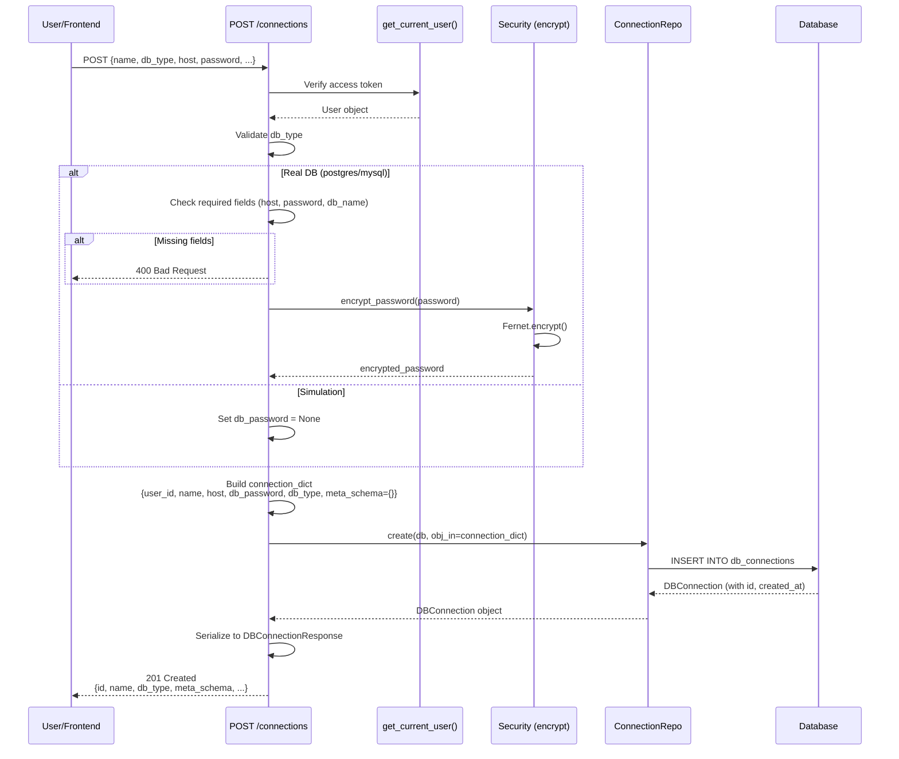
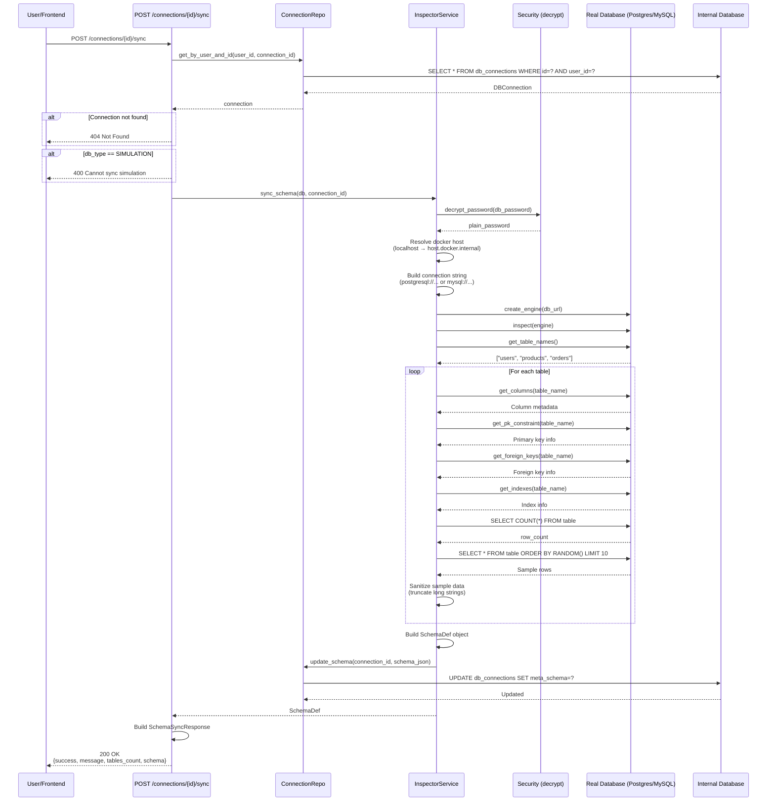

specification_functions/20260206/2_workspace_connection_management.md

# Tài liệu Đặc tả: Quản lý Workspace & Kết nối (Workspace & Connection Management)

## 1. Tác động Database (Database Impact)

### Table: `db_connections`
- **Usage:**
  - **Create:** Tạo workspace mới với thông tin kết nối (real DB) hoặc blank schema (simulation)
  - **Read:** `id`, `user_id`, `name`, `host`, `port`, `username`, `db_name`, `db_type`, `meta_schema` để hiển thị danh sách workspace
  - **Update:** Cập nhật thông tin kết nối hoặc `meta_schema` khi sync/design schema
  - **Delete:** Xóa workspace và cascade delete conversations, query_logs
  - `db_type` enum: `'postgres'`, `'mysql'`, `'simulation'`
  - `db_password`: Mã hóa bằng Fernet encryption (chỉ lưu encrypted, không plain text)
  - `meta_schema`: JSONB chứa schema metadata (tables, columns, foreign keys, indexes, sample_data)
  - `metadata_cache`: JSONB cache cho query performance (optional)

**Lưu ý:** Không tạo cột/table mới. Chức năng này sử dụng schema hiện tại.

---

## 2. Mô phỏng API (API Simulation)

### 2.1. Tạo Workspace

**Endpoint:** `POST /api/v1/connections`

**Simulation:**

**Request JSON (Real Database - PostgreSQL):**
```json
{
  "name": "Production DB",
  "db_type": "postgres",
  "host": "localhost",
  "port": 5432,
  "username": "admin",
  "password": "SecurePass123!",
  "db_name": "myapp_db"
}
```

**Request JSON (Real Database - MySQL):**
```json
{
  "name": "MySQL Local",
  "db_type": "mysql",
  "host": "127.0.0.1",
  "port": 3306,
  "username": "root",
  "password": "mysql_pass",
  "db_name": "test_db"
}
```

**Request JSON (Simulation):**
```json
{
  "name": "Demo Workspace",
  "db_type": "simulation"
}
```

**Response JSON (Success):**
```json
{
  "id": "550e8400-e29b-41d4-a716-446655440000",
  "user_id": "7a1b2c3d-4e5f-6789-0abc-def123456789",
  "name": "Production DB",
  "host": "localhost",
  "port": 5432,
  "username": "admin",
  "db_name": "myapp_db",
  "db_type": "postgres",
  "meta_schema": {},
  "metadata_cache": null,
  "created_at": "2026-02-06T10:30:00Z"
}
```

**Error Response (400 - Missing Required Fields for Real DB):**
```json
{
  "detail": "Real database connections require host, password, and db_name"
}
```

---

### 2.2. Liệt kê Workspaces

**Endpoint:** `GET /api/v1/connections`

**Simulation:**

**Query Parameters:**
```
?skip=0&limit=100
```

**Response JSON (Success):**
```json
[
  {
    "id": "550e8400-e29b-41d4-a716-446655440000",
    "user_id": "7a1b2c3d-4e5f-6789-0abc-def123456789",
    "name": "Production DB",
    "host": "localhost",
    "port": 5432,
    "username": "admin",
    "db_name": "myapp_db",
    "db_type": "postgres",
    "meta_schema": {
      "tables": [
        {
          "name": "users",
          "columns": [...]
        }
      ]
    },
    "created_at": "2026-02-06T10:30:00Z"
  },
  {
    "id": "660f9511-f39c-52e5-b827-557766551111",
    "user_id": "7a1b2c3d-4e5f-6789-0abc-def123456789",
    "name": "Demo Simulation",
    "host": null,
    "port": null,
    "username": null,
    "db_name": null,
    "db_type": "simulation",
    "meta_schema": {},
    "created_at": "2026-02-05T14:20:00Z"
  }
]
```

---

### 2.3. Sync Schema từ Real Database

**Endpoint:** `POST /api/v1/connections/{connection_id}/sync`

**Simulation:**

**Request JSON (Optional):**
```json
{}
```

**Response JSON (Success):**
```json
{
  "success": true,
  "message": "Schema synchronized successfully",
  "tables_count": 12,
  "schema": {
    "tables": [
      {
        "name": "users",
        "columns": [
          {
            "name": "id",
            "type": "UUID",
            "is_pk": true,
            "is_nullable": false,
            "default": null
          },
          {
            "name": "email",
            "type": "VARCHAR(255)",
            "is_pk": false,
            "is_nullable": false,
            "default": null
          },
          {
            "name": "created_at",
            "type": "TIMESTAMP",
            "is_pk": false,
            "is_nullable": false,
            "default": "now()"
          }
        ],
        "foreign_keys": [],
        "indexes": [
          {
            "name": "ix_users_email",
            "column_names": ["email"],
            "unique": true
          }
        ],
        "row_count": 1234,
        "sample_data": [
          {
            "id": "7a1b2c3d-4e5f-6789-0abc-def123456789",
            "email": "user@example.com",
            "created_at": "2026-01-15T10:30:00Z"
          }
        ]
      }
    ]
  }
}
```

**Error Response (400 - Cannot Sync Simulation):**
```json
{
  "detail": "Cannot sync schema from a simulation connection. Use PUT /schema instead."
}
```

**Error Response (400 - Connection Failed):**
```json
{
  "detail": "Failed to sync schema: could not connect to database at localhost:5432"
}
```

**Error Response (404 - Connection Not Found):**
```json
{
  "detail": "Connection with ID 550e8400-e29b-41d4-a716-446655440000 not found"
}
```

---

### 2.4. Get Schema Metadata

**Endpoint:** `GET /api/v1/connections/{connection_id}/schema`

**Simulation:**

**Response JSON (Success):**
```json
{
  "tables": [
    {
      "name": "products",
      "columns": [
        {
          "name": "id",
          "type": "INTEGER",
          "is_pk": true,
          "is_nullable": false
        },
        {
          "name": "name",
          "type": "VARCHAR(200)",
          "is_pk": false,
          "is_nullable": false
        },
        {
          "name": "price",
          "type": "DECIMAL(10,2)",
          "is_pk": false,
          "is_nullable": false
        }
      ],
      "foreign_keys": [],
      "indexes": [],
      "sample_data": []
    }
  ]
}
```

**Error Response (404 - No Schema):**
```json
{
  "detail": "Schema not available. Please sync the connection or update schema for simulations."
}
```

---

### 2.5. Update Simulation Schema

**Endpoint:** `PUT /api/v1/connections/{connection_id}/schema`

**Simulation:**

**Request JSON:**
```json
{
  "tables": [
    {
      "name": "customers",
      "columns": [
        {
          "name": "id",
          "type": "INTEGER",
          "is_pk": true,
          "is_nullable": false
        },
        {
          "name": "name",
          "type": "VARCHAR(100)",
          "is_pk": false,
          "is_nullable": false
        }
      ],
      "foreign_keys": [],
      "indexes": []
    }
  ]
}
```

**Response JSON (Success):**
```json
{
  "tables": [
    {
      "name": "customers",
      "columns": [...]
    }
  ]
}
```

**Error Response (400 - Not Simulation):**
```json
{
  "detail": "Can only update schema for simulation connections. Use POST /sync for real databases."
}
```

---

### 2.6. Update Workspace Info

**Endpoint:** `PUT /api/v1/connections/{connection_id}`

**Simulation:**

**Request JSON:**
```json
{
  "name": "Updated Production DB",
  "host": "prod-db.example.com",
  "port": 5433,
  "username": "new_admin",
  "password": "NewPass456!"
}
```

**Response JSON (Success):**
```json
{
  "id": "550e8400-e29b-41d4-a716-446655440000",
  "user_id": "7a1b2c3d-4e5f-6789-0abc-def123456789",
  "name": "Updated Production DB",
  "host": "prod-db.example.com",
  "port": 5433,
  "username": "new_admin",
  "db_name": "myapp_db",
  "db_type": "postgres",
  "meta_schema": {...},
  "created_at": "2026-02-06T10:30:00Z"
}
```

---

### 2.7. Xóa Workspace

**Endpoint:** `DELETE /api/v1/connections/{connection_id}`

**Simulation:**

**Response (Success):**
```
HTTP 204 No Content
```

**Error Response (404 - Not Found):**
```json
{
  "detail": "Connection with ID 550e8400-e29b-41d4-a716-446655440000 not found"
}
```

---

## 3. Luồng xử lý Chi tiết (Core Logic Flow)

### 3.1. Luồng Tạo Workspace Real Database (POST /connections)

**Step-by-Step Flow:**

1. **Input Handling:**
   - API nhận `DBConnectionCreate` với `name`, `db_type`, `host`, `port`, `username`, `password`, `db_name`
   - Extract `current_user` từ cookie (dependency `get_current_user()`)

2. **Validate Database Type:**
   - Kiểm tra `connection_data.db_type`:
     - Nếu `DBType.POSTGRES` hoặc `DBType.MYSQL` → Require real DB credentials
     - Nếu `DBType.SIMULATION` → Skip credential checks

3. **Validate Required Fields:**
   - Với real DB (`POSTGRES` hoặc `MYSQL`):
     - Kiểm tra `all([host, password, db_name])`:
       - Nếu thiếu → HTTP 400: "Real database connections require host, password, and db_name"
   - Với simulation:
     - Chỉ cần `name`

4. **Encrypt Password:**
   - Với real DB:
     - Gọi `encrypt_password(connection_data.password)`:
       - Sử dụng `Fernet` cipher với `settings.ENCRYPTION_KEY`
       - `cipher.encrypt(plain_password.encode())` → Encrypted bytes
       - Decode thành string để lưu DB
   - Với simulation:
     - Set `db_password = None`

5. **Build Connection Dictionary:**
   - Construct dict:
     - `user_id`: ID của current_user
     - `name`: Tên workspace
     - `host`, `port`, `username`, `db_name`: Từ request
     - `db_password`: Encrypted password (hoặc None)
     - `db_type`: Enum value
     - `meta_schema`: Empty dict `{}`

6. **Create Connection in Database:**
   - Gọi `connection_repository.create(db, obj_in=connection_dict)`:
     - Insert vào `db_connections` table
     - Commit transaction
     - Return `DBConnection` object với auto-generated `id`, `created_at`

7. **Return Response:**
   - Serialize `DBConnection` thành `DBConnectionResponse`
   - Return JSON với HTTP 201 Created

**Sequence Diagram (Tạo Workspace):**



---

### 3.2. Luồng Sync Schema từ Real Database (POST /connections/{id}/sync)

**Step-by-Step Flow:**

1. **Verify Ownership:**
   - Gọi `connection_repository.get_by_user_and_id(db, user_id, connection_id)`:
     - Query: `SELECT * FROM db_connections WHERE id=? AND user_id=?`
   - Nếu không tìm thấy → HTTP 404

2. **Validate Connection Type:**
   - Kiểm tra `connection.db_type`:
     - Nếu `DBType.SIMULATION` → HTTP 400: "Cannot sync schema from a simulation connection. Use PUT /schema instead."

3. **Decrypt Password:**
   - Gọi `decrypt_password(connection.db_password)`:
     - `cipher.decrypt(encrypted_password.encode())` → Plain password bytes
     - Decode thành string

4. **Resolve Docker Host:**
   - Kiểm tra `connection.host` có trong `LOCALHOSTS` (`['localhost', '127.0.0.1']`):
     - Nếu đúng → Replace với `'host.docker.internal'` (Docker bridge network)
     - Nếu không → Giữ nguyên host

5. **Build Connection String:**
   - Với `DBType.POSTGRES`:
     - `postgresql://{username}:{password}@{resolved_host}:{port}/{db_name}`
   - Với `DBType.MYSQL`:
     - `mysql+pymysql://{username}:{password}@{resolved_host}:{port}/{db_name}`

6. **Connect to Database:**
   - Gọi `create_engine(db_url)` (SQLAlchemy sync engine)
   - Gọi `inspect(engine)` → Get Inspector object

7. **Introspect Schema:**
   - Gọi `inspector.get_table_names()` → List table names
   - Với mỗi table:
     - **Get Columns:**
       - `inspector.get_columns(table_name)` → List of column info
       - Extract: `name`, `type`, `nullable`, `default`
     - **Get Primary Keys:**
       - `inspector.get_pk_constraint(table_name)` → Dict với `constrained_columns`
       - Mark columns với `is_pk=True` nếu trong PK list
     - **Get Foreign Keys:**
       - `inspector.get_foreign_keys(table_name)` → List of FK info
       - Build `ForeignKeyDef`:
         - `column`: Constrained column name
         - `ref_table`: Referenced table
         - `ref_column`: Referenced column
     - **Get Indexes:**
       - `inspector.get_indexes(table_name)` → List of index info
       - Build `IndexDef`:
         - `name`, `column_names`, `unique`

8. **Fetch Sample Data:**
   - Với mỗi table:
     - **Get Row Count:**
       - Execute: `SELECT COUNT(*) FROM {table_name}`
     - **Fetch Sample Rows (max 10):**
       - PostgreSQL: `SELECT * FROM {table} ORDER BY RANDOM() LIMIT 10`
       - MySQL: `SELECT * FROM {table} ORDER BY RAND() LIMIT 10`
     - **Sanitize Values:**
       - Truncate large strings (> 500 chars) → Add "..."
       - Preserve NULL, int, float, bool
       - Convert complex types (dict, list) to string
     - Add to `sample_data` array

9. **Build SchemaDef Object:**
   - Construct `SchemaDef`:
     - `tables`: List of `TableDef` objects
     - Each `TableDef` có: `name`, `columns`, `foreign_keys`, `indexes`, `row_count`, `sample_data`

10. **Update meta_schema:**
    - Gọi `connection_repository.update_schema(db, connection_id, schema_def.to_json_dict())`:
      - Update: `UPDATE db_connections SET meta_schema = ? WHERE id = ?`
      - Commit transaction

11. **Return Response:**
    - Build `SchemaSyncResponse`:
      - `success=True`
      - `message="Schema synchronized successfully"`
      - `tables_count=len(schema_def.tables)`
      - `schema=schema_def.to_json_dict()`
    - Return JSON

**Error Handling:**
- Connection failed → HTTP 400: "Failed to sync schema: could not connect to database..."
- Invalid credentials → HTTP 400: "Failed to sync schema: authentication failed"
- Permission denied → HTTP 400: "Failed to sync schema: access denied to database"

**Sequence Diagram (Sync Schema):**



---

### 3.3. Luồng Tạo Simulation Workspace (Blank Slate)

**Step-by-Step Flow:**

1. **Input Handling:**
   - API nhận `DBConnectionCreate` với:
     - `name`: Tên workspace (bắt buộc)
     - `db_type`: `DBType.SIMULATION`
     - Không có `host`, `port`, `username`, `password`, `db_name`

2. **Skip Credential Validation:**
   - Vì `db_type == SIMULATION` → Không validate real DB credentials
   - Set `db_password = None`

3. **Create Blank Schema:**
   - Set `meta_schema = {}` (empty dict)
   - Frontend sẽ cho phép user thiết kế schema thủ công sau

4. **Create in Database:**
   - Tương tự luồng 3.1, insert vào `db_connections` với:
     - `db_type='simulation'`
     - `host=None`, `port=None`, `username=None`, `db_password=None`, `db_name=None`
     - `meta_schema={}`

5. **Return Response:**
   - Return `DBConnectionResponse` với empty `meta_schema`

**User Flow sau khi tạo:**
- User navigate to workspace details
- Frontend hiển thị "No schema defined" message
- User có thể:
  - Design tables manually (diagram editor)
  - Import DDL script
  - Generate sample data

**Note:** Blank slate simulation không execute SQL ngay được. Cần user update schema trước (PUT `/connections/{id}/schema`).

---

### 3.4. Luồng Update Simulation Schema (PUT /connections/{id}/schema)

**Step-by-Step Flow:**

1. **Verify Ownership:**
   - Gọi `connection_repository.get_by_user_and_id(db, user_id, connection_id)`
   - Nếu không tìm thấy → HTTP 404

2. **Validate Connection Type:**
   - Kiểm tra `connection.db_type`:
     - Nếu **KHÔNG PHẢI** `DBType.SIMULATION` → HTTP 400: "Can only update schema for simulation connections. Use POST /sync for real databases."

3. **Parse Schema Data:**
   - Parse request body thành `SchemaDef` object:
     - `tables`: List of `TableDef`
     - Validate structure: table names, column types, foreign key references

4. **Update Metadata:**
   - Gọi `simulation_service.update_table_metadata(db, connection_id, schema_data)`:
     - Convert `SchemaDef` to JSON dict
     - Call `connection_repository.update_schema(db, connection_id, schema_json)`
     - Update: `UPDATE db_connections SET meta_schema = ?`
     - Commit transaction

5. **Return Updated Schema:**
   - Return `schema_def.to_json_dict()`

**Use Cases:**
- User design tables trong diagram editor → Frontend call API để save
- User import DDL script → Backend parse DDL → Call update schema
- User add/remove tables/columns → Update schema incrementally

---

### 3.5. Luồng List Workspaces (GET /connections)

**Step-by-Step Flow:**

1. **Get Current User:**
   - Extract `current_user` từ dependency `get_current_user()`

2. **Query User's Workspaces:**
   - Gọi `connection_repository.get_by_user(db, user_id, skip, limit)`:
     - Query: `SELECT * FROM db_connections WHERE user_id = ? OFFSET ? LIMIT ?`
     - Default: `skip=0`, `limit=100`

3. **Return List:**
   - Serialize list of `DBConnection` to `List[DBConnectionResponse]`
   - Return JSON array

**Frontend Display:**
- WorkspacesPage grid layout
- Each card hiển thị:
  - Workspace name
  - Database type icon (PostgreSQL, MySQL, Simulation)
  - Schema status (synced, empty, X tables)
  - Actions (Edit, Sync, Delete)

---

### 3.6. Luồng Delete Workspace (DELETE /connections/{id})

**Step-by-Step Flow:**

1. **Verify Ownership:**
   - Gọi `connection_repository.get_by_user_and_id(db, user_id, connection_id)`
   - Nếu không tìm thấy → HTTP 404

2. **Delete Connection:**
   - Gọi `connection_repository.delete_by_user(db, user_id, connection_id)`:
     - Execute: `DELETE FROM db_connections WHERE id = ? AND user_id = ?`
     - Cascade delete: Tất cả conversations và query_logs liên quan (FK constraint `ondelete="CASCADE"`)
     - Commit transaction

3. **Return Success:**
   - HTTP 204 No Content

**Cascade Effect:**
- Delete workspace → Delete all conversations → Delete all query_logs và performance_analysis
- User mất toàn bộ chat history và optimization data cho workspace đó

---

## 4. Tương tác Frontend (Frontend Flow)

### 4.1. Trigger Tạo Workspace

**Trigger:**
- User click "New Workspace" button tại `/workspaces` page
- Modal `CreateWorkspaceModal` được hiển thị

**Data Handling:**

1. **Component `WorkspacesPage`:**
   - State: `isCreateModalOpen` toggle modal visibility
   - Mutation: `createMutation` (React Query)
     - `mutationFn: workspaceService.create(payload)`
     - `onSuccess`: Invalidate `['workspaces']` query → Re-fetch workspace list

2. **Component `CreateWorkspaceModal`:**
   - State: `workspaceType` (`'real'` hoặc `'simulation'`)
   - State: `selectedDbType` (`DbType.POSTGRES` hoặc `DbType.MYSQL`)
   - Form validation: `react-hook-form` với `zod` schema
     - Real DB schema: Require `name`, `host`, `port`, `username`, `password`, `db_name`
     - Simulation schema: Chỉ require `name`

3. **Type Selection:**
   - User click "Connect Database" card:
     - Set `workspaceType='real'`
     - Show real DB form fields (host, port, username, password, db_name)
     - DB type selector: PostgreSQL (port 5432) hoặc MySQL (port 3306)
   - User click "Simulation" card:
     - Set `workspaceType='simulation'`
     - Hide credential fields
     - Chỉ hiển thị name input

4. **Form Submit:**
   - `handleFormSubmit()`:
     - Build `CreateWorkspacePayload`:
       - `name`, `db_type`
       - Nếu real DB: `host`, `port`, `username`, `password`, `db_name`
     - Call `onSubmit(payload)` → Trigger mutation
     - **Success:**
       - Close modal
       - Reset form
       - Toast notification: "Workspace created successfully"
       - Workspace list tự động refresh (query invalidation)
     - **Error:**
       - Display error message trong modal
       - Toast: "Failed to create workspace: {error}"

**User Flow:**
```
Click "New Workspace" → Modal opens → Select type (Real DB / Simulation) → Fill form → Submit → API call → Close modal → Refresh list
```

---

### 4.2. Trigger Sync Schema

**Trigger:**
- User click "Sync Schema" button trên Workspace Card (chỉ với real DB)
- Hoặc user navigate to workspace details và click "Sync" trong toolbar

**Data Handling:**

1. **Component `WorkspaceCard`:**
   - Mutation: `syncMutation`
     - `mutationFn: workspaceService.syncSchema(workspace.id)`
     - `onMutate`: Set loading state, disable sync button
     - `onSuccess`:
       - Display toast: "Schema synced: {tables_count} tables"
       - Invalidate workspace query → Re-fetch schema metadata
     - `onError`:
       - Display toast: "Sync failed: {error.detail}"

2. **Loading States:**
   - Button shows spinner: "Syncing..."
   - Disable tất cả actions trong thời gian sync

3. **Success Display:**
   - Toast notification hiển thị số tables synced
   - Schema metadata được cache trong `meta_schema`
   - Frontend có thể hiển thị table list ngay lập tức (không cần fetch lại)

**User Flow:**
```
Click "Sync Schema" → Show loading → API call → Backend introspect DB → Update meta_schema → Success toast → Refresh workspace details
```

---

### 4.3. Trigger Delete Workspace

**Trigger:**
- User click "Delete" trong workspace card dropdown menu
- Confirmation dialog appears

**Data Handling:**

1. **Confirmation:**
   - Display modal: "Are you sure? This will delete all conversations and query history."
   - Buttons: "Cancel" | "Delete"

2. **Delete Mutation:**
   - `deleteMutation`:
     - `mutationFn: workspaceService.delete(workspace.id)`
     - `onSuccess`:
       - Close confirmation modal
       - Toast: "Workspace deleted"
       - Invalidate `['workspaces']` query → Re-fetch list
       - Remove deleted workspace từ UI
     - `onError`:
       - Toast: "Failed to delete workspace: {error}"

**User Flow:**
```
Click Delete → Confirmation dialog → Confirm → DELETE /connections/{id} → Success → Remove from list
```

---

### 4.4. Trigger Update Workspace

**Trigger:**
- User click "Edit" trong workspace card
- Modal `EditWorkspaceModal` opens với pre-filled data

**Data Handling:**

1. **Component `EditWorkspaceModal`:**
   - Props: `workspace` (current workspace data)
   - Form fields pre-filled:
     - `name`, `host`, `port`, `username`
     - Password field empty (security - không hiển thị encrypted password)

2. **Form Submit:**
   - Build partial update payload:
     - Chỉ gửi fields đã thay đổi
     - Nếu password field empty → Không include trong payload (giữ password cũ)
   - Call `workspaceService.update(id, payload)`
   - **Success:**
     - Toast: "Workspace updated"
     - Close modal
     - Invalidate workspace query

**User Flow:**
```
Click Edit → Modal with current data → Update fields → Submit → PUT /connections/{id} → Success → Refresh
```

---

### 4.5. Trigger Get Schema Metadata

**Trigger:**
- User navigate to workspace details page
- Frontend cần hiển thị schema diagram/table list

**Data Handling:**

1. **Component `WorkspaceDetailsPage`:**
   - Query: `getWorkspaceQuery`
     - `queryFn: workspaceService.getById(workspaceId)`
     - Response có `meta_schema` field

2. **Check Schema Availability:**
   - Nếu `meta_schema` empty hoặc `null`:
     - Hiển thị "No schema available" message
     - Nếu real DB: Show "Sync Schema" button
     - Nếu simulation: Show "Design Schema" button
   - Nếu có `meta_schema`:
     - Parse `meta_schema.tables`
     - Render schema diagram hoặc table list

3. **Alternative: Fetch Schema Separately:**
   - Query: `getSchemaQuery`
     - `queryFn: workspaceService.getSchema(workspaceId)`
     - Separate API call nếu cần refresh schema mà không fetch toàn bộ workspace

**User Flow:**
```
Navigate to workspace → GET /connections/{id} → Check meta_schema → Render diagram OR show "Sync/Design" prompt
```

---

### 4.6. Trigger Design Simulation Schema

**Trigger:**
- User ở simulation workspace, click "Design Schema" button
- Schema diagram editor opens

**Data Handling:**

**Note:** **Logic này chưa được triển khai đầy đủ ở frontend.**

**Planned Flow:**

1. **Component `SchemaEditor` (diagram-based):**
   - User drag-drop tables
   - Add columns với type, constraints
   - Define foreign keys bằng visual connections
   - State: `schemaDef` (local state)

2. **Save Schema:**
   - Button: "Save Schema"
   - Build `SchemaDef` từ diagram state
   - Call `workspaceService.updateSimulationSchema(workspaceId, schemaDef)`
   - **Success:**
     - Toast: "Schema saved"
     - Enable "Execute SQL" features

**Current Behavior:**
- Simulation workspace có blank schema
- User phải manually call PUT `/connections/{id}/schema` với JSON
- Hoặc import DDL script (feature chưa có UI đầy đủ)

---

## 5. End-to-End Flow Diagram

```mermaid
graph TB
    subgraph "Frontend"
        WP[WorkspacesPage]
        CWM[CreateWorkspaceModal]
        WC[WorkspaceCard]
        WDP[WorkspaceDetailsPage]
    end
    
    subgraph "Backend API"
        CREATE[POST /connections]
        LIST[GET /connections]
        SYNC[POST /connections/{id}/sync]
        GET_SCHEMA[GET /connections/{id}/schema]
        UPDATE_SCHEMA[PUT /connections/{id}/schema]
        DELETE[DELETE /connections/{id}]
    end
    
    subgraph "Services"
        IS[InspectorService<br/>sync_schema]
        SS[SimulationService<br/>update_table_metadata]
        SEC[Security<br/>encrypt/decrypt_password]
    end
    
    subgraph "Repository"
        CR[ConnectionRepository<br/>create, get_by_user, update_schema, delete]
    end
    
    subgraph "Database"
        CONN[(db_connections table)]
        CONV[(conversations table)]
        QL[(query_logs table)]
    end
    
    subgraph "External"
        RDB[(Real Database<br/>Postgres/MySQL)]
    end
    
    WP -->|1. Click "New Workspace"| CWM
    
    CWM -->|2a. Real DB form| CREATE
    CWM -->|2b. Simulation form| CREATE
    
    CREATE -->|3. Validate db_type| CREATE
    CREATE -->|4. Encrypt password (real DB)| SEC
    SEC -->|5. Encrypted password| CR
    CREATE -->|6. Create record| CR
    
    CR -->|7. INSERT| CONN
    CONN -->|8. Return DBConnection| CR
    CR -->|9. Response| CREATE
    CREATE -->|10. Return JSON| WP
    
    WP -->|11. Fetch list| LIST
    LIST -->|12. Query by user_id| CR
    CR -->|13. SELECT| CONN
    CONN -->|14. List| CR
    CR -->|15. Response| LIST
    LIST -->|16. Return array| WP
    
    WP -->|17. Render cards| WC
    
    WC -->|18. Click "Sync" (real DB)| SYNC
    SYNC -->|19. Verify ownership| CR
    SYNC -->|20. Call sync_schema| IS
    
    IS -->|21. Decrypt password| SEC
    IS -->|22. Connect & introspect| RDB
    RDB -->|23. Schema metadata + sample data| IS
    
    IS -->|24. Update meta_schema| CR
    CR -->|25. UPDATE| CONN
    CONN -->|26. Success| CR
    CR -->|27. Return SchemaDef| IS
    IS -->|28. Response| SYNC
    SYNC -->|29. SchemaSyncResponse| WC
    
    WC -->|30. Navigate to details| WDP
    WDP -->|31. GET workspace| LIST
    WDP -->|32. Render schema from meta_schema| WDP
    
    WDP -->|33. Update schema (simulation)| UPDATE_SCHEMA
    UPDATE_SCHEMA -->|34. Validate db_type=simulation| UPDATE_SCHEMA
    UPDATE_SCHEMA -->|35. Call update_table_metadata| SS
    SS -->|36. Update meta_schema| CR
    CR -->|37. UPDATE| CONN
    
    WC -->|38. Click Delete| DELETE
    DELETE -->|39. Verify ownership| CR
    DELETE -->|40. delete_by_user| CR
    CR -->|41. DELETE (cascade)| CONN
    CONN -->|42. Cascade delete| CONV
    CONN -->|43. Cascade delete| QL
    
    style CREATE fill:#e1f5ff
    style SYNC fill:#fff4e1
    style UPDATE_SCHEMA fill:#e8f5e9
    style WP fill:#f0f0f0
    style IS fill:#ffe6cc
```

---

## Tóm tắt

### Tình trạng Triển khai:

**✅ Backend (Hoàn chỉnh):**
- `POST /connections`: Tạo workspace (real DB hoặc simulation)
- `GET /connections`: List workspaces của user
- `GET /connections/{id}`: Get workspace details với schema
- `PUT /connections/{id}`: Update workspace info
- `DELETE /connections/{id}`: Delete workspace với cascade
- `POST /connections/{id}/sync`: Sync schema từ real database
- `GET /connections/{id}/schema`: Get schema metadata
- `PUT /connections/{id}/schema`: Update simulation schema
- Password encryption: Fernet cipher với ENCRYPTION_KEY

**✅ Database:**
- `db_connections` table: name, host, port, username, db_password (encrypted), db_name, db_type (postgres/mysql/simulation), meta_schema (JSONB)
- Cascade delete: `ondelete="CASCADE"` cho conversations và query_logs

**✅ Schema Introspection:**
- `InspectorService.sync_schema()`: Connect to real DB, introspect tables/columns/FKs/indexes, fetch sample data
- Docker host resolution: `localhost` → `host.docker.internal`
- Sample data sanitization: Truncate long strings, preserve data types

**✅ Frontend:**
- `WorkspacesPage`: List workspaces, create/edit/delete
- `CreateWorkspaceModal`: Two modes (real DB / simulation), form validation
- React Query: Workspace list cache, mutations với auto-refetch
- Toast notifications: Success/error feedback

**❌ Chưa Triển khai Đầy đủ:**
- ❌ Schema diagram editor cho simulation (chỉ có API, chưa có UI)
- ❌ DDL import/export UI
- ❌ Visual foreign key designer
- ❌ Table data editor inline (có API `getTableData`, chưa có UI đầy đủ)

### Core Functions:

1. **ConnectionRepository:**
   - `create(db, obj_in)`: Create new workspace
   - `get_by_user(db, user_id, skip, limit)`: List user's workspaces
   - `get_by_user_and_id(db, user_id, connection_id)`: Get workspace by ID với ownership check
   - `update_schema(db, connection_id, meta_schema)`: Update meta_schema JSONB column
   - `delete_by_user(db, user_id, connection_id)`: Delete workspace với ownership check

2. **InspectorService:**
   - `sync_schema(db, connection_id)`: Introspect real DB schema, fetch sample data, update meta_schema
   - Introspection methods: `get_columns()`, `get_pk_constraint()`, `get_foreign_keys()`, `get_indexes()`

3. **SimulationService:**
   - `update_table_metadata(db, connection_id, schema_def)`: Update simulation schema
   - `generate_ddl_for_connection(db, connection_id)`: Export DDL script từ meta_schema

4. **Security:**
   - `encrypt_password(plain_password)`: Fernet encryption
   - `decrypt_password(encrypted_password)`: Fernet decryption

5. **Frontend Services:**
   - `workspaceService.create(payload)`: POST /connections
   - `workspaceService.getAll()`: GET /connections
   - `workspaceService.syncSchema(id)`: POST /connections/{id}/sync
   - `workspaceService.getSchema(id)`: GET /connections/{id}/schema
   - `workspaceService.updateSimulationSchema(id, schema)`: PUT /connections/{id}/schema
   - `workspaceService.delete(id)`: DELETE /connections/{id}

### Key Features:

- **Dual Mode:** Support cả real database connections (PostgreSQL, MySQL) và simulation mode (blank slate)
- **Password Security:** Fernet encryption cho database credentials, không lưu plain text
- **Docker Compatibility:** Auto-resolve `localhost` → `host.docker.internal` cho Docker containers
- **Schema Introspection:** Tự động extract schema metadata từ real database (tables, columns, constraints, indexes, sample data)
- **Sample Data:** Fetch random sample rows (max 10) cho mỗi table để preview data
- **Blank Slate Simulation:** Tạo workspace simulation với empty schema, user design schema sau
- **Cascade Delete:** Xóa workspace tự động xóa conversations và query_logs
- **Ownership Enforcement:** Mọi operation đều verify `user_id` để prevent unauthorized access
- **Frontend Cache:** React Query cache workspace list, auto-invalidate sau mutations
