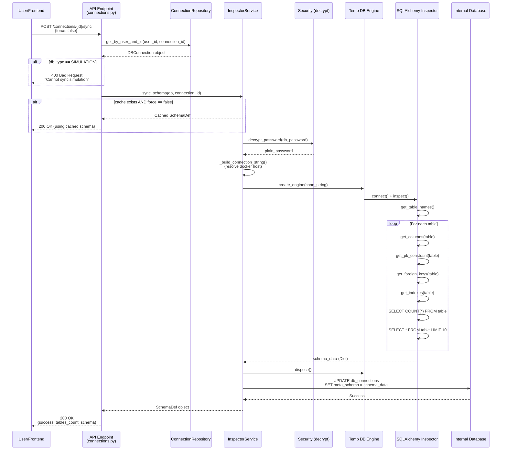
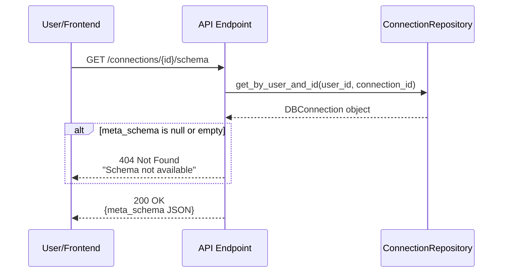
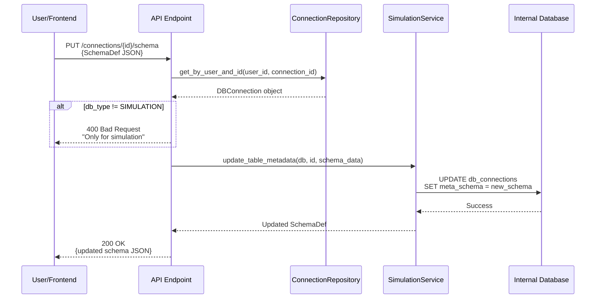
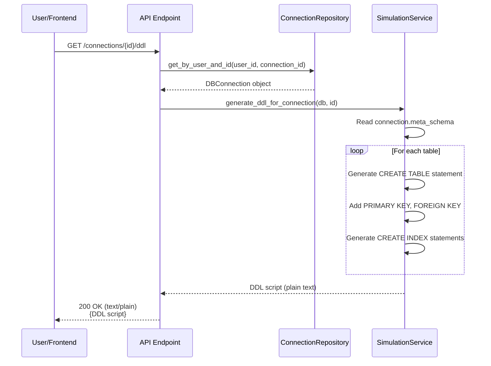
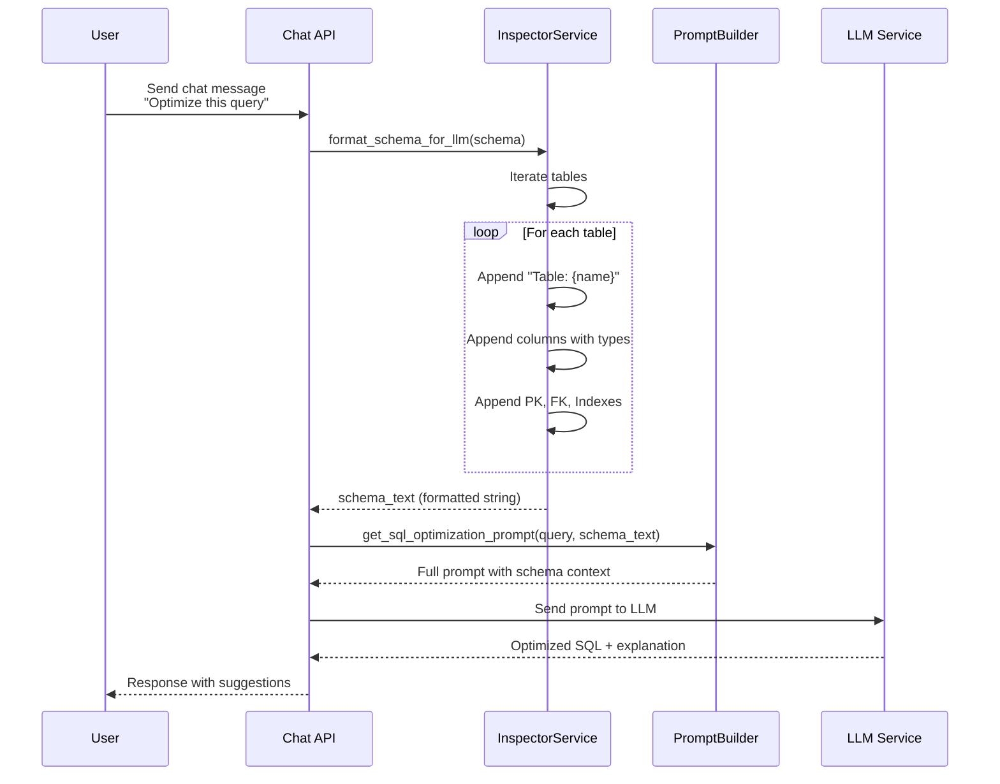

specification_functions/20260206/3_schema_sync_management.md

# Tài liệu Đặc tả: Đồng bộ và Quản lý Schema

## 1. Tác động Database (Database Impact)

### Table: `db_connections`
- **Usage:** 
  - **Read:** `id`, `user_id`, `db_type`, `host`, `port`, `username`, `db_password`, `db_name` để kết nối DB thật
  - **Update:** `meta_schema` (JSONB), `metadata_cache` (JSONB) sau khi sync
  - `meta_schema`: Lưu cấu trúc schema chi tiết (tables, columns, FK, indexes) dưới dạng JSON
  - `metadata_cache`: Cache thô của schema metadata (có thể dùng cho internal DB)

**Lưu ý:** Không tạo cột mới. Chức năng này chỉ đọc/ghi vào các cột đã tồn tại.

---

## 2. Mô phỏng API (API Simulation)

### 2.1. Đồng bộ Schema từ DB Thật (Real DB)

**Endpoint:** `POST /api/v1/connections/{connection_id}/sync`

**Simulation:**

**Request JSON:**
```json
{
  "force": false
}
```
- `force` (optional, mặc định `false`): Nếu `true`, bắt buộc sync lại ngay cả khi đã có cache.

**Response JSON (Success):**
```json
{
  "success": true,
  "message": "Schema synchronized successfully",
  "tables_count": 5,
  "schema": {
    "database_name": "ecommerce_db",
    "db_type": "postgres",
    "tables": [
      {
        "name": "users",
        "columns": [
          {
            "name": "id",
            "type": "UUID",
            "is_pk": true,
            "is_nullable": false
          },
          {
            "name": "email",
            "type": "VARCHAR",
            "is_pk": false,
            "is_nullable": false
          },
          {
            "name": "created_at",
            "type": "TIMESTAMP",
            "is_pk": false,
            "is_nullable": false,
            "default": "now()"
          }
        ],
        "foreign_keys": [],
        "indexes": [
          {
            "name": "idx_users_email",
            "column_names": ["email"],
            "unique": true
          }
        ],
        "row_count": 1250
      },
      {
        "name": "orders",
        "columns": [
          {
            "name": "id",
            "type": "UUID",
            "is_pk": true,
            "is_nullable": false
          },
          {
            "name": "user_id",
            "type": "UUID",
            "is_pk": false,
            "is_nullable": false
          },
          {
            "name": "total_amount",
            "type": "NUMERIC",
            "is_pk": false,
            "is_nullable": false
          }
        ],
        "foreign_keys": [
          {
            "column": "user_id",
            "ref_table": "users",
            "ref_column": "id"
          }
        ],
        "indexes": [
          {
            "name": "idx_orders_user_id",
            "column_names": ["user_id"],
            "unique": false
          }
        ],
        "row_count": 3420
      }
    ]
  }
}
```

**Response JSON (Using Cached Schema):**
```json
{
  "success": true,
  "message": "Using cached schema metadata",
  "tables_count": 5,
  "schema": {
    "database_name": "ecommerce_db",
    "db_type": "postgres",
    "tables": [ "... (same structure as above)" ]
  }
}
```

**Error Response (403 - Simulation Connection):**
```json
{
  "detail": "Cannot sync schema from a simulation connection. Use PUT /schema instead."
}
```

**Error Response (400 - Connection Failed):**
```json
{
  "detail": "Failed to sync schema: FATAL: password authentication failed for user 'admin'"
}
```

**Error Response (404 - Connection Not Found):**
```json
{
  "detail": "Connection with ID 550e8400-e29b-41d4-a716-446655440000 not found"
}
```

---

### 2.2. Lấy Schema đã Cache

**Endpoint:** `GET /api/v1/connections/{connection_id}/schema`

**Simulation:**

**Request:** Không có body.

**Response JSON (Success):**
```json
{
  "database_name": "ecommerce_db",
  "db_type": "postgres",
  "tables": [
    {
      "name": "users",
      "columns": [ "... (same structure as sync response)" ]
    }
  ]
}
```

**Error Response (404 - No Schema Cached):**
```json
{
  "detail": "Schema not available. Please sync the connection or update schema for simulations."
}
```

---

### 2.3. Cập nhật Schema thủ công (cho Simulation Workspace)

**Endpoint:** `PUT /api/v1/connections/{connection_id}/schema`

**Simulation:**

**Request JSON:**
```json
{
  "database_name": "my_simulation",
  "db_type": "simulation",
  "tables": [
    {
      "name": "products",
      "columns": [
        {
          "name": "id",
          "type": "INTEGER",
          "is_pk": true,
          "is_nullable": false
        },
        {
          "name": "name",
          "type": "VARCHAR",
          "is_pk": false,
          "is_nullable": false
        },
        {
          "name": "price",
          "type": "DECIMAL",
          "is_pk": false,
          "is_nullable": false
        }
      ],
      "foreign_keys": [],
      "indexes": []
    }
  ]
}
```

**Response JSON (Success):**
```json
{
  "database_name": "my_simulation",
  "db_type": "simulation",
  "tables": [ "... (same as request)" ]
}
```

**Error Response (400 - Not Simulation):**
```json
{
  "detail": "Can only update schema for simulation connections. Use POST /sync for real databases."
}
```

---

### 2.4. Lấy DDL Script

**Endpoint:** `GET /api/v1/connections/{connection_id}/ddl`

**Simulation:**

**Request:** Không có body.

**Response (Plain Text):**
```sql
-- Table: users
CREATE TABLE users (
  id UUID PRIMARY KEY,
  email VARCHAR NOT NULL,
  created_at TIMESTAMP NOT NULL DEFAULT now()
);

CREATE UNIQUE INDEX idx_users_email ON users(email);

-- Table: orders
CREATE TABLE orders (
  id UUID PRIMARY KEY,
  user_id UUID NOT NULL,
  total_amount NUMERIC NOT NULL,
  FOREIGN KEY (user_id) REFERENCES users(id)
);

CREATE INDEX idx_orders_user_id ON orders(user_id);
```

**Error Response (404 - No Schema):**
```json
{
  "detail": "No schema available for this connection"
}
```

---

## 3. Luồng xử lý Chi tiết (Core Logic Flow)

### 3.1. Luồng Đồng bộ Schema từ DB Thật (POST /sync)

**Step-by-Step Flow:**

1. **Xác thực và Kiểm tra Connection:**
   - API endpoint nhận `connection_id` từ URL path
   - Gọi `get_current_user()` để lấy thông tin user hiện tại
   - Gọi `connection_repository.get_by_user_and_id()` để kiểm tra connection có tồn tại và thuộc về user không
   - Nếu không tìm thấy → Trả về HTTP 404
   - Nếu `connection.db_type == DBType.SIMULATION` → Trả về HTTP 400 (không thể sync từ simulation)

2. **Kiểm tra Cache (nếu `force == false`):**
   - Trong `inspector_service.sync_schema()`:
     - Đọc `connection.metadata_cache`
     - Nếu `metadata_cache` có dữ liệu và `force == false` → Trả về schema từ cache ngay lập tức
     - Nếu `force == true` hoặc cache rỗng → Tiếp tục bước 3

3. **Giải mã Mật khẩu:**
   - Gọi `decrypt_password(connection.db_password)` để lấy plain text password
   - Nếu thất bại → Ném `AuthenticationError`

4. **Xây dựng Connection String:**
   - Gọi `_build_connection_string()` với các tham số:
     - `db_type` (postgres/mysql)
     - `host` (đã resolve docker host nếu cần: `host.docker.internal` cho localhost)
     - `port`, `username`, `password`, `db_name`
   - Tạo connection string phù hợp:
     - PostgreSQL: `postgresql://{username}:{password}@{host}:{port}/{db_name}`
     - MySQL: `mysql+pymysql://{username}:{password}@{host}:{port}/{db_name}`

5. **Kết nối tới DB Thật:**
   - Tạo `temp_engine` bằng `create_engine()` với:
     - `pool_pre_ping=True` (kiểm tra kết nối trước khi dùng)
     - `pool_recycle=3600` (recycle connection sau 1h)
     - `connect_args={"connect_timeout": 10}` (timeout 10 giây)
   - Gọi `temp_engine.connect()` để test kết nối
   - Nếu thất bại (sai password, host unreachable, etc.) → Trả về error message

6. **Trích xuất Schema Metadata:**
   - Gọi `_inspect_schema(temp_engine)`:
     - Tạo `inspector = inspect(temp_engine)` (SQLAlchemy Inspector)
     - Gọi `inspector.get_table_names()` để lấy danh sách bảng
     - Với mỗi bảng:
       - `inspector.get_columns(table_name)` → Lấy thông tin cột (name, type, nullable, default)
       - `inspector.get_pk_constraint(table_name)` → Lấy primary key columns
       - `inspector.get_foreign_keys(table_name)` → Lấy foreign keys (constrained_columns, referred_table, referred_columns)
       - `inspector.get_indexes(table_name)` → Lấy indexes (name, column_names, unique)
       - Xây dựng cấu trúc JSON cho mỗi cột:
         ```python
         {
           "name": "user_id",
           "type": "UUID",
           "nullable": False,
           "pk": True,  # nếu là PK
           "fk": "users.id"  # nếu là FK
         }
         ```
     - Trả về `schema_data` dạng `Dict[table_name, List[column_info]]`

7. **Lấy Sample Data và Row Count:**
   - Với mỗi bảng, execute query:
     - `SELECT COUNT(*) FROM {table_name}` → Lấy `row_count`
     - `SELECT * FROM {table_name} ORDER BY RANDOM() LIMIT 10` (Postgres) hoặc `ORDER BY RAND()` (MySQL)
     - Xử lý giá trị phức tạp (JSON, long strings cắt còn 500 ký tự)
     - Lưu vào `sample_data[]`

8. **Lưu vào Database:**
   - Cập nhật `connection.meta_schema = schema_data` (SchemaDef JSON)
   - Gọi `db.commit()` để lưu thay đổi
   - Gọi `db.refresh(connection)` để reload object

9. **Cleanup và Trả về:**
   - Gọi `temp_engine.dispose()` để đóng connections
   - Trả về `SchemaSyncResponse`:
     ```python
     {
       "success": True,
       "message": "Schema synchronized successfully",
       "tables_count": len(schema_data),
       "schema": schema_def.to_json_dict()
     }
     ```

**Sequence Diagram (Mermaid):**



---

### 3.2. Luồng Lấy Schema từ Cache (GET /schema)

**Step-by-Step Flow:**

1. **Xác thực và Kiểm tra Connection:**
   - Tương tự luồng sync: gọi `get_current_user()` và `get_by_user_and_id()`

2. **Đọc meta_schema:**
   - Truy cập `connection.meta_schema`
   - Nếu `meta_schema` là `null` hoặc `{}` → Trả về HTTP 404 với message yêu cầu sync

3. **Trả về Schema:**
   - Response body chính là `connection.meta_schema` (JSON)

**Sequence Diagram:**



---

### 3.3. Luồng Cập nhật Schema thủ công (PUT /schema - chỉ cho Simulation)

**Step-by-Step Flow:**

1. **Xác thực và Kiểm tra Connection:**
   - Gọi `get_current_user()` và `get_by_user_and_id()`
   - Nếu `connection.db_type != DBType.SIMULATION` → Trả về HTTP 400 (chỉ cho phép simulation)

2. **Validate Schema Data:**
   - Request body là một `SchemaDef` object (Pydantic validation tự động)
   - Kiểm tra structure: `tables[]`, `columns[]`, `foreign_keys[]`, `indexes[]`

3. **Gọi simulation_service:**
   - `simulation_service.update_table_metadata(db, connection_id, schema_data)`
   - Service này cập nhật `connection.meta_schema` từ request

4. **Lưu vào Database:**
   - `db.commit()` để persist thay đổi

5. **Trả về:**
   - Response là `schema_data.to_json_dict()` (echo lại schema đã update)

**Sequence Diagram:**



---

### 3.4. Luồng Tạo DDL Script (GET /ddl)

**Step-by-Step Flow:**

1. **Xác thực và Lấy Connection:**
   - Gọi `get_current_user()` và `get_by_user_and_id()`

2. **Gọi simulation_service:**
   - `simulation_service.generate_ddl_for_connection(db, connection_id)`
   - Service đọc `connection.meta_schema` và convert sang DDL syntax

3. **Generate DDL:**
   - Với mỗi table trong `meta_schema.tables`:
     - Tạo `CREATE TABLE` statement với tất cả columns
     - Thêm `PRIMARY KEY` constraint
     - Thêm `FOREIGN KEY` constraints
     - Tạo `CREATE INDEX` statements riêng cho mỗi index
   - Join tất cả statements thành một chuỗi DDL

4. **Trả về Plain Text:**
   - Response `Content-Type: text/plain`
   - Body là DDL script hoàn chỉnh

**Sequence Diagram:**



---

### 3.5. Luồng Format Schema cho AI Context

**Step-by-Step Flow:**

1. **Trigger:**
   - Khi user gửi câu hỏi trong Chat AI hoặc yêu cầu tối ưu SQL
   - Backend cần format schema thành text để làm context cho LLM

2. **Gọi inspector_service:**
   - `inspector_service.format_schema_for_llm(schema)`
   - Input là `schema` dict từ `connection.meta_schema`

3. **Format Logic:**
   - Với mỗi table:
     ```
     Table: users
     Columns:
       - id: UUID NOT NULL
       - email: VARCHAR NOT NULL
       - created_at: TIMESTAMP NOT NULL
     Primary Key: (id)
     Indexes:
       - idx_users_email: (email) UNIQUE
     ```
   - Join tất cả tables thành một chuỗi text

4. **Sử dụng trong Prompt:**
   - Gọi `get_sql_optimization_prompt(sql_query, schema_text)`
   - Hoặc `get_sql_generation_prompt(user_request, schema_text)`
   - Schema text được inject vào system prompt cho LLM

**Sequence Diagram:**



---

## 4. Tương tác Frontend (Frontend Flow)

### 4.1. Auto-sync khi mở Workspace Mới (Real DB)

**Trigger:**
- User navigate vào `/editor/:workspaceId`
- Component `EditorPage` mount và gọi hook `useWorkspace(workspaceId)`

**Data Handling:**
1. Hook fetch workspace details: `GET /api/v1/connections/{id}`
2. Kiểm tra `workspace.meta_schema`:
   - Nếu `null` hoặc `{}` và `db_type != 'simulation'`:
     - Tự động gọi `workspaceService.syncSchema(workspaceId)`
     - Hiển thị loading state: "Syncing schema..."
3. Sau khi sync xong:
   - Hook re-fetch workspace details
   - Update `workspace` state với `meta_schema` mới
   - Truyền `schema` prop vào component `SchemaViewer`

**User Flow:**
```
User opens Editor → Check schema → Empty? → Auto-sync (if real DB) → Show schema in right pane
```

---

### 4.2. Manual Sync từ SchemaViewer

**Trigger:**
- User click nút "Sync Schema" trong component `SchemaViewer`

**Data Handling:**
1. Component gọi `handleSync()`:
   - Set `isSyncing = true` (hiển thị spinner icon)
   - Gọi `workspaceService.syncSchema(workspaceId)`
   - API call: `POST /api/v1/connections/{id}/sync` với `force: true`
2. Sau khi nhận response:
   - Gọi `onSync()` callback (trigger parent re-fetch workspace)
   - Set `isSyncing = false`
   - Schema Viewer tự động re-render với data mới

**User Flow:**
```
User clicks "Sync" → Show spinner → POST /sync → Update schema state → Re-render tree view
```

---

### 4.3. Xem Schema dạng Tree View (List View)

**Trigger:**
- Khi `SchemaViewer` nhận prop `schema` không null

**Data Handling:**
1. Parse `schema` thành `SchemaDef` object:
   - `schema.tables[]` → Array of `TableSchema`
2. Render collapsible tree:
   - Header: Table name + row count
   - Expandable: Columns với icons (🔑 PK, 🔗 FK)
   - Group riêng: Indexes, Foreign Keys
3. State management:
   - `expandedTables` (Set<string>) để track bảng nào đang expand
   - Toggle bằng `toggleTable(tableName)`

**User Flow:**
```
Schema loaded → Render table list → User clicks table → Expand columns/indexes → User clicks again → Collapse
```

---

### 4.4. Xem Schema dạng Diagram (ER Diagram)

**Trigger:**
- User click nút "View Diagram" trong `SchemaViewer`

**Data Handling:**
1. Component set `isDiagramModalOpen = true`
2. Render `SchemaDiagramModal` component:
   - Pass `schema` prop
   - Component `SchemaDiagram` sử dụng React Flow:
     - Convert `schema.tables[]` thành nodes (position tự động bằng Dagre layout)
     - Convert `foreign_keys[]` thành edges
3. User có thể:
   - Zoom in/out
   - Drag nodes
   - Click vào column để highlight FK relationships
4. Close modal:
   - Set `isDiagramModalOpen = false`

**User Flow:**
```
User clicks "View Diagram" → Modal opens → Show interactive ER diagram → Drag/zoom → Close modal
```

---

### 4.5. Navigate tới Schema Editor

**Trigger:**
- User click nút "Edit Schema" trong `SchemaViewer`

**Data Handling:**
1. Component gọi `navigate('/schema-editor/:workspaceId')`
2. Route chuyển sang `TableEditor` page:
   - Load `workspace.meta_schema`
   - Hiển thị editor form cho phép:
     - Add/remove tables
     - Add/remove columns
     - Define FK relationships
     - Add indexes
3. Khi user save:
   - Nếu `db_type == 'simulation'`: Gọi `PUT /api/v1/connections/{id}/schema`
   - Cập nhật `meta_schema` trong database

**User Flow:**
```
User clicks "Edit Schema" → Navigate to editor page → Modify schema → Save → PUT /schema → Update meta_schema
```

---

### 4.6. Tra cứu nhanh (Search/Filter trong Schema)

**Trigger:**
- User nhập text vào search box trong `SchemaViewer` (nếu có feature này)

**Data Handling:**
1. Filter `schema.tables[]` theo tên bảng hoặc tên cột
2. Highlight match results
3. Auto-expand tables có kết quả match

**Note:** Logic này chưa được triển khai hoàn toàn. Hiện tại chỉ hỗ trợ manual expand/collapse.

---

## 5. End-to-End Flow Diagram

```mermaid
graph TB
    subgraph "Frontend"
        U[User Opens Editor]
        UI[EditorPage Component]
        SV[SchemaViewer Component]
        SD[SchemaDiagram Modal]
        SE[Schema Editor Page]
    end
    
    subgraph "Backend API"
        A1[GET /connections/:id]
        A2[POST /connections/:id/sync]
        A3[GET /connections/:id/schema]
        A4[PUT /connections/:id/schema]
        A5[GET /connections/:id/ddl]
    end
    
    subgraph "Services"
        IS[InspectorService]
        SS[SimulationService]
        SEC[decrypt_password]
    end
    
    subgraph "External Resources"
        RDB[(Real Database<br/>Postgres/MySQL)]
        IDB[(Internal DB<br/>db_connections table)]
    end
    
    U -->|1. Navigate| UI
    UI -->|2. Fetch workspace| A1
    A1 -->|3. Read| IDB
    IDB -->|4. Return connection| A1
    A1 -->|5. Response| UI
    
    UI -->|6. Check meta_schema| UI
    UI -->|7a. Empty? Auto-sync| A2
    UI -->|7b. Has data? Display| SV
    
    A2 -->|8. sync_schema| IS
    IS -->|9. Decrypt password| SEC
    IS -->|10. Connect & inspect| RDB
    RDB -->|11. Schema metadata| IS
    IS -->|12. Save meta_schema| IDB
    IS -->|13. Return SchemaDef| A2
    A2 -->|14. Response| UI
    UI -->|15. Update state| SV
    
    SV -->|16. Manual sync button| A2
    SV -->|17. View Diagram button| SD
    SV -->|18. Edit Schema button| SE
    
    SE -->|19. Save changes<br/>(Simulation only)| A4
    A4 -->|20. update_table_metadata| SS
    SS -->|21. Update meta_schema| IDB
    
    SV -->|22. Export DDL| A5
    A5 -->|23. generate_ddl| SS
    SS -->|24. Read meta_schema| IDB
    SS -->|25. Return DDL script| A5
    
    style RDB fill:#e1f5ff
    style IDB fill:#fff4e1
    style U fill:#f0f0f0
    style SV fill:#e8f5e9
    style SD fill:#e8f5e9
    style SE fill:#e8f5e9
```

---

## Tóm tắt

### Core Functions:

1. **SchemaService:**
   - `sync_connection_schema(connection_id, db, force)`: Sync schema từ DB thật, lưu vào `meta_schema`
   - `get_cached_schema(connection_id, db)`: Lấy schema từ cache
   - `_inspect_schema(engine)`: SQLAlchemy Inspector để trích xuất tables/columns/FK/indexes

2. **InspectorService:**
   - `sync_schema(db, connection_id)`: Tạo `SchemaDef` object chi tiết với sample data
   - `format_schema_for_llm(schema)`: Format schema thành text cho AI context

3. **SimulationService:**
   - `update_table_metadata(db, connection_id, schema_data)`: Cập nhật schema cho simulation
   - `generate_ddl_for_connection(db, connection_id)`: Tạo DDL script từ schema

4. **API Endpoints:**
   - `POST /sync`: Sync từ real DB
   - `GET /schema`: Lấy cached schema
   - `PUT /schema`: Update schema (simulation only)
   - `GET /ddl`: Export DDL script

5. **Frontend Components:**
   - `SchemaViewer`: Tree view với sync/diagram/edit buttons
   - `SchemaDiagram`: Interactive ER diagram (React Flow)
   - `TableEditor`: Schema editor cho simulation workspaces

### Key Features:
- **Auto-sync** khi mở workspace real DB lần đầu
- **Cache mechanism** để tránh sync lặp lại
- **Dual view**: List view (tree) + Diagram view (ER)
- **Manual schema editing** cho simulation workspaces
- **DDL export** để copy schema ra ngoài
- **AI context integration** (format schema cho LLM prompts)
