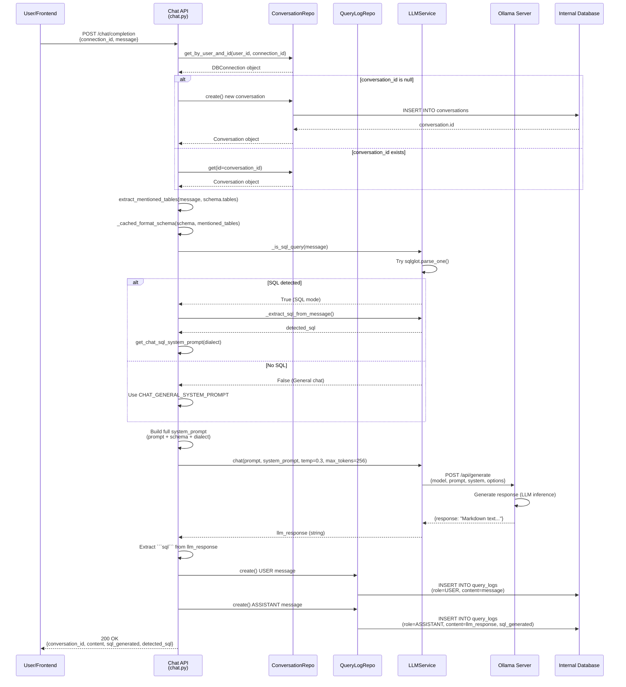
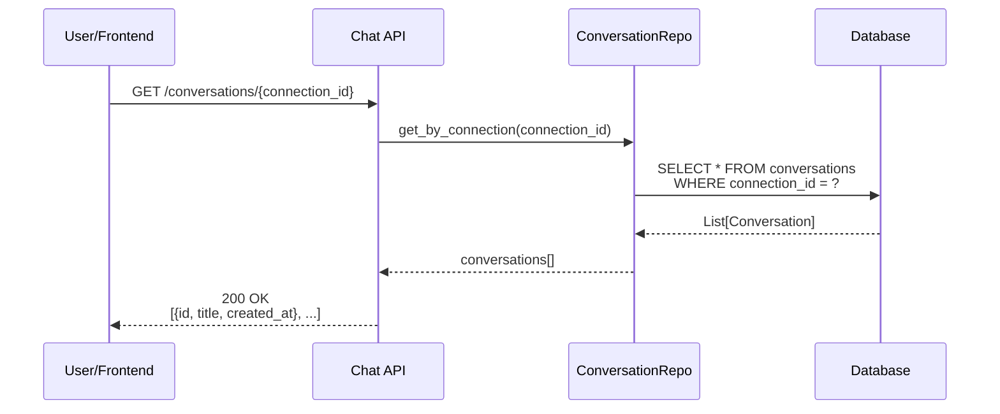
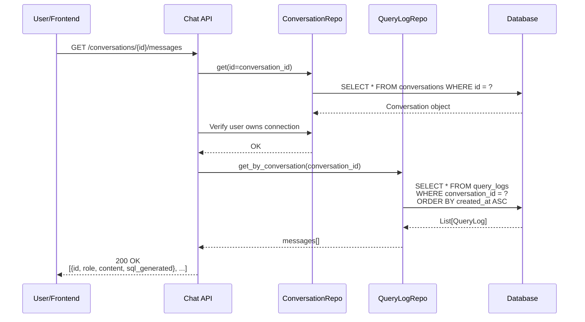

specification_functions/20260206/4_sql_editor_chat_ai.md

# Tài liệu Đặc tả: Trình soạn thảo SQL & Chat AI

## 1. Tác động Database (Database Impact)

### Table: `conversations`
- **Usage:**
  - **Create:** Tạo conversation mới khi user gửi tin nhắn đầu tiên (nếu `conversation_id = null`)
  - **Read:** `id`, `connection_id`, `title`, `created_at` để hiển thị danh sách cuộc hội thoại
  - `connection_id` (FK): Liên kết conversation với workspace/connection cụ thể
  - `title`: Tự động lấy 50 ký tự đầu của message đầu tiên

### Table: `query_logs`
- **Usage:**
  - **Create:** Lưu mỗi message (user và assistant) vào bảng này
  - **Read:** `conversation_id`, `role`, `content`, `sql_generated`, `created_at` để hiển thị lịch sử chat
  - `role` (enum): `USER` hoặc `ASSISTANT`
  - `content`: Nội dung tin nhắn (text hoặc Markdown)
  - `sql_generated`: SQL code được AI generate (nếu có)
  - `action_type`: Mặc định `'chat'`

### Table: `db_connections`
- **Usage:**
  - **Read:** `meta_schema` (JSONB) để lấy schema làm context cho AI
  - **Read:** `db_type` để chọn dialect phù hợp (postgres/mysql)

**Lưu ý:** Không tạo cột mới. Chức năng này chỉ đọc/ghi vào các bảng đã tồn tại.

---

## 2. Mô phỏng API (API Simulation)

### 2.1. Gửi tin nhắn Chat & Nhận phản hồi AI

**Endpoint:** `POST /api/v1/chat/completion`

**Simulation:**

**Request JSON (Câu hỏi tự nhiên - General Q&A):**
```json
{
  "connection_id": "550e8400-e29b-41d4-a716-446655440000",
  "conversation_id": null,
  "message": "What tables do I have in this database?"
}
```

**Response JSON (General Chat):**
```json
{
  "conversation_id": "660f9511-f39c-52e5-b827-557766551111",
  "role": "assistant",
  "content": "Based on your schema, you have 5 tables:\n\n1. **users** - Stores user account information (email, password, role)\n2. **orders** - Contains order records with user_id foreign key\n3. **products** - Product catalog with pricing\n4. **order_items** - Junction table linking orders and products\n5. **categories** - Product categories\n\nWould you like me to explain the relationships between these tables?",
  "sql_generated": null,
  "detected_sql": null
}
```

---

**Request JSON (Có SQL code - Intent Detection phát hiện SQL):**
```json
{
  "connection_id": "550e8400-e29b-41d4-a716-446655440000",
  "conversation_id": "660f9511-f39c-52e5-b827-557766551111",
  "message": "Can you check this query?\n\n```sql\nSELECT * FROM orders WHERE created_at > NOW() - INTERVAL '7 days'\n```"
}
```

**Response JSON (SQL Analysis với Markdown):**
```json
{
  "conversation_id": "660f9511-f39c-52e5-b827-557766551111",
  "role": "assistant",
  "content": "**Status:** Valid for PostgreSQL\n**Intent:** Retrieve all orders created in the last 7 days\n**Quick Tip:** This query is optimized for PostgreSQL. For MySQL, use `DATE_SUB(NOW(), INTERVAL 7 DAY)` instead.\n\n```sql\nSELECT * FROM orders WHERE created_at > NOW() - INTERVAL '7 days'\n```\n\n**Performance Consideration:** If the `orders` table is large, consider adding an index on `created_at` column:\n```sql\nCREATE INDEX idx_orders_created_at ON orders(created_at);\n```",
  "sql_generated": "SELECT * FROM orders WHERE created_at > NOW() - INTERVAL '7 days'",
  "detected_sql": "SELECT * FROM orders WHERE created_at > NOW() - INTERVAL '7 days'"
}
```

---

**Request JSON (Yêu cầu generate SQL):**
```json
{
  "connection_id": "550e8400-e29b-41d4-a716-446655440000",
  "conversation_id": "660f9511-f39c-52e5-b827-557766551111",
  "message": "Show me top 10 users who placed the most orders"
}
```

**Response JSON (SQL Generated):**
```json
{
  "conversation_id": "660f9511-f39c-52e5-b827-557766551111",
  "role": "assistant",
  "content": "**Query Intent:** Find the top 10 users with the highest order count\n\nHere's the query:\n\n```sql\nSELECT \n  u.id,\n  u.email,\n  COUNT(o.id) AS order_count\nFROM users u\nLEFT JOIN orders o ON u.id = o.user_id\nGROUP BY u.id, u.email\nORDER BY order_count DESC\nLIMIT 10;\n```\n\n**Explanation:**\n- Uses `LEFT JOIN` to include users with 0 orders\n- `GROUP BY` aggregates orders per user\n- `ORDER BY order_count DESC` sorts from highest to lowest\n- `LIMIT 10` returns only top 10 results",
  "sql_generated": "SELECT \n  u.id,\n  u.email,\n  COUNT(o.id) AS order_count\nFROM users u\nLEFT JOIN orders o ON u.id = o.user_id\nGROUP BY u.id, u.email\nORDER BY order_count DESC\nLIMIT 10;",
  "detected_sql": null
}
```

---

**Error Response (404 - Connection Not Found):**
```json
{
  "detail": "Connection not found or access denied"
}
```

**Error Response (500 - LLM Service Error):**
```json
{
  "detail": "LLM service error: Cannot connect to Ollama at http://localhost:11434/api/generate. Is Ollama running?"
}
```

---

### 2.2. Lấy danh sách Conversations

**Endpoint:** `GET /api/v1/chat/conversations/{connection_id}`

**Request:** Không có body.

**Response JSON:**
```json
[
  {
    "id": "660f9511-f39c-52e5-b827-557766551111",
    "title": "What tables do I have in this database?",
    "created_at": "2026-02-06T10:30:00Z"
  },
  {
    "id": "771faa22-g40d-63f6-c938-668877662222",
    "title": "Top 10 users with most orders",
    "created_at": "2026-02-06T11:00:00Z"
  }
]
```

---

### 2.3. Lấy lịch sử tin nhắn của Conversation

**Endpoint:** `GET /api/v1/chat/conversations/{conversation_id}/messages`

**Request:** Không có body.

**Response JSON:**
```json
[
  {
    "id": "881fbb33-h51e-74g7-d049-779988773333",
    "role": "user",
    "content": "Show me top 10 users who placed the most orders",
    "sql_generated": null,
    "created_at": "2026-02-06T11:00:00Z"
  },
  {
    "id": "991fcc44-i62f-85h8-e150-880099884444",
    "role": "assistant",
    "content": "**Query Intent:** Find the top 10 users with the highest order count...",
    "sql_generated": "SELECT u.id, u.email, COUNT(o.id) AS order_count...",
    "created_at": "2026-02-06T11:00:05Z"
  }
]
```

---

## 3. Luồng xử lý Chi tiết (Core Logic Flow)

### 3.1. Luồng Gửi tin nhắn & Nhận phản hồi AI (POST /chat/completion)

**Step-by-Step Flow:**

1. **Xác thực và Kiểm tra Connection:**
   - API endpoint nhận `ChatCompletionRequest` (connection_id, conversation_id, message)
   - Gọi `get_current_user()` để lấy user hiện tại
   - Gọi `connection_repository.get_by_user_and_id()` để kiểm tra connection có tồn tại và thuộc về user không
   - Nếu không tìm thấy → Trả về HTTP 404

2. **Kiểm tra hoặc Tạo Conversation:**
   - Nếu `conversation_id` được cung cấp:
     - Gọi `conversation_repository.get(db, id=conversation_id)`
     - Kiểm tra `conversation.connection_id` khớp với `request.connection_id`
     - Nếu không khớp → Trả về HTTP 404
   - Nếu `conversation_id = null`:
     - Gọi `conversation_repository.create()` với:
       - `connection_id`: từ request
       - `title`: Lấy 50 ký tự đầu của message
       - `created_at`: Timestamp hiện tại
     - Lưu `conversation.id` để dùng tiếp

3. **Trích xuất Tables được đề cập (Mentioned Tables):**
   - Đọc `connection.meta_schema.get("tables", [])`
   - Gọi `extract_mentioned_tables(message, all_tables)`:
     - Convert message thành lowercase
     - Với mỗi table name trong schema:
       - Nếu table name xuất hiện trong message → Thêm vào danh sách `mentioned_tables`
   - Log số lượng tables được đề cập

4. **Format Schema cho AI Context (với Cache):**
   - Gọi `_cached_format_schema()` (LRU cache size=128):
     - Input: `schema_json` (string), `limit_tables=10`, `mentioned_table_names` (tuple)
     - Logic:
       - Parse `schema_json` thành dict
       - Nếu có `mentioned_tables` → Ưu tiên hiển thị các bảng này
       - Nếu không → Lấy 10 bảng đầu tiên
       - Với mỗi table:
         ```
         Table: users
           - id: UUID NOT NULL PRIMARY KEY
           - email: VARCHAR NOT NULL
           - created_at: TIMESTAMP NOT NULL
           Foreign Keys:
             - (none)
         ```
     - Return formatted text

5. **Intent Detection (Phát hiện ý định):**
   - Gọi `llm_service._is_sql_query(request.message)`:
     - **Step 1:** Thử parse bằng `sqlglot.parse_one(clean_message)`
       - Remove markdown code blocks: `r'```sql\s*|\s*```'`
       - Nếu parse thành công → Return `True` (log: "SQL detected via sqlglot parsing")
     - **Step 2:** Nếu parse thất bại, kiểm tra keywords:
       - Keywords: `SELECT, INSERT, UPDATE, DELETE, CREATE, ALTER, DROP, WITH, TRUNCATE, MERGE, GRANT, REVOKE`
       - Regex search: `\b{keyword}\b` (word boundary)
       - Nếu tìm thấy → Return `True` (log: "SQL detected via keyword: {keyword}")
     - **Step 3:** Nếu không phát hiện SQL → Return `False` (log: "No SQL detected - treating as general chat")

6. **Extract SQL từ Message (nếu có):**
   - Nếu `is_sql_query == True`:
     - Gọi `llm_service._extract_sql_from_message(message)`:
       - Tìm markdown blocks: `r'```sql\s*(.*?)\s*```'`
       - Validate bằng `_validate_sql(candidate_sql)` (sqlglot parsing)
       - Nếu không tìm thấy trong markdown → Tìm raw patterns: `\b(SELECT|WITH|...).*?(?:;|$)`
       - Return SQL string hoặc `None`

7. **Chọn System Prompt phù hợp (Context-Aware Prompting):**
   - Lấy `dialect` từ `connection.db_type.value` (postgres/mysql/simulation)
   - **Nếu `is_sql_query == True` (SQL Analysis Mode):**
     - Gọi `get_chat_sql_system_prompt(dialect)`:
       - Tạo prompt với syntax rules cụ thể cho dialect:
         - **PostgreSQL:** `'value'::type`, `NOW() - INTERVAL '1 day'`, `||` for concat
         - **MySQL:** `CAST('value' AS TYPE)`, `DATE_SUB(NOW(), INTERVAL 1 DAY)`, `CONCAT()` function
       - Template prompt:
         ```
         You are a Senior {DIALECT} Database Engineer assistant.
         CONTEXT: User tool has 'Run', 'Explain', 'Optimize' buttons (only appear if SQL code block present).
         TARGET DIALECT: {DIALECT}
         PRIORITY RULE: TEXT INTENT > PROVIDED SQL
         
         {Syntax Rules for dialect}
         
         Response Template:
         **Status:** [Valid / Corrected / Fixed for dialect]
         **Intent:** [Brief summary]
         **Quick Tip:** [Why changed]
         
         ```sql
         [FINAL CORRECTED SQL]
         ```
         ```
     - Thêm schema text:
       ```
       {sql_system_prompt}
       
       Database Type: {db_type_name}
       
       {schema_text}
       
       [SYSTEM NOTE: Ensure all SQL syntax is valid for {DIALECT}]
       ```
   - **Nếu `is_sql_query == False` (General Chat Mode):**
     - Sử dụng `CHAT_GENERAL_SYSTEM_PROMPT`:
       ```
       You are a helpful assistant for SQLTuner.
       Your role:
       - General questions about databases and SQL
       - Understanding database concepts
       - Clarifying how to use SQLTuner features
       - Providing guidance on best practices
       Be concise, helpful, and friendly.
       ```
     - Thêm schema và instructions:
       ```
       {CHAT_GENERAL_SYSTEM_PROMPT}
       
       Database Type: {db_type_name}
       
       {schema_text}
       
       Instructions:
       - Answer user questions about the database
       - Generate SQL queries when requested
       - Explain query results clearly
       - If generating SQL, wrap it in ```sql code blocks
       - Be concise and helpful
       ```

8. **Gọi LLM Service:**
   - Gọi `llm_service.chat()`:
     - `prompt`: User message
     - `system_prompt`: Prompt đã build ở step 7
     - `temperature=0.3` (để balance creativity và consistency)
     - `max_tokens=256`
   - Config payload:
     - `model`: `settings.MODEL_CHAT_NAME` (ví dụ: llama3.2:latest)
     - `num_ctx=2048` (context window)
     - `keep_alive='120m'` (giữ model trong RAM 2 giờ)
   - Gọi `_make_ollama_request()`:
     - URL: `{OLLAMA_BASE_URL}/api/generate`
     - Method: POST với JSON payload
     - Timeout: Connect=10s, Read=LLM_REQUEST_TIMEOUT (default 120s)
     - Handle errors:
       - `ConnectError` → "Cannot connect to Ollama. Is Ollama running?"
       - `TimeoutException` → "Ollama request timed out after {timeout}s"
       - `HTTPStatusError` → "Ollama returned HTTP {status_code}"
   - Return `llm_response` (Markdown text)

9. **Extract SQL Generated từ Response (nếu có):**
   - Tìm markdown code block trong `llm_response`:
     - Pattern: `"```sql" in llm_response`
     - Extract content giữa `\`\`\`sql` và `\`\`\``
     - Lưu vào biến `sql_generated`

10. **Lưu Query Logs:**
    - Tạo 2 records trong `query_logs`:
      - **User message:**
        - `conversation_id`: từ step 2
        - `role`: `ChatRole.USER`
        - `content`: `request.message`
        - `created_at`: timestamp hiện tại
      - **Assistant response:**
        - `conversation_id`: từ step 2
        - `role`: `ChatRole.ASSISTANT`
        - `content`: `llm_response`
        - `sql_generated`: từ step 9 (hoặc `None`)
        - `created_at`: timestamp hiện tại

11. **Trả về Response:**
    - Build `ChatCompletionResponse`:
      - `conversation_id`: ID của conversation (mới tạo hoặc existing)
      - `role`: `"assistant"`
      - `content`: `llm_response` (Markdown text)
      - `sql_generated`: SQL code extracted từ response
      - `detected_sql`: SQL code extracted từ user message (step 6)
    - `detected_sql` dùng để hiển thị action buttons (Run/Explain/Optimize) ngay cả khi user chỉ paste SQL mà không yêu cầu gì

**Sequence Diagram (Mermaid):**



---

### 3.2. Luồng Lấy danh sách Conversations (GET /conversations/{connection_id})

**Step-by-Step Flow:**

1. **Xác thực và Kiểm tra Connection:**
   - Gọi `get_current_user()` và `get_by_user_and_id()`
   - Nếu connection không tồn tại → HTTP 404

2. **Lấy danh sách Conversations:**
   - Gọi `conversation_repository.get_by_connection(db, connection_id)`
   - Query: `SELECT * FROM conversations WHERE connection_id = ? ORDER BY created_at DESC`

3. **Format Response:**
   - Map mỗi conversation thành dict:
     ```python
     {
       "id": str(conv.id),
       "title": conv.title,
       "created_at": conv.created_at.isoformat()
     }
     ```

**Sequence Diagram:**



---

### 3.3. Luồng Lấy lịch sử Messages (GET /conversations/{conversation_id}/messages)

**Step-by-Step Flow:**

1. **Xác thực Conversation:**
   - Gọi `conversation_repository.get(db, id=conversation_id)`
   - Nếu không tìm thấy → HTTP 404

2. **Kiểm tra quyền truy cập:**
   - Lấy `conversation.connection_id`
   - Gọi `connection_repository.get_by_user_and_id()` để verify user có quyền truy cập connection không
   - Nếu không → HTTP 403

3. **Lấy danh sách Messages:**
   - Gọi `query_log_repository.get_by_conversation(db, conversation_id)`
   - Query: `SELECT * FROM query_logs WHERE conversation_id = ? ORDER BY created_at ASC`

4. **Format Response:**
   - Map mỗi message thành dict với `role`, `content`, `sql_generated`, `created_at`

**Sequence Diagram:**



---

## 4. Tương tác Frontend (Frontend Flow)

### 4.1. Gửi tin nhắn mới

**Trigger:**
- User nhập text vào `ChatInput` component và nhấn Enter hoặc click nút "Send"

**Data Handling:**

1. **Component `ChatInput`:**
   - Capture event `onSubmit` hoặc `onKeyDown` (Enter key)
   - Validate: `input.trim()` không rỗng và `!disabled`
   - Gọi callback `onSend(input.trim())`
   - Clear input: `setInput('')`

2. **Hook `useEditorLogic`:**
   - Nhận message từ `handleSendMessage(content)`
   - Gọi `sendMessageMutation.mutate(content)`:
     - **onMutate (Optimistic UI):**
       - Tạo 2 temporary messages:
         - User message: `{id: 'temp-user-{timestamp}', role: 'user', content}`
         - Loading message: `{id: 'temp-loading-{timestamp}', role: 'assistant', content: 'Processing...'}`
       - Update state: `setOptimisticMessages([userMsg, loadingMsg])`
       - UI hiển thị ngay lập tức (không chờ API)
     - **API Call:**
       - `chatService.sendMessage({connection_id, conversation_id, message})`
       - POST `/api/v1/chat/completion`
     - **onSuccess:**
       - Clear optimistic messages: `setOptimisticMessages([])`
       - Nếu conversation mới → Update `activeConversationId`
       - Invalidate queries:
         - `['conversations', connectionId]` → Re-fetch conversation list
         - `['messages', conversationId]` → Re-fetch messages
       - UI tự động re-render với data thật từ server
     - **onError:**
       - Clear optimistic messages
       - Hiển thị error message (toast/alert)

3. **Component `ChatArea`:**
   - Nhận `messages` prop từ hook (combined: fetched + optimistic)
   - Render message list:
     - User messages: Align right, blue background
     - Assistant messages: Align left, white background
   - Auto-scroll to bottom: `useEffect(() => messagesEndRef.current?.scrollIntoView())`

**User Flow:**
```
User types message → Press Enter → Optimistic UI (instant) → API call → Response received → Replace optimistic with real data → Auto-scroll
```

---

### 4.2. Hiển thị SQL Code Block với Action Buttons

**Trigger:**
- Assistant response chứa markdown code block `\`\`\`sql`

**Data Handling:**

1. **Component `ChatMessage` (hoặc `SQLBlock`):**
   - Parse content để tìm SQL blocks:
     - Regex: `r'```sql\s*(.*?)\s*```'`
   - Nếu tìm thấy → Render `SQLBlock` component:
     - Syntax highlighting (sử dụng library như `react-syntax-highlighter`)
     - Action bar với 3 buttons:
       - **Run:** `onExecute(sql)` → Gọi SQL execution API
       - **Explain:** `onExplain(sql)` → Gọi EXPLAIN PLAN API
       - **Optimize:** `onOptimize(sql)` → Gọi AI optimization API
   - Nếu `detected_sql` có giá trị (user paste SQL):
     - Hiển thị action buttons ngay cả khi chưa có AI response

2. **Hook `useEditorLogic`:**
   - `onExecute(sql)`:
     - Gọi `executeSqlMutation.mutate(sql)`
     - API: POST `/api/v1/sql/execute`
     - Response: `{columns, rows, execution_time_ms, row_count}`
     - Update state: `setQueryResults(new Map(..., [sql, data]))`
   - `onOptimize(sql)`:
     - Gọi `optimizeSqlMutation.mutate(sql)`
     - API: POST `/api/v1/sql/optimize`
     - Response: `{optimized_sql, index_suggestion, explanation}`
     - Open modal: `setIsOptimizationModalOpen(true)`
   - `onExplain(sql)`:
     - Gọi `explainSqlMutation.mutate(sql)`
     - API: POST `/api/v1/sql/explain`
     - Response: `{explanation, execution_plan}`
     - Display in modal hoặc inline

**User Flow:**
```
AI returns SQL → Render code block → Show Run/Explain/Optimize buttons → User clicks → Execute action → Show results
```

---

### 4.3. Intent Detection ảnh hưởng giao diện

**Trigger:**
- Backend detect SQL trong message → Set `detected_sql` trong response

**Data Handling:**

1. **Frontend nhận response:**
   - Check `response.detected_sql !== null`
   - Nếu có → Hiển thị action buttons trước cả khi AI response content đầy đủ
   - Ví dụ:
     - User paste: `SELECT * FROM users`
     - Backend detect SQL → `detected_sql` có giá trị
     - Frontend hiển thị buttons ngay lập tức
     - User có thể click "Run" trước khi đọc AI explanation

2. **UI Feedback:**
   - Nếu `is_sql_query == True` (backend log):
     - Response thường ngắn gọn hơn, có structured format (**Status**, **Intent**, **Quick Tip**)
     - Focus vào SQL code block
   - Nếu `is_sql_query == False`:
     - Response dạng prose, giải thích chi tiết
     - Có thể chứa SQL blocks nếu user yêu cầu generate query

**User Flow:**
```
User pastes SQL → Backend detects intent → Frontend shows action buttons immediately → User can run SQL without reading full AI response
```

---

### 4.4. Context-Aware Prompting (Dialect Switching)

**Trigger:**
- User switch workspace (connection) sang database type khác (PostgreSQL → MySQL)

**Data Handling:**

1. **Frontend:**
   - Khi user chọn workspace mới:
     - `connection_id` thay đổi
     - Hook re-fetch connection details: `{db_type: 'mysql'}`
   - Không cần thay đổi gì ở frontend code
   - Tất cả logic dialect ở backend

2. **Backend tự động điều chỉnh:**
   - Đọc `connection.db_type` từ database
   - Chọn system prompt phù hợp:
     - `get_chat_sql_system_prompt('mysql')` thay vì `'postgres'`
   - AI response sẽ sử dụng syntax phù hợp:
     - PostgreSQL: `'2026-02-06'::date`
     - MySQL: `CAST('2026-02-06' AS DATE)`

3. **UI Display:**
   - Hiển thị database type trong header hoặc sidebar
   - Ví dụ: "Connected to: ecommerce_db (MySQL)"
   - User awareness nhưng không cần manual configuration

**User Flow:**
```
User switches workspace → Frontend sends connection_id → Backend reads db_type → AI uses correct dialect → Response contains MySQL-compatible SQL
```

---

### 4.5. Markdown Rendering với Performance Risk Highlights

**Trigger:**
- AI response chứa Markdown text với các keywords đặc biệt

**Data Handling:**

1. **Component `ChatMessage`:**
   - Sử dụng Markdown renderer (ví dụ: `react-markdown`)
   - Custom renderers:
     - `**Status:**` → Badge component (green="Valid", yellow="Corrected", red="Error")
     - `**Intent:**` → Italic text với icon
     - `**Quick Tip:**` → Callout box với warning icon
     - `**Performance Risk:**` → Red highlight box
     - Code blocks: Syntax highlighting với copy button

2. **Styling theo keyword:**
   - Scan content cho patterns:
     - `Performance Risk` → Apply warning style (orange/red background)
     - `Suggestion` → Apply info style (blue background)
     - `Index missing` → Apply action style (với button "Create Index")

**User Flow:**
```
AI response → Parse Markdown → Detect special keywords → Apply custom styling → Render formatted output with visual hierarchy
```

---

### 4.6. Conversation Sidebar (Session Manager)

**Trigger:**
- User navigate vào Editor page

**Data Handling:**

1. **Component `SessionManager` (hoặc `ConversationSidebar`):**
   - Hook: `useQuery(['conversations', connectionId])`
   - API: GET `/api/v1/chat/conversations/{connectionId}`
   - Render list of conversations:
     - Title (truncated to 50 chars)
     - Created date (relative: "2 hours ago")
     - Active indicator (highlight current conversation)

2. **Click conversation:**
   - Set `activeConversationId` state
   - Hook auto-fetch messages:
     - `useQuery(['messages', activeConversationId])`
     - API: GET `/api/v1/chat/conversations/{conversationId}/messages`
   - `ChatArea` re-render với messages từ selected conversation

3. **New Conversation button:**
   - Set `activeConversationId = null`
   - Clear `ChatArea` messages
   - User sends first message → Backend tạo conversation mới

**User Flow:**
```
Load page → Fetch conversations list → Display in sidebar → User clicks conversation → Fetch messages → Display in chat area
```

---

## 5. End-to-End Flow Diagram

```mermaid
graph TB
    subgraph "Frontend"
        UI[User Input<br/>ChatInput Component]
        UEL[useEditorLogic Hook]
        CA[ChatArea Component]
        SB[SQLBlock Component]
        SM[SessionManager Sidebar]
    end
    
    subgraph "Backend API"
        A1[POST /chat/completion]
        A2[GET /conversations/:id]
        A3[GET /conversations/:id/messages]
    end
    
    subgraph "Services & Logic"
        INT[Intent Detection<br/>_is_sql_query]
        EXT[SQL Extraction<br/>_extract_sql_from_message]
        FMT[Schema Formatter<br/>_cached_format_schema]
        PMT[Prompt Builder<br/>get_chat_sql_system_prompt]
        LLM[LLMService.chat]
    end
    
    subgraph "External LLM"
        OL[(Ollama Server<br/>LLM Model)]
    end
    
    subgraph "Database"
        CONV[(conversations table)]
        QL[(query_logs table)]
        CONN[(db_connections table)]
    end
    
    UI -->|1. User sends message| UEL
    UEL -->|2. Optimistic UI update| CA
    UEL -->|3. POST request| A1
    
    A1 -->|4. Check/Create conversation| CONV
    A1 -->|5. Read schema| CONN
    A1 -->|6. Detect intent| INT
    
    INT -->|SQL detected?| EXT
    INT -->|General chat?| PMT
    
    A1 -->|7. Extract mentioned tables| FMT
    FMT -->|8. Format schema text| PMT
    
    PMT -->|9. Build full prompt<br/>(dialect-specific)| LLM
    LLM -->|10. Call Ollama API| OL
    OL -->|11. Generate response| LLM
    
    LLM -->|12. Return Markdown text| A1
    A1 -->|13. Extract SQL from response| A1
    A1 -->|14. Save USER message| QL
    A1 -->|15. Save ASSISTANT message| QL
    
    A1 -->|16. Response JSON| UEL
    UEL -->|17. Clear optimistic, refresh data| CA
    CA -->|18. Render messages| SB
    
    SB -->|19. Display SQL blocks<br/>with action buttons| UI
    
    SM -->|20. Load conversation list| A2
    A2 -->|21. Query conversations| CONV
    
    SM -->|22. User selects conversation| A3
    A3 -->|23. Query messages| QL
    
    style INT fill:#ffe6cc
    style PMT fill:#ffe6cc
    style LLM fill:#d5e8d4
    style OL fill:#dae8fc
    style CA fill:#f8cecc
    style SB fill:#f8cecc
```

---

## Tóm tắt

### Core Functions:

1. **LLMService:**
   - `chat(prompt, system_prompt, temperature, max_tokens)`: Gọi Ollama API để generate response
   - `_is_sql_query(message)`: Phát hiện SQL bằng sqlglot parsing + keyword matching
   - `_extract_sql_from_message(message)`: Trích xuất SQL từ markdown blocks hoặc raw text
   - `_validate_sql(sql)`: Validate SQL syntax bằng sqlglot

2. **Prompt Builders:**
   - `get_chat_sql_system_prompt(dialect)`: Tạo prompt cho SQL analysis với syntax rules cụ thể (PostgreSQL/MySQL/SQLite/MSSQL)
   - `CHAT_GENERAL_SYSTEM_PROMPT`: Prompt cho general Q&A
   - `format_schema_for_prompt(meta_schema, limit_tables, mentioned_tables)`: Format schema thành text cho context

3. **API Endpoints:**
   - `POST /chat/completion`: Gửi message, nhận AI response
   - `GET /conversations/{connection_id}`: Lấy danh sách conversations
   - `GET /conversations/{conversation_id}/messages`: Lấy lịch sử chat

4. **Frontend Hooks:**
   - `useEditorLogic()`: Centralized logic cho chat, execution, optimization
   - Optimistic UI updates với `useMutation` onMutate
   - Query invalidation để sync data

5. **Frontend Components:**
   - `ChatInput`: Textarea với auto-resize, Enter/Shift+Enter handling
   - `ChatArea`: Message stream với auto-scroll, empty state prompts
   - `SQLBlock`: Code highlighting với Run/Explain/Optimize buttons
   - `SessionManager`: Conversation list sidebar

### Key Features:

- **Intent Detection:** Tự động nhận diện SQL vs General Q&A bằng sqlglot + regex
- **Dialect-Aware:** Prompt tự điều chỉnh theo PostgreSQL/MySQL/SQLite/MSSQL
- **Context Pruning:** Chỉ gửi mentioned tables vào context (cache với LRU)
- **Optimistic UI:** Instant feedback với temporary messages
- **Markdown Response:** Structured format với **Status**, **Intent**, **Quick Tip**
- **Action Buttons:** Run/Explain/Optimize xuất hiện ngay khi detect SQL
- **Conversation History:** Persistent chat sessions với title auto-generation
- **Schema-Aware:** AI có full context về database structure (tables/columns/FK/indexes)
