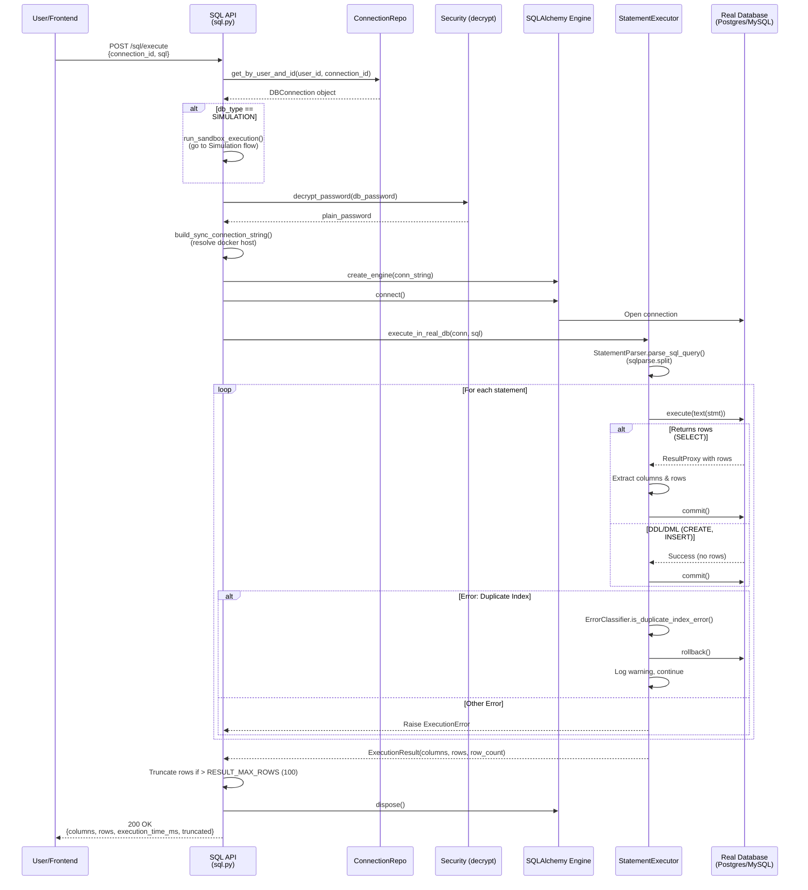
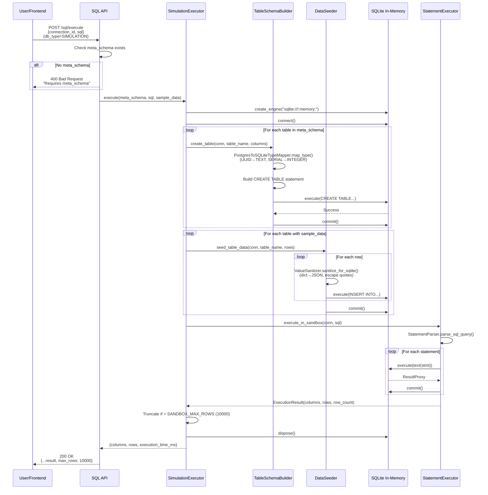

specification_functions/20260206/5_query_execution.md

# Tài liệu Đặc tả: Thực thi Truy vấn (Query Execution)

## 1. Tác động Database (Database Impact)

### Table: `db_connections`
- **Usage:**
  - **Read:** `id`, `user_id`, `db_type`, `host`, `port`, `username`, `db_password`, `db_name` để kết nối DB thật
  - **Read:** `meta_schema` (JSONB) để lấy schema cho Simulation Sandbox
  - `db_type` enum: `'postgres'`, `'mysql'`, `'simulation'`
  - `meta_schema`: Chứa tables structure và sample_data cho simulation

**Lưu ý:** Không tạo cột mới. Chức năng này chỉ đọc dữ liệu từ bảng connections.

---

## 2. Mô phỏng API (API Simulation)

### 2.1. Thực thi SQL Query

**Endpoint:** `POST /api/v1/sql/execute`

**Simulation:**

**Request JSON (Single Statement):**
```json
{
  "connection_id": "550e8400-e29b-41d4-a716-446655440000",
  "sql": "SELECT id, email, created_at FROM users WHERE created_at > '2026-01-01' ORDER BY created_at DESC LIMIT 10"
}
```

**Response JSON (Success - Real Database):**
```json
{
  "columns": ["id", "email", "created_at"],
  "rows": [
    {
      "id": "7a1b2c3d-4e5f-6789-0abc-def123456789",
      "email": "alice@example.com",
      "created_at": "2026-02-05T14:30:00Z"
    },
    {
      "id": "8b2c3d4e-5f67-8901-bcde-f234567890ab",
      "email": "bob@example.com",
      "created_at": "2026-02-04T09:15:00Z"
    }
  ],
  "execution_time_ms": 45.23,
  "row_count": 2,
  "total_rows": 2,
  "truncated": false,
  "max_rows": 100
}
```

---

**Request JSON (Multi-statement - DDL + DML):**
```json
{
  "connection_id": "550e8400-e29b-41d4-a716-446655440000",
  "sql": "CREATE INDEX idx_users_email ON users(email);\nSELECT COUNT(*) as total FROM users;"
}
```

**Response JSON (Multi-statement Success):**
```json
{
  "columns": ["total"],
  "rows": [
    {
      "total": 1250
    }
  ],
  "execution_time_ms": 125.67,
  "row_count": 1,
  "total_rows": 1,
  "truncated": false,
  "max_rows": 100
}
```
*Note: Response chỉ trả về kết quả của statement cuối cùng có `returns_rows`. DDL statements (CREATE INDEX) được execute nhưng không return rows.*

---

**Request JSON (Simulation Sandbox):**
```json
{
  "connection_id": "660f9511-f39c-52e5-b827-557766551111",
  "sql": "SELECT name, price FROM products WHERE price > 100 ORDER BY price DESC"
}
```

**Response JSON (Simulation Success):**
```json
{
  "columns": ["name", "price"],
  "rows": [
    {
      "name": "Product A",
      "price": 299.99
    },
    {
      "name": "Product B",
      "price": 149.99
    }
  ],
  "execution_time_ms": 12.45,
  "row_count": 2,
  "total_rows": 2,
  "truncated": false,
  "max_rows": 10000
}
```
*Note: Simulation sử dụng SQLite in-memory, nhanh hơn real DB nhưng giới hạn `max_rows=10000` (config `SANDBOX_MAX_ROWS`).*

---

**Response JSON (Truncated Result):**
```json
{
  "columns": ["id", "name", "status"],
  "rows": [ "... (100 rows)" ],
  "execution_time_ms": 234.56,
  "row_count": 100,
  "total_rows": 15234,
  "truncated": true,
  "max_rows": 100
}
```
*Note: Real DB limit `max_rows=100` (`RESULT_MAX_ROWS`). Simulation limit 10000.*

---

**Error Response (404 - Connection Not Found):**
```json
{
  "detail": "Connection not found"
}
```

**Error Response (400 - SQL Syntax Error on Real DB):**
```json
{
  "detail": "SQL execution error on postgres database: syntax error at or near \"SELECTT\"\nLINE 1: SELECTT * FROM users;\n        ^"
}
```

**Error Response (400 - No Schema for Simulation):**
```json
{
  "detail": "SIMULATION connection requires meta_schema. Please sync schema first."
}
```

**Error Response (400 - Sandbox Execution Error):**
```json
{
  "detail": "Sandbox execution error: no such table: invalid_table\nTraceback (most recent call last):\n  ..."
}
```

---

## 3. Luồng xử lý Chi tiết (Core Logic Flow)

### 3.1. Luồng Thực thi Query trên Real Database (POST /sql/execute - Real DB)

**Step-by-Step Flow:**

1. **Xác thực và Kiểm tra Connection:**
   - API endpoint nhận `SQLExecuteRequest` (connection_id, sql)
   - Gọi `get_current_user()` để lấy user hiện tại
   - Gọi `connection_repository.get_by_user_and_id(db, user_id, connection_id)`
   - Nếu không tìm thấy → HTTP 404

2. **Phân nhánh theo Database Type:**
   - Kiểm tra `connection.db_type`:
     - Nếu `DBType.SIMULATION` → Chuyển sang luồng 3.2 (Simulation Sandbox)
     - Nếu `DBType.POSTGRES` hoặc `DBType.MYSQL` → Tiếp tục

3. **Xây dựng Connection String:**
   - Gọi `decrypt_password(connection.db_password)` để lấy plain password
   - Gọi `build_sync_connection_string(connection)`:
     - Resolve docker host: Nếu `host in LOCALHOSTS` → `'host.docker.internal'`
     - PostgreSQL: `postgresql://{username}:{password}@{host}:{port}/{db_name}`
     - MySQL: `mysql+pymysql://{username}:{password}@{host}:{port}/{db_name}`

4. **Tạo Database Engine:**
   - Gọi `create_engine(conn_string)` với options:
     - `pool_pre_ping=True` (validate connections)
     - `pool_recycle=3600` (recycle after 1 hour)
   - Nếu thất bại (invalid credentials, network error):
     - Log error với traceback
     - Trả về HTTP 500: "Failed to connect to {db_type} database: {error}"

5. **Thực thi Query:**
   - Start timer: `start_time = time.time()`
   - Open connection: `with engine.connect() as conn:`
   - Gọi `simulation_executor.execute_in_real_db(conn, sql)`:
     - Tạo `StatementExecutor` với `log_prefix="REAL_DB"`
     - Gọi `execute_statements(conn, sql_query)`

6. **Parse Multi-statements:**
   - Gọi `StatementParser.parse_sql_query(sql_query)`:
     - Sử dụng `sqlparse.split(sql_query)` để tách statements
     - Remove empty statements và trailing semicolons
     - Nếu không có statements hợp lệ → Raise `ValidationError("No valid SQL statements found")`
     - Return list of statements

7. **Execute từng Statement:**
   - Loop qua từng statement:
     - Log: `"[REAL_DB] Executing statement {i+1}: {stmt[:100]}..."`
     - Gọi `conn.execute(text(stmt))`
     - Nếu `result.returns_rows`:
       - Extract columns: `list(result.keys())`
       - Extract rows: `[dict(row._mapping) for row in result.fetchall()]`
       - Commit: `conn.commit()`
       - Lưu columns và rows cho response
     - Nếu không return rows (DDL/DML):
       - Commit: `conn.commit()`
       - Log: "Statement {i} executed (no rows)"
   - **Error Handling:**
     - Nếu gặp lỗi:
       - Check `ErrorClassifier.is_duplicate_index_error()`:
         - Pattern: "Duplicate key name", "already exists", "CREATE INDEX" in statement
         - Nếu đúng → Rollback, log warning, skip statement (return `True`)
       - Nếu không phải duplicate index:
         - Raise `ExecutionError(f"Statement {i} failed: {error}")`

8. **Post-processing Results:**
   - Lấy kết quả từ statement cuối cùng có `returns_rows`
   - Convert `ExecutionResult` thành dict:
     - `columns`: List[str]
     - `rows`: List[Dict]
     - `row_count`: int
   - Truncate results nếu vượt limit:
     - `total_rows = len(all_rows)`
     - `rows = all_rows[:settings.RESULT_MAX_ROWS]` (default 100)
     - `truncated = total_rows > RESULT_MAX_ROWS`

9. **Cleanup và Trả về:**
   - Calculate execution time: `(time.time() - start_time) * 1000` (ms)
   - Dispose engine: `engine.dispose()`
   - Log: "Success! Total rows: {total}, Returned: {count}, Truncated: {truncated}, in {time}ms"
   - Return `SQLExecuteResponse`:
     ```python
     {
       "columns": columns,
       "rows": rows,
       "execution_time_ms": execution_time_ms,
       "row_count": len(rows),
       "total_rows": total_rows,
       "truncated": truncated,
       "max_rows": RESULT_MAX_ROWS
     }
     ```

**Sequence Diagram (Real Database):**



---

### 3.2. Luồng Thực thi Query trên Simulation Sandbox (SQLite In-Memory)

**Step-by-Step Flow:**

1. **Validate Meta Schema:**
   - Kiểm tra `connection.meta_schema` tồn tại
   - Nếu `null` hoặc empty → HTTP 400: "SIMULATION connection requires meta_schema. Please sync schema first."
   - Log số lượng tables: `len(meta_schema.get('tables', []))`

2. **Tạo SQLite In-Memory Database:**
   - Gọi `simulation_executor.execute(meta_schema, sql, sample_data)`:
     - Tạo engine: `create_engine("sqlite:///:memory:")`
     - Config: `check_same_thread=False`, `echo=False`

3. **Hydrate Schema (Create Tables):**
   - Lấy danh sách tables từ `meta_schema.get("tables", [])`
   - Log: "Creating {count} tables in sandbox"
   - Với mỗi table:
     - Gọi `TableSchemaBuilder.create_table(conn, table_name, columns)`:
       - **Build Column Definitions:**
         - Loop qua `columns[]`:
           - Get `name`, `type` (PostgreSQL type), `is_nullable`, `is_pk`
           - Gọi `PostgresToSQLiteTypeMapper.map_type(pg_type)`:
             - UUID/JSONB/TIMESTAMP → `"TEXT"`
             - SERIAL/BIGSERIAL/BOOLEAN → `"INTEGER"`
             - INT/BIGINT/SMALLINT → `"INTEGER"`
             - FLOAT/DOUBLE/NUMERIC → `"REAL"`
             - VARCHAR/CHAR → giữ nguyên
           - Build col_def: `"{name}" {sqlite_type}"`
           - Nếu `not nullable` → Add `" NOT NULL"`
           - Nếu `is_pk` → Lưu vào list `primary_keys[]`
       - **Add Primary Key Constraint:**
         - Nếu có `primary_keys` → Add `PRIMARY KEY ({col1, col2, ...})`
       - **Execute CREATE TABLE:**
         - SQL: `CREATE TABLE "{table_name}" (\n  {col_defs}\n);`
         - `conn.execute(text(create_stmt))`
         - `conn.commit()`

4. **Hydrate Data (Seed Sample Data):**
   - Với mỗi table:
     - Lấy `sample_data = table.get("sample_data", [])`
     - Nếu không có → Try `sample_data.get(table_name, [])`
     - Nếu vẫn không có → Skip (log: "No sample data for '{table}'")
   - Gọi `DataSeeder.seed_table_data(conn, table_name, columns, rows)`:
     - Build type map: `{col_name: sqlite_type}`
     - Với mỗi row:
       - **Sanitize values:**
         - Gọi `ValueSanitizer.sanitize_for_sqlite(value, data_type)`:
           - `None` → `"NULL"`
           - `TEXT` type:
             - dict/list → `json.dumps(value).replace("'", "''")`
             - string → Escape single quotes: `value.replace("'", "''")`
           - `INTEGER/REAL` type:
             - bool → `"1"` or `"0"`
             - numeric → `str(value)`
       - Build INSERT statement:
         - SQL: `INSERT INTO "{table}" ({cols}) VALUES ({vals});`
         - Execute: `conn.execute(text(insert_stmt))`
     - Commit: `conn.commit()`
     - Log: "Seeded {count} rows into '{table}'"

5. **Execute User Query:**
   - Gọi `execute_in_sandbox(conn, sql_query)`:
     - Tương tự như Real DB (step 6-7 ở luồng 3.1)
     - Parse multi-statements bằng `sqlparse.split()`
     - Execute từng statement
     - Return `ExecutionResult(columns, rows, row_count)`

6. **Post-processing và Response:**
   - Truncate nếu vượt `SANDBOX_MAX_ROWS` (10000):
     - `rows = result['rows'][:10000]`
     - `truncated = total_rows > 10000`
   - Calculate execution time (bao gồm cả create tables + seed data)
   - Dispose engine: `engine.dispose()`
   - Return `SQLExecuteResponse` với `max_rows=10000`

**Sequence Diagram (Simulation Sandbox):**



---

### 3.3. Luồng Multi-statement Execution

**Step-by-Step Flow:**

1. **Statement Parsing:**
   - User input: `"CREATE INDEX idx_users_email ON users(email);\nSELECT COUNT(*) FROM users;"`
   - Gọi `sqlparse.split(sql_query)`:
     - Split by semicolons
     - Remove empty strings và trailing semicolons
     - Result: `["CREATE INDEX idx_users_email ON users(email)", "SELECT COUNT(*) FROM users"]`

2. **Sequential Execution:**
   - Statement 1: `CREATE INDEX...`
     - Execute: `conn.execute(text(stmt))`
     - Check `result.returns_rows` → `False`
     - Commit: `conn.commit()`
     - Log: "Statement 1 executed (no rows)"
     - **Không lưu kết quả** (vì không return rows)
   - Statement 2: `SELECT COUNT(*)...`
     - Execute: `conn.execute(text(stmt))`
     - Check `result.returns_rows` → `True`
     - Extract columns: `["count"]`
     - Extract rows: `[{"count": 1250}]`
     - Commit: `conn.commit()`
     - **Lưu kết quả** (overwrite biến `final_columns`, `final_rows`)

3. **Return Last Result:**
   - Response chỉ chứa kết quả của statement cuối cùng có `returns_rows`
   - Nếu không có statement nào return rows → Response có `columns=[]`, `rows=[]`

4. **Error Handling cho Multi-statements:**
   - Nếu statement 1 thất bại:
     - Nếu là duplicate index error → Skip, continue với statement 2
     - Nếu là error khác → Fail ngay, rollback, không execute statement 2
   - Nếu statement 2 thất bại → Fail và return error (statement 1 đã commit)

**Use Cases:**
- **Index creation + Query:** `CREATE INDEX...; SELECT...` → Test index impact
- **Data manipulation + Verification:** `INSERT INTO...; SELECT COUNT(*)...`
- **Schema migration:** `ALTER TABLE...; CREATE INDEX...; SELECT...`

---

## 4. Tương tác Frontend (Frontend Flow)

### 4.1. Trigger Execution từ SQL Block

**Trigger:**
- User click nút "Run" trên `SQLBlock` component
- Hoặc user click "Execute" button trên `ChatArea` action bar

**Data Handling:**

1. **Component `SQLBlock` hoặc `ChatArea`:**
   - Callback: `onExecute(sql)` được gọi với SQL string
   - SQL string đã được extracted từ markdown code block: `` ```sql...``` ``

2. **Hook `useEditorLogic`:**
   - Nhận `handleExecute(sql)` callback
   - Gọi `executeSqlMutation.mutate(sql)`:
     - **Mutation Function:**
       - API call: `sqlService.execute({connection_id, sql})`
       - POST `/api/v1/sql/execute`
     - **onSuccess:**
       - Tạo `QueryResult` object:
         ```typescript
         {
           sql: string,
           data: SQLExecuteResponse,
           timestamp: Date.now()
         }
         ```
       - Update state: `setQueryResults(prev => new Map(prev).set(sql, result))`
       - Frontend lưu kết quả trong Map với key là SQL string
     - **onError:**
       - Display error message (toast/alert)
       - Log error details

3. **Component `ResultsGrid` (hiển thị kết quả):**
   - Nhận `queryResults` state từ hook
   - Render data grid với:
     - **Headers:** `result.data.columns` (array of column names)
     - **Rows:** `result.data.rows` (array of objects)
   - Display metadata:
     - Execution time: `{execution_time_ms}ms`
     - Row count: `Showing {row_count} of {total_rows} rows`
     - Truncation warning: Nếu `truncated == true` → "Result set was truncated to {max_rows} rows"

**User Flow:**
```
User clicks "Run" → Call executeSqlMutation → POST /execute → Receive response → Store in Map → Render ResultsGrid
```

---

### 4.2. Loading States

**Trigger:**
- `executeSqlMutation.isPending == true` trong khi API call đang chờ

**Data Handling:**

1. **Hook `useEditorLogic`:**
   - Export state: `isExecuting: executeSqlMutation.isPending`

2. **Component `SQLBlock`:**
   - Disable "Run" button:
     - `disabled={isExecuting}`
   - Show loading spinner:
     - `{isExecuting ? <Loader2 className="animate-spin" /> : <Play />}`

3. **Component `ResultsGrid`:**
   - Show skeleton loader hoặc "Executing query..." message
   - Placeholder rows với shimmer effect

**User Flow:**
```
Click Run → Button shows spinner → Disable all action buttons → Results area shows "Executing..." → Response received → Hide spinner → Show results
```

---

### 4.3. Error Handling

**Trigger:**
- Backend trả về HTTP error (400/404/500)

**Data Handling:**

1. **Axios Interceptor (error handling):**
   - Catch error response
   - Extract `error.response.data.detail`

2. **Hook `useEditorLogic`:**
   - `executeSqlMutation.onError(error)`:
     - Parse error message
     - Display toast notification:
       - Title: "Query Execution Failed"
       - Message: `error.detail` (SQL syntax error, connection error, etc.)
       - Type: "error" (red color)

3. **Component UI:**
   - Show error banner below SQL block:
     - Red background
     - Error icon
     - Error message với monospace font (cho syntax errors)
     - "Retry" button → Re-execute same SQL

**User Flow:**
```
Execute fails → Toast notification appears → Error banner shows in results area → User can click "Retry" or edit SQL
```

---

### 4.4. Truncation Warning

**Trigger:**
- Response có `truncated: true`

**Data Handling:**

1. **Component `ResultsGrid`:**
   - Check `result.data.truncated`
   - Nếu `true`:
     - Display warning banner phía trên data grid:
       - Yellow/orange background
       - Warning icon
       - Message: "Result set truncated. Showing {row_count} of {total_rows} rows (limit: {max_rows})"
       - Suggestion: "Add LIMIT clause or filter conditions to reduce result size"

2. **Tooltip on column headers:**
   - Hover hint: "Full result has {total_rows} rows. Consider adding WHERE filters."

**User Flow:**
```
Large result set → Backend truncates → Frontend receives truncated:true → Display warning banner → User can add LIMIT/WHERE to query
```

---

### 4.5. Real DB vs Simulation Indicator

**Trigger:**
- User switch giữa các workspaces khác nhau (real DB vs simulation)

**Data Handling:**

1. **Hook `useWorkspace`:**
   - Fetch workspace details: `{db_type: 'postgres' | 'mysql' | 'simulation'}`

2. **Component Header/Badge:**
   - Display indicator:
     - **Real DB:** Badge màu xanh "PostgreSQL / MySQL" + icon database
     - **Simulation:** Badge màu cam "Simulation Mode" + icon beaker
   - Khác biệt limits:
     - Real: "Max 100 rows per query"
     - Simulation: "Max 10,000 rows per query"

3. **Behavior Differences:**
   - Real DB:
     - Execution time thường > 50ms (network + DB latency)
     - Có thể timeout nếu query phức tạp
   - Simulation:
     - Execution time thường < 50ms (in-memory)
     - Luôn available (không cần network)
     - Nhưng data là mock/sample data

**User Flow:**
```
Switch workspace → Fetch workspace details → Display db_type badge → User awareness of execution mode
```

---

### 4.6. Multi-statement Feedback

**Trigger:**
- User execute multi-statement SQL

**Data Handling:**

1. **Frontend Detection (optional):**
   - Parse SQL input để detect semicolons
   - Count statements: `sql.split(';').filter(s => s.trim()).length`
   - Display hint: "Executing {count} statements..."

2. **Backend Processing:**
   - Execute tất cả statements
   - Chỉ return kết quả của statement cuối cùng có rows

3. **Frontend Display:**
   - Show result từ statement cuối
   - Display info message:
     - "Executed {count} statements. Showing result of final SELECT query."
   - Nếu không có SELECT → `rows: []`
     - Message: "Statements executed successfully. No rows returned."

**User Flow:**
```
User pastes multi-statement SQL → Execute → Backend runs all → Frontend shows last result + info message about execution
```

---

## 5. End-to-End Flow Diagram

```mermaid
graph TB
    subgraph "Frontend"
        UI[User clicks Run Button<br/>SQLBlock Component]
        UEL[useEditorLogic Hook]
        RG[ResultsGrid Component]
        ERR[Error Toast/Banner]
    end
    
    subgraph "Backend API"
        A[POST /sql/execute]
        DEC{db_type?}
    end
    
    subgraph "Real DB Flow"
        SEC[decrypt_password]
        BUILD[build_connection_string]
        ENG[SQLAlchemy Engine]
        PARSE1[StatementParser<br/>sqlparse.split]
        EXEC1[StatementExecutor<br/>execute_statements]
        RDB[(Real Database<br/>Postgres/MySQL)]
    end
    
    subgraph "Simulation Flow"
        SE[SimulationExecutor]
        LITE[SQLite In-Memory<br/>create_engine]
        TSB[TableSchemaBuilder<br/>CREATE TABLE]
        DS[DataSeeder<br/>INSERT rows]
        PARSE2[StatementParser]
        EXEC2[StatementExecutor<br/>execute_in_sandbox]
    end
    
    subgraph "Database"
        CONN[(db_connections table)]
    end
    
    UI -->|1. onExecute(sql)| UEL
    UEL -->|2. POST request| A
    
    A -->|3. Read connection| CONN
    CONN -->|4. Return db_type, meta_schema| A
    
    A --> DEC
    
    DEC -->|Real DB| SEC
    SEC --> BUILD
    BUILD --> ENG
    ENG -->|5. connect()| RDB
    ENG --> PARSE1
    PARSE1 --> EXEC1
    
    EXEC1 -->|6. Loop statements| RDB
    RDB -->|7. ResultProxy| EXEC1
    EXEC1 -->|8. Commit each| RDB
    
    EXEC1 -->|9. ExecutionResult| A
    
    DEC -->|Simulation| SE
    SE --> LITE
    LITE --> TSB
    TSB -->|10. CREATE TABLE| LITE
    LITE --> DS
    DS -->|11. INSERT rows| LITE
    LITE --> PARSE2
    PARSE2 --> EXEC2
    EXEC2 -->|12. Execute SQL| LITE
    LITE -->|13. ResultProxy| EXEC2
    EXEC2 -->|14. ExecutionResult| SE
    SE -->|15. Return| A
    
    A -->|16. Truncate if needed<br/>max_rows limit| A
    A -->|17. Response JSON| UEL
    
    UEL -->|18. Store in Map| UEL
    UEL -->|19. Update state| RG
    
    RG -->|20. Render data grid| UI
    
    A -.->|Error| ERR
    ERR -.->|21. Show toast| UI
    
    style DEC fill:#fff4e1
    style RDB fill:#e1f5ff
    style LITE fill:#e8f5e9
    style RG fill:#f0f0f0
    style A fill:#ffe6cc
```

---

## Tóm tắt

### Core Functions:

1. **StatementParser:**
   - `parse_sql_query(sql)`: Split multi-statements bằng `sqlparse.split()`, remove empty strings

2. **StatementExecutor:**
   - `execute_statements(conn, sql)`: Execute multi-statements tuần tự, commit từng statement, return kết quả cuối cùng
   - `_handle_execution_error()`: Detect duplicate index errors → skip, continue

3. **TableSchemaBuilder (Simulation):**
   - `create_table(conn, table_name, columns)`: Generate CREATE TABLE statement
   - `PostgresToSQLiteTypeMapper.map_type()`: Convert PostgreSQL types → SQLite types (UUID→TEXT, SERIAL→INTEGER)

4. **DataSeeder (Simulation):**
   - `seed_table_data(conn, table_name, rows)`: Insert sample data vào SQLite
   - `ValueSanitizer.sanitize_for_sqlite()`: Escape quotes, convert dict→JSON, bool→0/1

5. **SimulationExecutor:**
   - `execute(meta_schema, sql, sample_data)`: Orchestrate toàn bộ simulation flow (create engine → create tables → seed data → execute SQL)
   - `execute_in_sandbox()`: Execute SQL trong SQLite in-memory
   - `execute_in_real_db()`: Execute SQL trên real database

6. **API Endpoint:**
   - `POST /sql/execute`: Điều phối luồng real DB vs simulation, handle errors, truncate results

7. **Frontend Hooks:**
   - `useEditorLogic()`: Manage execution state, store results in Map
   - `executeSqlMutation`: React Query mutation cho SQL execution

8. **Frontend Components:**
   - `SQLBlock`: Display SQL code với Run button
   - `ResultsGrid`: Render data grid với columns/rows, hiển thị metadata (execution time, row count, truncation warning)

### Key Features:

- **Multi-statement Support:** Sử dụng `sqlparse.split()` để tách statements, execute tuần tự, return kết quả cuối cùng
- **Real Database Execution:** Connect qua SQLAlchemy Engine, support PostgreSQL/MySQL với docker host resolution
- **Simulation Sandbox:** SQLite in-memory với type mapping (PostgreSQL→SQLite), seed sample data từ meta_schema
- **Error Recovery:** Detect duplicate index errors → skip và continue
- **Result Truncation:** Real DB limit 100 rows, Simulation limit 10,000 rows để prevent memory issues
- **Frontend State Management:** Store results trong Map với SQL string làm key, enable multiple query results tracking
- **Loading States:** Disable buttons, show spinners during execution
- **Error Display:** Toast notifications + inline error banners với syntax highlighting
