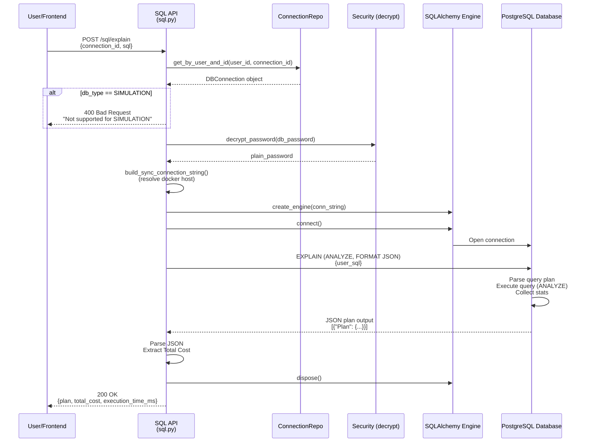
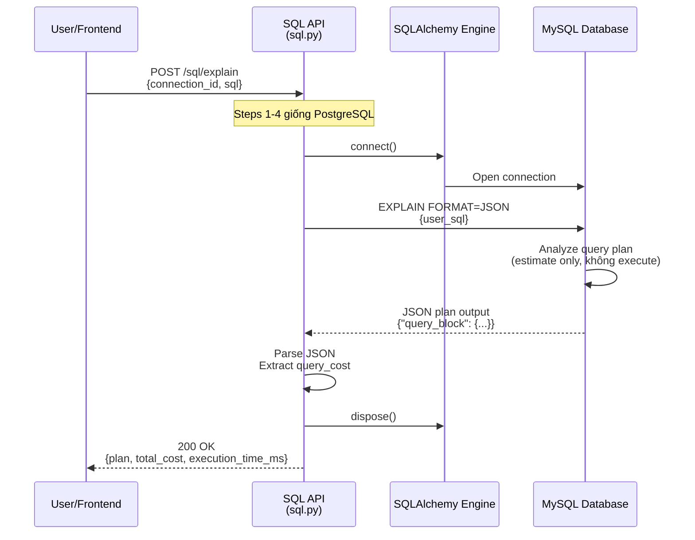
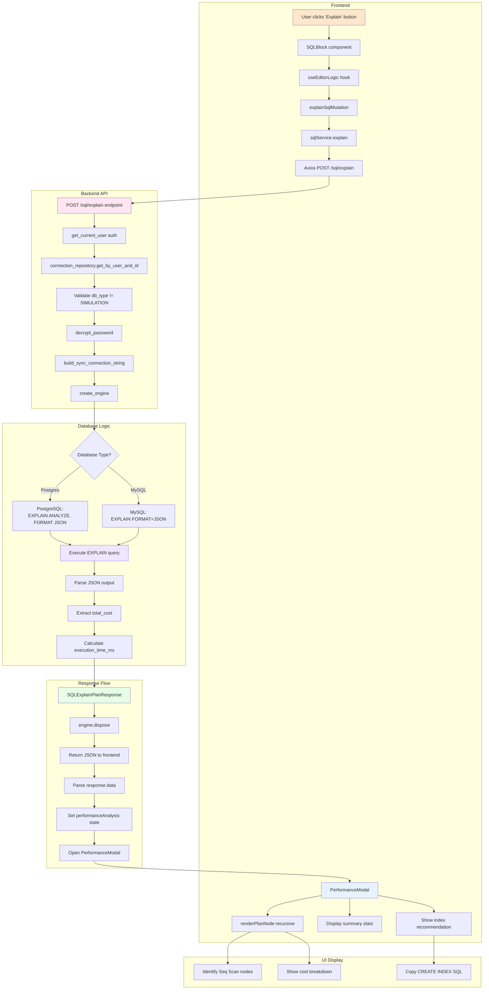

specification_functions/20260206/6_explain_plan.md

# Tài liệu Đặc tả: Giải thích Truy vấn (Explain Plan)

## 1. Tác động Database (Database Impact)

### Table: `db_connections`
- **Usage:**
  - **Read:** `id`, `user_id`, `db_type`, `host`, `port`, `username`, `db_password`, `db_name` để kết nối DB thật và thực thi lệnh EXPLAIN
  - `db_type` enum: `'postgres'`, `'mysql'` (không hỗ trợ `'simulation'`)

### Table: `query_logs` (optional, nếu lưu lịch sử)
- **Usage:**
  - **Write:** Có thể lưu kết quả EXPLAIN vào `explain_plan` (JSONB) để tra cứu sau

**Lưu ý:** Chức năng này không tạo cột mới. Chỉ đọc thông tin kết nối và thực thi EXPLAIN trực tiếp xuống DB.

---

## 2. Mô phỏng API (API Simulation)

### 2.1. Explain Plan Analysis

**Endpoint:** `POST /api/v1/sql/explain`

**Simulation:**

**Request JSON (PostgreSQL):**
```json
{
  "connection_id": "550e8400-e29b-41d4-a716-446655440000",
  "sql": "SELECT u.id, u.email, o.total FROM users u JOIN orders o ON u.id = o.user_id WHERE o.created_at > '2026-01-01' ORDER BY o.total DESC LIMIT 100"
}
```

**Response JSON (Success - PostgreSQL):**
```json
{
  "plan": [
    {
      "Plan": {
        "Node Type": "Limit",
        "Startup Cost": 1245.67,
        "Total Cost": 1345.89,
        "Plan Rows": 100,
        "Plan Width": 256,
        "Actual Time": 12.345,
        "Actual Rows": 100,
        "Actual Loops": 1,
        "Plans": [
          {
            "Node Type": "Sort",
            "Startup Cost": 1200.00,
            "Total Cost": 1300.00,
            "Plan Rows": 5000,
            "Plan Width": 256,
            "Sort Key": ["o.total DESC"],
            "Plans": [
              {
                "Node Type": "Hash Join",
                "Startup Cost": 500.00,
                "Total Cost": 1100.00,
                "Plan Rows": 5000,
                "Plan Width": 256,
                "Hash Cond": "(o.user_id = u.id)",
                "Plans": [
                  {
                    "Node Type": "Seq Scan",
                    "Relation Name": "orders",
                    "Startup Cost": 0.00,
                    "Total Cost": 450.00,
                    "Plan Rows": 5000,
                    "Plan Width": 128,
                    "Filter": "(created_at > '2026-01-01'::date)"
                  },
                  {
                    "Node Type": "Hash",
                    "Startup Cost": 300.00,
                    "Total Cost": 300.00,
                    "Plan Rows": 10000,
                    "Plan Width": 128,
                    "Plans": [
                      {
                        "Node Type": "Seq Scan",
                        "Relation Name": "users",
                        "Startup Cost": 0.00,
                        "Total Cost": 250.00,
                        "Plan Rows": 10000,
                        "Plan Width": 128
                      }
                    ]
                  }
                ]
              }
            ]
          }
        ]
      }
    }
  ],
  "total_cost": 1345.89,
  "execution_time_ms": 125.45
}
```

**Note:** 
- `plan`: PostgreSQL EXPLAIN output in JSON format (nested structure)
- `total_cost`: Chi phí tổng (Cost Units) - extracted từ `Plan.Total Cost`
- `execution_time_ms`: Thời gian thực thi lệnh EXPLAIN (không phải execution time của query gốc, trừ khi dùng EXPLAIN ANALYZE)

---

**Request JSON (MySQL):**
```json
{
  "connection_id": "660f9511-f39c-52e5-b827-557766551111",
  "sql": "SELECT product_name, price FROM products WHERE category = 'Electronics' ORDER BY price DESC"
}
```

**Response JSON (Success - MySQL):**
```json
{
  "plan": {
    "query_block": {
      "select_id": 1,
      "cost_info": {
        "query_cost": "245.67"
      },
      "ordering_operation": {
        "using_filesort": true,
        "table": {
          "table_name": "products",
          "access_type": "ALL",
          "rows_examined_per_scan": 1500,
          "rows_produced_per_join": 300,
          "filtered": "20.00",
          "cost_info": {
            "read_cost": "200.50",
            "eval_cost": "30.00",
            "prefix_cost": "245.67",
            "data_read_per_join": "24K"
          },
          "used_columns": [
            "product_name",
            "price",
            "category"
          ],
          "attached_condition": "(`products`.`category` = 'Electronics')"
        }
      }
    }
  },
  "total_cost": 245.67,
  "execution_time_ms": 45.23
}
```

**Note:**
- MySQL EXPLAIN format khác PostgreSQL: nested `query_block` structure
- `total_cost` extracted từ `query_block.cost_info.query_cost`
- `access_type: "ALL"` = Seq Scan (không dùng index)

---

**Error Response (404 - Connection Not Found):**
```json
{
  "detail": "Connection not found"
}
```

**Error Response (400 - SIMULATION Not Supported):**
```json
{
  "detail": "EXPLAIN analysis is not supported for SIMULATION connections. Use this feature with real PostgreSQL/MySQL databases."
}
```

**Error Response (400 - SQL Syntax Error):**
```json
{
  "detail": "EXPLAIN error: syntax error at or near \"SELECTT\"\nLINE 1: SELECTT * FROM users;\n        ^"
}
```

**Error Response (500 - Connection Failed):**
```json
{
  "detail": "Failed to create database connection: FATAL: password authentication failed for user \"admin\""
}
```

---

## 3. Luồng xử lý Chi tiết (Core Logic Flow)

### 3.1. Luồng EXPLAIN cho PostgreSQL

**Step-by-Step Flow:**

1. **Xác thực và Kiểm tra Connection:**
   - API endpoint nhận `SQLExplainPlanRequest` (connection_id, sql)
   - Gọi `get_current_user()` để lấy user hiện tại
   - Gọi `connection_repository.get_by_user_and_id(db, user_id, connection_id)`
   - Nếu không tìm thấy → HTTP 404

2. **Validate Database Type:**
   - Kiểm tra `connection.db_type`:
     - Nếu `DBType.SIMULATION` → Trả về HTTP 400: "EXPLAIN analysis is not supported for SIMULATION connections"
     - Nếu `DBType.POSTGRES` hoặc `DBType.MYSQL` → Tiếp tục

3. **Xây dựng Connection String:**
   - Gọi `build_sync_connection_string(connection)`:
     - Decrypt password: `decrypt_password(connection.db_password)`
     - Resolve docker host (nếu localhost → `host.docker.internal`)
     - PostgreSQL: `postgresql://{username}:{password}@{host}:{port}/{db_name}`
     - MySQL: `mysql+pymysql://{username}:{password}@{host}:{port}/{db_name}`
   - Nếu thất bại → HTTP 500: "Failed to create database connection"

4. **Tạo Database Engine:**
   - Gọi `create_engine(conn_string, pool_pre_ping=True, pool_recycle=3600)`
   - Config:
     - `pool_pre_ping=True`: Validate connection trước khi sử dụng
     - `pool_recycle=3600`: Recycle connection sau 1 giờ

5. **Thực thi EXPLAIN (PostgreSQL):**
   - Start timer: `start_time = time.time()`
   - Open connection: `with engine.connect() as conn:`
   - Build explain query: `EXPLAIN (ANALYZE, FORMAT JSON) {request.sql}`
     - `ANALYZE`: Thực thi query thật để lấy stats thực tế (Actual Rows, Actual Time)
     - `FORMAT JSON`: Output dạng JSON thay vì plain text
   - Execute: `conn.execute(text(explain_query))`
   - Fetch result: `result_proxy.fetchone()[0]`

6. **Parse JSON Output (PostgreSQL):**
   - Kiểm tra type của output:
     - Nếu `isinstance(explain_output, str)` → Parse: `json.loads(explain_output)`
     - Nếu đã là dict/list → Sử dụng trực tiếp
   - Extract total cost: `plan_data[0]["Plan"]["Total Cost"]`
     - Lấy từ root Plan node
     - Đây là chi phí tổng cho toàn bộ query execution
   - Fallback: Nếu không tìm thấy → `total_cost = 0.0`

7. **Calculate Execution Time:**
   - `execution_time_ms = (time.time() - start_time) * 1000`
   - **Note:** Đây là thời gian chạy lệnh EXPLAIN, không phải thời gian thực thi query gốc (trừ khi dùng EXPLAIN ANALYZE)

8. **Cleanup và Response:**
   - Dispose engine: `engine.dispose()`
   - Return `SQLExplainPlanResponse`:
     ```python
     SQLExplainPlanResponse(
         plan=plan_data,              # Full nested JSON structure
         total_cost=float(total_cost),
         execution_time_ms=execution_time_ms
     )
     ```

**Sequence Diagram (PostgreSQL EXPLAIN):**



---

### 3.2. Luồng EXPLAIN cho MySQL

**Step-by-Step Flow:**

1. **Steps 1-4:** Giống PostgreSQL (Xác thực, Validate, Build connection, Create engine)

2. **Thực thi EXPLAIN (MySQL):**
   - Build explain query: `EXPLAIN FORMAT=JSON {request.sql}`
     - **Note:** MySQL không có option `ANALYZE` trong EXPLAIN JSON
     - EXPLAIN FORMAT=JSON chỉ ước tính (estimate), không chạy query thật
   - Execute: `conn.execute(text(explain_query))`
   - Fetch result: `result_proxy.fetchone()[0]`

3. **Parse JSON Output (MySQL):**
   - Parse string to JSON (nếu cần): `json.loads(explain_output)`
   - Extract total cost:
     ```python
     total_cost = plan_data.get("query_block", {}) \
                           .get("cost_info", {}) \
                           .get("query_cost", 0.0)
     ```
   - Nested path: `plan["query_block"]["cost_info"]["query_cost"]`

4. **Cleanup và Response:** Giống PostgreSQL

**Sequence Diagram (MySQL EXPLAIN):**



---

### 3.3. Xử lý Lỗi (Error Handling)

**Error Flow:**

1. **Connection Not Found:**
   - Repository return `None` → HTTP 404

2. **SIMULATION Connection:**
   - Check `db_type == DBType.SIMULATION` → HTTP 400

3. **Connection Failed:**
   - `create_engine()` fail → HTTP 500
   - Common causes: invalid credentials, network unreachable, DB server down

4. **SQL Syntax Error:**
   - EXPLAIN execution fail → Catch exception
   - Parse error message từ database
   - HTTP 400 với detail: `"EXPLAIN error: {str(e)}"`

5. **Cleanup on Error:**
   - Luôn gọi `engine.dispose()` trong finally block (hoặc check `if engine:`)
   - Prevent connection leak

---

## 4. Tương tác Frontend (Frontend Flow)

### 4.1. Trigger EXPLAIN từ SQL Block

**Trigger:**
- User click nút "Explain" trên `SQLBlock` component
- Hoặc user select "Analyze Performance" từ dropdown menu

**Data Handling:**

1. **Component `SQLBlock`:**
   - Callback: `onExplain(sql)` được gọi với SQL string
   - Disable "Explain" button: `disabled={isExplaining}`

2. **Hook `useEditorLogic`:**
   - Nhận `handleExplain(sql)` callback
   - Gọi `explainSqlMutation.mutateAsync(sql)`:
     ```typescript
     const explainSqlMutation = useMutation({
       mutationFn: (sql: string) =>
         sqlService.explain({
           connection_id: connectionId,
           sql,
         }),
     });
     ```
   - Return promise với `SQLExplainPlanResponse`

3. **Service Layer:**
   - `sqlService.explain()` gọi Axios:
     ```typescript
     async explain(request: SQLExplainPlanRequest): Promise<SQLExplainPlanResponse> {
       const response = await axios.post<SQLExplainPlanResponse>(
         '/sql/explain',
         request
       );
       return response.data;
     }
     ```

4. **State Update:**
   - Mutation success → Store result vào state
   - Example (QueryEditor.tsx):
     ```typescript
     const result = await explainSqlMutation.mutateAsync(sql);
     setPerformanceAnalysis({
       id: 'temp-id',
       query_log_id: 'temp',
       explain_plan: result.plan[0].Plan, // Extract root Plan node
       total_cost: result.total_cost,
       execution_time_ms: result.execution_time_ms,
       // ... other fields
     });
     setIsPerformanceModalOpen(true);
     ```

**User Flow:**
```
User clicks "Explain" → Disable button → Call explainSqlMutation → POST /explain → Response received → Parse plan → Open PerformanceModal
```

---

### 4.2. Hiển thị Explain Plan trong Modal

**Trigger:**
- `isPerformanceModalOpen === true` sau khi nhận response

**Data Handling:**

1. **Component `PerformanceModal`:**
   - Props: `analysis: PerformanceAnalysis`, `isOpen`, `onClose`
   - Render summary stats:
     - **Execution Time:** `{analysis.execution_time_ms}ms`
       - Color-coded: Green (<100ms), Yellow (<1000ms), Red (≥1000ms)
     - **Total Cost:** `{analysis.total_cost.toFixed(2)}`

2. **Recursive Rendering của Plan Tree:**
   - Function: `renderPlanNode(node: ExplainPlanNode, depth: number)`
   - Hiển thị mỗi node với:
     - **Node Type:** `node['Node Type']` (Seq Scan, Index Scan, Hash Join, etc.)
     - **Relation Name:** `node['Relation Name']` (table name, nếu có)
     - **Cost:** `{Startup Cost} .. {Total Cost}`
     - **Rows:** Plan Rows vs Actual Rows (nếu có ANALYZE)
     - **Index Name:** Nếu là Index Scan
   - Visual indicators:
     - **Seq Scan:** Background đỏ + Warning icon (AlertTriangle)
     - **Index Scan:** Background xanh + Check icon (CheckCircle2)
   - Recursive render: `node.Plans.map(child => renderPlanNode(child, depth+1))`
     - Indent bằng `marginLeft: {depth * 20}px`

3. **Index Recommendation (nếu có):**
   - Display `analysis.index_recommendation` trong section riêng
   - Button "Copy SQL" để copy recommendation:
     ```typescript
     const copyIndexSQL = () => {
       navigator.clipboard.writeText(analysis.index_recommendation);
       setCopiedIndex(true);
       setTimeout(() => setCopiedIndex(false), 2000);
     };
     ```

**User Flow:**
```
Modal opens → Display summary (time, cost) → Render plan tree (with color coding) → User sees Seq Scan warnings → User clicks "Copy SQL" for index recommendation
```

---

### 4.3. Loading States

**Trigger:**
- `explainSqlMutation.isPending === true` trong khi API call đang chờ

**Data Handling:**

1. **Hook `useEditorLogic`:**
   - Export state: `isExplaining: explainSqlMutation.isPending`

2. **Component `SQLBlock`:**
   - Disable "Explain" button:
     ```tsx
     <button disabled={isExplaining}>
       {isExplaining ? 'Analyzing...' : 'Explain'}
     </button>
     ```
   - Show spinner icon trong button

3. **Component UI:**
   - Global loading indicator (optional)
   - Prevent multiple concurrent explain requests

**User Flow:**
```
Click Explain → Button shows "Analyzing..." with spinner → Disable all action buttons → Response received → Re-enable buttons → Open modal
```

---

### 4.4. Error Handling

**Trigger:**
- Backend trả về HTTP error (400/404/500)

**Data Handling:**

1. **Hook `useEditorLogic`:**
   - `explainSqlMutation.onError(error)`:
     ```typescript
     onError: (error) => {
       toast.error(`EXPLAIN failed: ${error.response?.data?.detail || error.message}`);
     }
     ```

2. **Component UI:**
   - Show error toast notification:
     - "Connection not found" → User cần chọn lại workspace
     - "EXPLAIN analysis is not supported for SIMULATION" → Explain chỉ hoạt động với real DB
     - "EXPLAIN error: syntax error..." → User cần sửa SQL
     - "Failed to create database connection..." → Connection credentials invalid

3. **State Update:**
   - `explainError: explainSqlMutation.error` để display inline error message (optional)

**User Flow:**
```
Execute fails → Toast notification appears → Error message shows detail → User can fix SQL or check connection → Retry
```

---

### 4.5. Plan Tree Interpretation

**Trigger:**
- User hover hoặc click vào plan nodes trong modal

**Data Handling:**

1. **Node Type Indicators:**
   - **Sequential Scan (Seq Scan):**
     - Red background + `AlertTriangle` icon
     - Warning: "This operation scans entire table. Consider adding index."
   - **Index Scan:**
     - Green background + `CheckCircle2` icon
     - Success: "Using index: {Index Name}"
   - **Hash Join / Nested Loop:**
     - Neutral background
     - Display join condition

2. **Cost Interpretation:**
   - **Startup Cost:** Chi phí khởi tạo (setup overhead)
   - **Total Cost:** Chi phí hoàn thành toàn bộ operation
   - Higher depth nodes (children) thực thi trước parents

3. **Actual vs Estimated (chỉ với EXPLAIN ANALYZE):**
   - **Plan Rows:** Số rows ước tính
   - **Actual Rows:** Số rows thực tế
   - Gap lớn giữa Plan vs Actual → Statistics out-of-date, cần ANALYZE table

**User Flow:**
```
User opens modal → Sees plan tree → Identifies Seq Scan nodes (red) → Reads index recommendation → Copies CREATE INDEX SQL → Applies to database
```

---

### 4.6. Integration với Optimization Flow

**Trigger:**
- User click "Optimize" sau khi xem Explain result

**Data Handling:**

1. **Pass Explain Result to Optimizer:**
   - `handleOptimize(sql)` có thể include explain result:
     ```typescript
     optimizeSqlMutation.mutateAsync({
       connection_id: connectionId,
       sql_query: sql,
       include_explain: true, // Backend sẽ tự chạy EXPLAIN
     });
     ```
   - Backend optimization service dùng `ExplainPlanAnalyzer.get_explain_plan()` để lấy plan
   - Extract bottlenecks từ plan (Seq Scan, missing indexes)

2. **Optimization Result:**
   - Display optimized SQL + index recommendations
   - Compare old cost vs new cost (nếu có)

**User Flow:**
```
User clicks "Explain" → Sees high cost → Clicks "Optimize" → Backend analyzes plan → Returns optimized SQL + indexes → User applies changes
```

---

## 5. End-to-End Flow Diagram



---

## Tóm tắt

### Core Functions:

1. **API Endpoint:**
   - `POST /sql/explain`: Nhận connection_id + sql, trả về explain plan JSON

2. **ExplainPlanAnalyzer (optimization_service.py):**
   - `get_explain_plan(connection, sql_query)`: Orchestrate explain flow cho optimization
   - `_execute_postgres_explain()`: Run `EXPLAIN (ANALYZE, FORMAT JSON)`
   - `_execute_mysql_explain()`: Run `EXPLAIN FORMAT=JSON`
   - `extract_bottlenecks()`: Parse plan để tìm Seq Scan, missing indexes

3. **Connection Utilities:**
   - `build_sync_connection_string()`: Decrypt password, resolve docker host, build connection string
   - `ConnectionStringBuilder.resolve_docker_host()`: Map localhost → host.docker.internal
   - `create_engine()`: Tạo SQLAlchemy engine với pooling config

4. **Frontend Hooks:**
   - `useEditorLogic()`: Manage explain state với `explainSqlMutation`
   - `sqlService.explain()`: Axios wrapper cho API call

5. **Frontend Components:**
   - `PerformanceModal`: Hiển thị explain plan tree, summary stats, index recommendations
   - `renderPlanNode()`: Recursive rendering với color-coding (red = Seq Scan, green = Index Scan)

### Key Features:

- **Database Support:** PostgreSQL (EXPLAIN ANALYZE) vs MySQL (EXPLAIN FORMAT=JSON estimate)
- **Real DB Only:** Không hỗ trợ SIMULATION connections
- **JSON Output:** Structured plan tree với nested Plans array
- **Cost Extraction:** 
  - PostgreSQL: `plan[0]["Plan"]["Total Cost"]`
  - MySQL: `plan["query_block"]["cost_info"]["query_cost"]`
- **Visual Feedback:** Color-coded plan nodes (Seq Scan warnings, Index Scan success indicators)
- **Index Recommendations:** Display CREATE INDEX SQL với copy button
- **Error Handling:** Connection errors, SQL syntax errors, SIMULATION rejection
- **Performance Metrics:** Execution time, total cost, actual vs estimated rows (với ANALYZE)
- **Integration:** Explain result dùng làm input cho AI Optimization flow
