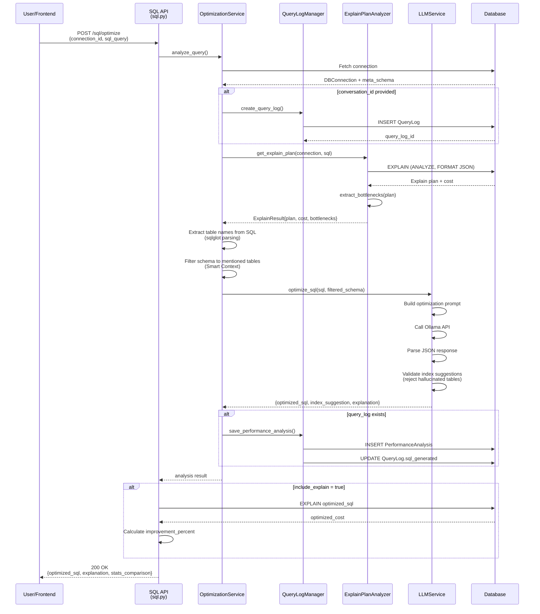
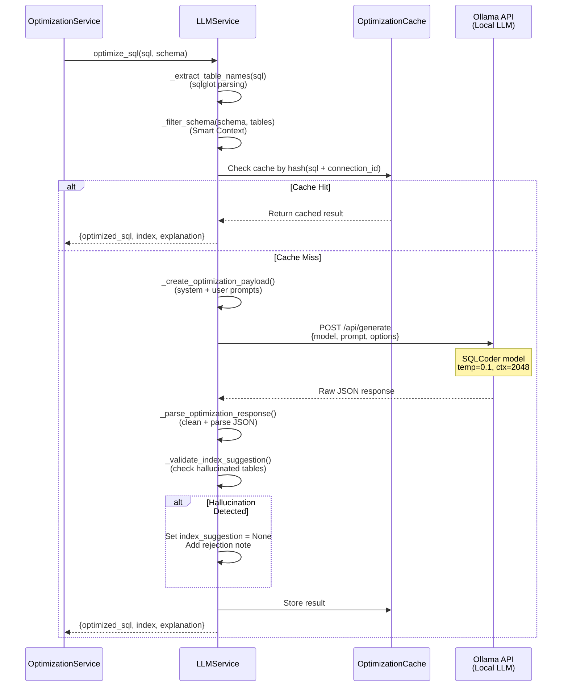
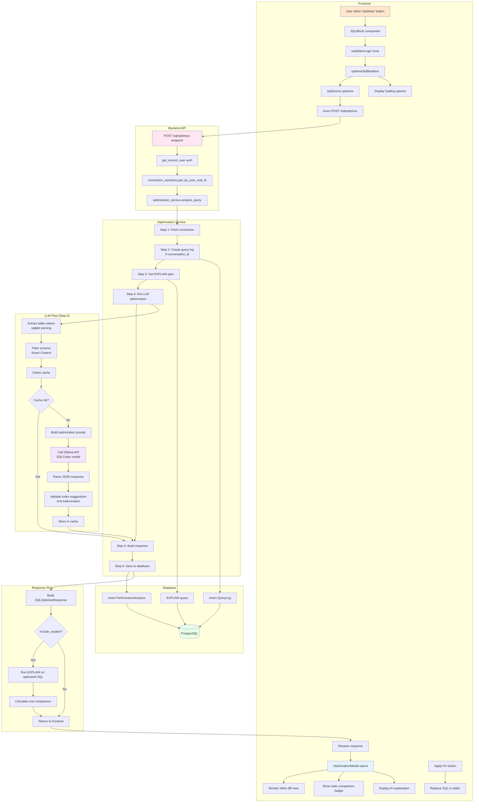

specification_functions/20260206/7_ai_query_optimizer.md

# Tài liệu Đặc tả: Tối ưu Truy vấn bằng AI (AI Query Optimizer)

## 1. Tác động Database (Database Impact)

### Table: `db_connections`
- **Usage:**
  - **Read:** `id`, `user_id`, `db_type`, `host`, `port`, `username`, `db_password`, `db_name` để kết nối DB và chạy EXPLAIN
  - **Read:** `meta_schema` (JSONB) để lấy schema information cho AI context
  - Schema được filter để chỉ gửi các bảng liên quan đến query (Smart Context)

### Table: `conversations`
- **Usage:**
  - **Read:** `id` để validate conversation tồn tại (nếu `conversation_id` được gửi)
  - Link optimization với conversation context

### Table: `query_logs`
- **Usage:**
  - **Write:** Tạo mới `QueryLog` với:
    - `conversation_id`: Link với conversation
    - `role`: "assistant"
    - `action_type`: "optimize"
    - `content`: Original SQL query
    - `sql_generated`: Optimized SQL (update sau khi có kết quả)

### Table: `performance_analysis`
- **Usage:**
  - **Write:** Tạo mới `PerformanceAnalysis` với:
    - `query_log_id`: Link với query log
    - `total_cost`: Original query cost từ EXPLAIN
    - `explain_plan`: EXPLAIN output (JSONB)
    - `index_recommendation`: CREATE INDEX statements từ AI

**Lưu ý:** Chức năng này không tạo cột mới, chỉ ghi dữ liệu vào các bảng hiện có.

---

## 2. Mô phỏng API (API Simulation)

### 2.1. Optimize SQL Query

**Endpoint:** `POST /api/v1/sql/optimize`

**Simulation:**

**Request JSON (Với Conversation ID):**
```json
{
  "connection_id": "550e8400-e29b-41d4-a716-446655440000",
  "sql_query": "SELECT u.id, u.email, o.total FROM users u JOIN orders o ON u.id = o.user_id WHERE o.status = 'pending' ORDER BY o.created_at DESC",
  "include_explain": true,
  "conversation_id": "770g9622-g50d-63f6-c938-668877662222"
}
```

**Response JSON (Success - With Cost Comparison):**
```json
{
  "original_sql": "SELECT u.id, u.email, o.total FROM users u JOIN orders o ON u.id = o.user_id WHERE o.status = 'pending' ORDER BY o.created_at DESC",
  "optimized_sql": "SELECT u.id, u.email, o.total\nFROM users u\nINNER JOIN orders o ON u.id = o.user_id\nWHERE o.status = 'pending'\nORDER BY o.created_at DESC",
  "explanation": "The query uses a sequential scan on the 'orders' table because the 'status' column is not indexed. Adding an index on 'status' will significantly improve performance when filtering by order status.\n\nDetected Performance Bottlenecks:\n• Sequential Scan on 'orders' (no index used)",
  "index_recommendation": "CREATE INDEX idx_orders_status ON orders (status);\nCREATE INDEX idx_orders_created_at ON orders (created_at);",
  "stats_comparison": {
    "old_cost": 1245.67,
    "new_cost": 45.23,
    "improvement_percent": 96.37
  },
  "query_log_id": "880h0733-h61e-74g7-d049-779988773333"
}
```

**Note:**
- `stats_comparison`: Chỉ có khi `include_explain=true` và cả 2 queries đều chạy EXPLAIN thành công
- `improvement_percent`: Positive = better (cost giảm), Negative = worse (cost tăng)
- `query_log_id`: UUID của query log record (nếu có conversation_id)

---

**Request JSON (Without Conversation - Standalone Optimization):**
```json
{
  "connection_id": "550e8400-e29b-41d4-a716-446655440000",
  "sql_query": "SELECT * FROM products WHERE category = 'Electronics' AND price > 500",
  "include_explain": true
}
```

**Response JSON (Success - No Query Log):**
```json
{
  "original_sql": "SELECT * FROM products WHERE category = 'Electronics' AND price > 500",
  "optimized_sql": "SELECT * FROM products WHERE category = 'Electronics' AND price > 500",
  "explanation": "Query is already optimal. Existing indexes on 'category' and 'price' columns are being used effectively.",
  "index_recommendation": null,
  "stats_comparison": {
    "old_cost": 125.50,
    "new_cost": 125.50,
    "improvement_percent": 0.0
  },
  "query_log_id": null
}
```

**Note:** 
- `conversation_id` optional → Nếu không gửi, không tạo query_log
- `index_recommendation: null` khi AI không có gợi ý index

---

**Request JSON (SIMULATION Connection):**
```json
{
  "connection_id": "660f9511-f39c-52e5-b827-557766551111",
  "sql_query": "SELECT name FROM users WHERE email = 'test@example.com'",
  "include_explain": false
}
```

**Response JSON (Success - SIMULATION, No EXPLAIN):**
```json
{
  "original_sql": "SELECT name FROM users WHERE email = 'test@example.com'",
  "optimized_sql": "SELECT name FROM users WHERE email = 'test@example.com'",
  "explanation": "Based on schema analysis, consider adding an index on 'email' column for faster lookups.",
  "index_recommendation": "CREATE INDEX idx_users_email ON users (email);",
  "stats_comparison": null,
  "query_log_id": null
}
```

**Note:**
- SIMULATION connections skip EXPLAIN (không hỗ trợ)
- `stats_comparison: null` vì không có EXPLAIN data
- AI vẫn phân tích schema và đưa ra gợi ý index

---

**Error Response (404 - Connection Not Found):**
```json
{
  "detail": "Connection not found or access denied"
}
```

**Error Response (404 - Conversation Not Found):**
```json
{
  "detail": "Conversation 770g9622-g50d-63f6-c938-668877662222 not found"
}
```

**Error Response (500 - LLM Service Failed):**
```json
{
  "detail": "Optimization analysis failed: Connection to LLM service timed out"
}
```

**Error Response (400 - EXPLAIN Failed):**
```json
{
  "detail": "EXPLAIN error: syntax error at or near \"SELEC\""
}
```

---

## 3. Luồng xử lý Chi tiết (Core Logic Flow)

### 3.1. Luồng Tổng quan Optimization

**Step-by-Step Flow:**

1. **Xác thực và Kiểm tra Connection:**
   - API endpoint nhận `SQLOptimizeRequest` (connection_id, sql_query, include_explain, conversation_id?)
   - Gọi `get_current_user()` để lấy user hiện tại
   - Gọi `connection_repository.get_by_user_and_id(db, user_id, connection_id)`
   - Nếu không tìm thấy → HTTP 404: "Connection not found or access denied"

2. **Orchestrate Analysis:**
   - Gọi `optimization_service.analyze_query(connection_id, sql_query, db, conversation_id)`
   - Phân tách thành 6 steps trong service:
     - Step 1: Fetch connection
     - Step 2: Create query log (nếu có conversation_id)
     - Step 3: Get EXPLAIN plan từ DB
     - Step 4: Get LLM optimization
     - Step 5: Build response
     - Step 6: Save to database

3. **Cost Comparison (Optional):**
   - Nếu `include_explain=true` và `db_type != SIMULATION`:
     - Chạy EXPLAIN trên optimized SQL
     - Extract optimized_cost
     - Calculate improvement_percent: `(old_cost - new_cost) / old_cost * 100`

4. **Append Bottlenecks to Explanation:**
   - Nếu có bottlenecks từ EXPLAIN analysis:
     - Append text: `"\n\nDetected Performance Bottlenecks:\n• {bottleneck1}\n• {bottleneck2}"`

5. **Return Response:**
   - Build `SQLOptimizeResponse` với full details

**Sequence Diagram (High-Level):**



---

### 3.2. Luồng Smart Context - Schema Filtering

**Step-by-Step Flow:**

1. **Extract Table Names từ SQL:**
   - Gọi `llm_service._extract_table_names(sql_query)`:
     - **Primary method:** Sử dụng `sqlglot.parse_one(sql_query)`
       - Tìm tất cả `exp.Table` nodes
       - Extract `table.name.lower()`
     - **Fallback method:** Nếu sqlglot parsing fail → Regex
       - Pattern: `r"\b(?:FROM|JOIN)\s+([a-zA-Z0-9_]+)"`
       - Extract table names từ FROM/JOIN clauses
   - Return: `List[str]` (lowercase table names)

2. **Filter Schema by Table Names:**
   - Gọi `llm_service._filter_schema(db_schema, used_tables)`:
     - Parse JSON: `schema_data = json.loads(db_schema)`
     - Extract tables array: `schema_data.get("tables", [])`
     - Filter: `table.get("name").lower() in used_tables`
     - Tạo minimal table info:
       - `name`, `columns`, `indexes` only
       - Column info: `name`, `data_type`, `primary_key` (loại bỏ nullable, default, etc.)

3. **Calculate Schema Reduction:**
   - Original size: `len(db_schema)` bytes
   - Filtered size: `len(filtered_schema)` bytes
   - Reduction: `(original - filtered) / original * 100`
   - Log stats:
     ```
     [OPTIMIZE] Original schema: 25,340 bytes, tables: ['users', 'orders']
     [OPTIMIZE] Filtered schema: 1,240 bytes (95.1% reduction)
     ```

4. **Build Schema Text for Prompt:**
   - Format: `"\nRelevant Schema:\n{filtered_schema_json}"`
   - Gửi vào LLM prompt thay vì full schema

**Benefits:**
- Giảm token count → Faster LLM response
- Tránh hallucination (AI không thấy tables không liên quan)
- Improve accuracy (focus vào relevant context)

**Example:**

```python
# Original SQL
sql = "SELECT u.email, o.total FROM users u JOIN orders o ON u.id = o.user_id"

# Extracted tables
used_tables = ["users", "orders"]  # NOT: products, categories, etc.

# Filtered schema (chỉ 2 tables)
filtered_schema = {
  "tables": [
    {
      "name": "users",
      "columns": [
        {"name": "id", "data_type": "integer", "primary_key": true},
        {"name": "email", "data_type": "varchar"}
      ],
      "indexes": [{"name": "users_pkey", "columns": ["id"]}]
    },
    {
      "name": "orders",
      "columns": [
        {"name": "id", "data_type": "integer", "primary_key": true},
        {"name": "user_id", "data_type": "integer"},
        {"name": "total", "data_type": "numeric"}
      ],
      "indexes": [{"name": "orders_pkey", "columns": ["id"]}]
    }
  ]
}
```

---

### 3.3. Luồng LLM Optimization

**Step-by-Step Flow:**

1. **Build Optimization Prompt:**
   - System prompt: `SQL_OPTIMIZATION_SYSTEM_PROMPT`
     - Role: "PostgreSQL Performance Expert"
     - Logic rules:
       - Analyze existing indexes
       - Identify missing indexes (WHERE/JOIN/ORDER BY columns)
       - Primary key rule (index on id không giúp search by email/status)
     - Output format: JSON with `optimized_sql`, `index_suggestion`, `explanation`
   
   - User prompt: `get_sql_optimization_prompt(sql_query, schema_text)`
     ```
     Input SQL: {sql_query}
     Relevant Schema: {filtered_schema}
     
     Task: Analyze if the columns in the WHERE clause are indexed.
     Response (JSON):
     ```

2. **Create Ollama Payload:**
   - Model: `self.coder_model` (SQLCoder)
   - Temperature: `0.1` (low variance, deterministic)
   - Context window: `num_ctx=2048`
   - Max tokens: `num_predict=150` (tối ưu cho JSON response)
   - JSON mode: `json_mode=True` (force JSON output)
   - Keep alive: `120m` (2 hours cache)

3. **Call Ollama API:**
   - URL: `{OLLAMA_BASE_URL}/api/generate`
   - Method: POST
   - Await response từ local Ollama server
   - Log timing: `"[OPTIMIZE] LLM took: {duration:.2f}s"`

4. **Parse LLM Response:**
   - Clean response: Remove ` ```json` markers
   - Parse JSON: `json.loads(clean_response)`
   - Extract fields:
     - `optimized_sql`: Rewritten SQL (hoặc original nếu không cần optimize)
     - `index_suggestion`: CREATE INDEX statements (optional)
     - `explanation`: Reasoning cho optimization

5. **Validate Index Suggestions (Anti-Hallucination):**
   - Pattern: Extract table names từ `CREATE INDEX ... ON {table_name}`
   - Regex: `r"\bON\s+([a-zA-Z0-9_]+)"`
   - Check: `suggested_table.lower() in used_tables`
   - Nếu hallucination detected:
     - Set `index_suggestion = None`
     - Append reasoning: `"[System Rejected: Hallucinated table '{table}' - not in query]"`
   - Example hallucination:
     ```sql
     -- Query chỉ dùng users, orders
     -- Nhưng AI suggest: CREATE INDEX ON products (category)  ← REJECTED
     ```

6. **Return Validated Result:**
   - Return dict:
     ```python
     {
       "optimized_sql": "...",
       "index_suggestion": "..." or None,
       "explanation": "...",
       "reasoning": "Analyzed with Qwen model" + rejection_note
     }
     ```

**Sequence Diagram (LLM Service):**



---

### 3.4. Luồng Bottleneck Extraction

**Step-by-Step Flow:**

1. **Extract Bottlenecks từ EXPLAIN Plan (PostgreSQL):**
   - Gọi `ExplainPlanAnalyzer._extract_postgres_bottlenecks(explain_plan)`:
     - Traverse plan tree recursively
     - Detect patterns:
       - **Sequential Scan:** `"Seq Scan" in node_type`
         - Bottleneck: `"Sequential Scan on '{relation_name}' (no index used)"`
       - **High-cost Hash Join:** `"Hash Join" in node_type AND total_cost > 1000`
         - Bottleneck: `"High-cost Hash Join (cost: {cost})"`
       - **Expensive Nested Loop:** `"Nested Loop" in node_type AND actual_loops > 1000`
         - Bottleneck: `"Expensive Nested Loop (loops: {loops})"`
     - Return: `List[str]` bottleneck descriptions

2. **Extract Bottlenecks từ EXPLAIN Plan (MySQL):**
   - Gọi `ExplainPlanAnalyzer._extract_mysql_bottlenecks(explain_plan)`:
     - Extract `query_block.table.access_type`
     - Detect patterns:
       - **Full Table Scan:** `access_type in ["ALL", "index"]`
         - Bottleneck: `"Full table scan on '{table_name}' (access_type: {type})"`
     - Return: `List[str]` bottleneck descriptions

3. **Append Bottlenecks to Explanation:**
   - Format:
     ```
     {original_explanation}
     
     Detected Performance Bottlenecks:
     • Sequential Scan on 'orders' (no index used)
     • High-cost Hash Join (cost: 2345.67)
     ```

**Example Output:**

```json
{
  "bottlenecks": [
    "Sequential Scan on 'orders' (no index used)",
    "Sequential Scan on 'users' (no index used)"
  ],
  "explanation": "The query performs sequential scans on both tables because there are no indexes on the JOIN columns.\n\nDetected Performance Bottlenecks:\n• Sequential Scan on 'orders' (no index used)\n• Sequential Scan on 'users' (no index used)"
}
```

---

### 3.5. Luồng Query Log & Performance Analysis Storage

**Step-by-Step Flow:**

1. **Create Query Log (nếu có conversation_id):**
   - Gọi `QueryLogManager.create_query_log(db, conversation_id, sql_query)`:
     - Query conversation: `select(Conversation).where(id == conversation_id)`
     - Validate tồn tại → Nếu không: Raise `NotFoundError`
     - Tạo `QueryLog`:
       ```python
       query_log = QueryLog(
           conversation_id=conversation.id,
           role="assistant",
           action_type="optimize",
           content=sql_query,  # Original SQL
           sql_generated=None  # Will update later
       )
       ```
     - Insert: `db.add(query_log)`, `await db.flush()`
     - Return: `query_log` object

2. **Save Performance Analysis:**
   - Gọi `QueryLogManager.save_performance_analysis(db, query_log, explain_plan, original_cost, index_recommendation, optimized_sql)`:
     - Tạo `PerformanceAnalysis`:
       ```python
       performance_analysis = PerformanceAnalysis(
           query_log_id=query_log.id,
           execution_time_ms=None,  # Not measured
           total_cost=original_cost,
           explain_plan=explain_plan,  # JSONB
           index_recommendation=index_recommendation
       )
       ```
     - Insert: `db.add(performance_analysis)`, `await db.commit()`
     - Update query log: `query_log.sql_generated = optimized_sql`
     - Commit: `await db.commit()`
     - Return: `str(query_log.id)`

3. **Skip Storage (nếu không có conversation_id):**
   - Optimization results chỉ return về frontend
   - Không lưu vào database
   - Use case: Quick optimization trong modal, không cần lịch sử

**Data Relationships:**

```
Conversation (1) ─┬─> (N) QueryLog ─┬─> (1) PerformanceAnalysis
                   │                  │
                   │                  └─> sql_generated (optimized SQL)
                   │
                   └─> role: "assistant"
                       action_type: "optimize"
```

---

## 4. Tương tác Frontend (Frontend Flow)

### 4.1. Trigger Optimization từ SQL Block

**Trigger:**
- User click nút "Optimize" trên `SQLBlock` component
- Hoặc user select "Optimize Query" từ dropdown menu

**Data Handling:**

1. **Component `SQLBlock`:**
   - Callback: `onOptimize(sql)` được gọi với SQL string
   - Disable "Optimize" button: `disabled={isOptimizing}`

2. **Hook `useEditorLogic`:**
   - Nhận `handleOptimize(sql)` callback
   - Gọi `optimizeSqlMutation.mutateAsync(sql)`:
     ```typescript
     const optimizeSqlMutation = useMutation({
       mutationFn: (sql: string) =>
         sqlService.optimize({
           connection_id: connectionId,
           sql_query: sql,
           include_explain: true,
           // Don't send conversation_id - standalone optimization
         }),
       onSuccess: (data) => {
         setOptimizationResult(data);
         setIsOptimizationModalOpen(true);
       },
     });
     ```

3. **Service Layer:**
   - `sqlService.optimize()` gọi Axios:
     ```typescript
     async optimize(request: SQLOptimizeRequest): Promise<SQLOptimizeResponse> {
       const response = await axios.post<SQLOptimizeResponse>(
         '/sql/optimize',
         request
       );
       return response.data;
     }
     ```

4. **State Update:**
   - Mutation success → Store `data` vào `optimizationResult` state
   - Open modal: `setIsOptimizationModalOpen(true)`

**User Flow:**
```
User clicks "Optimize" → Disable button → Call optimizeSqlMutation → POST /optimize → Response received → Open OptimizationModal
```

---

### 4.2. Hiển thị Optimization trong Modal

**Trigger:**
- `isOptimizationModalOpen === true` sau khi nhận response

**Data Handling:**

1. **Component `OptimizationModal`:**
   - Props: `analysis: OptimizationAnalysis`, `originalSql`, `onReplaceQuery`
   - Build modified code:
     ```typescript
     const modifiedCode = analysis.index_recommendation
       ? `-- AI Suggested Index\n${analysis.index_recommendation};\n\n${analysis.optimized_sql}`
       : analysis.optimized_sql;
     ```

2. **Stats Comparison Display:**
   - Extract: `stats = analysis.stats_comparison`
   - Format: `"📉 Cost: {old} → {new} ({improvement}%)"`
   - Badge color:
     - Green: `improvement_percent > 0` (better)
     - Red: `improvement_percent < 0` (worse)
     - Gray: `improvement_percent === 0` (no change)

3. **Inline Diff View:**
   - Split: `originalLines = originalSql.split('\n')`
   - Split: `modifiedLines = modifiedCode.split('\n')`
   - Algorithm:
     - Find common prefix (unchanged lines at start)
     - Find common suffix (unchanged lines at end)
     - Mark middle lines as removed (from original) or added (from modified)
   - Render:
     - Red background: Removed lines (prefix `-`)
     - Green background: Added lines (prefix `+`)
     - White background: Unchanged lines

4. **AI Explanation:**
   - Display: `{analysis.explanation}` dưới diff view
   - Format: Italic, muted color
   - Truncate: `line-clamp-2` để tiết kiệm space

5. **No Changes Case:**
   - Check: `originalSql.trim() === modifiedCode.trim()`
   - Display: "✨ No Changes Needed - Your query is already well-optimized!"

**User Flow:**
```
Modal opens → Display cost comparison badge → Render inline diff (red/green highlights) → Show AI explanation → User can Apply or Dismiss
```

---

### 4.3. Apply Optimization

**Trigger:**
- User click "Apply Fix" button trong modal

**Data Handling:**

1. **Handler Function:**
   ```typescript
   const handleApplyFix = () => {
     if (onReplaceQuery) {
       onReplaceQuery(modifiedCode); // Includes index + optimized SQL
       onNotify?.('Optimization applied successfully!', 'success');
       onClose();
     }
   };
   ```

2. **Replace Query:**
   - `onReplaceQuery` callback cập nhật SQL editor content
   - Nếu có index recommendation → User thấy:
     ```sql
     -- AI Suggested Index
     CREATE INDEX idx_orders_status ON orders (status);
     
     SELECT u.id, u.email, o.total
     FROM users u
     INNER JOIN orders o ON u.id = o.user_id
     WHERE o.status = 'pending'
     ORDER BY o.created_at DESC
     ```

3. **Toast Notification:**
   - Success message: "Optimization applied successfully!"
   - Type: `success` (green toast)

4. **Close Modal:**
   - Modal state: `setIsOptimizationModalOpen(false)`

**User Flow:**
```
User clicks "Apply Fix" → Replace SQL in editor → Show success toast → Close modal → User can run optimized query
```

---

### 4.4. Loading States

**Trigger:**
- `optimizeSqlMutation.isPending === true` trong khi API call đang chờ

**Data Handling:**

1. **Hook `useEditorLogic`:**
   - Export state: `isOptimizing: optimizeSqlMutation.isPending`

2. **Component `SQLBlock`:**
   - Disable "Optimize" button:
     ```tsx
     <button disabled={isOptimizing}>
       {isOptimizing ? 'Analyzing...' : 'Optimize'}
     </button>
     ```

3. **Modal Loading State:**
   - Display loading screen:
     ```tsx
     <div className="spinner" />
     <h3>AI is analyzing your query...</h3>
     <p>Examining execution plan and identifying bottlenecks</p>
     ```
   - Animation: Spinning border circle

**User Flow:**
```
Click Optimize → Modal opens with spinner → Text: "AI is analyzing..." → Response received → Show diff view
```

---

### 4.5. Error Handling

**Trigger:**
- Backend trả về HTTP error (404/500)

**Data Handling:**

1. **Hook `useEditorLogic`:**
   - `optimizeSqlMutation.onError(error)`:
     ```typescript
     onError: (error) => {
       toast.error(`Optimization failed: ${error.response?.data?.detail || error.message}`);
     }
     ```

2. **Error States:**
   - Export: `optimizeError: optimizeSqlMutation.error`
   - Component có thể check error để display inline message

3. **Common Errors:**
   - "Connection not found" → User cần chọn lại workspace
   - "Conversation {id} not found" → Invalid conversation_id
   - "Optimization analysis failed: LLM timeout" → Retry hoặc check Ollama service
   - "EXPLAIN error: syntax error..." → Original SQL có lỗi cú pháp

**User Flow:**
```
Execute fails → Toast notification appears → Modal closes (nếu đang mở) → User can fix SQL or retry
```

---

### 4.6. Caching Behavior

**Trigger:**
- Frontend gọi optimize với cùng SQL + connection_id lần thứ 2

**Data Handling:**

1. **Backend Cache:**
   - `OptimizationCache` trong memory
   - Key: MD5 hash of `"{connection_id}:{normalized_sql}"`
   - Normalized SQL: lowercase, collapse whitespace
   - Max size: 100 entries (LRU eviction)

2. **Cache Hit:**
   - Log: `"[CACHE-HIT] Returning cached result"`
   - Skip LLM call → Instant response
   - EXPLAIN vẫn chạy (nếu `include_explain=true`)

3. **Frontend Behavior:**
   - Frontend không có cache logic
   - Mỗi lần click "Optimize" → Gọi API
   - Backend quyết định cache hit/miss

**User Flow:**
```
First optimize: 2-3s (LLM call)
Second optimize (same SQL): <500ms (cache hit)
```

---

### 4.7. Integration với Chat Flow

**Trigger:**
- User gửi "optimize this query" trong chat với SQL attached

**Data Handling:**

1. **Chat Intent Detection:**
   - Backend detect "optimize" keyword trong user message
   - Trigger optimization flow với conversation context

2. **Save to Conversation:**
   - `conversation_id` được gửi → Tạo query_log
   - Optimization result lưu vào `performance_analysis`
   - User có thể xem lại trong history

3. **Display in Chat:**
   - Assistant message chứa:
     - Optimized SQL (code block)
     - Explanation (text)
     - Index recommendations (code block)
   - User có thể click "Apply" từ chat message

**User Flow:**
```
User: "optimize this query: SELECT * FROM users WHERE email = 'test@test.com'"
→ Backend runs optimization
→ Assistant message: "I've analyzed your query. Here's the optimized version: [SQL]"
→ User clicks "Apply" → SQL replaces in editor
```

---

## 5. End-to-End Flow Diagram



---

## Tóm tắt

### Core Functions:

1. **API Endpoint:**
   - `POST /sql/optimize`: Nhận SQL + connection, trả về optimized SQL + index recommendations + explanation

2. **OptimizationService:**
   - `analyze_query()`: Orchestrate 6-step optimization flow
   - `_get_optimization()`: Handle LLM call với caching
   - `_build_response()`: Combine LLM result + bottlenecks + costs

3. **QueryLogManager:**
   - `create_query_log()`: Tạo query log record (nếu có conversation_id)
   - `save_performance_analysis()`: Lưu EXPLAIN plan + index recommendations

4. **ExplainPlanAnalyzer:**
   - `get_explain_plan()`: Chạy EXPLAIN trên original query
   - `extract_bottlenecks()`: Parse plan để tìm Seq Scan, expensive joins
   - `_execute_postgres_explain()`: PostgreSQL EXPLAIN ANALYZE
   - `_execute_mysql_explain()`: MySQL EXPLAIN FORMAT=JSON

5. **LLMService:**
   - `optimize_sql()`: Main optimization logic với Smart Context
   - `_extract_table_names()`: Sqlglot parsing để lấy table names
   - `_filter_schema()`: Filter schema chỉ giữ mentioned tables
   - `_validate_index_suggestion()`: Anti-hallucination check
   - `_parse_optimization_response()`: Parse JSON từ LLM

6. **OptimizationCache:**
   - In-memory cache với MD5 key: `hash(connection_id + normalized_sql)`
   - LRU eviction với max 100 entries

7. **Frontend Hooks:**
   - `useEditorLogic()`: Manage optimization state với `optimizeSqlMutation`
   - `sqlService.optimize()`: Axios wrapper

8. **Frontend Components:**
   - `OptimizationModal`: Inline diff view với color-coded changes
   - Stats comparison badge (green/red/gray)
   - Apply Fix button để replace SQL

### Key Features:

- **Smart Context:** Filter schema chỉ gửi tables liên quan → Giảm 90-95% schema size
- **Anti-Hallucination:** Validate index suggestions, reject tables không tồn tại trong query
- **Bottleneck Detection:** Tự động phát hiện Seq Scan, expensive joins từ EXPLAIN plan
- **Cost Comparison:** Run EXPLAIN trên cả original và optimized query để so sánh
- **Caching:** In-memory cache để tránh duplicate LLM calls
- **Inline Diff:** Visual diff view với red (removed) / green (added) highlighting
- **No-Changes Detection:** Detect khi query đã optimal → Display "No Changes Needed"
- **Conversation Integration:** Optional save vào query_logs cho chat history
- **Index Recommendations:** AI suggest CREATE INDEX statements kèm explanation
- **Validation:** System prompt có logic rules để đảm bảo AI không suggest index redundant
