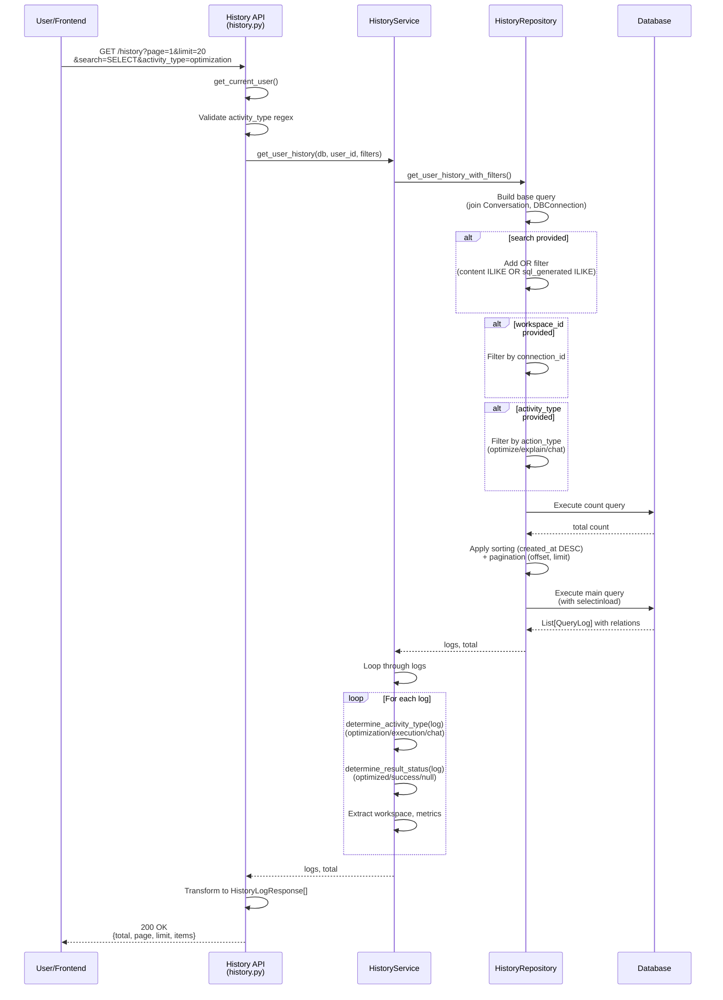
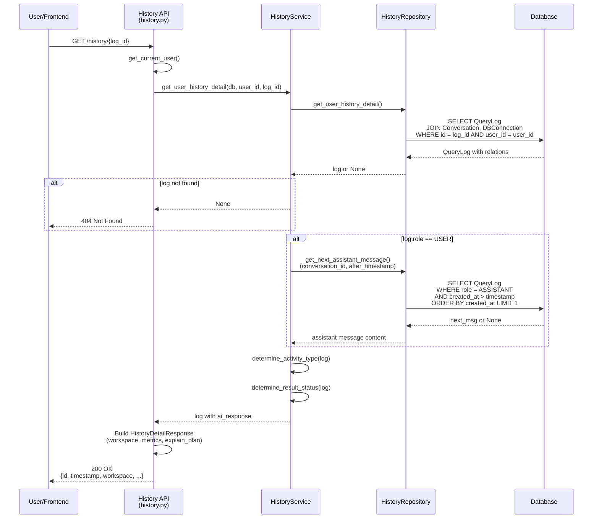
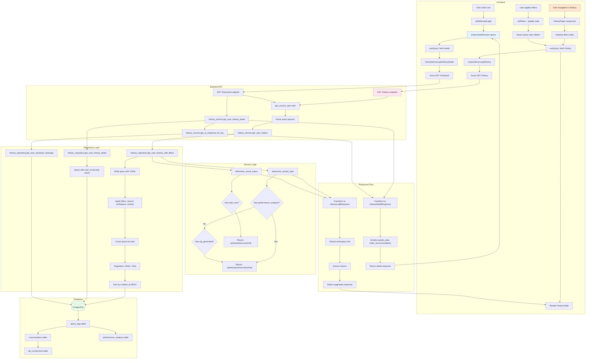

specification_functions/20260206/8_history_audit_log.md

# Tài liệu Đặc tả: Lịch sử & Nhật ký (Audit Log)

## 1. Tác động Database (Database Impact)

### Table: `conversations`
- **Usage:**
  - **Read:** `id`, `connection_id`, `title`, `created_at` để liên kết với query logs
  - Link với `db_connections` để lấy workspace info

### Table: `query_logs`
- **Usage:**
  - **Read:** Tất cả columns:
    - `id`: Primary key
    - `conversation_id`: Link với conversation
    - `role`: Enum ('user', 'assistant') để phân biệt user prompt vs AI response
    - `action_type`: String ('chat', 'optimize', 'explain') để phân loại activity
    - `content`: User prompt hoặc AI message content
    - `sql_generated`: Generated SQL từ AI
    - `created_at`: Timestamp cho sorting và filtering

### Table: `db_connections`
- **Usage:**
  - **Read:** `id`, `user_id`, `name`, `db_type` để hiển thị workspace info
  - Join để filter history theo workspace

### Table: `performance_analysis`
- **Usage:**
  - **Read:** `query_log_id`, `execution_time_ms`, `total_cost`, `explain_plan`, `index_recommendation`
  - Join với query_logs để lấy performance metrics

### Table: `feedbacks` (optional)
- **Usage:**
  - **Read:** `query_log_id`, `rating`, `corrected_sql`, `comment`
  - Join để hiển thị feedback (nếu có)

**Lưu ý:** Chức năng này chỉ đọc dữ liệu, không write. Audit log được tạo tự động khi user thực hiện các actions (chat, optimize, explain).

---

## 2. Mô phỏng API (API Simulation)

### 2.1. Get History List with Filters

**Endpoint:** `GET /api/v1/history`

**Simulation:**

**Request Query Parameters:**
```
GET /api/v1/history?page=1&limit=20&search=SELECT&workspace_id=550e8400-e29b-41d4-a716-446655440000&activity_type=optimization
```

**Response JSON (Success):**
```json
{
  "total": 150,
  "page": 1,
  "limit": 20,
  "items": [
    {
      "id": "880h0733-h61e-74g7-d049-779988773333",
      "timestamp": "2026-02-06T10:30:45.123Z",
      "workspace": {
        "id": "550e8400-e29b-41d4-a716-446655440000",
        "name": "Production DB",
        "db_type": "postgres"
      },
      "activity_type": "optimization",
      "action_type": "optimize",
      "user_prompt": "Optimize this query for better performance",
      "sql_query": "SELECT u.id, u.email, o.total FROM users u JOIN orders o ON u.id = o.user_id WHERE o.status = 'pending'",
      "result_status": "optimized",
      "cost_reduction": 1245.67,
      "execution_time_ms": 125.5
    },
    {
      "id": "990i1844-i72f-85h8-e150-880099884444",
      "timestamp": "2026-02-06T09:15:30.456Z",
      "workspace": {
        "id": "660f9511-f39c-52e5-b827-557766551111",
        "name": "Staging DB",
        "db_type": "mysql"
      },
      "activity_type": "execution",
      "action_type": "explain",
      "user_prompt": "Run this query and show results",
      "sql_query": "SELECT * FROM products WHERE category = 'Electronics'",
      "result_status": "success",
      "cost_reduction": null,
      "execution_time_ms": 45.2
    },
    {
      "id": "aa0j2955-j83g-96i9-f261-991100995555",
      "timestamp": "2026-02-05T16:45:12.789Z",
      "workspace": {
        "id": "550e8400-e29b-41d4-a716-446655440000",
        "name": "Production DB",
        "db_type": "postgres"
      },
      "activity_type": "chat",
      "action_type": "chat",
      "user_prompt": "What columns are in the users table?",
      "sql_query": null,
      "result_status": null,
      "cost_reduction": null,
      "execution_time_ms": null
    }
  ]
}
```

**Note:**
- `activity_type`: Determined by service logic:
  - `"optimization"` → có `performance_analysis`
  - `"execution"` → có `sql_generated` nhưng không có `performance_analysis`
  - `"chat"` → không có `sql_generated` và không có `performance_analysis`
- `result_status`:
  - `"optimized"` → có `performance_analysis.total_cost`
  - `"success"` → có `performance_analysis` hoặc `sql_generated`
  - `null` → chat only
- `cost_reduction`: Lấy từ `performance_analysis.total_cost` (original cost trước khi optimize)

---

**Request Query Parameters (No Filters):**
```
GET /api/v1/history?page=1&limit=20
```

**Response JSON (Empty Results):**
```json
{
  "total": 0,
  "page": 1,
  "limit": 20,
  "items": []
}
```

---

**Error Response (401 - Unauthorized):**
```json
{
  "detail": "Not authenticated"
}
```

**Error Response (400 - Invalid Activity Type):**
```json
{
  "detail": "Input should be 'optimization', 'execution' or 'chat'"
}
```

---

### 2.2. Get History Detail

**Endpoint:** `GET /api/v1/history/{log_id}`

**Simulation:**

**Request:**
```
GET /api/v1/history/880h0733-h61e-74g7-d049-779988773333
```

**Response JSON (Success - Optimization Log):**
```json
{
  "id": "880h0733-h61e-74g7-d049-779988773333",
  "timestamp": "2026-02-06T10:30:45.123Z",
  "workspace": {
    "id": "550e8400-e29b-41d4-a716-446655440000",
    "name": "Production DB",
    "db_type": "postgres"
  },
  "activity_type": "optimization",
  "user_prompt": "Optimize this query for better performance",
  "sql_query": "SELECT u.id, u.email, o.total FROM users u INNER JOIN orders o ON u.id = o.user_id WHERE o.status = 'pending' ORDER BY o.created_at DESC",
  "ai_response": "I've analyzed your query and found that it performs a sequential scan on the 'orders' table. Adding an index on the 'status' column will significantly improve performance.\n\nOptimized SQL:\nSELECT u.id, u.email, o.total\nFROM users u\nINNER JOIN orders o ON u.id = o.user_id\nWHERE o.status = 'pending'\nORDER BY o.created_at DESC\n\nRecommended Index:\nCREATE INDEX idx_orders_status ON orders (status);\nCREATE INDEX idx_orders_created_at ON orders (created_at);",
  "result_status": "optimized",
  "execution_time_ms": 125.5,
  "total_cost": 1245.67,
  "explain_plan": {
    "Node Type": "Limit",
    "Startup Cost": 1245.67,
    "Total Cost": 1345.89,
    "Plan Rows": 100,
    "Plans": [
      {
        "Node Type": "Seq Scan",
        "Relation Name": "orders",
        "Startup Cost": 0.00,
        "Total Cost": 450.00
      }
    ]
  },
  "index_recommendation": "CREATE INDEX idx_orders_status ON orders (status);\nCREATE INDEX idx_orders_created_at ON orders (created_at);",
  "conversation_id": "770g9622-g50d-63f6-c938-668877662222"
}
```

---

**Response JSON (Success - Chat Log):**
```json
{
  "id": "aa0j2955-j83g-96i9-f261-991100995555",
  "timestamp": "2026-02-05T16:45:12.789Z",
  "workspace": {
    "id": "550e8400-e29b-41d4-a716-446655440000",
    "name": "Production DB",
    "db_type": "postgres"
  },
  "activity_type": "chat",
  "user_prompt": "What columns are in the users table?",
  "sql_query": null,
  "ai_response": "The 'users' table contains the following columns:\n\n1. `id` (integer, PRIMARY KEY) - Unique identifier\n2. `email` (varchar) - User email address\n3. `username` (varchar) - User's login name\n4. `created_at` (timestamp) - Account creation date\n5. `updated_at` (timestamp) - Last update timestamp",
  "result_status": null,
  "execution_time_ms": null,
  "total_cost": null,
  "explain_plan": null,
  "index_recommendation": null,
  "conversation_id": "770g9622-g50d-63f6-c938-668877662222"
}
```

---

**Error Response (404 - Log Not Found):**
```json
{
  "detail": "History log not found or access denied"
}
```

**Note:**
- `ai_response`: Lấy từ assistant message tiếp theo trong conversation (nếu user prompt), hoặc `null`
- Backend gọi `history_repository.get_next_assistant_message()` để fetch response

---

## 3. Luồng xử lý Chi tiết (Core Logic Flow)

### 3.1. Luồng Get History List với Filters

**Step-by-Step Flow:**

1. **Xác thực và Parse Query Parameters:**
   - API endpoint nhận query params: `page`, `limit`, `search`, `workspace_id`, `activity_type`
   - Gọi `get_current_user()` để lấy user hiện tại
   - Validate `activity_type` regex: `^(optimization|execution|chat)$`

2. **Call Service Layer:**
   - Gọi `history_service.get_user_history(db, user_id, page, limit, search, workspace_id, activity_type)`:
     - Forward parameters to repository layer

3. **Repository Query Construction:**
   - Gọi `history_repository.get_user_history_with_filters()`:
     - **Base Query:**
       ```python
       select(QueryLog)
         .join(Conversation)
         .join(DBConnection)
         .outerjoin(PerformanceAnalysis)
         .options(
           selectinload(QueryLog.conversation).selectinload(Conversation.connection),
           selectinload(QueryLog.performance_analysis)
         )
         .where(DBConnection.user_id == user_id)
       ```
     - **Search Filter (nếu có):**
       - Apply `OR` condition:
         - `QueryLog.content.ilike(f"%{search}%")` (search in user prompt)
         - `QueryLog.sql_generated.ilike(f"%{search}%")` (search in SQL)
     - **Workspace Filter (nếu có):**
       - `Conversation.connection_id == workspace_id`
     - **Activity Type Filter (nếu có):**
       - `"optimization"` → `QueryLog.action_type == "optimize"`
       - `"execution"` → `QueryLog.action_type == "explain"`
       - `"chat"` → `QueryLog.action_type == "chat"`

4. **Count Total Results:**
   - Tạo count query từ filtered query
   - Execute: `total = len(db.execute(count_query).all())`

5. **Apply Sorting and Pagination:**
   - Sort: `order_by(desc(QueryLog.created_at))` (newest first)
   - Offset: `(page - 1) * limit`
   - Limit: `limit`

6. **Execute Query:**
   - `result = await db.execute(query)`
   - `logs = list(result.scalars().all())`

7. **Transform to Response Format:**
   - Loop qua mỗi log:
     - Extract workspace info từ `log.conversation.connection`:
       - `id`, `name`, `db_type`
     - Determine activity type:
       - Gọi `history_service.determine_activity_type(log)`:
         - Nếu `log.performance_analysis` → `"optimization"`
         - Nếu `log.sql_generated` → `"execution"`
         - Else → `"chat"`
     - Determine result status:
       - Gọi `history_service.determine_result_status(log)`:
         - Nếu có `performance_analysis.total_cost` → `"optimized"`
         - Nếu có `performance_analysis` hoặc `sql_generated` → `"success"`
         - Else → `None`
     - Extract metrics:
       - `cost_reduction = performance_analysis.total_cost` (nếu có)
       - `execution_time_ms = performance_analysis.execution_time_ms` (nếu có)
     - Build `HistoryLogResponse` object

8. **Return Paginated Response:**
   - Return `HistoryListResponse(total, page, limit, items)`

**Sequence Diagram (Get History List):**



---

### 3.2. Luồng Determine Activity Type

**Step-by-Step Flow:**

1. **Check Performance Analysis:**
   - Nếu `log.performance_analysis` tồn tại → Return `"optimization"`
   - Có performance analysis = query đã được optimize

2. **Check SQL Generated:**
   - Nếu `log.sql_generated` tồn tại → Return `"execution"`
   - Có SQL generated = query đã được execute

3. **Default to Chat:**
   - Else → Return `"chat"`
   - Không có SQL, không có performance = chat conversation only

**Logic:**
```python
def determine_activity_type(log: QueryLog) -> str:
    if log.performance_analysis:
        return "optimization"
    elif log.sql_generated:
        return "execution"
    else:
        return "chat"
```

---

### 3.3. Luồng Determine Result Status

**Step-by-Step Flow:**

1. **Check Performance Analysis:**
   - Nếu `log.performance_analysis` tồn tại:
     - Nếu `performance_analysis.total_cost` tồn tại → Return `"optimized"`
     - Else → Return `"success"`

2. **Check SQL Generated:**
   - Nếu `log.sql_generated` tồn tại → Return `"success"`

3. **Default:**
   - Else → Return `None`

**Logic:**
```python
def determine_result_status(log: QueryLog) -> Optional[str]:
    if log.performance_analysis:
        if log.performance_analysis.total_cost:
            return "optimized"
        return "success"
    elif log.sql_generated:
        return "success"
    return None
```

---

### 3.4. Luồng Get History Detail

**Step-by-Step Flow:**

1. **Xác thực và Validate:**
   - API endpoint nhận `log_id` (UUID path parameter)
   - Gọi `get_current_user()` để lấy user hiện tại

2. **Fetch Log Detail:**
   - Gọi `history_service.get_user_history_detail(db, user_id, log_id)`:
     - Forward to repository

3. **Repository Query:**
   - Gọi `history_repository.get_user_history_detail(db, user_id, log_id)`:
     - **Query:**
       ```python
       select(QueryLog)
         .join(Conversation)
         .join(DBConnection)
         .outerjoin(PerformanceAnalysis)
         .options(
           selectinload(QueryLog.conversation).selectinload(Conversation.connection),
           selectinload(QueryLog.performance_analysis)
         )
         .where(
           QueryLog.id == log_id,
           DBConnection.user_id == user_id  # Security: chỉ user owner
         )
       ```
     - Execute: `result.scalar_one_or_none()`

4. **Check Existence:**
   - Nếu `log is None` → HTTP 404: "History log not found or access denied"

5. **Fetch AI Response (nếu log.role == USER):**
   - Gọi `history_service.get_ai_response_for_log(db, log)`:
     - Nếu `log.role != ChatRole.USER` → Return `None`
     - Gọi `history_repository.get_next_assistant_message(db, conversation_id, after_timestamp=log.created_at)`:
       - **Query:**
         ```python
         select(QueryLog)
           .where(
             QueryLog.conversation_id == conversation_id,
             QueryLog.created_at > after_timestamp,
             QueryLog.role == ChatRole.ASSISTANT
           )
           .order_by(QueryLog.created_at)
           .limit(1)
         ```
       - Fetch first assistant message sau user prompt
     - Return: `next_msg.content` (nếu có) hoặc `None`

6. **Build Detail Response:**
   - Extract workspace info
   - Determine activity type và result status
   - Include all fields:
     - `user_prompt`: `log.content` nếu role = user
     - `sql_query`: `log.sql_generated`
     - `ai_response`: Từ step 5
     - `execution_time_ms`, `total_cost`: Từ `performance_analysis`
     - `explain_plan`: `performance_analysis.explain_plan` (JSONB)
     - `index_recommendation`: `performance_analysis.index_recommendation`
     - `conversation_id`: Link để navigate

7. **Return Detail Response:**
   - Return `HistoryDetailResponse` với full details

**Sequence Diagram (Get History Detail):**



---

### 3.5. Luồng Search Filtering

**Step-by-Step Flow:**

1. **Parse Search Query:**
   - User nhập: `"SELECT users"`
   - Backend nhận: `search = "SELECT users"`

2. **Normalize Search:**
   - SQLAlchemy `ilike` operator (case-insensitive)

3. **Apply OR Conditions:**
   - Search trong 2 fields:
     - `QueryLog.content` (user prompt hoặc assistant message)
     - `QueryLog.sql_generated` (generated SQL)
   - Pattern: `f"%{search}%"` (wildcard both sides)

4. **Execute Filtered Query:**
   - Results bao gồm logs có search string trong content HOẶC SQL

**Example Matches:**
```
Search: "SELECT users"

Matches:
- Log 1: content = "How to SELECT users from database?" ✓
- Log 2: sql_generated = "SELECT * FROM users WHERE active = true" ✓
- Log 3: content = "What is JOIN?" ✗ (không match)
```

---

## 4. Tương tác Frontend (Frontend Flow)

### 4.1. Trigger History Page Load

**Trigger:**
- User navigate to `/history` route
- Component mount: `HistoryPage`

**Data Handling:**

1. **Initialize State:**
   ```typescript
   const [filters, setFilters] = useState<HistoryFilter>({
     page: 1,
     limit: 20,
     search: '',
     workspace_id: undefined,
     activity_type: undefined,
   });
   ```

2. **Fetch History Data:**
   - React Query:
     ```typescript
     const { data, isLoading, error } = useQuery({
       queryKey: ['history', filters],
       queryFn: () => historyService.getHistory(filters),
     });
     ```
   - Auto refetch khi `filters` change

3. **Fetch Workspaces for Filter:**
   - Separate query:
     ```typescript
     const { data: workspaces } = useQuery({
       queryKey: ['workspaces'],
       queryFn: () => workspaceService.getAll(),
     });
     ```
   - Populate workspace dropdown

**User Flow:**
```
User navigates to /history → Component mounts → Fetch history (page 1, limit 20) → Render table
```

---

### 4.2. Apply Filters

**Trigger:**
- User nhập search term và nhấn Enter hoặc click "Search" button
- User chọn workspace từ dropdown
- User chọn activity type từ dropdown

**Data Handling:**

1. **Search Input:**
   ```typescript
   const [searchInput, setSearchInput] = useState('');
   
   const handleSearch = () => {
     setFilters((prev) => ({ ...prev, search: searchInput, page: 1 }));
   };
   ```
   - Reset page về 1 khi search

2. **Workspace Filter:**
   ```typescript
   onChange={(e) =>
     setFilters((prev) => ({
       ...prev,
       workspace_id: e.target.value || undefined,
       page: 1,
     }))
   }
   ```

3. **Activity Type Filter:**
   ```typescript
   onChange={(e) =>
     setFilters((prev) => ({
       ...prev,
       activity_type: (e.target.value as ActivityType) || undefined,
       page: 1,
     }))
   }
   ```

4. **React Query Auto Refetch:**
   - `filters` thay đổi → `queryKey` thay đổi → Auto trigger refetch

**User Flow:**
```
User types "SELECT" → Clicks Search → setFilters({search: "SELECT", page: 1}) → React Query refetches → Table updates
```

---

### 4.3. Pagination

**Trigger:**
- User click "Previous" hoặc "Next" button

**Data Handling:**

1. **Page Change Handler:**
   ```typescript
   const handlePageChange = (newPage: number) => {
     setFilters((prev) => ({ ...prev, page: newPage }));
   };
   ```

2. **Disable Logic:**
   - Previous button: `disabled={filters.page === 1}`
   - Next button: `disabled={filters.page >= totalPages}`

3. **Calculate Total Pages:**
   ```typescript
   const totalPages = data ? Math.ceil(data.total / filters.limit!) : 1;
   ```

4. **Display Info:**
   ```
   Showing 21 to 40 of 150 results
   ```
   - Calculation: `(page - 1) * limit + 1` to `min(page * limit, total)`

**User Flow:**
```
User on page 1 → Clicks Next → setFilters({page: 2}) → Refetch with offset=20 → Display rows 21-40
```

---

### 4.4. View Detail Drawer

**Trigger:**
- User click row trong history table
- Hoặc click "View Details" button

**Data Handling:**

1. **Open Drawer:**
   ```typescript
   const handleViewDetail = (log: HistoryLog) => {
     setSelectedLogId(log.id);
   };
   ```

2. **Fetch Detail:**
   - `HistoryDetailDrawer` component:
     ```typescript
     const { data: detail, isLoading } = useQuery<HistoryDetail>({
       queryKey: ['history-detail', logId],
       queryFn: () => historyService.getHistoryDetail(logId!),
       enabled: !!logId,
     });
     ```
   - `enabled: !!logId` → Chỉ fetch khi logId tồn tại

3. **Display Detail:**
   - Workspace info (name, db_type, timestamp)
   - Activity type & status badges
   - Performance metrics (execution time, cost)
   - User prompt (nếu có)
   - SQL query (syntax highlighted)
   - AI response (nếu có)
   - Explain plan (JSON tree, nếu có)
   - Index recommendation (code block, nếu có)

4. **Close Drawer:**
   ```typescript
   const handleCloseDrawer = () => {
     setSelectedLogId(null);
   };
   ```

**User Flow:**
```
User clicks row → setSelectedLogId(log.id) → Drawer slides open → Fetch detail → Display full information → User clicks X → Drawer closes
```

---

### 4.5. Copy SQL to Clipboard

**Trigger:**
- User click "Copy SQL" button trong table row hoặc detail drawer

**Data Handling:**

1. **Copy Handler:**
   ```typescript
   const handleCopySQL = async (sql: string) => {
     await historyService.copySQLToClipboard(sql);
     // Show toast notification
   };
   ```

2. **Clipboard Service:**
   ```typescript
   async copySQLToClipboard(sql: string): Promise<void> {
     if (navigator.clipboard) {
       await navigator.clipboard.writeText(sql);
     } else {
       // Fallback: Create textarea, select, execCommand('copy')
     }
   }
   ```

3. **User Feedback:**
   - Toast notification: "SQL copied to clipboard"
   - Icon change: Copy → Check (2 seconds)

**User Flow:**
```
User clicks "Copy SQL" → navigator.clipboard.writeText() → Toast appears → User can paste SQL elsewhere
```

---

### 4.6. Navigate to Workspace

**Trigger:**
- User click "Open in Workspace" button trong detail drawer

**Data Handling:**

1. **Navigate Handler:**
   ```typescript
   const handleOpenInWorkspace = () => {
     if (detail?.workspace.id) {
       navigate(`/editor/${detail.workspace.id}`);
     }
   };
   ```

2. **React Router Navigation:**
   - Navigate to editor page với workspace context
   - User có thể continue working với query trong history

**User Flow:**
```
User viewing detail → Clicks "Open in Workspace" → Navigate to /editor/{workspace_id} → Editor loads với workspace context
```

---

### 4.7. Display Activity Type Indicators

**Trigger:**
- Render table rows hoặc detail card

**Data Handling:**

1. **Activity Type Badges:**
   - `"optimization"` → Orange badge, Sparkles icon
   - `"execution"` → Blue badge, Play icon
   - `"chat"` → Green badge, MessageSquare icon

2. **Result Status Indicators:**
   - `"optimized"` → Green check icon
   - `"success"` → Blue check icon
   - `null` → Gray dash

3. **Conditional Display:**
   - Execution time: Chỉ hiển thị nếu `execution_time_ms != null`
   - Cost: Chỉ hiển thị nếu `cost_reduction != null`
   - Index recommendation: Chỉ hiển thị trong detail view

**User Flow:**
```
Table render → Map activity_type to badge color → Display icon + label → User can quickly identify log types
```

---

### 4.8. Loading and Error States

**Trigger:**
- `isLoading === true` khi fetching
- `error` tồn tại khi API fails

**Data Handling:**

1. **Loading State:**
   ```typescript
   {isLoading ? (
     <div className="flex items-center justify-center h-64">
       <div className="animate-spin rounded-full h-12 w-12 border-b-2 border-primary"></div>
     </div>
   ) : ...}
   ```

2. **Error State:**
   ```typescript
   {error ? (
     <div className="text-center">
       <p className="text-red-500">Failed to load history</p>
       <p className="text-sm text-muted">{error.message}</p>
     </div>
   ) : ...}
   ```

3. **Empty State:**
   ```typescript
   {data.items.length === 0 ? (
     <div className="text-center py-12">
       <p>No history found</p>
       <p className="text-sm">Try adjusting your filters</p>
     </div>
   ) : ...}
   ```

**User Flow:**
```
Initial load: Spinner → Data arrives → Display table
Filter change: Spinner → New data → Update table
API error: Error message → User can retry or adjust filters
```

---

## 5. End-to-End Flow Diagram



---

## Tóm tắt

### Core Functions:

1. **API Endpoints:**
   - `GET /history`: List với pagination, search, filters
   - `GET /history/{log_id}`: Detail view với AI response

2. **HistoryService:**
   - `get_user_history()`: Orchestrate fetch với filters
   - `get_user_history_detail()`: Fetch single log detail
   - `determine_activity_type()`: Logic để classify log (optimization/execution/chat)
   - `determine_result_status()`: Logic để classify result (optimized/success/null)
   - `get_ai_response_for_log()`: Fetch assistant response từ conversation

3. **HistoryRepository:**
   - `get_user_history_with_filters()`: Complex query với JOIN 4 tables, filter conditions, pagination
   - `get_user_history_detail()`: Single log query với security check (user_id)
   - `get_next_assistant_message()`: Fetch assistant message sau user prompt

4. **Frontend Service:**
   - `historyService.getHistory()`: API wrapper với query params
   - `historyService.getHistoryDetail()`: Fetch detail
   - `historyService.copySQLToClipboard()`: Clipboard utility

5. **Frontend Components:**
   - `HistoryPage`: Main page với filters, table, pagination
   - `HistoryTable`: Data grid với action buttons
   - `HistoryDetailDrawer`: Slide-over panel với full details

### Key Features:

- **Automatic Logging:** Query logs tự động created khi user chat/optimize/execute
- **Activity Classification:** Smart logic để determine activity type từ log relationships
- **Full-Text Search:** Search trong user prompt và SQL generated
- **Multi-Filter:** Workspace, activity type, search term
- **Pagination:** Server-side pagination với total count
- **Detail View:** Complete information bao gồm explain plan, index recommendations
- **AI Response Tracking:** Link user prompt với assistant response trong conversation
- **Security:** User chỉ xem history của chính mình (user_id filter)
- **Performance:** Eager loading với `selectinload` để tránh N+1 queries
- **No Write Operations:** Read-only feature, logs created by other services
- **Cost Savings:** Xem lại kết quả cũ mà không cần gọi lại AI → Save tokens
