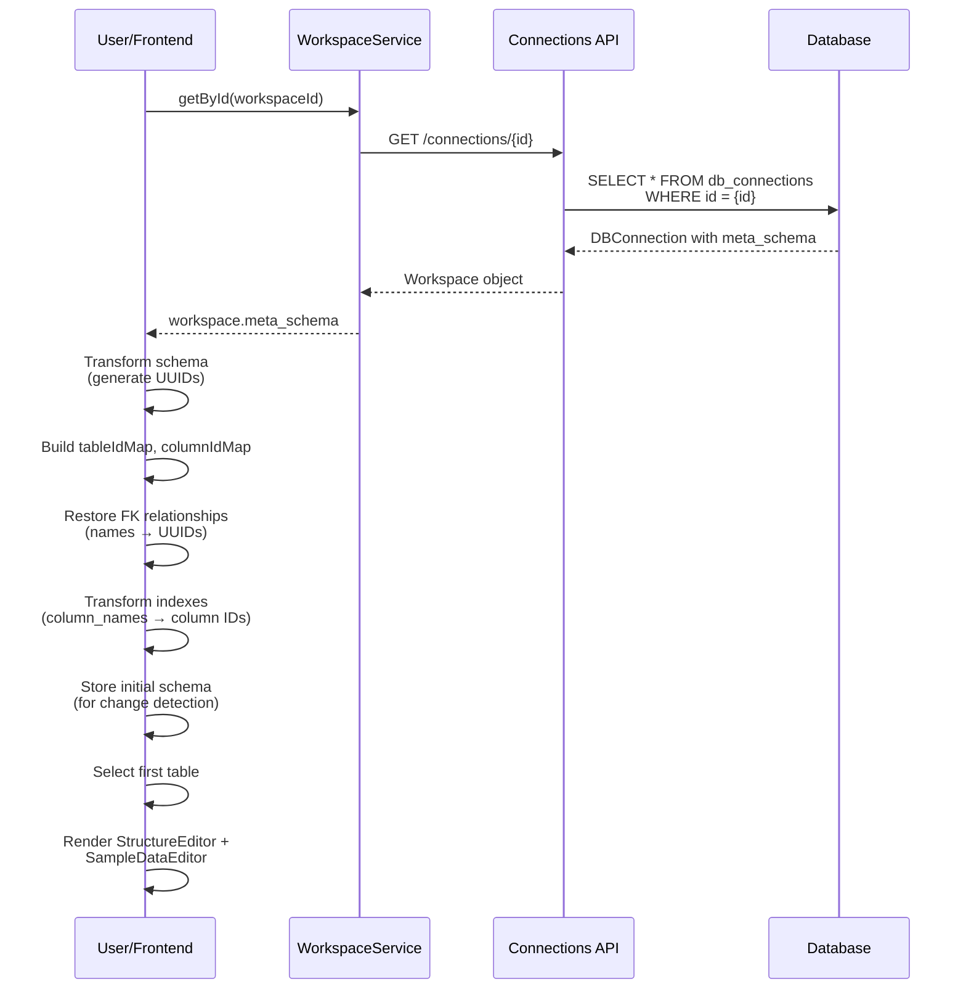
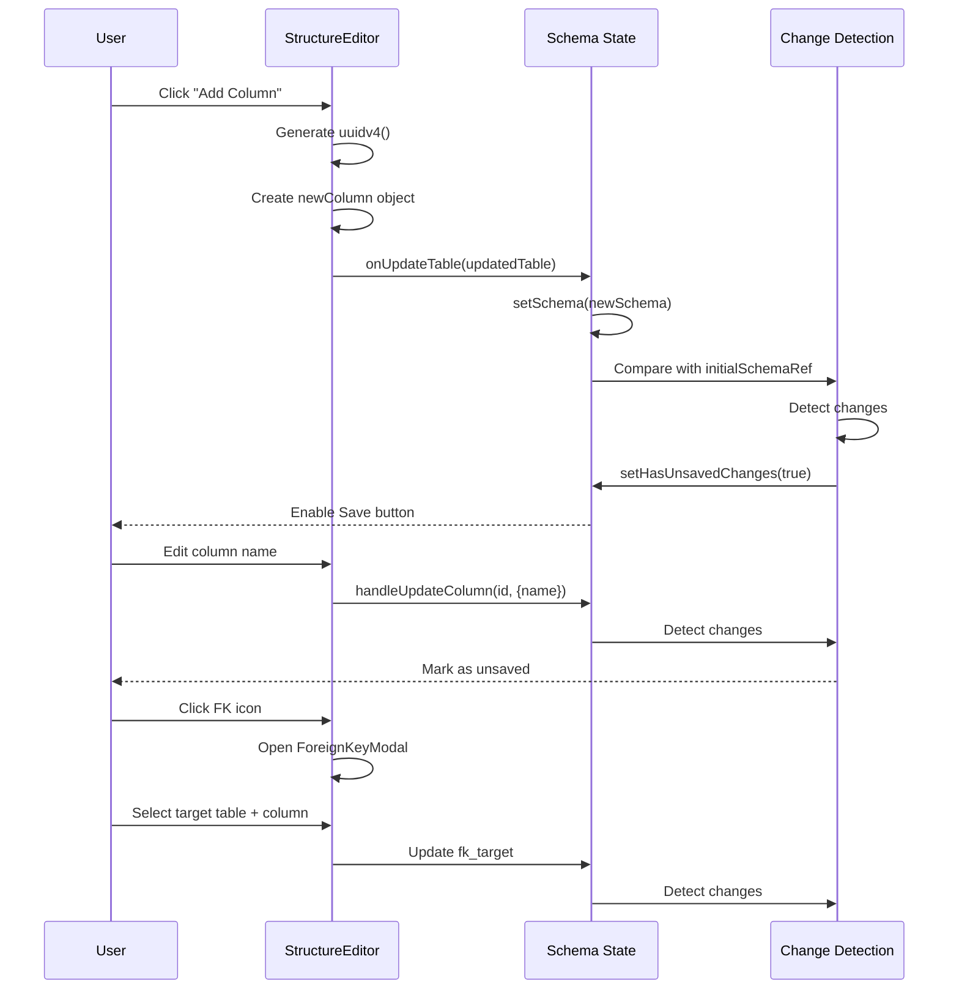
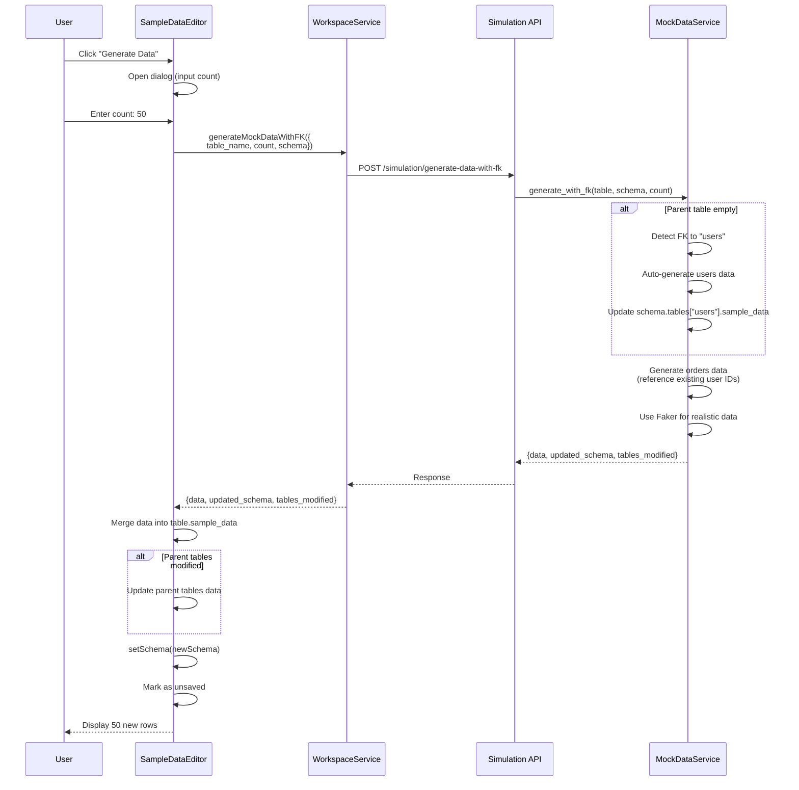
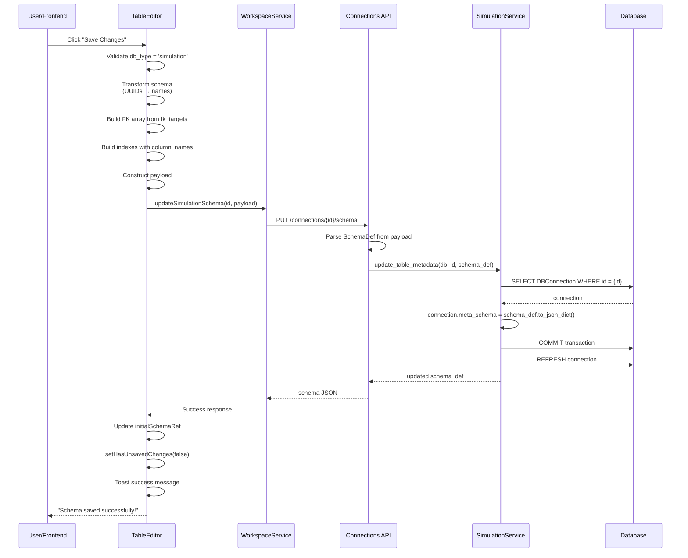
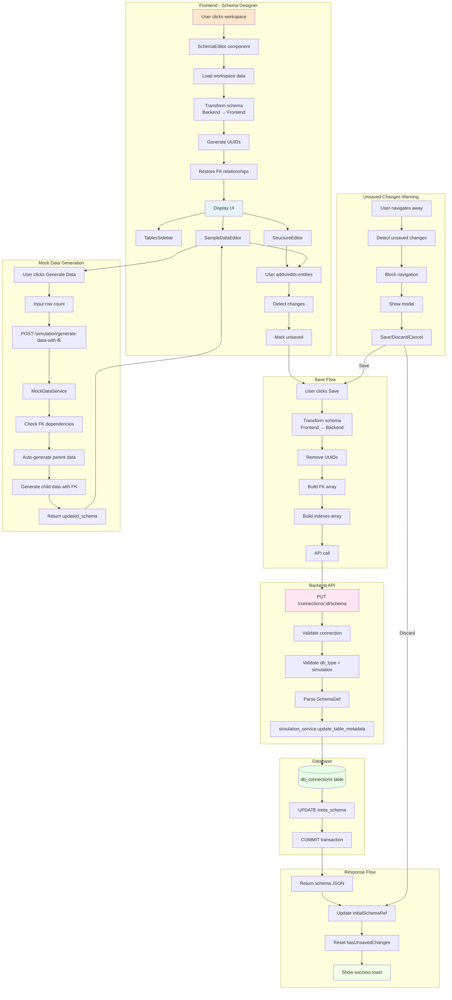

specification_functions/20260206/9_simulation_workspace_designer.md

# Tài liệu Đặc tả: Simulation Workspace (Database Designer)

## 1. Tác động Database (Database Impact)

### Table: `db_connections`
- **Usage:**
  - **Read:** `id`, `user_id`, `db_type` để validate workspace và kiểm tra quyền sở hữu
  - **Update:** `meta_schema` (JSONB) để lưu toàn bộ schema design + sample data
  - `db_type`: Phải là `'simulation'` để enable schema editing
  - `meta_schema` structure:
    ```json
    {
      "tables": [
        {
          "name": "table_name",
          "columns": [...],
          "foreign_keys": [...],
          "indexes": [...],
          "sample_data": [...],
          "row_count": 100
        }
      ]
    }
    ```

**Lưu ý:** 
- Chức năng này chỉ UPDATE `meta_schema` column, không tạo cột mới
- Schema editing chỉ hoạt động với `db_type='simulation'`
- Real database connections (`postgres`, `mysql`) không thể edit schema thủ công

---

## 2. Mô phỏng API (API Simulation)

### 2.1. Get Schema Metadata

**Endpoint:** `GET /api/v1/connections/{connection_id}/schema`

**Simulation:**

**Response JSON (Success - Simulation Workspace):**
```json
{
  "tables": [
    {
      "name": "users",
      "columns": [
        {
          "name": "id",
          "type": "UUID",
          "is_pk": true,
          "is_nullable": false,
          "default": null
        },
        {
          "name": "email",
          "type": "VARCHAR(255)",
          "is_pk": false,
          "is_nullable": false,
          "default": null
        },
        {
          "name": "created_at",
          "type": "TIMESTAMP",
          "is_pk": false,
          "is_nullable": false,
          "default": "NOW()"
        }
      ],
      "foreign_keys": [],
      "indexes": [
        {
          "name": "idx_users_email",
          "column_names": ["email"],
          "unique": true
        }
      ],
      "sample_data": [
        {
          "id": "123e4567-e89b-12d3-a456-426614174000",
          "email": "john@example.com",
          "created_at": "2026-01-15T10:30:00Z"
        }
      ],
      "row_count": 1
    },
    {
      "name": "orders",
      "columns": [
        {
          "name": "id",
          "type": "UUID",
          "is_pk": true,
          "is_nullable": false
        },
        {
          "name": "user_id",
          "type": "UUID",
          "is_pk": false,
          "is_nullable": false
        },
        {
          "name": "total",
          "type": "DECIMAL(10,2)",
          "is_pk": false,
          "is_nullable": false
        }
      ],
      "foreign_keys": [
        {
          "column": "user_id",
          "ref_table": "users",
          "ref_column": "id"
        }
      ],
      "indexes": [],
      "sample_data": [],
      "row_count": 0
    }
  ]
}
```

**Error Response (404 - No Schema):**
```json
{
  "detail": "Schema not available. Please sync the connection or update schema for simulations."
}
```

**Error Response (404 - Connection Not Found):**
```json
{
  "detail": "Connection with ID 550e8400-e29b-41d4-a716-446655440000 not found"
}
```

---

### 2.2. Update Schema (Save Design)

**Endpoint:** `PUT /api/v1/connections/{connection_id}/schema`

**Simulation:**

**Request JSON:**
```json
{
  "tables": [
    {
      "name": "products",
      "columns": [
        {
          "name": "id",
          "type": "UUID",
          "is_pk": true,
          "is_nullable": false
        },
        {
          "name": "name",
          "type": "VARCHAR(255)",
          "is_pk": false,
          "is_nullable": false
        },
        {
          "name": "price",
          "type": "DECIMAL(10,2)",
          "is_pk": false,
          "is_nullable": false
        },
        {
          "name": "category_id",
          "type": "UUID",
          "is_pk": false,
          "is_nullable": true
        }
      ],
      "foreign_keys": [
        {
          "column": "category_id",
          "ref_table": "categories",
          "ref_column": "id"
        }
      ],
      "indexes": [
        {
          "name": "idx_products_category",
          "column_names": ["category_id"],
          "unique": false
        }
      ],
      "sample_data": [
        {
          "id": "prod-001",
          "name": "Laptop Dell XPS 15",
          "price": 1299.99,
          "category_id": "cat-001"
        }
      ]
    }
  ]
}
```

**Response JSON (Success):**
```json
{
  "tables": [
    {
      "name": "products",
      "columns": [
        {
          "name": "id",
          "type": "UUID",
          "is_pk": true,
          "is_nullable": false
        },
        {
          "name": "name",
          "type": "VARCHAR(255)",
          "is_pk": false,
          "is_nullable": false
        },
        {
          "name": "price",
          "type": "DECIMAL(10,2)",
          "is_pk": false,
          "is_nullable": false
        },
        {
          "name": "category_id",
          "type": "UUID",
          "is_pk": false,
          "is_nullable": true
        }
      ],
      "foreign_keys": [
        {
          "column": "category_id",
          "ref_table": "categories",
          "ref_column": "id"
        }
      ],
      "indexes": [
        {
          "name": "idx_products_category",
          "column_names": ["category_id"],
          "unique": false
        }
      ],
      "sample_data": [
        {
          "id": "prod-001",
          "name": "Laptop Dell XPS 15",
          "price": 1299.99,
          "category_id": "cat-001"
        }
      ]
    }
  ]
}
```

**Note:** Response echoes back transformed schema sau khi lưu thành công.

**Error Response (400 - Not Simulation):**
```json
{
  "detail": "Can only update schema for simulation connections. Use POST /sync for real databases."
}
```

**Error Response (404 - Connection Not Found):**
```json
{
  "detail": "Connection with ID 550e8400-e29b-41d4-a716-446655440000 not found"
}
```

---

### 2.3. Generate Mock Data với Foreign Key Support

**Endpoint:** `POST /api/v1/simulation/generate-data-with-fk`

**Simulation:**

**Request JSON:**
```json
{
  "table_name": "orders",
  "count": 50,
  "schema": {
    "tables": [
      {
        "name": "users",
        "columns": [
          {"name": "id", "type": "UUID", "is_pk": true}
        ],
        "sample_data": [
          {"id": "user-001"},
          {"id": "user-002"}
        ]
      },
      {
        "name": "orders",
        "columns": [
          {"name": "id", "type": "UUID", "is_pk": true},
          {"name": "user_id", "type": "UUID"},
          {"name": "total", "type": "DECIMAL"}
        ],
        "foreign_keys": [
          {
            "column": "user_id",
            "ref_table": "users",
            "ref_column": "id"
          }
        ]
      }
    ]
  }
}
```

**Response JSON (Success):**
```json
{
  "data": [
    {
      "id": "order-001",
      "user_id": "user-001",
      "total": 1234.56
    },
    {
      "id": "order-002",
      "user_id": "user-002",
      "total": 789.12
    }
  ],
  "count": 50,
  "updated_schema": {
    "tables": [
      {
        "name": "users",
        "columns": [...],
        "sample_data": [...]
      },
      {
        "name": "orders",
        "columns": [...],
        "sample_data": [
          {"id": "order-001", "user_id": "user-001", "total": 1234.56},
          {"id": "order-002", "user_id": "user-002", "total": 789.12}
        ]
      }
    ]
  },
  "tables_modified": ["orders"]
}
```

**Note:** 
- `updated_schema`: Full schema với sample_data đã được update
- `tables_modified`: List tables có data thay đổi (có thể bao gồm parent tables nếu auto-generate)

**Error Response (404 - Table Not Found):**
```json
{
  "detail": "Table 'invalid_table' not found in schema"
}
```

**Error Response (500 - Generation Failed):**
```json
{
  "detail": "Failed to generate mock data: Invalid column type"
}
```

---

### 2.4. Get DDL Script

**Endpoint:** `GET /api/v1/connections/{connection_id}/ddl`

**Simulation:**

**Response (Success - Plain Text):**
```sql
-- Generated DDL Script from Schema Definition
-- This script can be used as context for AI query generation

CREATE TABLE users (
    id UUID NOT NULL,
    email VARCHAR NOT NULL,
    created_at TIMESTAMP NOT NULL DEFAULT NOW(),
    PRIMARY KEY (id)
);

CREATE TABLE orders (
    id UUID NOT NULL,
    user_id UUID NOT NULL,
    total DECIMAL NOT NULL,
    PRIMARY KEY (id)
);

ALTER TABLE orders ADD CONSTRAINT fk_orders_user_id FOREIGN KEY (user_id) REFERENCES users(id);

-- Sample data for users
INSERT INTO users (id, email, created_at) VALUES ('123e4567-e89b-12d3-a456-426614174000', 'john@example.com', '2026-01-15 10:30:00');

-- Sample data for orders
INSERT INTO orders (id, user_id, total) VALUES ('order-001', '123e4567-e89b-12d3-a456-426614174000', 1234.56);
```

**Error Response (404 - No Schema):**
```json
{
  "detail": "No schema metadata found for connection 550e8400-e29b-41d4-a716-446655440000"
}
```

---

## 3. Luồng xử lý Chi tiết (Core Logic Flow)

### 3.1. Luồng Load Schema để Edit

**Step-by-Step Flow:**

1. **User Navigation:**
   - User click vào Simulation workspace từ workspace list
   - Navigate to `/workspaces/{workspace_id}/schema` route

2. **Fetch Workspace:**
   - Gọi `workspaceService.getById(workspaceId)`
   - Endpoint: `GET /connections/{connection_id}`
   - Nhận workspace object với `meta_schema` JSONB

3. **Transform Schema (Backend → Frontend):**
   - Backend format: Tables với column names trong FKs và Indexes
   - Frontend cần: Tables với UUIDs cho UI management
   - Process:
     - Generate UUID cho mỗi table: `table.id = uuidv4()`
     - Generate UUID cho mỗi column: `column.id = uuidv4()`
     - Generate UUID cho mỗi index: `index.id = uuidv4()`
     - Build maps: `tableIdMap`, `columnIdMap`
   - Restore FK relationships:
     ```typescript
     // Backend: {column: "user_id", ref_table: "users", ref_column: "id"}
     // Frontend: {table_id: "uuid-1", column_id: "uuid-2"}
     fk_target = {
       table_id: tableIdMap.get(fk.ref_table),
       column_id: columnIdMap.get(fk.ref_table)?.get(fk.ref_column)
     }
     ```
   - Transform indexes:
     ```typescript
     // Backend: {column_names: ["email", "status"]}
     // Frontend: {columns: ["uuid-col-1", "uuid-col-2"]}
     index.columns = column_names.map(name => columnIdMap.get(name))
     ```

4. **Store Initial Schema:**
   - Serialize schema: `initialSchemaRef.current = JSON.stringify(schema)`
   - Dùng để detect unsaved changes

5. **Select First Table:**
   - Nếu có tables → `setSelectedTableId(schema.tables[0].id)`
   - Display `StructureEditor` và `SampleDataEditor`

**Sequence Diagram (Load Schema):**



---

### 3.2. Luồng Edit Table Structure

**Step-by-Step Flow:**

1. **Add Column:**
   - User click "Add Column" button trong `StructureEditor`
   - Tạo column mới:
     ```typescript
     newColumn = {
       id: uuidv4(),
       name: `column_${table.columns.length + 1}`,
       type: 'VARCHAR',
       is_pk: false,
       is_nullable: true,
       fk_target: null
     }
     ```
   - Update table: `onUpdateTable({...table, columns: [...columns, newColumn]})`
   - State update cascade:
     - `setSchema()` → Update full schema
     - `setHasUnsavedChanges(true)` → Enable save button

2. **Edit Column Properties:**
   - User edit column name: Inline text input
   - User change data type: Dropdown select
     - Split type: `parseSQLType("VARCHAR(255)")` → `{type: "VARCHAR", args: "255"}`
     - Reconstruct: `constructSQLType("VARCHAR", "255")` → `"VARCHAR(255)"`
   - User toggle PK: Checkbox
   - User toggle nullable: Checkbox
   - Each change triggers: `handleUpdateColumn(columnId, updates)`

3. **Add Foreign Key:**
   - User click FK icon bên cạnh column
   - Open `ForeignKeyModal`:
     - Select target table: Dropdown (exclude current table)
     - Select target column: Dropdown (filter by compatible type)
   - Set FK: `column.fk_target = {table_id, column_id}`
   - Update table state

4. **Add Index:**
   - User click "Manage Indexes" button
   - Open `IndexEditorModal`:
     - Mode: `create` hoặc `edit`
     - Input: index name, columns (multi-select), unique flag
   - Create index:
     ```typescript
     newIndex = {
       id: uuidv4(),
       name: "idx_users_email",
       columns: [selectedColumnIds],
       unique: true
     }
     ```
   - Update table: `onUpdateTable({...table, indexes: [...indexes, newIndex]})`

5. **Delete Column:**
   - User click delete icon
   - Validate: Cannot delete last column
   - Filter: `columns.filter(c => c.id !== columnId)`
   - Auto-remove:
     - FKs liên quan (nếu column là FK)
     - Indexes chứa column này

6. **Mark Changes:**
   - Mỗi modification:
     - Compare: `JSON.stringify(currentSchema) !== initialSchemaRef.current`
     - Set: `setHasUnsavedChanges(true)`
   - UI indicators:
     - Save button enabled + highlighted
     - Unsaved changes badge

**Sequence Diagram (Edit Structure):**



---

### 3.3. Luồng Edit Sample Data

**Step-by-Step Flow:**

1. **Load Table Data (Real DB):**
   - Khi user select table từ sidebar
   - Check: `workspace.db_type !== 'simulation'` AND `table.sample_data.length === 0`
   - Gọi `workspaceService.getTableData(workspaceId, tableName, 100)`:
     - Endpoint: `GET /connections/{id}/tables/{table_name}/data?limit=100`
     - Backend: Execute `SELECT * FROM {table} LIMIT 100`
     - Return: `{columns, rows, total_rows}`
   - Update: `table.sample_data = rows`

2. **Load Table Data (Simulation):**
   - Data đã có sẵn trong `meta_schema.tables[].sample_data`
   - Skip API call

3. **Edit Cell Value:**
   - User double-click cell trong `SampleDataEditor`
   - Render inline editor (text input, JSON editor modal)
   - Update row:
     ```typescript
     updatedData = table.sample_data.map((row, idx) =>
       idx === rowIndex ? {...row, [columnName]: newValue} : row
     )
     ```
   - Update table: `onUpdateTable({...table, sample_data: updatedData})`

4. **Add Row (Manual):**
   - User click "Add Row" button
   - Create empty row với default values:
     ```typescript
     newRow = {}
     table.columns.forEach(col => {
       newRow[col.name] = col.default || null
     })
     ```
   - Append: `sample_data.push(newRow)`

5. **Generate Mock Data:**
   - User click "Generate Data" button
   - Open dialog: Input row count (1-1000)
   - Gọi `workspaceService.generateMockDataWithFK({table_name, count, schema})`:
     - Endpoint: `POST /simulation/generate-data-with-fk`
     - Backend:
       - Check FK dependencies
       - Nếu parent table empty → Auto-generate parent data first
       - Generate data với FK references hợp lệ
       - Return: `{data, updated_schema, tables_modified}`
   - Merge data:
     - Replace `table.sample_data = response.data`
     - Update parent tables nếu có: `tables_modified.forEach(name => update table data)`

6. **Delete Row:**
   - User click delete icon
   - Filter: `sample_data.filter((_, idx) => idx !== rowIndex)`

**Sequence Diagram (Generate Mock Data):**



---

### 3.4. Luồng Save Schema

**Step-by-Step Flow:**

1. **Trigger Save:**
   - User click "Save Changes" button
   - Validate: `workspace.db_type === 'simulation'` (chỉ simulation được edit)

2. **Transform Schema (Frontend → Backend):**
   - Remove UUIDs (backend không lưu UUIDs)
   - Convert FK targets (UUIDs → names):
     ```typescript
     // Frontend: column.fk_target = {table_id: "uuid-1", column_id: "uuid-2"}
     // Backend: foreign_keys = [{column: "user_id", ref_table: "users", ref_column: "id"}]
     
     foreign_keys = table.columns
       .filter(col => col.fk_target)
       .map(col => {
         const refTable = schema.tables.find(t => t.id === col.fk_target.table_id)
         const refColumn = refTable.columns.find(c => c.id === col.fk_target.column_id)
         return {
           column: col.name,
           ref_table: refTable.name,
           ref_column: refColumn.name
         }
       })
     ```
   - Convert indexes (column IDs → names):
     ```typescript
     // Frontend: index.columns = ["uuid-col-1", "uuid-col-2"]
     // Backend: index.column_names = ["email", "status"]
     
     indexes = table.indexes.map(idx => ({
       name: idx.name,
       column_names: idx.columns.map(colId =>
         table.columns.find(c => c.id === colId)?.name
       ),
       unique: idx.unique
     }))
     ```
   - Build payload:
     ```typescript
     payload = {
       tables: schema.tables.map(table => ({
         name: table.name,
         columns: table.columns.map(col => ({
           name, type, is_pk, is_nullable, default
         })),
         foreign_keys: [...],
         indexes: [...],
         sample_data: table.sample_data,
         row_count: table.sample_data.length
       }))
     }
     ```

3. **API Call:**
   - Gọi `workspaceService.updateSimulationSchema(workspaceId, payload)`
   - Endpoint: `PUT /connections/{connection_id}/schema`
   - Backend:
     - Validate connection exists
     - Validate `db_type === 'simulation'`
     - Parse payload: `schema_data: SchemaDef`

4. **Service Update:**
   - Gọi `simulation_service.update_table_metadata(db, connection_id, schema_def)`:
     - Query: `select(DBConnection).where(id == connection_id)`
     - Update: `connection.meta_schema = schema_def.to_json_dict()`
     - Commit: `await db.commit()`
     - Refresh: `await db.refresh(connection)`
   - Return: `schema_def.to_json_dict()`

5. **Post-Save:**
   - Success:
     - Update: `initialSchemaRef.current = JSON.stringify(currentSchema)`
     - Reset: `setHasUnsavedChanges(false)`
     - Toast: "Schema saved successfully!"
   - Error:
     - Toast: "Failed to save schema: {error message}"

**Sequence Diagram (Save Schema):**



---

### 3.5. Luồng Unsaved Changes Warning

**Step-by-Step Flow:**

1. **Detect Changes:**
   - React effect: `useEffect(() => compare schema }, [schema])`
   - Compare: `JSON.stringify(schema) !== initialSchemaRef.current`
   - Update: `setHasUnsavedChanges(true/false)`

2. **Block Navigation:**
   - Hook: `useUnsavedChangesWarning({when: hasUnsavedChanges, onNavigate: ...})`
   - Intercept: React Router navigation
   - Trigger: User clicks back button or navigates to another route

3. **Show Modal:**
   - Display: `UnsavedChangesModal`
   - Options:
     - "Save Changes": Call `handleSaveChanges()` → Allow navigation
     - "Discard Changes": Reset schema → Allow navigation
     - "Cancel": Stay on page

4. **Save and Navigate:**
   - User click "Save Changes"
   - Execute save flow (transform + API call)
   - Success:
     - Allow navigation: `allowNavigation()`
     - Navigate to target route
   - Error:
     - Show error toast
     - Keep user on page

5. **Discard and Navigate:**
   - User click "Discard Changes"
   - Reset: `setSchema(initialSchema)`
   - Reset: `setHasUnsavedChanges(false)`
   - Allow: `allowNavigation()`

**Note:** Native browser `beforeunload` event bị disabled để tránh conflict với modal custom.

---

## 4. Tương tác Frontend (Frontend Flow)

### 4.1. Trigger Schema Designer

**Trigger:**
- User click vào Simulation workspace card
- Navigate to `/workspaces/{workspace_id}/schema` route

**Data Handling:**

1. **Component `SchemaEditor` (TableEditor.tsx):**
   - Mount: Load workspace via `useWorkspace(workspaceId)` hook
   - Parse: `workspace.meta_schema` → Transform to frontend format
   - State: `schema`, `selectedTableId`, `hasUnsavedChanges`

2. **UI Layout:**
   - Sidebar: `TablesSidebar` (list tables, add table button)
   - Main area:
     - Tab 1: `StructureEditor` (columns, FKs, indexes)
     - Tab 2: `SampleDataEditor` (data grid)
   - Header: Unsaved changes indicator, Save button, ERD button

3. **Initial Load:**
   - Generate IDs: `uuidv4()` for all entities
   - Build maps: `tableIdMap`, `columnIdMap`
   - Restore relationships: FK targets, index columns
   - Store snapshot: `initialSchemaRef.current`

**User Flow:**
```
User clicks workspace → Navigate to /schema → Load meta_schema → Generate UUIDs → Restore FKs → Display editor
```

---

### 4.2. Add/Edit Table Structure

**Trigger:**
- User click "Add Column" button
- User edit column name/type inline
- User click FK icon
- User click "Manage Indexes"

**Data Handling:**

1. **Add Column:**
   - Generate: `newColumn = {id: uuidv4(), name: "column_1", ...}`
   - Update: `setSchema({...schema, tables: updatedTables})`
   - Auto-scroll: Scroll to new column row

2. **Edit Column Type:**
   - Split: `parseSQLType("VARCHAR(255)")` → `{type: "VARCHAR", args: "255"}`
   - Dropdown: Select base type (`VARCHAR`, `INTEGER`, `UUID`, etc.)
   - Input: Type args (e.g., `255` for VARCHAR)
   - Reconstruct: `constructSQLType(baseType, args)`
   - Update: `column.type = fullType`

3. **Set Foreign Key:**
   - Modal: `ForeignKeyModal` opens
   - Filters:
     - Tables: Exclude current table, exclude tables without PK
     - Columns: Filter by compatible type (UUID → UUID, INTEGER → INTEGER)
   - Set: `column.fk_target = {table_id, column_id}`
   - Visual: FK icon highlighted, tooltip shows "→ users.id"

4. **Manage Indexes:**
   - Modal: `IndexEditorModal` opens
   - Multi-select: Columns to include
   - Toggle: Unique constraint
   - Name: Auto-suggest `idx_{table}_{col1}_{col2}`
   - Save: Add to `table.indexes` array

5. **Delete Column:**
   - Confirm: "Are you sure?" (nếu có FK hoặc index)
   - Cascade:
     - Remove FKs pointing to this column
     - Remove from indexes
   - Filter: `columns.filter(c => c.id !== columnId)`

**User Flow:**
```
Click "Add Column" → New row appears → Edit name → Select type → Set FK → Click save → Mark unsaved
```

---

### 4.3. Generate Mock Data

**Trigger:**
- User click "Generate Data" button trong `SampleDataEditor`
- User input row count (1-1000) trong dialog

**Data Handling:**

1. **Dialog Input:**
   - Component: `GenerateDataDialog`
   - Input: Number input with validation (min: 1, max: 1000)
   - Default: 10 rows

2. **API Call:**
   - Payload:
     ```typescript
     {
       table_name: selectedTable.name,
       count: userInput,
       schema: transformedSchema // Full schema for FK resolution
     }
     ```
   - Endpoint: `POST /simulation/generate-data-with-fk`

3. **Response Handling:**
   - Extract: `{data, updated_schema, tables_modified}`
   - Update main table: `selectedTable.sample_data = data`
   - Update parent tables: Loop `tables_modified`, merge data
   - Full schema update: `setSchema(transformSchemaFromBackend(updated_schema))`

4. **UI Updates:**
   - Loading: Spinner during API call
   - Success:
     - Data grid refresh với new rows
     - Row count badge update
     - Toast: "Generated 50 rows successfully!"
   - Error:
     - Toast: "Failed to generate data: {error}"

5. **Smart Features:**
   - **Faker Integration:** Realistic data based on column names
     - `email` column → valid emails
     - `name` column → person names
     - `created_at` → recent timestamps
   - **FK Respect:** Foreign key values reference existing parent rows
   - **Auto-cascade:** Generate parent data if missing

**User Flow:**
```
Click "Generate Data" → Input count: 50 → Submit → API generates with FK → Merge response → Update grid → Show success toast
```

---

### 4.4. Save Changes

**Trigger:**
- User click "Save Changes" button
- Button enabled only when `hasUnsavedChanges === true`

**Data Handling:**

1. **Pre-Save Transform:**
   - Remove UI-only fields: `id` from all entities
   - Build FK array:
     ```typescript
     foreign_keys = columns
       .filter(col => col.fk_target)
       .map(col => ({
         column: col.name,
         ref_table: lookupTableName(col.fk_target.table_id),
         ref_column: lookupColumnName(col.fk_target.column_id)
       }))
     ```
   - Build indexes:
     ```typescript
     indexes = table.indexes.map(idx => ({
       name: idx.name,
       column_names: idx.columns.map(colId => lookupColumnName(colId)),
       unique: idx.unique
     }))
     ```

2. **API Call:**
   - Loading: `setIsSaving(true)`, disable save button
   - Call: `workspaceService.updateSimulationSchema(workspaceId, payload)`
   - Timeout: 30 seconds

3. **Success Handling:**
   - Update snapshot: `initialSchemaRef.current = JSON.stringify(schema)`
   - Reset flag: `setHasUnsavedChanges(false)`
   - UI update:
     - Save button disabled
     - Unsaved badge hidden
     - Toast: "Schema saved successfully!"

4. **Error Handling:**
   - Parse error: Extract error message từ response
   - Toast: "Failed to save schema: {detail}"
   - Keep changes: User can retry

**User Flow:**
```
Edit schema → Changes detected → Save button enabled → Click save → Transform data → POST /schema → Success → Reset unsaved flag → Show toast
```

---

### 4.5. Unsaved Changes Warning

**Trigger:**
- User clicks browser back button
- User navigates to another route (via navbar, workspace list)
- User closes browser tab (disabled - để tránh native alert)

**Data Handling:**

1. **Navigation Intercept:**
   - Hook: `useUnsavedChangesWarning({when: hasUnsavedChanges, onNavigate: () => {}})`
   - Block: Prevent React Router navigation
   - Show: `setShowUnsavedModal(true)`

2. **Modal Options:**
   - Component: `UnsavedChangesModal`
   - Buttons:
     - **Save Changes:** Call `handleSaveChanges()` → Wait → Navigate
     - **Discard Changes:** Reset to initial → Navigate immediately
     - **Cancel:** Close modal, stay on page

3. **Save and Navigate:**
   - Execute: `await handleSaveChanges(currentSchema)`
   - Wait: API response
   - Success:
     - Execute: `allowNavigation()` (from hook)
     - Navigate: To blocked destination
   - Error:
     - Close modal
     - Show error toast
     - Stay on page

4. **Discard and Navigate:**
   - Reset: `setSchema(JSON.parse(initialSchemaRef.current))`
   - Reset: `setHasUnsavedChanges(false)`
   - Execute: `allowNavigation()`
   - Navigate: To blocked destination

**User Flow:**
```
Edit schema → Click back → Navigation blocked → Modal appears → User selects "Save Changes" → API call → Success → Navigate to target
```

---

### 4.6. ERD Visualization

**Trigger:**
- User click "View Diagram" button (Network icon) trong header

**Data Handling:**

1. **Schema Transform:**
   - Convert: Frontend format → Diagram format
   - Extract:
     ```typescript
     diagramSchema = {
       database_name: workspace.name,
       db_type: workspace.db_type,
       tables: schema.tables.map(table => ({
         name: table.name,
         columns: table.columns.map(col => ({name, type, is_nullable, is_pk})),
         foreign_keys: extractFKs(table.columns), // UUIDs → names
         row_count: table.sample_data.length
       }))
     }
     ```

2. **Modal Display:**
   - Component: `SchemaDiagramModal`
   - Props: `schema={diagramSchema}`, `isOpen`, `onClose`
   - Render: ReactFlow diagram với:
     - Nodes: Table boxes với columns list
     - Edges: FK relationships (arrows)
     - Layout: Auto-arrange (dagre algorithm)

3. **Interactions:**
   - Zoom: Mouse wheel, pinch
   - Pan: Drag background
   - Highlight: Hover table → Highlight FKs
   - Click: Select table (không navigate - chỉ visual highlight)

**User Flow:**
```
Click "View Diagram" → Transform schema → Open modal → Render ReactFlow → User explores diagram → Close modal
```

---

### 4.7. Real Database Schema (Read-Only Mode)

**Trigger:**
- User opens schema editor for real database (`db_type === 'postgres'` hoặc `'mysql'`)

**Data Handling:**

1. **Read-Only Indicators:**
   - Disable: All edit buttons (Add Column, Delete, Edit)
   - Badge: "Read-Only - Real Database" màu warning
   - Tooltip: "Schema editing is only available for simulation workspaces"

2. **Lazy Load Table Data:**
   - On table select:
     - Check: `table.sample_data.length === 0`
     - Call: `workspaceService.getTableData(workspaceId, tableName, 100)`
     - Update: `table.sample_data = rows`
   - Loading: Spinner trong data grid
   - Cache: Data persists trong session (không lưu vào meta_schema)

3. **Allowed Actions:**
   - View structure: ✓
   - View sample data: ✓
   - View ERD: ✓
   - Edit schema: ✗
   - Generate data: ✗
   - Save changes: ✗ (button hidden)

**User Flow:**
```
Open real DB workspace → Load schema from sync → Select table → Fetch 100 rows → Display in grid → Read-only mode (no edits)
```

---

## 5. End-to-End Flow Diagram



---

## Tóm tắt

### Core Functions:

1. **Backend API Endpoints:**
   - `GET /connections/{id}/schema`: Lấy meta_schema
   - `PUT /connections/{id}/schema`: Update schema (chỉ simulation)
   - `GET /connections/{id}/ddl`: Generate DDL script
   - `POST /simulation/generate-data-with-fk`: Generate mock data với FK support

2. **SimulationService:**
   - `update_table_metadata()`: Update `connection.meta_schema` JSONB
   - `get_schema_metadata()`: Parse `meta_schema` to `SchemaDef`
   - `generate_ddl_script()`: Convert schema to SQL DDL
   - `generate_ddl_for_connection()`: Get DDL for workspace

3. **Frontend Components:**
   - `SchemaEditor` (TableEditor.tsx): Main page với tabs
   - `TablesSidebar`: List tables, add table
   - `StructureEditor`: Edit columns, FKs, indexes
   - `SampleDataEditor`: Edit data grid, generate mock data
   - `ForeignKeyModal`: Select FK target
   - `IndexEditorModal`: Create/edit indexes
   - `UnsavedChangesModal`: Warning before navigation

4. **Frontend State Management:**
   - `schema`: Current schema với UUIDs
   - `selectedTableId`: Active table UUID
   - `hasUnsavedChanges`: Boolean flag
   - `initialSchemaRef`: Snapshot for change detection

5. **Schema Transformations:**
   - **Backend → Frontend:** Generate UUIDs, restore FK relationships (names → IDs)
   - **Frontend → Backend:** Remove UUIDs, build FK array (IDs → names), build indexes (column IDs → names)

6. **MockDataService:**
   - `generate_with_fk()`: Generate data respectful of FK constraints
   - Auto-cascade: Generate parent data if missing
   - Faker integration: Realistic data based on column names

### Key Features:

- **Visual Schema Designer:** Drag-free table/column editor với inline editing
- **Foreign Key Management:** Modal-based FK selection với type validation
- **Index Management:** Multi-column indexes với unique constraint support
- **Mock Data Generation:** AI-powered realistic data với FK auto-resolution
- **Unsaved Changes Protection:** Modal warning trước khi navigate away
- **Read-Only Mode:** Real database schemas viewable nhưng không edit được
- **ERD Visualization:** Interactive diagram với ReactFlow
- **Change Detection:** JSON comparison để track modifications
- **Local State Management:** Frontend handles UUIDs, backend stores names only
- **DDL Script Generation:** Export schema as SQL for AI context
- **Lazy Loading:** Real DB table data loaded on-demand (100 rows limit)
- **Type System:** SQL type parsing (`VARCHAR(255)` - `{type, args}`)
- **Validation:** Cannot delete last column, FK type checking, unique table names
- **Persistence:** Chỉ lưu khi user click "Save" (không auto-save)
